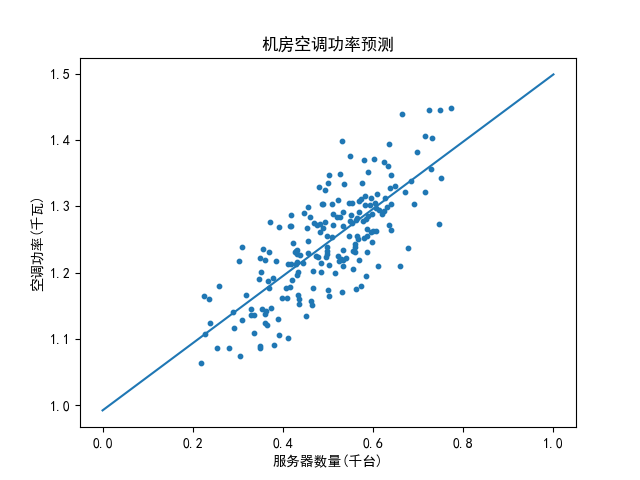

## 1.4 编程验证

### 提出问题

先假设一个应用场景：**在一个机房里，有 346 台计算机服务器，需要多大功率的空调来制冷，才能使得机房的温度保持在 20 摄氏度左右？**

假设空调的功率（千瓦/小时）与计算机的数量是相关的，而且是线性关系，需要解决的问题是找到这种线性关系。这个问题用定量的数学方法是很难解出来的，因为每台计算机的散热量不是一个定值，与其繁忙程度有关，所以一般会用现场实测的方式来解决，即：
1. 在一个有 100 台服务器的机房里，设定空调功率以保持 20 摄氏度，并记录此功率值 $y_1$；
2. 在一个有 200 台服务器的机房里，设定空调功率以保持 20 摄氏度，并记录此功率值 $y_2$；
3. 在一个有 M 台服务器的机房里，设定空调功率以保持 20 摄氏度，并记录此功率值 $y_m$；
4. ......

由此就会得到一张表 1.4.1，是服务器的数量与空调功率的对应表。

表 1.4.1 服务器与空调功率的对应表

|样本序号|服务器数量|实测空调功率|
|--|--|--|
|1|100|$y_1$|
|2|200|$y_2$|
|3|M|$y_m$|
|...|......|......|

由于我们不可能去做实际的测量，所以用程序来模拟生成这些数据。

### 制作数据集

根据公式 1.1.2，下面我们来自己制作一个数据集，来验证一下最小二乘法在一元线性回归中的效果。

这里有人可能会有疑问：为什么要自己制作数据集？不是有很多现有的工业数据集可以使用吗？

自己制作数据集，是本书的一个自学、教学方法。以本例来说，我们会根据公式 1.1.2，令 $a=0.5$ 且 $b=1$，外加噪音来制作样本数据。在解出回归模型的 $\hat a$ 和 $\hat b$ 后，与原始的 $a=0.5$ 和 $b=1$ 来对比，如果非常值接近，就说明我们的算法是正确的。如果直接用工业数据集来验证算法，即使通过测试数据达到比较满意的准确率，依然不能得知其 ground truth（真实数值）。


针对公式 1.1.2，假设 $a=0.5$，$b=1$，$\varepsilon \sim N(0,0.1)$，$\boldsymbol{X}$（某个机房内的计算机数量）是 200 个从 0 到 1 之间的随机数来模拟采样数据，于是有代码如下：

```Python
a = 0.5         # 参数a
b = 1           # 参数b
m = 200         # 模拟100个机房的样本
def generate_samples_1(a, b, m):
    # m个[0,1)之间随机数，表示机房内计算机数量/1000
    X = np.random.random(size=(m, 1))
    # 返回均值为0，方差为0.05的误差的一组值
    Epsilon = np.random.normal(loc=0, scale=0.05, size=X.shape)
    Y = a * X + b + Epsilon
    return X,Y
```

这里的 $\boldsymbol{X}$ 和 $\boldsymbol{Y}$ 各是一个 $(200\times 1)$ 的一维数组，分别表示样本的训练数据和标签数据。

且慢！上面的代码并不正确，有两个地方的假设是错误的：

1. 关于 $\boldsymbol{X}$ 的生成方法

大家都知道正态分布无处不在，所以机房中服务器的数量也应该服从这一分布。这一行代码：
```Python
    X = np.random.random(size=(m, 1))
```
是在 $[0,1)$ 之间均匀分布生成了 $m$ 个随机值，这与实际情况不符，应该使用 np.random.normal() 函数。

2. 关于 $\boldsymbol{Y}$ 的生成方法

在生成 Epsilon 时，只生成了一组（200个）正态分布的噪音数据，然后就在最后一行代码通过矩阵相加的形式，顺序地分配给了 $\boldsymbol{X}$ 数组。这就相当于在不同的 $x$ 值对应的所有的 $y$ 值整体的噪音是一个正态分布，而不是基于每个 $y$ 的独立的正态分布。

所以，我们改变代码如下：
```Python
def generate_samples_2(a, b, m):
    # 以0.5为中心的正态分布，表示机房内计算机数量/1000
    X = np.random.normal(loc=0.5, scale=0.15, size=(m, 1))
    Y = np.zeros_like(X)
    for i in range(m):
        # 返回均值为0，方差为0.05的误差的一个值
        epsilon = np.random.normal(loc=0, scale=0.05, size=None)
        # 对于每个特定的x值，都从N(0,0.05)中取出一个随机值作为噪音添加到y上
        Y[i,0] = a * X[i,0] + b + epsilon
    return X,Y
```
运行代码 1-4-GenerateSamples.py，在生成数据后，保存到当前目录 1-0-data.csv。然后我们可以取出前几行浏览一下，得到表1.4.1，并用 matplotlib 库来做一下可视化，得到图1.4.2。

表 1.4.2 样本模拟数据

|样本序号|x=服务器数量(千台)|y=空调功率(千瓦)|
|--|--|--|
|1|0.690586|1.312095|
|2|0.366986|1.261951|
|3|0.673172|1.316155|
|4|0.463276|1.174213|
|5|0.378678|1.144099|
|...|......|......|


<center>图 1.4.1 样本数据可视化</center>

在图 1.4.1 中，上面的两张子图分别是 $\boldsymbol{X}$ 和 $\boldsymbol{Y}$ 的分布，可以看到它们都是呈正态分布的，满足我们制作数据集的假设。下面的子图中，每个样本点代表某个机房的情况：

- 横坐标是计算机的数量，用“千台”作为单位；
- 纵坐标是需要空调的功率，用“千瓦”作为单位。

从散点图的密度也可以看出，处于中间的部分密度较大，因为是处于正态分布的中间地带，所以样本数较多。

如果图中的中文无法显示的话，需要升级到最新版的 matplotlib 包。


### 验证最小二乘算法

下面用代码实现一下最小二乘法。

根据公式 1.3.8，由于 $\hat{b}$ 依赖于 $\hat{a}$，所以我们先计算 $\hat{a}$，再计算 $\hat{b}$：

```Python
# 公式 1.3.8
def least_square_1(X,Y):
    n = X.shape[0]
    # a_hat
    numerator = n * np.sum(X*Y) - np.sum(X) * np.sum(Y)
    denominator = n * np.sum(X*X) - np.sum(X) * np.sum(X)
    a_hat = numerator / denominator
    # b_hat
    b_hat = (np.sum(Y - a_hat * X))/n
    return a_hat, b_hat
```

其中 np.sum(X\*Y)，相当于公式中的 $\sum\limits_{i=1}^n x_i y_i$，由于 $\boldsymbol{X}$ 和 $\boldsymbol{Y}$ 都是（200x1）的数组，所以 $\boldsymbol{X}*\boldsymbol{Y}$ 会按元素相乘，得到一个新的（200x1）的数组，然后求和。

运行代码 1-4-LeasstSquare.py，最后得到的结果是：

```
a_hat=0.5066, b_hat=0.9921
```
把拟合结果变成直线方程，即 $y=0.5066x+0.9921$，绘制在原始的样本图上，得到图1.4.2。


<center>图 1.4.2 拟合结果</center>

### 计算均方差

还记得我们在制作数据集时设置的参数值吗？$a=0.5$，$b=1$。用代码计算出来的结果 $\hat a=0.5066...$，$\hat b=0.9921...$，非常接近实验预设值。

可能会有人有疑问，为什么没有得到 $a=0.5、b=1$ 的解，而是得到了一个近似解？这是由于在制作样本数据集时有 $\varepsilon$ 的存在，加入了噪音（方差、偏差），使得实际的参数值已经偏离了预设的 $a=0.5、b=1$。

那我们就来看一下 $y=0.5066x+0.9921$ 和 $y=0.5x+1$ 的损失函数值分别是多少吧。

```Python
# 计算均方差
def calculate_mse(Y, Y_hat):
    loss = np.sum((Y-Y_hat)*(Y-Y_hat))/Y.shape[0]
    return loss

# 根据参数 a 和 b 计算模型回归值 Y_hat，然后与 Y 做均方差
def calculate_J(a,b,X,Y):
    Y_hat = a * X + b
    J = calculate_mse(Y, Y_hat)
    return J

if __name__ == '__main__':
    ......
        # 比较估计值和原始的均方差的大小
        J1 = calculate_J(a_hat, b_hat, X, Y)
        J2 = calculate_J(0.5, 1, X, Y)
        print(str.format("J1={0:.6f}, J2={1:.6f}", J1, J2))
```
1. 用最小二乘法得到的 $\hat{a}、\hat{b}$，把样本数据的 $x$ 值代入回归方程 $y=\hat{a}x+\hat{b}$ 来计算出对应的 $\hat{y}$，然后用样本标签数据 $y$ 来做基准计算均方差，得到 $J_1$；
2. 用 $a=0.5、b=1$，带入回归方程计算出 $J_2$。

结果为：

```
J1=0.002558, J2=0.002580
```

可以看到 $J_1 < J_2$，说明在这个数据集上，最小二乘法估算出的参数值比预设值更准确一些。

### 思考与练习

1. 运行代码 1-4-GenerateSamples.py，修改预设参数，保存到新的数据集。
2. 运行代码 1-4-LeastSquare.py，检查运行结果是否与在练习 1 中的预设值一致。
