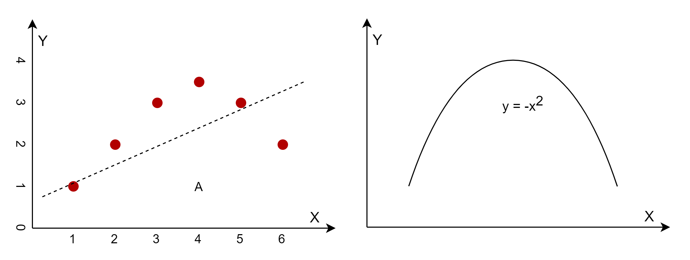

## 3.2 问题 A

### 问题 A 的解法

我们先看问题 A，其 6 个样本点的坐标按从左到右的顺序如表 3.1.1 所示：

表 3.1.1 原始样本点

|样本序号|$x$|$y$|
|--|--|--|
|1|1|1|
|2|2|2|
|3|3|3|
|4|4|3.5|
|5|5|3|
|6|6|2|

如果用直线拟合，根据我们以前的知识，使用模型 $y=ax+b$，最好的情况下也就是可以得到图 3.1.2 左图的效果。但是我们观察这些样本点的分布形状，是不是和图 3.1.2 右图所示的 $y=-x^2$ 的函数图很像呢？这就提示我们也许可以用 $x^2$ 作为特征值来做回归试验，而不是仅仅是用原始的 $x$ 做特征值。


<center>图 3.1.2 猜想的拟合曲线</center>

根据这一提示，我们在原始样本点的基础上增加一列，如表 3.1.2 所示：

表 3.1.2 增加 $x^2$ 后的样本

|样本序号|$x$|$x^2$|$y$|
|--|--|--|--|
|1|1|1|1|
|2|2|4|2|
|3|3|9|3|
|4|4|16|3.5|
|5|5|25|3|
|6|6|36|2|

这样的话，就变成了多项式回归模型：

$$
y = a_1 x + a_2 x^2 + b \tag{3.1.1}
$$

第二章中（公式 2.2.1）我们学习过如何解决这个模型：

$$
y = a_1 x_1 + a_2 x_2 + b \tag{3.1.2}
$$

如果令 $x_1=x，x_2=x^2$，那么公式 3.1.1 和公式 3.1.2 就完全等价了。在第二章里我们用正规方程解决的问题，那么在这里也就可以用同样的方法解决！

### 编程验证

我们先用如下代码实现表 3.1.2 中增加样本的功能：

```Python
# 给原始的一维 X 增加到 m 维多项式
def make_Xm(X1, m):
    count = X1.shape[0]
    Xm = np.zeros((count, m))
    for i in range(m):
        Xm[:,i:i+1] = np.power(X1, i+1)
    return Xm
```
这段代码可以依次增加任意列的关于 $x$ 多项式，比如当 m = 2 时，会在原始 $x$ 的右侧增加一列 $x^2$；同理，当 m = 3 时，会在原始 $x$ 的右侧增加一列 $x^2$ 和一列 $x^3$。

得到数组 Xm 后，带入正规方程公式：
```Python
# 解正规方程
# X0 - 还没有在左侧加 1 的原始样本值
# Y - X0 对应的标签值
def normal_equation(X0,Y):
    # 在原始的X矩阵最左侧加一列1
    X = add_ones_at_left(X0)
    # X^T * X
    p = np.dot(X.T, X)
    # (X^T * X)^{-1}
    q = np.linalg.inv(p)
    # (X^T * X)^{-1} * X^T
    r = np.dot(q, X.T)
    # (X^T * X)^{-1} * X^T * Y
    A = np.dot(r, Y)
    # 按顺序
    return A
```

运行代码 3-1-FigureA.py，就可以得到参数值 A。在该代码中，我们顺便把简单线性回归模型用正规方程也实现了一下（第一章中用最小二乘法实现的），然后又实现了多项式回归模型，下面是这两种回归方程的参数：

```
# 简单线性回归结果
a=0.2429, b=1.5667
# 多项式回归结果
a1=2.2429, a2=-0.2857, b=-1.1000
```

图 3.1.3 中展示了两种结果的可视化效果。


<center>图 3.1.3 简单线性回归与多项式回归的比较</center>

- 左子图的简单线性回归结果为： 
$$
y = 0.2429x+1.5667  \tag{3.1.3}
$$
- 右子图的多项式回归结果为： 
$$
y = 0.2429x-0.2857x^2 - 1.1000  \tag{3.1.4}
$$

从右图的结果看，就是在一个抛物线 $y=-0.2857x^2$ 的基础上，再增加一个线性变换。

### 思考与练习

1. 如果图 A 中样本点的坐标顺序不是从左到右，而是乱序的，对回归算法有影响吗？
