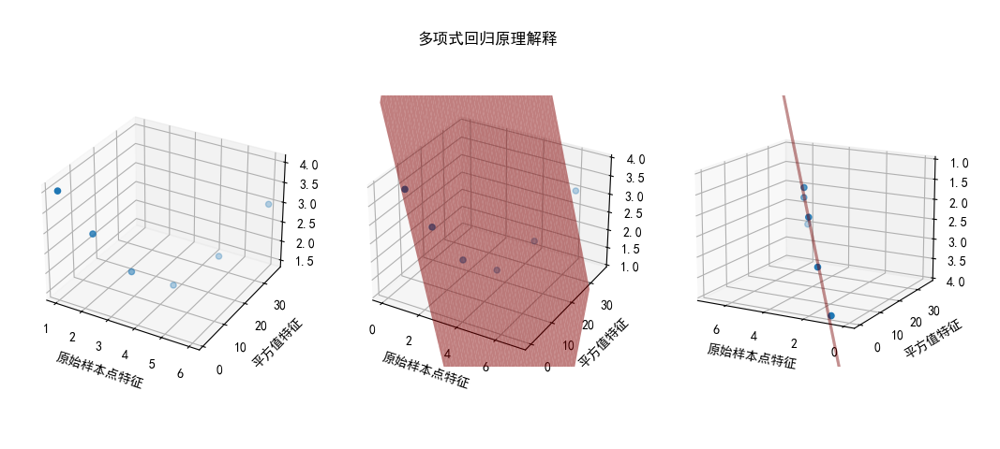

## 3.3 问题 B

### 问题 B 的解法

问题 A 已经顺利解决了，问题 B 只是把抛物线的方向颠倒一下而已，体现在参数上，就是把公式 3.1.4 中的关于 $x^2$ 的项的参数值由负数变成正数，b 值也应该是正数。

请大家自己练习写代码来解决问题 B（只是在代码 3-1-FigureA.py 的基础上，把输入样本数据修改一下）。

### 问题 B 的解法的可视化理解

利用这个机会，我们用可视化的方法研究一下二阶多项式回归的原理，因为到了三阶以上，就无法可视化了。

对于问题 B，原始的样本点特征值仅为一维，在我们给它增加了平方值作为第二个特征值后，得到表xxx。

表  增加 $x^2$ 后的样本

|样本序号|$x$|$x^2$|$y$|
|--|--|--|--|
|1|1|1|4|
|2|2|3|3|
|3|3|9|2|
|4|4|16|1.5|
|5|5|25|2|
|6|6|36|3|

不妨把原始的 $x、x^2、y$ 分别作为三维坐标系中的 $x、y、z$，绘制图 3.1.4 中的左子图。

图 3.1.4 多项式回归原理解释

然后我们求出多项式回归的参数值，它应该可以转换为三维坐标系中的一个拟合超平面（第二章中有解释），即图 3.1.4 的中子图。把中子图旋转一个视角，得到右子图，可以看到该拟合超平面确实“穿过”了所有的样本点。

所以，二项式回归的原理是这样的：虽然在二维平面上，我们无法用一条直线拟合所有样本点，但是，在增加了一维平方值作为特征后，相当于把样本点映射到了三维空间。“巧合”发生了：这些样本点“正好”可以被一个超平面所拟合！于是，解出这个超平面的参数值，就可以作为二阶多项式回归的参数了。

其实，凡是满足可以被二阶多项式拟合的样本，都具备这种“巧合”发生的条件，读者可以自己制作一些样本点来试验。反过来说，当样本点不具备可以被二阶多项式回归模型拟合的条件时，这种只升一维的方法就达不到很好的效果了，我们可以看看下一小节中的问题，就是这种情况。

### 思考与练习

1. 编程验证问题 B 的多项式回归结果。
