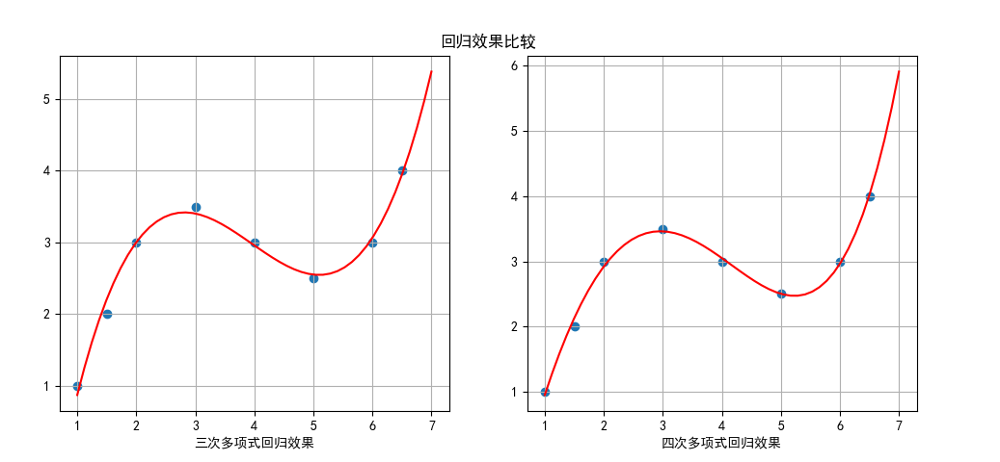
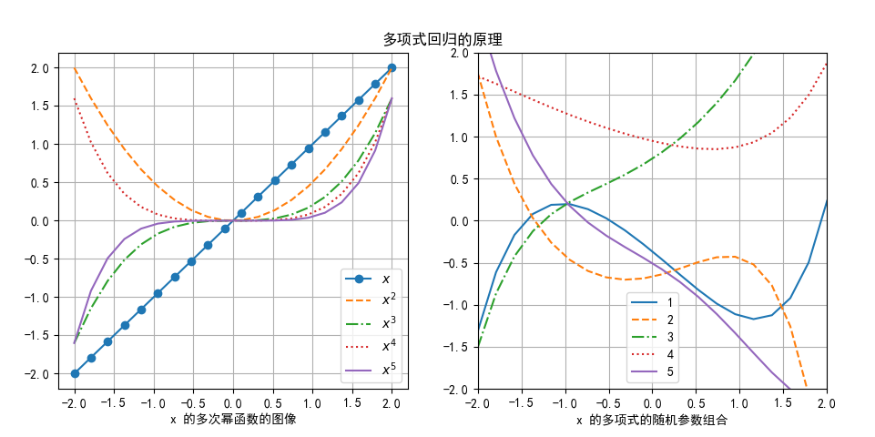

## 3.4 问题 C

### 问题 C 的解法

用模型 3.1.1 是肯定不能满足问题 C 的回归需要的，因为从直观上看图中的样本点组成的不是一条二次曲线，而至少是三次曲线。

把公式 3.1.1 扩展到一般性：

$$
y = a_1 x + a_2 x^2 + \dots + a_k x^k + b   \tag{3.1.5}
$$

则该问题的解决办法就显而易见了，仍旧是正规方程，只不过样本点需要做如下处理：

|样本序号|$x$|$x^2$|$x^3$|y|
|--|--|--|--|--|
|1|1|1|1|1|
|2|1.5|2.25|3.375|2|
|3|2|4|8|3|
|4|3|9|27|3.5|
|5|4|16|64|3|
|6|5|25|125|2.5|
|7|6|36|216|3|
|8|6.5|42.25|274.625|4|

所以公式 3.1.5 实例化为：

$$
y = a_1 x + a_2 x^2 + a_3 x^3 + b   \tag{3.1.6}
$$

具体的实现方式同前，只不过在代码 3-1-FigureC.py 里面，我们顺便把四次多项式回归也实现了一下，以便和三次多项式的回归效果做比较，得到图 3.1.5。


<center>图 3.1.5 多项式回归原理解释</center>

很明显，在图 3.1.5 的左子图中，回归曲线没有精确地穿过每个样本点，而右子图中改进了不少。

各个参数值如下：
```
# 三次多项式回归结果
a1=6.3435, a2=-1.7479, b=-3.8718
# 四次多项式回归结果
a1=4.3043, a2=-0.7106, a3=-0.0585, b=-2.5989
# 损失函数值
J3=0.0810, J4=0.0319
```
计算一下两者的均方差损失函数值，可以看到 J4 比 J3 小一倍。由此可以推断，在图 3.1.3 中，如果用三次多项式做回归模型，会得到更好的效果。

从四次多项式的参数值的数值大小（忽略正负号）可以观察到：a1 的值比 a2 大一个数量级，a2 的值比 a3 又大一个数量级。这个原因读者可以先思考一下，我们后面再解释。

到目前为止，我们得到的经验是：**多项式次数越高，拟合的效果越好。** 但是这个经验是不是正确的呢？我们后面会学习到。

### 多项式回归的工作原理探讨

在学习了几个问题的解决方法之后，是时候来研究一下多项式回归的工作原理了。

在 3.3 小节，我们在二次多项式回归中讲解了其工作原理，即升维后，把非线性拟合问题变成线性（超平面）拟合问题，对于高次多项式，我们可以从另一个方面来理解其工作原理。

首先，我们绘制出几条幂函数的曲线，幂次从 0 到 5，见图 3.4.2 左子图。


<center>图 3.4.2 多项式回归工作原理</center>

从左子图的函数曲线可以观察到：

- 1、3、5 次幂的曲线的走向是相同的，从左下到右上，但是曲率是不一致的。
- 1 次幂是直线，5 次幂的曲率最大。
- 2、4 次幂的走向相同，曲率不一致。

这种多样性给后面的计算带来了非常大的可能性。

下一步，我们随机生成了 5 组参数值，分别代表公式 3.4.1 中的各个参数。

$$
y = b+a_1x + a_2x^2 + a_3x^3 + a_4x^4 + a_5x^5 \tag{3.4.1}
$$

具体的值在表 3.4.1 中。请注意，由于在 3-4-Poly.py 绘制图 3.4.2 的右子图时使用了随机数，所以每次运行得到的图形结果都会有所不同，但是同样都能说明问题。

表 3.4.1 随机生成的参数值

|序号|$b$|$a_1$|$a_2$|$a_3$|$a_4$|$a_5$|
|--|--|--|--|--|--|--|
|1|-0.366|-0.850|-0.236|0.696|0.185|0.853|
|2|-0.666|0.229|0.650|-0.968|-0.888|-0.911|
|3|0.736|0.675|0.509|0.358|-0.269|0.569|
|4|0.947|-0.245|0.215|0.193|0.622| 0.164|
|5|-0.506|-0.639|-0.305|-0.948|0.942|0.294|

然后根据参数值绘制出 5 条曲线，即公式 3.4.1 的实例化形态，显示在图 3.4.2 的右子图中。举例来说，图中第一条曲线的公式是：

$$
y=-0.366 - 0.85x - 0.236x^2 + 0.696 x^3 + 0.185 x^4 + 0.853 x^5
$$

仔细观察这些曲线的走向和曲率，可以发现各个序号的曲线的特点是：

1. 先上后下再上
2. 先下后上再下
3. 单边向上
4. 不规则抛物线
5. 单边向下

也就是说，这 5 条 曲线可以涵盖几乎所有需要拟合的样本形态，而且其生成方式是：
1. 依赖左子图的原始曲线形态（获得 $x$ 值的高次幂值）；
2. 给高次幂值赋予不同权重；
3. 通过公式 3.4.1 做简单线性相加即可实现。


### 思考和练习

1. 尝试用更高次的多项式来解决问题 C，并看看拟合效果即损失函数值。
2. 修改 3-4-Poly.py，尝试生成更多组随机参数值，观察其根据公式 3.4.1 生成的最终曲线形态，更充分地理解多项式回归的工作原理。
