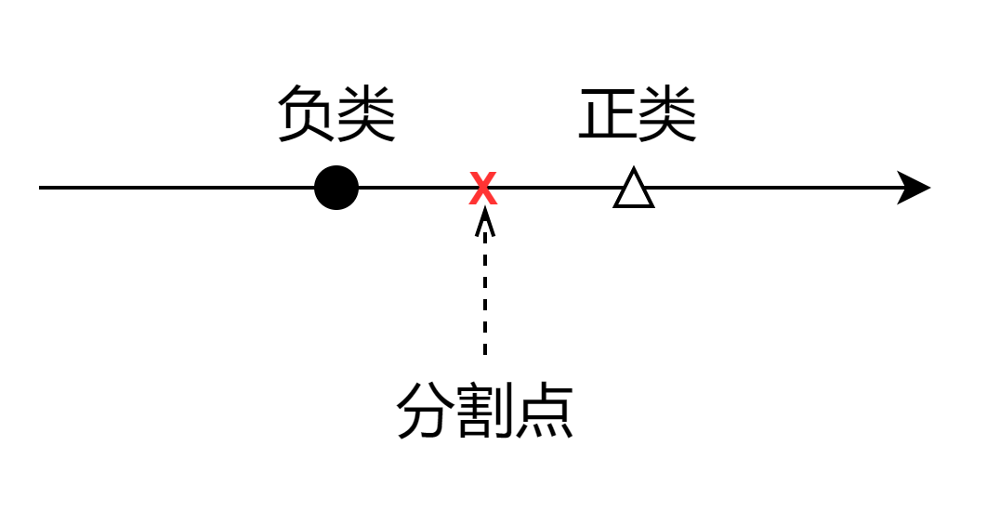
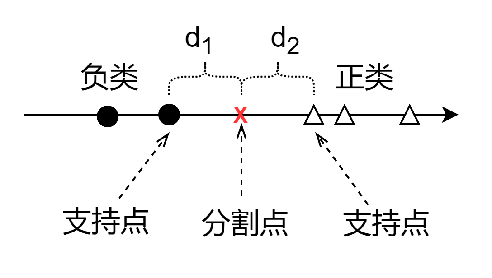
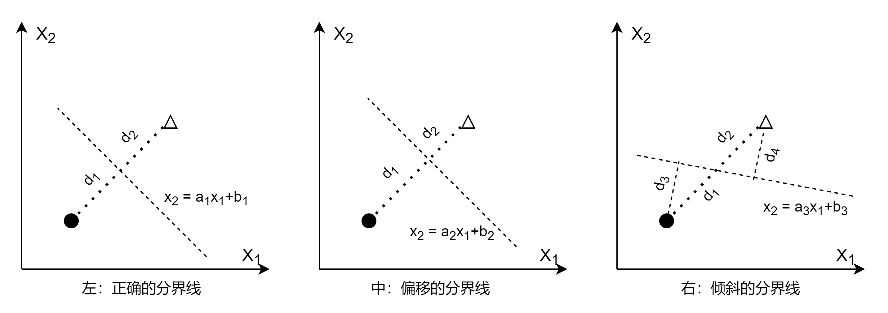
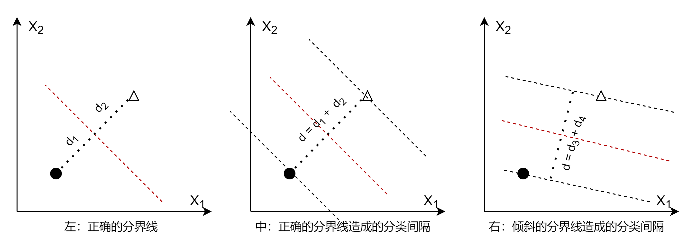
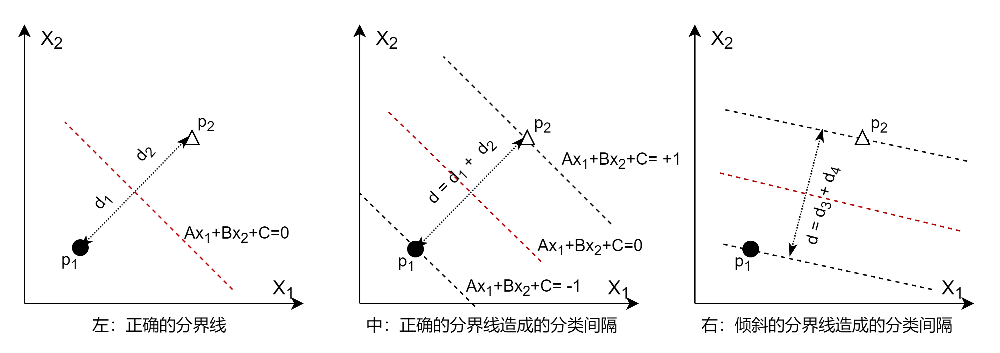

https://zhuanlan.zhihu.com/p/29604517

# 支持向量机（SVM，Support Vector Machine）

### 一维空间中的分类

先从最简单的问题说起：一条直线上，有两个点，分别代表正类（好人）和负类（坏人），如图 1 所示，如何分界？

图 1 一条穿过两点的直线

小学生都可以快速地回答：当然是取一个中点作为**分界点**，把好人坏人分开。

进一步，在两侧各增加几个样本点，如何分界？如图 2 所示。

图 2 一条穿过两点的直线

小学生稍微犹豫一下，但还会做出正确的回答：仍然是在原来的分界点的位置上做分界，而不会由于好人坏人的数量或密度不一样而改变分界点位置。

好了，现在我们已经得到了支持向量机的最原始的概念了：在正类和负类样本之间，找到一个中点 $p_0$ 做分界点，让所有的正类样本点都在分界点右侧，所有的负类样本点都在分界点的左侧。附加条件是 $d_1 = d_2$。

其中：
- $d_1 = |x_{p_1} - x_{p_0}|$，$p_1$ 是距离分界点最近的负类样本点
- $d_2 = |x_{p_2} - x_{p_0}|$，$p_2$ 是距离分界点最近的正类样本点

$p_1、p_2$叫做**支持点**。

用数学语言描述如下：

- 样本点用 $x_i$ 表示（既包括正类也包括负类）；
- 而 $y_i$ 是标签值，$+1$ 代表正类，$-1$ 代表负类。

$$
\begin{cases}
x_i > x_{p_0}, \quad  y_i=+1（正类样本）
\\\\
x_i < x_{p_0}, \quad y_i=-1（负类样本）
\\\\
d_1 = d_2
\end{cases}
\tag{1}
$$

随着样本特征维数的增加，分界点可以扩展到分界线（二维）、分界平面（三维），分界超平面（更高维）。

### 二维

下面我们把情况从以为扩展到二维。假设在二维空间中有两个样本点，分别属于正负类，如图 3 所示。

图 3 一条穿过两点的直线

- 左图

    分界线 $x_2 = a_1 x_1 + b_1$ 正确，符合两个条件：1）分界线垂直于两个样本点之间的连线；2）两个样本点距离分界线的距离一致，即 $d_1 = d_2$。

- 中图
  
    分界线 $x_2 = a_2 x_1 + b_2$ 向上偏移了。与左图比较的话，即 $a_2 = a_1，b_2 > b_1$，结果造成了 $d_1 \ne d_2$。

- 右图

   分界线 $x_2 = a_3 x_1 + b_3$ 倾斜了。与左图比较的话，即 $a_3 > a_1，b_3 < b_1$，虽然 $d_1 = d_2$，而且其到分界线的垂直距离 $d_3 = d_4$，但是分界线没有与两个样本的连线垂直，即 $d_3<d_1，d_4<d_2$。

三个图中，虽然分界线都可以正确地分界了两个样本点，但只有左图是正确的，在用这个分类模型做预测时的鲁棒性最强，误差最小。

用数学语言描述如下：

如果分界线方程是：

$$
Ax_1 + Bx_2+ C=0 \tag{2}
$$

或者是其等价形式：

$$
x_2 = ax_1 + b \tag{4}
$$
与公式 3 相比，$a = -\frac{A}{B}，b = -\frac{C}{B}$。

点到直线的距离的方程为：

$$
d = \frac{|Ax_1+Bx_2+C|}{\sqrt{A^2+B^2}} \tag{3}
$$

而两类样本的支持点到分界线的**垂直距离**分别为 $d_1、d_2$：

$$
d_1 = \frac{|Ax_{p_1,1}+Bx_{p_1,2}+C|}{\sqrt{A^2+B^2}} \tag{4}
$$

$$
d_2 = \frac{|Ax_{p_2,1}+Bx_{p_2,2}+C|}{\sqrt{A^2+B^2}} \tag{5}
$$

则：

$$
\begin{cases}
x_{i2} \ge a x_{i1} + b, \quad  y_i=+1（正类样本）
\\\\
x_{i2} \le a x_{i1} + b, \quad y_i=-1（负类样本）
\\\\
d_1 = d_2
\end{cases}
\tag{6}
$$

其中：

用几何概念来解释，就是负类在分界线的下方，正类在分界线的上方。当然，这里的正类负类是人为指定的，也可以约定相反的符号，这样正类就会在分界线的下方，这会造成理解上的障碍，但是并不妨碍最后的推导结果正确。

从这几个例子可以看出来，分类与回归不同：
- 在回归中，**尽量让回归距离最小**，得到的效果是每个样本都想把回归线尽量拉向自己，最终的回归结果是**所有样本点**的“引力”的均衡；
- 而在分类中，**尽量让分界距离最大**，得到的效果是每一类样本都想把分界线推向对方，最终的分类结果是两类样本中**支持点**的“推力”的均衡。

用图 4 来解释。

图 4 一条穿过两点的直线

分界线的确定是为了“照顾”距离对方样本较近的点，如 $p_1、p_2$。相对来说，距离分界线较远的点，如 $p_4、p_6$ 在分类的准确性上更有保证。所以每一类样本都希望分界线距离自己越远越好。

### 分类间隔

分界线的直线方程为 $Ax_1+Bx_2+C=0$，如果用向量形式表示，可以转化为：

$$
\begin{pmatrix}
    A & B
\end{pmatrix}
\begin{pmatrix}
    x_1
    \\\\
    x_2
\end{pmatrix}
+C=\boldsymbol{w} \boldsymbol{x}+C=0
$$

令：$\boldsymbol{w} = (A \quad B)，\boldsymbol{x} = (x_1 \quad x_2)^T$，则公式 3 可以写成：

$$
d = \frac{\boldsymbol{w} \boldsymbol{x}+C}{\sqrt{w_1^2 + w_2^2}}=\frac{\boldsymbol{w}\boldsymbol{x}+C}{||\boldsymbol{w}||}
$$

其中，$||\boldsymbol{w}||$ 是 $||\boldsymbol{w}||_2^2$ 的简写形式，表示 $\boldsymbol{w}$ 的二范数 $L_2$，即 $\boldsymbol{w}$ 中的各元素平方和再开方。

图 4 一条穿过两点的直线

我们前面提到

假设 $p_1$ 的坐标值为 $(x_{11}, x_{12})$，则 $p_1$ 到分界线的距离 $d_1$ 为：

$$
d_1 = \frac{|Ax_{11}+Bx_{12}+C|}{\sqrt{A^2+B^2}} = \frac{\boldsymbol{w}\boldsymbol{x_1}+C}{||\boldsymbol{w}||}
$$

由于 $d$ 的存在，我们在分界线的两侧各画一条与分界线平行的直线，并穿过样本点，形成一个带状的间隔，这样就能扩展 $d$ 的作用：即距离 $d$ 存在于整条分界线的两侧，而不是仅仅限于两个样本点之间。也就是说在两类样本点之间有一条中空的地带，就叫做**分类间隔**。

### 增加新的样本点

图 2.1.1 一条穿过两点的直线

- 左图
  
    还是最初的两个样本点以及分界线、分类间隔，间隔的宽度为 $d_1$。

- 中图
  
    正类上增加了新的样本点 $p_3$（三角形），由于在分类间隔之外，所以并没有影响已有的分界线和分类间隔的正确性。

    但是，在负类上增加的新样本点 $p_4$（实心圆点），已经在间隔以内了，所以必须重新计算分界线。

- 右图

    重新计算的分界线及分类间隔的结果，可以想象成是原有的分类间隔在平面上逆时针旋转了一个角度。可以看到，负类中有两个点在分类间隔上，这并不是巧合（这一点在很多文字资料中没有讲清楚，造成很多读者误以为支持向量一定是正类一个样本，负类两个样本，或者相反），而是分类间隔在这个角度上，可以刚刚好分类正确，并且得到的 $d_2$ 值 最大。

    尽管如此，但图中的 $d_2 < d_1$，这从直角三角形斜边大于直角边的关系可以看出来。但这已经是分来间隔可以做到的最优解了，再逆时针旋转的话，会造成 $d_2$ 值进一步减小。

$$
d = \frac{\boldsymbol{w}\boldsymbol{x}+C}{||\boldsymbol{w}||}
$$

所以，我们希望所有的样本点都在分类间隔之外，把公式 x 的绝对值符号去掉，会有两种情况，分别是正类样本和负类样本。

$$
\begin{cases}
\frac{\boldsymbol{w}\boldsymbol{x_i}+C}{||\boldsymbol{w}||} \ge d, \quad y_i=+1（即正类样本）
\\\\
\frac{\boldsymbol{w}\boldsymbol{x_i}+C}{||\boldsymbol{w}||} \le -d, \quad  y_i=-1（即负类样本）
\end{cases}
$$

两边都除以 $d$ 不会改变公式的性质，就如同 $x_1 + x_2 - 4 = 0$ 和 $0.5x_1 + 0.5x_2 - 2 = 0$ 表示的是同一条直线一样。

$$
\begin{cases}
\frac{\boldsymbol{w}}{d||\boldsymbol{w}||}\boldsymbol{x_i}+\frac{C}{d||\boldsymbol{w}||} \ge 1, \quad y_i=+1（即正类样本）
\\\\
\frac{\boldsymbol{w}}{d||\boldsymbol{w}||}\boldsymbol{x_i}+\frac{C}{d||\boldsymbol{w}||} \le -1, \quad  y_i=-1（即负类样本）
\end{cases}
$$

由于 $||\boldsymbol{w}||$ 时标量，重新令：$\boldsymbol{w}=\frac{\boldsymbol{w}}{d||\boldsymbol{w}||}，C=\frac{C}{d||\boldsymbol{w}||}$

$$
\begin{cases}
\boldsymbol{w}\boldsymbol{x_i}+C \ge 1, \quad y_i=+1（即正类样本）
\\\\
\boldsymbol{w}\boldsymbol{x_i}+C \le -1, \quad  y_i=-1（即负类样本）
\end{cases}
$$

公式 x 和公式 y 的 w 和 C 的值不一样，但是并不影响求解。

公式 y 的两边都乘以 $y_i$，当 $y_i=1$ 时，不等式符号不变，$y_i(\boldsymbol{w}\boldsymbol{x_i}+C) \ge 1$

当 $y_i=-1$ 时，不等式符号改变方向，$y_i(\boldsymbol{w}\boldsymbol{x_i}+C) \ge 1$

所以，最后可以合并成：

$$
y_i(\boldsymbol{w}\boldsymbol{x_i}+C) \ge 1
$$

$$
x_1 + x_2 -4=0
$$

$A_1=1，B_1=1，C_1=-4，x_1=3，x_2=3$

$$
d_1 = \frac{|A_1x_{1}+B_1x_{2}+C_1|}{\sqrt{A_1^2+B_1^2}} = \frac{|1 \times 3 + 1 \times 3 -4|}{\sqrt{1^2+1^2}}=\frac{2}{\sqrt{2}}=\sqrt{2}
$$

$$
0.5x_1 + 0.5x_2 - 2=0
$$

$A_2=0.5，B_2=0.5，C_2=-2，x_1=3，x_2=3$

$$
d_2 = \frac{|A_2x_{1}+B_2x_{2}+C|}{\sqrt{A_2^2+B_2^2}} = \frac{|0.5 \times 3 + 0.5 \times 3 -2|}{\sqrt{0.5^2+0.5^2}}=\frac{1}{\sqrt{0.5}}=\sqrt{2}
$$

两个方程表示了一条直线，但是 $|Ax_{1}+Bx_{2}+C|$ 的值并不相同，前者为 2，后者为 1，
