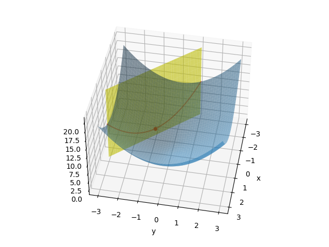
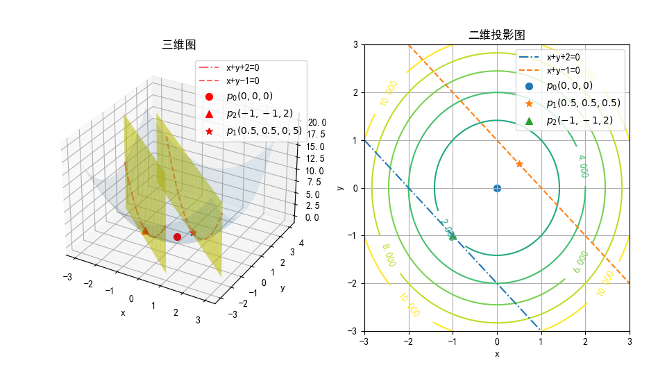

https://zhuanlan.zhihu.com/p/154517678


## 拉格朗日乘子法（Lagrange Multiplier）

### 无约束优化问题

对于函数 $f(x,y)=x^2+y^2$，如果求其最小值，我们知道分别对 $x、y$ 求偏导，并令结果为 0，即可以得到极值点结果为 $(0,0)$ 点。

### 等式约束优化问题

如果加一个限制条件，求函数 $f(x,y)$ 在约束条件 $x+y+2=0$ 时的最小值，记作：

$$
\underset{x,y}{\min} f(x,y)=x^2+y^2
\\\\
s.t.\quad x+y+2=0
\tag{1}
$$

- 用解方程组的方法

$$
\begin{cases}
    z = x^2+y^2
    \\\\
    x+y+2=0
\end{cases}
\tag{2}
$$
下面的公式变形为 $y=-x-2$ 带入上面的式子，得到：
$$
z=2x^2+4x+4 \tag{3}
$$

对$z$求$x$的导数，并令结果为 0：

$$
\nabla_x z = 4x+4 = 0 \tag{4}
$$

得到：当 $x=-1，y=-1$时，$z=2$ 为最小值。



<center>图 8 相交线及其极值点</center>

结果如图 8，红色曲线为函数 $f(x,y)$ 与约束平面 $g(x,y)=x+y+2=0$ 的相交线，红色圆点为极值点。此处可以运行 LagrangeF1.py 来观察实际效果。

注意，$g(x,y)$ 约束条件其实只是 $x/y$ 平面上的一条直线，我们把它“提升”成为一个平面，这样就和 $f(x,y)$ 形成相交，便于读者理解。

还有一种错误的理解是把 $g(x,y)=x+y+2=0$ 看成 $g(x,y)=x+y+2$，相当于 $z=x+y+2$，这就变成了一个三维空间中的斜面，与 $f(x,y)$ 的底部相交形成一个倾斜的椭圆，也可以求极值点。但是和原来的约束条件完全是两个不同的问题。

- 拉格朗日乘子法

当约束条件比较复杂时，不能直接解出方程组来，就可以用拉格朗日乘子法。

一个长方体的长宽高分别是 $x,y,z$，表面积是 $s^2$。问当长宽高具体为多少时，体积最大？

如果用解方程组的方法，可以得到：

$$
V = \frac{xy(s^2-2xy)}{2(x+y)}
$$

下一步求极值时，就非常麻烦了。如果参数更多的话，会更麻烦。

下面尝试用拉格朗日乘子法解决，先转化为约束条件：

$$
\begin{aligned}
    & V(x,y,z) = xyz
    \\\\
    & s.t. \quad 2xy+2xz+2yz-s^2=0
\end{aligned}
\tag{5}
$$

构造拉格朗日函数：

$$
F(x,y,z,\alpha)=V(x,y,z)+\alpha g(x,y,z)=xyz+\alpha(2xy+2xz+2yz-s^2) \tag{6}
$$

$$
\begin{cases}
    \nabla_x F(x,y,z,\alpha)=yz+2\alpha(y+z)=0
    \\\\
    \nabla_y F(x,y,z,\alpha)=xz+2\alpha(x+z)=0
    \\\\
    \nabla_z F(x,y,z,\alpha)=xy+2\alpha(x+y)=0
    \\\\
    \nabla_{\alpha} F(x,y,z,\alpha)=2xy+2xz+2yz-s^2=0
\end{cases}
\tag{7}
$$

解方程组 7 得：

$$x=y=z=\frac{6}{\sqrt{z}}，V_{max}=\frac{\sqrt{6}}{36}s^3$$


### 不等式约束优化问题

问题一：

$$
\underset{x,y}{\min} f(x,y)=x^2+y^2
\\\\
s.t.\quad x+y-1 \le 0
\tag{8}
$$

问题二：

$$
\underset{x,y}{\min} f(x,y)=x^2+y^2
\\\\
s.t.\quad x+y+2 \le 0
\tag{9}
$$




<center>图 9 不等式约束优化</center>

图 9 展示了两种情况的不等式，左子图是三维图形，包含原函数 $f(x,y)$ 的曲面图和两个约束不等式的立面图，右子图是左图在 $x/y$ 平面上的投影。

两个约束不等式形成了两种情况：

- 问题一：最优点在不等式的约束允许的区域内，但没有受到约束的影响

约束不等式 1：$g_1(x,y)=x+y-1 \le 0$，从右子图看，既要求右上方的虚线的左下方的区域为约束允许的区域。

由于原函数 $f(x,y)$ 的最优解 $p_0(x=0,y=0,z=0)$ 在不等式的约束区域允许范围内，所以极值点还是 $p_0$ 点，相当于没有约束。约束边界上的 $p_1(x=0.5,y=0.5,z=0.5)$ 点的 $z$ 值大于 $p_0$ 点的 $z$ 值，所以不是最优解。

- 问题二：最优点在不等式的边界上，改变了原函数的最优解

约束不等式 2：$g_2(x,y)=x+y+2 \le 0$，从右子图看，既要求点划线的左下方的区域为约束允许的区域。

这种情况下，由于原函数是个凸函数，越靠近原点越优，所以最优解应该在约束的边界上，而不是远离约束边界的允许区域内。这就相当于等式约束，那么就依然可以用上面的拉格朗日乘子法来求解，求得最优解为 $p_2(x=-1,y=-1,z=2)$。

### 同时含有等式和不等式的优化问题

$$
\underset{x,y}{\min} f(x,y)=x^2+y^2
\\\\
s.t. \qquad x-y-2 \le 0
\\\\
\qquad x^2y-3 = 0
\tag{10}
$$

此时构造拉格朗日函数如：

$$
F(x,y,\alpha,\beta)=f(x,y)+\alpha g(x,y)+\beta h(x,y)
$$

然后分别求 $x、y、\alpha、\beta$ 的偏导数，并令其为 0，连立 4 项等式方程组即可。

### KKT（Karush-Kuhn-Tucker）条件

综合上面两种情况考虑：
- 第一种情况相当于在公式 5 中的 $\alpha=0$，即没有约束，此时 $\alpha g(x,y)=0$ 项没有影响，直接求原函数的最优解即可。

- 第二种情况虽然是不等式，但是最优解在边界上，所以相当于等式约束，即 $g(x,y)=0$，而非 $g(x,y) \le 0$。此时无论 $\alpha$ 为何值，都有 $\alpha g(x,y)=0$。

所以两种情况都满足：
$$
\alpha g(x,y)=0 \tag{7}
$$

由于 $g(x,y) \le 0$，如果 $\alpha<0$ 的话，则相当于 $\alpha g(x,y) \ge 0$，改变了不等号的方向，不满足拉格朗日乘子法的规则。所以要求：
$$
\alpha \ge 0 \tag{8}
$$

所以，所谓的 KTT 条件就是可以求解出最优解的必要条件是：

$$
\begin{cases}
    \nabla_{x,y} L = \nabla_{x,y} f(x,y)+\nabla_{x,y}  \alpha g(x,y)=0
    \\\\
    \alpha \ge 0 \quad （从公式8得到）
    \\\\
    \alpha g(x,y)=0 \quad (从公式7得到)
\end{cases}
$$


### 拉格朗日对偶问题

- 原始问题
  
$$
\begin{aligned}
    &\underset{w,b}{\min} f(w,b)=\frac{1}{2}||w||^2
    \\\\
    & s.t. \quad 1-y_i(\boldsymbol{w} \boldsymbol{x_i}+b) \le 0 \quad \rightarrow g(x_i)
\end{aligned}
\tag{9}
$$

原始问题如公式 9 所示。按照前面的拉格朗日乘子法，先构造拉格朗日函数：

$$
L(w,b,\alpha) = f(w,b) + \sum_{i=1}^n \alpha_i g(x_i) \tag{10}
$$


需要用到拉格朗日对偶性，所以先求式 10 的最大值：

$$
\theta_P(w,b) = \underset{\alpha_i}{\max} L(w,b,\alpha) \tag{11}
$$

因为 $a_ig(x_i)=0$，所以求 $L(w,b,\alpha)$ 的最大值就等于 $f(w,b)$。接下来求 $\theta_p$ 的最小值：

$$
p^*=\underset{w,b}{\min} \theta_P(x) =\underset{w,b}{\min}  \underset{\alpha_i}{\max} L(w,b,\alpha) \tag{12}
$$

式 12 是我们要求的 SVM 问题的解，也被称为广义拉格朗日函数的**极小极大**问题。为什么要这么做呢？因为我们想用拉格朗日乘子法来解决问题。

- 对偶问题

与式 12 相反，先对 $L(w,b,\alpha)$ 求最小，再求最大，得式 13、14：

$$
\theta_D(\alpha) = \underset{w,b}{\min} L(w,b,\alpha) \tag{13}
$$

$$
d^*=\underset{\alpha}{\max} \theta_D(\alpha) =\underset{\alpha}{\max} \underset{w,b}{\min} L(w,b,\alpha) \tag{14}
$$

称为广义拉格朗日函数的**极大极小**问题。

- 二者关系

$$
\theta_D(\alpha) = \underset{w,b}{\min} L(w,b,\alpha) \le L(w,b,\alpha) \le \underset{\alpha}{\max} L(w,b,\alpha)=\theta_P(x)
$$

$$
\theta_D(\alpha) \le \theta_P(x)
$$

$$
\underset{\alpha}{\max} \theta_D(\alpha) \le \underset{w,b}{\min} \theta_P(x)
$$


$$
d^*=\underset{\alpha}{\max} \underset{w,b}{\min} L(w,b,\alpha) \le \underset{w,b}{\min} \underset{\alpha}{\max} L(w,b,\alpha)=p^*
$$


现在求 $L$ 的最小值，对公式 20 中的 $w、b$ 求偏导（相当于对公式 6 的 $x、y$ 求偏导）：

$$
\nabla_w L(w,b,a)=w - \sum a_iy_iw_i=0 \rightarrow w=\sum a_iy_ix_i \tag{21}
$$

$$
\nabla_b L(w,b,a)= -\sum a_iy_i=0 \rightarrow \sum a_iy_i=0 \tag{22}
$$

请注意，此时的 $x_i、y_i$ 不是变量，是样本值，可以看成是固定变量。

公式 21、22 代回公式 20：

$$
L_{min(w,b)} = \underset{w,b}{\min} L(w,b,a)=-\frac{1}{2} (\sum_{i=1}^n a_iy_ix_i)^2 + \sum_{i=1}^n a_i \tag{23}
$$

接下来求公式 23 的极大值 $\underset{a}{max} L_{min(w,b)}$，两边都乘以-1，就把求极大值问题变为求极小值问题：

$$
L_{max(a)}=\underset{a}{\max} L_{min(w,b)} = - \underset{a}{\min} L_{min(w,b)} =\sum_{i=1}^n a_i-\frac{1}{2} (\sum_{i=1}^n a_iy_ix_i)^2 \tag{24}
$$


再对式 24 中的 $\alpha_i$ 求偏导，即可求得 $\alpha_i$ 的值。


### SVM

针对 SVM 的优化问题：

$$
\begin{aligned}
    &\min \frac{1}{2}||w||^2
    \\\\
    & s.t. \quad 1-y_i(\boldsymbol{w} \boldsymbol{x_i}+b) \le 0
\end{aligned}
\tag{19}
$$

我们使用拉格朗日乘子法解决。约束条件中有很多样本，而不是单一变量，此时可以对每个样本都看作是一个独立的不等式约束条件，所以需要在每个样本上都附加一个$\alpha_i$，则构造出的拉格朗日公式的原型为：

$$
L = f(x) + \alpha_1 g(x_1) + \alpha_2 g(x_2) + \cdots + \alpha_n g(x_n)=f(x) + \sum_{i=1}^{n} \alpha_i g(x_i)
$$

应用于 SVM 上：

$$
\begin{aligned}
L(w,b,\alpha)&=\frac{1}{2}||w||^2+\sum_{i=1}^n{\alpha_i}(1-y_i(\boldsymbol{w} \boldsymbol{x_i} + b))
\\\\
&=\frac{1}{2}||w||^2+\sum_{i=1}^n{(\alpha_i}-a_iy_i\boldsymbol{w} \boldsymbol{x_i} - a_iy_ib)
\end{aligned}
\tag{20}
$$

下面我们举例说明，见图 7。


<center>图 7 举例</center>

优化目标为：

$$
\begin{aligned}
    &\underset{w,b}{\min} f(w,b)=\frac{1}{2}||w||^2
    \\\\
    & s.t. \quad 1-(-1)(w_1+w_2+b) \le 0
    \\\\
    & \qquad \quad 1-(+1)(3w_1+3w_2+b) \le 0
    \\\\
    & \qquad \quad 1-(+1)(4w_1+3w_2+b) \le 0

\end{aligned}
\tag{20}
$$

还有一个附加条件，由公式 22 得知：

$$
\sum_{i=1}^n a_iy_i=a_1 \cdot (-1) + a_2 \cdot 1 + a_3 \cdot  1=0，即：a_1=a_2+a_3
$$


|内积计算|$x_1$|$x_2$|$x_3$|
|--|--|--|--|
|$x_1$|$(1 \quad 1) \cdot (1 \quad 1)^T=2$|$(1 \quad 1) \cdot (3 \quad 3)^T=6$|$(1 \quad 1) \cdot (4 \quad 3)^T=7$|
|$x_2$|$(3 \quad 3) \cdot (1 \quad 1)^T=6$|$(3 \quad 3) \cdot (3 \quad 3)^T=18$|$(3 \quad 3) \cdot (4 \quad 3)^T=21$|
|$x_3$|$(4 \quad 3) \cdot (1 \quad 1)^T=7$|$(4 \quad 3) \cdot (3 \quad 3)^T=21$|$(4 \quad 3) \cdot (4 \quad 3)^T=25$|


$$
\begin{aligned}
L_{max(a)}&=\sum_{i=1}^n a_i-\frac{1}{2} (\sum_{i=1}^n a_iy_ix_i)^2 
\\\\
&=(a_1+a_2+a_3)-\frac{1}{2}(a_1y_1x_1+a_2y_2x_2+a_3y_3x_3)^2 \quad(带入y_i)
\\\\ 
&=(a_1+a_2+a_3)-\frac{1}{2}(-a_1x_1+a_2x_2+a_3x_3)^2
\\\\
&=(a_1+a_2+a_3)-\frac{1}{2}[a_1^2(x_1 \cdot x_1)+a_2^2(x_2 \cdot x_2)+a_3^2(x_3 \cdot x_3)
\\\\
&-2a_1a_2(x_1 \cdot x_2)-2a_1a_3(x_1 \cdot x_3)+2a_2a_3(x_2 \cdot x_3)]
\\\\
&=(a_1+a_2+a_3)-\frac{1}{2}(2a_1^2+18a_2^2+25a_3^2-12a_1a_2-14a_1a_3+42a_2a_3)
\end{aligned}
\tag{23}
$$

现在将 $a_1=a_2+a_3$ 带入式 23：

$$
L_{max(a)}=4a_2^2+6.5a_3^2+10a_2a_3-2a_2-2a_3 \tag{24}
$$

对式 24 分别求 $a_2、a_3$ 的偏导，并令结果等于 0：

$$
\begin{cases}
\nabla_{a_2} L_{max(a)}=8a_2+10a_3-2=0
\\\\
\nabla_{a_3} L_{max(a)}=13a_3+10a_2-2=0
\end{cases}
\tag{25}
$$

解得：

$$
\begin{cases}
    a_1=0.5
    \\\\
    a_2=1.5
    \\\\
    a_3=-1
\end{cases}
$$

其中，$a_3=-1$ 违反了公式 8 的约定。我们看一下公式 24 的形态，运行 test.py 以得到图 10，同时输出打印信息如下：

```
左：a2=1.50, a3=-1.00, z=-0.50
右：a2=0.25, a3=0.00, z=-0.25
```


<center>图 10 </center>


图 10 的左子图，为 $a_2、a_3$ 在自由取值空间内的函数形态，极小值确实在 $(a_2=1.5,a_3=-1,z=-0.5)$ 上。由于公式 8 的约定，我们把 $a_2、a_3$ 的取值限制在 $(0,+\infin)$上，得到右子图的形态，可以看到极值点在$(a_2=0.25,a_3=0,z=-0.25)$ 上。

我们也可以分别令 $a_2=0$ 和 $a_3=0$，来得到公式 24 的解：

令 $a_2=0$，则 $L_{max(a)}=6.5a_3^2-2a_3，\nabla_{a_3} L_{max(a)}=13a_3-2=0，a_3=\frac{2}{13}，L_{max(a)}=-\frac{2}{13}$。

令 $a_3=0$，则 $L_{max(a)}=4a_2^2-2a_2，\nabla_{a_2} L_{max(a)}=8a_2-2=0，a_2=\frac{1}{4}，L_{max(a)}=-\frac{1}{4}$。

由于 $-\frac{1}{4} < -\frac{2}{13}$，为极小值，所以我们最终得到：

$a_2=\frac{1}{4}，a_3=0，a_1=a_2+a_3=\frac{1}{4}$，极值为$-\frac{1}{4}$。

继续解出$w$和$b$。


### 思考与练习

1. 用拉格朗日乘子法解决公式 1 提出的问题。
2. 