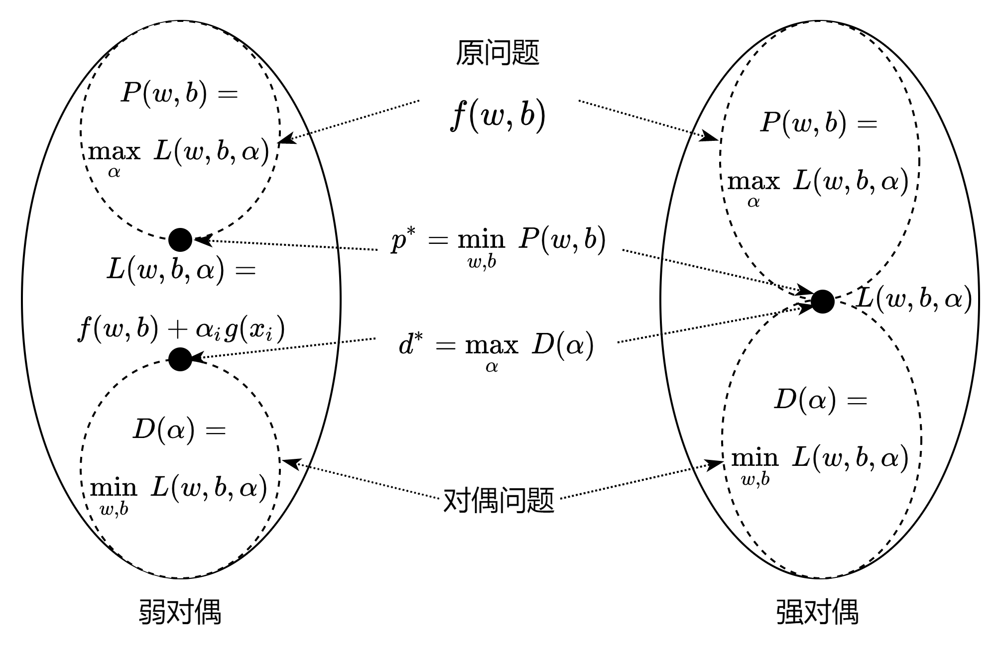

https://zhuanlan.zhihu.com/p/154517678

## 解决对偶问题

我们先用一个简单的例子来理解拉格朗日对偶问题。

### 原始问题
  
$$
\begin{aligned}
    &\underset{x}{\min} f(x)=x^2-2x+1
    \\\\
    & s.t. \quad x-0.5 \le 0 \qquad \rightarrow g(x)
\end{aligned}
\tag{5.4.1}
$$

### 构造拉格朗日函数

按照前面的拉格朗日乘子法，先构造拉格朗日函数。

$$
\begin{aligned}
L(x,\alpha) &= f(x) + \alpha g(x)
\\\\
&=x^2-2x+1 + \alpha (x-0.5)
\end{aligned}
\tag{5.4.2}
$$


### 求原始问题的极小极大值

求 $L(w,b,\alpha)$ 关于 $\alpha$ 的最大值，并记为 $P(w,b)$：

$$
P(w,b)=\underset{\alpha}{\max} \ L(w,b,\alpha)=
\begin{cases}
    f(w,b), \qquad x \in 可行解区域内
    \\\\
    +\infin, \qquad x \in 可行解区域外
\end{cases}
\tag{5.4.3}
$$

- 当样本点 $x_i,y_i$ 满足 $g(x_i)$ 的要求时，$P(w,b)$ 的值等于原函数 $f(w,b)$，因为 $P(w,b)$ 的值再怎么大也不可能超过原函数，所以取值范围应该和原函数一摸一样。
- 当样本点不满足 $g(x_i)$ 的要求时，可以把乘子 $\alpha_i$ 设置为无穷的，这样$P(w,b)$ 的值可以趋近于无穷大，没有限制。

现在确定了 $\alpha$ 的值，需要解决 $w,b$ 的问题了。对 $P(w,b)$ 取关于 $w,b$ 最小值，结果记为 $p^*$：

$$
p^* = \underset{w,b}{\min} \ P(w,b)=  \underset{w,b}{\min} \ [\underset{\alpha}{\max} \ L(w,b,\alpha)] = \underset{w,b}{\min} \ f(w,b)
\tag{5.4.4}
$$

这种针对不同参数先求最大再求最小的方法，也被称为广义拉格朗日函数的**极小极大**问题。

式 5.4.4 与式 5.4.1 是等价的，$p^*$ 就是要求的 SVM 问题的解。但是式 5.4.4 不容易求解，因为在不加入 $\alpha$ 的约束的前提下求解 $w,b$ 的最小值，这个问题不容易做，所以我们接下来用对偶问题来彻底解决。

### 求对偶问题的极大极小问题

令 $D(\alpha)$ 为 $L(w,b,\alpha)$ 关于 $w,b$ 的最小值：

$$
D(\alpha)= \underset{w,b}{\min} \ L(w,b,\alpha) \tag{5.4.5}
$$

再求 $D(\alpha)$ 关于 $\alpha$ 的最大值，并记为 $d^*$：

$$
d^*=\underset{\alpha}{\max} \ D(\alpha)= \underset{\alpha}{\max} \ [\underset{w,b}{\min} \ L(w,b,\alpha)] \tag{5.4.6}
$$

式 5.4.6 称为广义拉格朗日函数的**极大极小**问题。

### 原始问题和对偶问题的关系



<center>图 5.4.1 对偶问题</center>

很直接地，如图 5.4.1 的左子图所示：
- 在函数 $L(w,b,\alpha)$ 内部，关于一部分参数的最小值 $D(\alpha)$（式 5.4.5），一定处于该函数解空间内的底部区域；
- 相反，关于另一部分参数的最大值 $P(w,b)$（式 5.4.3），一定处于该函数解空间内的顶部区域。

为什么 $D(\alpha)$ 是一个区域而不是一个点呢？因为 $D(\alpha)= \underset{w,b}{\min} \ L(w,b,\alpha)$ 只确定了 $w,b$，而没有确定 $\alpha$，即 $\alpha$ 是个变量，$\alpha$ 取不同的值，$D(\alpha)$ 也会跟着变化。所以 $D(\alpha)$ 是一个区域。同理可知 $P(w,b)$ 也是一个区域。图中用虚线圆形来表示，只是个示意图。

所以有：

$$
D(\alpha) = \underset{w,b}{\min} \ L(w,b,\alpha) \le L(w,b,\alpha) \le \underset{\alpha}{\max} L(w,b,\alpha)=P(w,b) \tag{5.4.7}
$$

即：

$$
D(\alpha) \le P(w,b)  \tag{5.4.8}
$$

进一步可以推断，在最小值区域里面的最大值，肯定要小于在最大值区域里面的最小值：

$$
d^*=\underset{\alpha}{\max}\ D(\alpha) \le \underset{w,b}{\min} \ P(w,b)=p^* \tag{5.4.9}
$$

即：

$$
d^*=\underset{\alpha}{\max}[\underset{w,b}{\min} \ L(w,b,\alpha)] \le \underset{w,b}{\min}[\underset{\alpha}{\max} \ L(w,b,\alpha)]=p^*  \tag{5.4.10}
$$

所以，我们求得了对偶问题的解 $d^*$，就相当于求得了原问题的解 $p^*$，而且前者比后者要更容易得到。

图 5.4.1 的左子图叫做弱对偶，强对偶的情况如右子图所示，即 $d^*=p^*$。这里的符号 $d、p$ 也用得很有讲究，因为 $d$ 颠倒过来就是 $p$，但对偶问题更像是水中的倒影（镜像）问题。$d$ 向上，表示最后要求极大值；$p$ 向下，表示最后要求极小值。

### 继续求解 SVM 问题

有了式 5.4.6，解题思路就清晰了。在 5.3 小节中，我们已经通过求 $w,b$ 的偏导，顺利地得到了 $D(\alpha)=\underset{w,b}{\min} L(w,b,a)$ 的部分，得到式 5.3.9。按照式 5.4.5 的定义，重新命名为：

$$
D(\alpha)=2\alpha_2 + 2\alpha_3 -(4\alpha_2^2+6.5\alpha_3^2+10\alpha_2\alpha_3) \tag{5.4.11}
$$

接下来求公式 5.4.6 的极大值 $d^*=\underset{\alpha}{\max} D(\alpha)$。求 $D(\alpha)$ 这个凹函数的极大值，等价于求 $-D(\alpha)$ 这个凸函数的极小值，所以对 $D(\alpha)$ 取负号得到：

$$
L_{min(\alpha)} = \underset{\alpha}{\max} \ D(\alpha) =\underset{\alpha}{\min} \ [-D(\alpha)]=4\alpha_2^2+6.5\alpha_3^2+10\alpha_2\alpha_3-2\alpha_2 - 2\alpha_3 \tag{5.4.12}
$$

求极小值的方法，我们前面实践过很多次了：对表达式式中的变量求偏导，再令结果为 0 即可。对式 5.4.12 分别求 $\alpha_2、\alpha_3$ 的偏导，并令结果等于 0：

$$
\begin{cases}
\nabla_{\alpha_2} L_{min(\alpha)}=8\alpha_2+10\alpha_3-2=0
\\\\
\nabla_{\alpha_3} L_{min(\alpha)}=13\alpha_3+10\alpha_2-2=0
\end{cases}
\tag{5.4.13}
$$

解得：

$$
\begin{cases}
    \alpha_1=\alpha_2 + \alpha_3=0.5 \quad (式 5.3.8)
    \\\\
    \alpha_2=1.5
    \\\\
    \alpha_3=-1
\end{cases}
$$

其中，$\alpha_3=-1$ 违反了公式 5.4.2 关于 $\alpha_i \ge 0$ 的约定，这是为什么呢？因为从图 5.3.1 来看，样本 $p_3$ 好像不是关键点（支持向量），它不参与计算，所以 $\alpha_3$ 的值应该为 0。

我们看一下公式 5.4.12 在三维空间中的形态来具体理解。运行 4-Lmin.py 以得到图 5.4.2，同时输出打印信息如下：

```
左：a2=1.50, a3=-1.00, z=-0.50
右：a2=0.25, a3=0.00, z=-0.25
```


<center>图 5.4.2 </center>

图 5.4.2 的左子图，为 $\alpha_2、\alpha_3$ 在自由取值空间内（用 [-2,2] 近似表示）的函数形态，极小值确实在 $(\alpha_2$=1.5, $\alpha_3$=-1, $z$=-0.5) 上。

由于公式 5.4.2 的约定，我们把 $\alpha_2、\alpha_3$ 的取值限制在 $(0,+\infin)$上（用 [0,0.3] 近似表示），得到右子图的形态，右子图是左子图的一部分。可以看到极值点在 $(\alpha_2$=0.25, $\alpha_3$=0, $z$=-0.25) 上。

我们也可以分别令 $\alpha_2=0$ 和 $\alpha_3=0$，来得到公式 5.4.12 的解：

- 令 $\alpha_2=0$
  
  则 $L_{min(\alpha)}=6.5\alpha_3^2-2\alpha_3$，求导：$\nabla_{\alpha_3} L_{min(\alpha)}=13\alpha_3-2=0，\alpha_3=\frac{2}{13}，L_{min(\alpha)}=-\frac{2}{13}$。

  注意，这里不要错误地令 $L_{min(\alpha)}=6.5\alpha_3^2-2\alpha_3=0$ 来求一元二次方程的解，因为我们是求函数极值，而不是求方程的解。

- 令 $\alpha_3=0$

    则 $L_{min(\alpha)}=4\alpha_2^2-2\alpha_2，\nabla_{\alpha_2} L_{min(\alpha)}=8\alpha_2-2=0，\alpha_2=\frac{1}{4}，L_{min(\alpha)}=-\frac{1}{4}$。

由于 $-\frac{1}{4} < -\frac{2}{13}$，为极小值，所以我们最终得到：

$\alpha_2=\frac{1}{4}，\alpha_3=0，\alpha_1=\alpha_2+\alpha_3=\frac{1}{4}$，极值为$-\frac{1}{4}$。


### 思考与练习

