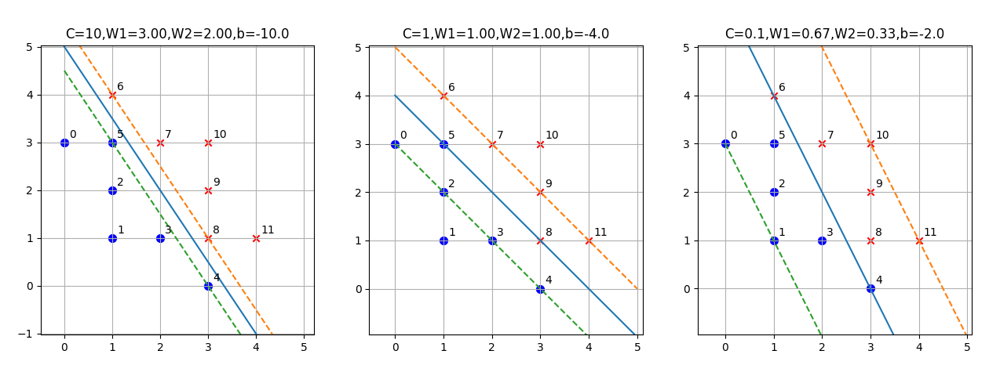
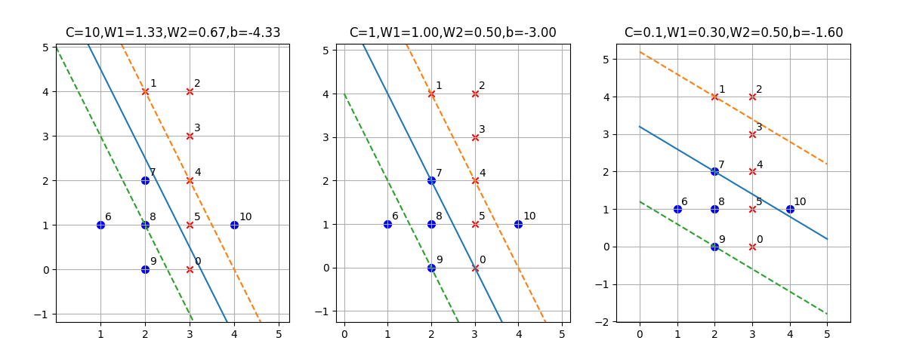

## 解决软间隔问题

### 实例学习一

我们先用图 5.7.1 的问题来学习一下 C 值对分类结果的影响。首先定义数据：

```Python
X = np.array([[0,3],[1,1],[1,2],[2,1],[3,0],[1,3],[1,4],[2,3],[3,1],[3,2],[3,3],[4,1]])
Y = np.array([-1,-1,-1,-1,-1,-1,1,1,1,1,1,1])
```

如果绘制到图中观察，可以发现正负类样本实际上是成对称分布的，中间有一个很宽的分类间隔，但是由于负类样本点 5 和正类样本点 8 的存在，侵占了原有的分类间隔，所以必须重新计算。

我们分别设置 C 的值为 10、1、0.1，看看分类效果如何。

```Python
fig = plt.figure()
ax = fig.add_subplot(131)
C = 10
svc(ax, C, X, Y)
ax = fig.add_subplot(132)
C = 1
svc(ax, C, X, Y)
ax = fig.add_subplot(133)
C = 0.1
svc(ax, C, X, Y)
plt.show()
```

上述代码中的 svc 函数实际上是调用 sklearn 的 SVM 模块中的 SVC 方法来实现的：

```Python
from sklearn.svm import SVC

model = SVC(C, kernel='linear')
model.fit(X,Y)
```
SVC 这个名字的含义是 Support Vector Classifier，支持向量分类器。SVM 中还有一个叫做 SVR 的方法，含义是 Support Vector Regression，支持向量回归，是用 SVM 算法做回归预测的。


绘制样本点：

```Python
    for i in range(Y.shape[0]):
        if (Y[i] == 1):
            # 正类样本
            ax.scatter(X[i,0], X[i,1], marker='x', color='r')
        else:
            # 负类样本
            ax.scatter(X[i,0], X[i,1], marker='.', color='b', s=200)
        # 样本编号
        ax.text(X[i,0]+0.1, X[i,1]+0.1, str(i))
```

同时，把分界线及分类间隔绘制出来：

- 分界线方程
  
  $w_1 x_1 + w_2 x_2 + b = 0$，转换成 $y=ax+b$ 的形式，即：$x_2 = -\frac{w_1}{w_2}x_1-\frac{b}{w_2}$，

- 分类间隔边界的方程

  $w_1 x_1 + w_2 x_2 + b = \plusmn 1$，转换成 $x_2 = -\frac{w_1}{w_2}x_1-\frac{b}{w_2} \plusmn \frac{1}{w_2}$

在下面的代码中，$w$ 矢量的下标是从 0 开始的，所以 $w_1 = w[0]，w_2=w[1]$：


```Python
    w = model.coef_[0]
    a = -w[0]/w[1]
    b = model.intercept_
    x = np.linspace(0,5,10)
    # 分界线
    y0 = a * x + -b/w[1]
    # 上边界
    y1 = a * x + -b/w[1] + 1/w[1]
    # 下边界
    y2 = a * x + -b/w[1] - 1/w[1]
    ax.plot(x,y0)
    ax.plot(x,y1,linestyle='--')
    ax.plot(x,y2,linestyle='--')
```

最后得到图 5.8.1。



<center>图 5.8.1 </center>

||C=10|C=1|C=0.1|
|--|--|--|--|
|W|[3,2]|[1,1]|[0.66,0.33]|
|b|-10|-4|-2|
|支持向量|4,5; 8|4,5; 7,8|0,1,2,3,4,5; 6,7,8,9,10,11|

- C=10

  C=10 时，要求尽量分类两类样本，分类间隔会变窄。支持向量只有 3 个，序号为 4、5、8 的三个样本。其实 6 也可以是支持向量，只不过有 4、5、8 三个样本点已经能够完全决定分类间隔的形状了。

- C=1

  C=1 时，属于比较中庸的选择，结果也比较合理。本来 5 号和 8 号样本点应该算是噪音，所以这种选择很合理地把 5、8 放在了分界线上，把 0、2、3、4 放在了分类间隔下界上，同时把 6、7、9、11 放在了分类间隔上届上。

- C=0.1

  C=0.1 时，要求分类间隔尽量宽，所以与左图相比，分界线顺时针旋转了一些，以牺牲 4、6 号样本点为代价（让它们处于模棱两可的状态中），使得分类间隔在三种情况中最宽，并造成了两类样本点都处于分类间隔之内，即都是支持向量。


### 实例学习二

下面我们看看图 5.7.2 所示的第二个例子。与前面的例子不同，在这个例子中，由于有序号为 0、5、10 的样本存在，无论如何也不能做到线性可分，那么 SVM 又是如何工作的呢？

首先列出样本值如表，有正类样本 6 个，负类样本 5 个。

表 5.8.1

|样本|0|1|2|3|4|5|6|7|8|9|10|
|--|--|--|--|--|--|--|--|--|--|--|--|
|$x_1$|3|2|3|3|3|3|1|2|2|2|4|
|$x_2$|0|4|4|3|2|1|1|2|1|0|1|
|$y$|1|1|1|1|1|1|-1|-1|-1|-1|-1|

- C=10 的情况

使用 sklearn 自带的 SVC 模块来进行分类，分别设置参数 C 为 10，执行 fit() 方法后，得到分类结果如表 5.8.2 所示。

表 5.8.2

|样本|0|1|2|3|4|5|6|7|8|9|10|
|--|--|--|--|--|--|--|--|--|--|--|--|
|$x_1$|3|2|3|3|3|3|1|2|2|2|4|
|$x_2$|0|4|4|3|2|1|1|2|1|0|1|
|$y$|1|1|1|1|1|1|-1|-1|-1|-1|-1|
|分类结果|错误|正确|正确|正确|正确|正确|正确|正确|正确|正确|错误|
|距离|-0.33|1|2.33|1.66|1|0.33|-2.33|-0.33|-1|-1.66|1.66|
|位置|错边|间隔线上|间隔之外|间隔之外|间隔线上|间隔之内|间隔之外|间隔之内|间隔线上|间隔之外|错边|
|支持向量|是|是|不|不|是|是|不|是|是|不|是|
|$\alpha * y$|10|6.44|0|0|1.33|10|0|-10|-7.77|0|-10|
|$\alpha$|10|6.44|0|0|1.33|10|0|10|7.77|0|10|
|$C=10$|$\alpha=C$|$\alpha<C$|$\alpha=0$|$\alpha=0$|$\alpha<C$|$\alpha=C$|$\alpha=0$|$\alpha=C$|$\alpha<C$|$\alpha=0$|$\alpha=C$|

读者可以自行与表 5.7.1 中的定义对比，看看表 5.8.2 中关于分类结果、距离、位置、是否支持向量、$\alpha$ 值、$C$ 值，是否符合定义并且合理。

有一点需要解释一下，在 SVC 的运行结果中，关于下面这个属性：
```
model.dual_coef_=[[-10  -7.77  -10  10  6.44  1.33  10]]
```
它对应到 $a_i * y_i$，它的顺序与下面这个属性是对应的：
```
model.support_=[ 7  8  10  0  1  4  5 ]
```
而且如果做下面的运算：

```
np.dot(model.dual_coef_, model.support_vectors_)
```
其结果应该就是 $w$ 的值，相当于公式 $\boldsymbol{w} = \sum_{i=1}^n a_i y_i \boldsymbol{x}_i$。

当然，我们也会把结果可视化，便于大家理解，请看图 5.8.2 的左子图（C=10 栏）。



<center>图 5.8.2 </center>


- C=1 的情况

接下来我们试验 C=1 的情况，运行结果如图 5.8.2 的中子图所示，具体数值在表 5.8.3 中。

表 5.8.3

|样本|0|1|2|3|4|5|6|7|8|9|10|
|--|--|--|--|--|--|--|--|--|--|--|--|
|$x_1$|3|2|3|3|3|3|1|2|2|2|4|
|$x_2$|0|4|4|3|2|1|1|2|1|0|1|
|$y$|1|1|1|1|1|1|-1|-1|-1|-1|-1|
|分类结果|两可|正确|正确|正确|正确|正确|正确|两可|正确|正确|错误|
|距离|0|1|2|1.5|1|0.5|-1.5|0|-0.5|-1|1.5|
|位置|分界线上|间隔线上|间隔之外|间隔之外|间隔线上|间隔之内|间隔之外|分界线上|间隔之内|间隔线上|错边|
|支持向量|是|是|不|不|是|是|不|是|是|是|是|
|$\alpha * y$|1|0.375|0|0|1|1|0|-1|-1|-0.375|-1|
|$\alpha$|1|0.375|0|0|1|1|0|1|1|0.375|1|
|$C=1$|$\alpha=C$|$\alpha<C$|$\alpha=0$|$\alpha=0$|$\alpha=C$|$\alpha=C$|$\alpha=0$|$\alpha=C$|$\alpha=C$|$\alpha<C$|$\alpha=C$|

与左子图相比，中子图的斜率没有变化，间隔上届也没有变化，分界线向左下方扩展了一些，本来是以 8 号样本为支持向量，变成了 9 号样本，所以间隔宽度变大。

式 5.7.5 中的 $\alpha$ 值是可以计算出来的，虽然是 $\beta$ 的值计算不出来，但是我们可以看一下式 5.7.3 中关于 $C \sum_{i=1}^n s_i$ 的情况。

在表 5.8.3 中，“距离”这一行的数据，实际上就是代表误差 $s_i$，但是这个距离是距离分界线的距离，而松弛变量的值是到间隔边界的值，确定其值还要结合“分类结果”及“位置”共同决定。我们把表 5.8.3 重新加工一下，去掉无关的行，形成表 5.8.4。

表 5.8.4

|样本|0|1|2|3|4|5|6|7|8|9|10|
|--|--|--|--|--|--|--|--|--|--|--|--|
|分类结果|两可|正确|正确|正确|正确|正确|正确|两可|正确|正确|错误|
|距离|0|1|2|1.5|1|0.5|-1.5|0|-0.5|-1|1.5|
|位置|分界线上|间隔线上|间隔之外|间隔之外|间隔线上|间隔之内|间隔之外|分界线上|间隔之内|间隔线上|错边|
|支持向量|是|是|不|不|是|是|不|是|是|是|是|
|$s_i$|1-0=1|1-1=0|0|0|1-1=0|1-0.5=0.5|0|1-0=1|1-0.5=0.5|1-1=0|1+1.5=2.5|

那么
$$
C \sum_{i=1}^n s_i=1 * (1+0+0+0+0+0.5+0+1+0.5+0+2.5)=5.5
$$


- C=0.1 的情况

C=0.1 的情况中，间隔进一步扩宽，导致分类错误的样本点有 3 个，分别是 0、5、10 号。其它不再赘述，请读者自己运行代码绘制表格来理解。

### 思考和练习

1. 修改并允许代码 5-7-2.py，观察并理解当 C=0.05 时，算法如何工作。
2. 请读者自行验证 np.dot(model.dual_coef_, model.support_vectors_) 的值是否与 $w$ 一致。
3. 请读者根据图 5.8.2 右子图的情况，自行绘制一张类似 5.8.3 的表，具体数值可以在运行 5-8-2.py 后得到。

  