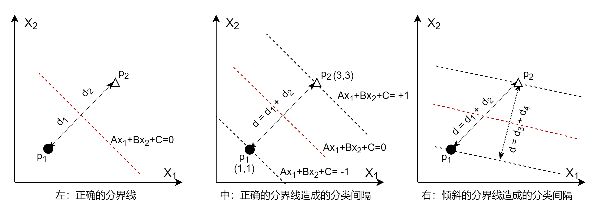

## 10.1 支持向量机的基本原理

### 10.1.1 一维空间中的二分类

先从最简单的问题说起：一条直线上，有两个点，分别代表正类（好人）和负类（坏人），如图 10.1.1 所示，如何分界？

图 10.1.1 直线上两个样本点的分类

小学生都可以快速地回答：当然是取一个**中点**作为**分界点**，把好人坏人分开。

进一步，在两侧各增加几个样本点，如何分界？如图 10.1.2 所示。

图 10.1.2 直线上两类样本点的分类

小学生稍微犹豫一下，但还会做出正确的回答：仍然是在原来的分界点的位置上做分界，而不会由于好人坏人的数量或密度不一样而改变分界点位置。

好了，现在我们已经得到了支持向量机的最原始的概念了：在正类和负类样本之间，找到一个中点 $p_0$ 做分界点，让所有的正类样本点都在分界点右侧，所有的负类样本点都在分界点的左侧。附加条件是 $d_1 = d_2$。

其中：
- $d_1 = |x_{p_1} - x_{p_0}|$，$p_1$ 是距离分界点最近的负类样本点
- $d_2 = |x_{p_2} - x_{p_0}|$，$p_2$ 是距离分界点最近的正类样本点

$p_1、p_2$叫做**支持点**。

用数学语言描述如下：

- 样本点用 $x_i$ 表示（既包括正类也包括负类）；
- $y_i$ 是标签值，$+1$ 代表正类，$-1$ 代表负类。

$$
\begin{cases}
x_{p_i} > x_{p_0}, \quad  y_i=+1（正类样本）
\\\\
x_{p_i} < x_{p_0}, \quad y_i=-1（负类样本）
\\\\
d_1 = d_2
\end{cases}
\tag{10.1.1}
$$

随着样本特征维数的增加，分界点可以扩展到分界线（二维）、分界平面（三维），分界超平面（更高维），当然，也可以把这三者统称为分界超平面（Hyperplane）。

### 10.1.2 二维空间中的二分类

下面我们把情况从一维扩展到二维。假设在二维空间中有两个样本点，分别属于正、负类，如图 10.1.3 所示。

图 10.1.3 二维空间中二分类的分界线的不同形态

- 左子图

    分界线 $x_2 = a_1 x_1 + b_1$ 正确，符合两个条件：1）分界线垂直于两个样本点之间的连线；2）两个样本点距离分界线的距离一致，即 $d_1 = d_2$。

- 中子图
  
    分界线 $x_2 = a_2 x_1 + b_2$ 虽然仍然与两个样本点之间的连线垂直，但是向上偏移了。与左图比较的话，分界线斜率相同，截距不同，即 $a_2 = a_1，b_2 > b_1$，结果造成了 $d_1 \ne d_2$。

- 右子图

   分界线 $x_2 = a_3 x_1 + b_3$ 虽然与两个样本点之间的距离相等（即 $d_3=d_4$），但是倾斜（逆时针旋转）了，造成 $d_3<d_1，d_4<d_2$。与左图比较的话，分割线的斜率和截距都不同，即 $a_3 > a_1，b_3 < b_1$。

三个子图中，虽然分界线都可以正确地分割两个样本点，但只有左图是最优的，在用这个分类模型做预测时的鲁棒性最强，误差最小。

用数学语言描述如下：

如果分界线方程为：

$$
Ax_1 + Bx_2+ C=0 \tag{10.1.2}
$$

或者是其等价形式（$a=-\frac{A}{B}，b=-\frac{C}{B}$）：

$$
x_2 = ax_1 + b \tag{10.1.3}
$$

则最优分界线满足以下条件：

$$
\begin{cases}
x_{i,2} \ge a x_{i,1} + b, \quad y_i=+1（正类样本）
\\\\
x_{i,2} \le a x_{i,1} + b, \quad y_i=-1（负类样本）
\\\\
d_1 = d_2
\\\\
\max d=d_1+d_2 \quad （即最大化 d 值）
\end{cases}
\tag{10.1.4}
$$

其中，$x_{i,j}$ 表示第 $i$ 个样本的第 $j$ 个特征值，对于本例来说，$i=1,...,n，j=1,2$，正类样本和负类样本的 $i$ 不相同，即一个样本 $x_i$ 只能属于一个类别。

用几何概念来解释就是：
- 正类样本在分界线的上方；
- 负类样本在分界线的下方；
- 样本点到分界线的距离相等（避免偏移）；
- 样本点到分界线的距离最大（避免倾斜，实际上就是垂直）。

当然，这里的正类负类是人为指定的，也可以约定相反的符号，这样正类就会在分界线的下方，这会造成理解上的障碍，但是并不妨碍最后的推导结果正确。

从这几个例子可以看出来，分类与回归不同：
- 在回归中，**尽量让回归（线）距离（自己）最小**，得到的效果是每个样本都想把回归线尽量“拉向”自己，最终的回归结果是**所有样本点**的“引力”的均衡；
- 而在分类中，**尽量让分界（线）距离（自己）最大**，得到的效果是每一类样本都想把分界线“推向”对方，最终的分类结果是两类样本中**支持点**的“斥力”的均衡。

用图 10.1.4 来解释这个规则。

图 10.1.4 分类的基本规则

分界线的确定是为了“照顾”距离对方样本较近的点，如 $p_1、p_2$。相对来说，距离分界线较远的点，如 $p_4、p_6$ 在分类的准确性上更有保证。所以每一类样本都希望分界线距离自己越远越好。

### 10.1.3 分类间隔

由于 $d$ 的存在，相当于我们在分界线的两侧各画一条与分界线平行的直线，并穿过样本点，形成一个带状的间隔。也就是说在两类样本点之间有一条中空的地带，就叫做**分类间隔**，$d$ 实际上就是该带状分类间隔的宽度。

图 10.1.5 分类间隔

在图 10.1.5 中：

- 左子图
  
  正确的分界线及其方程 $Ax_1+Bx_2+C=0$。

- 中子图
  
  两条黑丝虚线是正确的分界线造成的分类间隔的边界线，其直线方程是 $Ax_1+Bx_2+C=+1$ 和 $Ax_1+Bx_2+C=-1$。

- 右子图

  倾斜的分界线及其分类间隔。与中子图比较可以看到，$d_3+d_4 \lt d_1+d_2$，不属于最优解。
  中图的分类间隔的宽度大于右侧的分类间隔，而且是所有可能的情况中的最大值，属于最优解。

在图 10.1.5 的中子图，分界线公式 $Ax_1+Bx_2+C=0$，是大家都可以理解的。但是我们还定义了两侧的两条间隔边界的直线方程：

$$Ax_1+Bx_2+C=+1 \tag{10.1.5}$$
$$Ax_1+Bx_2+C=-1 \tag{10.1.6}$$ 

有些读者会有疑问：为什么公式 10.1.5 和 10.1.6 的值正好是 $+1$ 和 $-1$？如果间隔变窄了，该等式还成立吗？

我们举例说明。

点到直线距离如公式 10.1.7：

$$
d = \frac{|Ax_1+Bx_2+C|}{\sqrt{A^2+B^2}} \tag{10.1.7}
$$

假设分界线方程如等式 10.1.8：

$$
x_1+x_2-4=0 \tag{10.1.8}
$$

其中：$A_1=1，B_1=1，C_1=-4$。对 $p_2(3,3)$ 来说：

$$Ax_1+Bx_2+C=1 \times 3 + 1 \times 3 -4=2$$

$p_2$ 到该分界线的距离是：

$$
d' = \frac{|1 \times 3 + 1 \times 3 -4|}{\sqrt{1^2+1^2}}=\frac{2}{\sqrt{2}}，（=\sqrt{2}）
$$

对于式 10.1.8，我们两边都除以 2，得到式 10.1.9，该直线在二维空间中没有任何变化：

$$
0.5x_1 + 0.5x_2 - 2=0 \tag{10.1.9}
$$

此时，$A_2=0.5，B_2=0.5，C_2=-2$。此时对 $p_2(3,3)$ 来说，计算 $p_2$ 到分界线的距离：

$$
d'' = \frac{|0.5 \times 3 + 0.5 \times 3 -2|}{\sqrt{0.5^2+0.5^2}}=\frac{1}{\sqrt{0.5}}，（=\sqrt{2}）
$$

式 10.1.8 和 10.1.9 表示了同一条直线，点 $p_2$ 到其的距离 $d'、d''$ 都是 $\sqrt{2}$，但是分子 $|Ax_{1}+Bx_{2}+C|$ 的值并不相同，前者为 2，后者为 1。这就说明，无论分割线的位置如何，我们总可以改变 $A、B、C$ 的值让式 10.1.5 和 10.1.6 成立，同时保证几何距离（本例中为 $\sqrt{2}$）不会变化（因为分母 $\sqrt{A^2+B^2}$ 也会做相应的变化）。

我们把正类样本点 $p_2(3,3)$ 的坐标值代入公式 10.1.9：

$$
Ax_{2,1}+Bx_{2,2}+C=0.5 \times 3 + 0.5 \times 3 - 2 = +1
$$

再把负类样本点 $p_1(1,1)$ 的坐标值代入公式 10.1.9：

$$
Ax_{1,1}+Bx_{1,2}+C=0.5 \times 1 + 0.5 \times 1 - 2 =  -1
$$

可以看到上面两式的结果是 $+1$ 和 $-1$，和式 10.1.5、10.1.6 正好吻合，证明了其可行性。

所以，图 10.1.5 的中图的分类间隔宽度 $d$ 可以表示为：

$$
\begin{aligned}
d &= d_1 + d_2 = \frac{|Ax_{1,1}+Bx_{1,2}+C|}{\sqrt{A^2+B^2}}+\frac{|Ax_{2,1}+Bx_{2,2}+C|}{\sqrt{A^2+B^2}}
\\\\
&=\frac{|-1|}{\sqrt{A^2+B^2}}+\frac{|+1|}{\sqrt{A^2+B^2}}=\frac{2}{\sqrt{A^2+B^2}}
\end{aligned}
\tag{10.1.10}
$$

### 10.1.4 公式形式的变化

分界线的直线方程为公式 10.1.2，如果用向量形式表示，可以转化为：

$$
Ax_1+Bx_2+C=
\begin{pmatrix}
    A & B
\end{pmatrix}
\begin{pmatrix}
    x_1 & x_2
\end{pmatrix}^T
+C=\boldsymbol{w} \cdot \boldsymbol{x}+b=0
\tag{10.1.11}
$$

其中：$\boldsymbol{w} = (A \quad B)，\boldsymbol{x} = (x_1 \quad x_2)，b=C$，$\boldsymbol{w} \cdot \boldsymbol{x}$ 中间的 “$\cdot$” 表示内积计算，则式 10.1.5、10.1.6 可以写成：

$$
\boldsymbol{w} \cdot \boldsymbol{x}+b=+1 \tag{10.1.12}
$$
$$
\boldsymbol{w} \cdot \boldsymbol{x}+b=-1 \tag{10.1.13}
$$

把 $C$ 重新命名为 $b$ 在各种文献里比较通用，被称作截距。

而式 10.1.10 可以改成：

$$
d = \frac{2}{\sqrt{A^2+B^2}}=\frac{2}{\sqrt{w_1^2+w_2^2}} = \frac{2}{||\boldsymbol{w}||} \tag{10.1.14}
$$

其中，$||\boldsymbol{w}||$ 是 $||\boldsymbol{w}||_2$ 的简写形式，表示 $\boldsymbol{w}$ 的二范数 $L_2$，即 $\boldsymbol{w}$ 中的各元素的平方和，再开方。在二维平面中，$\boldsymbol{w}$ 只包含 $w_1,w_2$；可以扩展到高维坐标系中，比如含有四维特征的 $\boldsymbol{x}$ 所对应的 $||\boldsymbol{w}||=\sqrt{w_1^2+w_2^2+w_3^2+w_4^2}$。

### 10.1.5 增加新的样本点

下面我们看看多个样本点的情况，如图 10.1.6 所示。

图 10.1.6 新增加的样本点改变分界线及分类间隔

- 左子图
  
    还是最初的两个样本点以及分界线、分类间隔，间隔的宽度为 $d_1$，用于做参考。

- 中子图
  
    正类上增加了新的样本点 $p_3$，由于在分类间隔之外，所以并没有影响已有的分界线和分类间隔的正确性。

    在负类上增加的新样本点 $p_4$，已经在间隔以内了，所以必须重新计算分界线。

- 右子图
    
    重新计算的分界线及分类间隔的结果，可以想象成是原有的分类间隔在平面上以 $p_1$ 到 $p_2$ 的连线中心逆时针旋转了一个角度。
    
    可以看到，负类中有两个点在分类间隔边界上，这并不是巧合，而是分类间隔在这个角度上，可以刚好分类正确，并且得到的 $d_2$ 值最大。这一点在很多文字资料中没有讲清楚，造成很多读者误以为支持向量一定是一个正类样本，两个负类样本，或者相反。

    图中的 $d_2 < d_1$，这从直角三角形斜边大于直角边的关系可以看出来。但这已经是分类间隔可以做到的最优解了，再逆时针旋转的话（直到分类间隔边界达到 $p_3$ 点），虽然也可以保证分类正确，但是会造成 $d_2$ 值进一步减小。

所以，我们希望所有的样本点都在分类间隔之外，把式 10.1.12、10.1.13 的等号改成不等号，分别是正类样本和负类样本：

$$
\begin{cases}
\boldsymbol{w} \cdot \boldsymbol{x_i}+b \ge +1, \quad y_i=+1（正类样本）
\\\\
\boldsymbol{w} \cdot \boldsymbol{x_i}+b \le -1, \quad  y_i=-1（负类样本）
\end{cases}
\tag{10.1.15}
$$

式 10.1.15 的几何意义很明确，即所有正类样本都在分类间隔的上边界之上，而所有负类样本都在分类间隔的下边界之下。这种间隔叫做**硬间隔**。

进一步，式 10.1.15 的两边都乘以 $y_i$：
- 当 $y_i=+1$ 时，不等式符号不变，依旧是 $y_i(\boldsymbol{w} \cdot \boldsymbol{x_i}+b) \ge 1$； 
- 当 $y_i=-1$ 时，不等式符号改变方向，$y_i(\boldsymbol{w} \cdot \boldsymbol{x_i}+b) \ge 1$

所以，式 10.1.15 最后可以合并成式 10.1.16：

$$
1 - y_i(\boldsymbol{w} \cdot \boldsymbol{x_i}+b) \le 0 \tag{10.1.16}
$$

即把不等式右侧的 1 挪到左侧来，再两边乘以 -1，改变不等式符号方向。这样做是为了后面使用拉格朗日乘子确定优化条件时方便。

在图 10.1.5 右子图中，$p_1、p_2、p_4$ 处于分类间隔边界上，叫做**支持向量**，它们决定了间隔的宽度。在二维以上的独立样本数据都可以叫做向量。

### 10.1.6 优化目标函数

到目前为止，我们可以总结出分类间隔的基本条件，式 10.1.4 中的 $d$ 用式 10.1.14 代替：

$$
d = \frac{2}{||\boldsymbol{w}||} \tag{10.1.17}
$$

所以：

$$
\max d = \underset{w,b}{\max} \frac{2}{||\boldsymbol{w}||} \tag{10.1.18}
$$

由于 $||\boldsymbol{w}||$ 在分母上，所以求式 10.1.17 的最大值，等价于求 $||\boldsymbol{w}||^2$ 的最小值（$||\boldsymbol{w}||^2$ 是为了去掉开平方的操作，以及后续求导方便）：

$$
\underset{w,b}{\min} \ f(w,b) = \underset{w,b}{\min} \ \frac{1}{2}||\boldsymbol{w}||^2 \tag{10.1.19}
$$

在求式 10.1.18 的同时，我们还要求公式 10.1.16 成立，所以结合两者，我们需要优化的目标函数是：

$$
\begin{aligned}
    \underset{w,b}{\min} & \ f(w,b) =\frac{1}{2}||\boldsymbol{w}||^2
    \\\\
    s.t. & \ 1-y_i(\boldsymbol{w} \cdot \boldsymbol{x_i}+b) \le 0, \quad i=1,2,...,n
\end{aligned}
\tag{10.1.20}
$$

$s.t.$ 表示受约束（subject to）的意思。所以公式 10.1.20 的含义是：在所有样本分类正确的前提下，要求分类间隔最大化。

### 思考和练习
