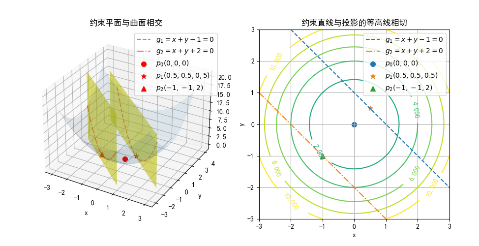

## 10.2 拉格朗日乘子法（Lagrange Multiplier）

解决 SVM 算法的优化问题，需要用到拉格朗日乘子法的数学知识，所以在这里解释一下其原理。

### 10.2.1 无约束优化问题

对于函数 $f(x,y)=x^2+y^2$，如果求其最小值，我们知道分别对 $x、y$ 求偏导，并令结果为 0，即可以得到极值点结果为 $(0,0)$ 点。

### 10.2.2 简单的等式约束优化问题一

如果加一个限制条件，求函数 $f(x,y)$ 在约束条件 $h(x,y)=x+y+2=0$ 时的最小值，记作：

$$
\begin{aligned}
\underset{x,y}{\min} & \ f(x,y)=x^2+y^2
\\\\
s.t. & \ x+y+2=0 \qquad \rightarrow h(x,y)=0
\end{aligned}
\tag{10.2.1}
$$

用解方程组的方法求解：

$$
\begin{cases}
    z = x^2+y^2
    \\\\
    x+y+2=0
\end{cases}
\tag{10.2.2}
$$
下面的公式变形为 $y=-x-2$ 带入上面的式子，得到：
$$
z=2x^2+4x+4 \tag{10.2.3}
$$

对$z$求$x$的导数，并令结果为 0：

$$
\frac{dz}{dx} = 4x+4 = 0 \tag{10.2.4}
$$

得到：当 $x=-1，y=-1$时，$z=2$ 为最小值。

图 10.2.1 相交线及其极值点

结果如图 10.2.1，红色曲线为函数 $f(x,y)$ 与约束平面 $h(x,y)=(x+1_)^2+(y+2)^2=$ 的相交线，红色圆点为极值点。此处可以运行 Code_10_2_1.py 来观察实际效果。

注意，$h(x,y)$ 约束条件其实只是 $x/y$ 平面上的一条直线，我们把它沿 Z 轴“提升”成为一个立平面，这样就和 $f(x,y)$ 相交并形成相交线，便于读者理解。

有一种错误的理解是把 $h(x,y)=x+y+2=0$ 看成 $z=x+y+2$，这就变成了一个三维空间中的斜面，与 $f(x,y)$ 的底部相交形成一个倾斜的椭圆，也可以求极值点。但是和原来的约束条件完全是两个不同的问题。

### 10.2.3 简单的等式约束优化问题二

有的读者可能会有疑问，

我们把 10.2.2 小节中的问题

如果加一个限制条件，求函数 $f(x,y)$ 在约束条件 $h(x,y)=(x+2)^2+(y+1)^2-1=0$ 时的最小值，记作：

$$
\begin{aligned}
\underset{x,y}{\min} & \ f(x,y)=x^2+2y^2
\\\\
s.t. & \ (x+2)^2+(y+1)^2-1=0
\end{aligned}
\tag{10.2.1}
$$

图 10.2.3 相交线及其极值点

### 10.2.4 复杂的等式约束优化问题

当约束条件比较复杂时，不能直接解出方程组来，就可以用拉格朗日乘子法（以数学家Joseph-Louis Lagrange命名）。

例：用一定体积 $V$ 的水装在一个玻璃长方体中，问当长宽高具体为多少时，表面积 $S$ 最大？

设长宽高分别为 $x,y,z$，则问题成为：
$$
\begin{aligned}
\underset{x,y,z}{\max} & \ f(x,y,z)=2xy+2xz+2yz
\\\\
s.t. & \ xyz-V = 0  \qquad \rightarrow h(x,y,z)=0
\end{aligned}
$$

构造拉格朗日函数：

$$
\begin{aligned}
L(x,y,z,\alpha)&=f(x,y,z)+\alpha h(x,y,z)
\\\\
&=2xy+2xz+2yz+\alpha(xyz-V)=0 \tag{10.2.6}
\end{aligned}
$$

求 $L$ 的各个参数的偏导数 $\nabla L$：

$$
\begin{cases}
    \nabla_x L(x,y,z,\alpha)=2y + 2z + \alpha yz=0
    \\\\
    \nabla_y L(x,y,z,\alpha)=2x+2z+\alpha xz=0
    \\\\
    \nabla_z L(x,y,z,\alpha)=2x+2y+\alpha xy=0
    \\\\
    \nabla_{\alpha} L(x,y,z,\alpha)=xyz-V=0
\end{cases}
\tag{10.2.7}
$$

解方程组 10.2.7 得：

$$
\alpha = -4 V^{-\frac{1}{3}}，x=y=z=V^{1/3}，S_{max}=6V^{2/3}
$$

### 10.2.5 不等式约束优化问题

问题一：

$$
\begin{aligned}
\underset{x,y}{\min} & \ f(x,y)=x^2+y^2
\\\\
s.t. & \ x+y-1 \le 0 \quad \rightarrow g_1(x,y)
\end{aligned}
\tag{10.2.8}
$$

问题二：

$$
\begin{aligned}
\underset{x,y}{\min} & \ f(x,y)=x^2+y^2
\\\\
s.t. & \ x+y+2 \le 0 \quad \rightarrow g_2(x,y)
\end{aligned}
\tag{10.2.9}
$$

图 10.2.2 不等式约束优化

图 10.2.2 展示了两种情况的不等式，左子图是三维图形，包含原函数 $f(x,y)$ 的曲面图和两个约束不等式的立面图，右子图是左图在 $x/y$ 平面上的投影。

两个约束不等式形成了两种情况：

- 问题一：原函数的最优解在不等式的约束允许的区域内，所以没有受到约束的影响

约束不等式 1：$g_1(x,y)=x+y-1 \le 0$，从右子图看，既要求红色虚线的左下方的区域为约束允许的区域。

可以使用**广义拉格朗日函数**求解不等式约束问题：

$$
L(x,y,\alpha)=f(x,y)+\alpha g_1(x,y) \tag{10.2.10}
$$

求 $x,y,\alpha$ 的偏导并令其为 0，解出：$\alpha=-1,x=0.5,y=0.5,f(0.5,0.5)=0.5$。

由于原函数 $f(x,y)$ 的最优解 $p_0(x=0,y=0,z=0)$ 在不等式的约束区域允许范围内，所以极值点还是 $p_0$ 点，相当于没有约束。约束边界上的 $p_1(x=0.5,y=0.5,z=0.5)$ 点的 $z$ 值大于 $p_0$ 点的 $z$ 值，所以不是最优解。

- 问题二：最优点在不等式的边界上，改变了原函数的最优解

约束不等式 2：$g_2(x,y)=x+y+2 \le 0$，从右子图看，既要求绿色点划线的左下方的区域为约束允许的区域。

这种情况下，由于原函数是个凸函数，越靠近原点越优，所以最优解应该在约束的边界上，而不是远离约束边界的允许区域内。这就相当于等式约束，那么就依然可以用上面的拉格朗日乘子法来求解：

$$
L(x,y,\alpha)=f(x,y)+\alpha g_2(x,y) \tag{10.2.11}
$$

求 $x,y,\alpha$ 的偏导并令其为 0，解出：$\alpha=2,x=-1,y=-1,f(-1,-1)=2$。请读者自行练习手动解题。

### 10.2.5 同时含有等式和不等式约束的优化问题

$$
\begin{aligned}
\underset{x,y}{\min}  & \ f(x,y)=x^2+y^2
\\\\
s.t. & \ y-x+2 \le 0 \quad \rightarrow g(x,y)
\\\\
& \ xy-3 = 0 \quad \rightarrow h(x,y)
\end{aligned}
\tag{10.2.12}
$$

此时构造拉格朗日函数如：

$$
\begin{aligned}
L(x,y,\alpha,\beta)&=f(x,y)+\alpha g(x,y)+\beta h(x,y)
\\\\
&=x^2+y^2+\alpha(y-x+2)+\beta(xy-3)=0
\end{aligned}
\tag{10.2.13}
$$

然后分别求 $x、y、\alpha、\beta$ 的偏导数并令其为 0，联立 4 项等式方程组：

$$
\begin{cases}
    \nabla_x L=2x-\alpha+\beta y=0
    \\
    \nabla_y L=2y+\alpha+\beta x=0
    \\
    \nabla_{\alpha} L=y-x+2=0
    \\
    \nabla_{\beta} L=xy-3=0
\end{cases}
\tag{10.2.14}
$$

解得两组解：

- $\alpha=4, \beta=-2,x=3,y=1,\min \ f(x,y) = 10$
- $\alpha=4, \beta=-2,x=-1,y=-3,\min \ f(x,y) = 10$

因为 $xy-3=0$ 是奇函数，原点对称，所以在第一象限和第三象限都有解。

### 10.2.6 KKT（Karush-Kuhn-Tucker）条件

综合 10.2.4 不等式优化中的两种情况考虑：
- 第一种情况相当于在公式 10.2.10 中的 $\alpha=0$，即没有约束，此时 $\alpha g(x,y)=0$ 项没有影响，直接求原函数的最优解即可。

- 第二种情况虽然是不等式，但是最优解在边界上，所以相当于等式约束，即 $g(x,y)=0$，而非 $g(x,y) \le 0$。此时无论 $\alpha$ 为何值，都有 $\alpha g(x,y)=0$。

所以两种情况都满足：
$$
\alpha g(x,y)=0 \tag{10.2.15}
$$

由于 $g(x,y) \le 0$，如果 $\alpha<0$ 的话，则相当于 $\alpha g(x,y) \ge 0$，改变了不等号的方向，不满足拉格朗日乘子法的规则（要求不等式小于等于 0）。所以要求：
$$
\alpha \ge 0 \tag{10.2.16}
$$

所以，KKT 条件就是可以求解出最优解的必要条件：

$$
\begin{cases}
    \nabla_{x,y} L = \nabla_{x,y} f(x,y)+\nabla_{x,y}  \alpha g(x,y)=0
    \\\\
    \alpha \ge 0
    \\\\
    g(x,y) \le 0    \quad (不等式约束)
    \\\\
    \alpha g(x,y)=0
    \\\\
    h(x,y) = 0 \quad (等式约束)
\end{cases}
\tag{10.2.17}
$$

### 思考与练习

1. 用拉格朗日乘子法解决式 10.2.1 提出的问题。
2. 自己动手列出 10.2.10 和 10.2.11 的求偏导为 0 的方程组。
3. 在代码 Code_10_2_1.py 中，把圆变成椭圆，检查约束直线是否依然与椭圆相切，并且切点就是最优解。
