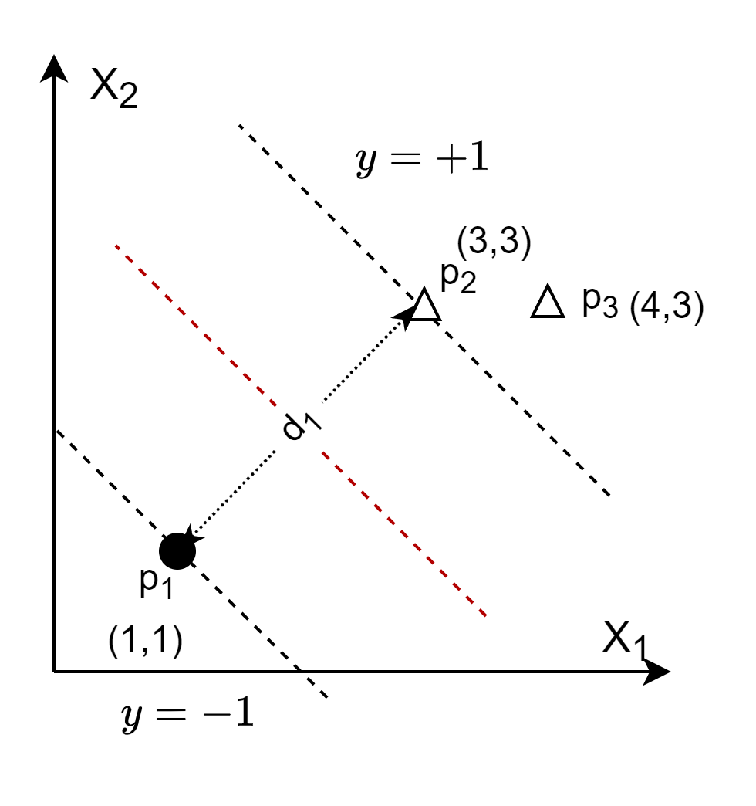
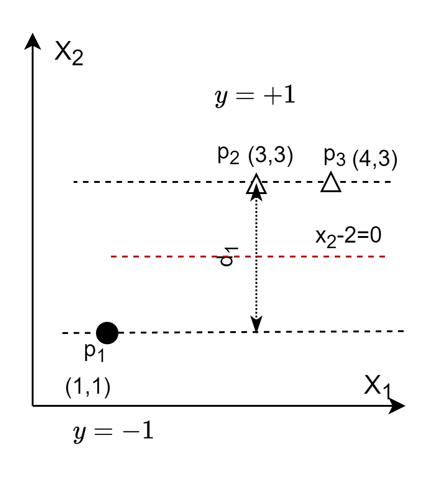

## 10.3 解决 SVM 的优化问题

### 10.3.1 SVM 的优化原始问题

我们尝试用拉格朗日在 10.1 中，我们已经推导出了 SVM 的优化问题如下：

$$
\begin{aligned}
    \min & \ f(w,b)=\frac{1}{2}||\boldsymbol{w}||^2
    \\\\
    s.t. & \ 1-y_i(\boldsymbol{w}  \cdot \boldsymbol{x_i}+b) \le 0, \quad i=1,...,n
\end{aligned}
\tag{10.3.1}
$$

下面我们用拉格朗日乘子法来解决一下式 10.3.1 的约束问题。

由于样本可能有 $n$ 个之多，所以为了简化问题，下面我们以只含有三个样本的问题举例说明，见图 10.3.1。

图 10.3.1 样本及其分类间隔

图 10.3.1 中展示了三个样本点（一个负类，两个正类），以及最优的分类间隔。样本点的具体数据如表 10.3.1 所示。

表 10.3.1 样本实例表 

|序号|$x_1$|$x_2$|标签 $y$|
|--|--|--|--|
|$p_1$|1|1|-1|
|$p_2$|3|3|+1|
|$p_3$|4|3|+1|

把表 10.3.1 的数据实例代入式 10.3.1，则优化目标实例化为：

$$
\begin{aligned}
    \underset{w,b}{\min} & \ f(w,b)=\frac{1}{2}||\boldsymbol{w}||^2
    \\\\
    s.t. & \ 1-(-1)(w_1+w_2+b) \le 0
    \\\\
    & \ 1-(+1)(3w_1+3w_2+b) \le 0
    \\\\
    & \ 1-(+1)(4w_1+3w_2+b) \le 0
\end{aligned}
\tag{10.3.2}
$$

### 10.3.2 构造拉格朗日函数

约束条件中有很多样本，而不是单一变量，此时可以对每个样本都看作是一个独立的不等式约束条件，所以需要在每个样本上都附加一个 $\alpha_i$，则构造出的拉格朗日公式的原型为：

$$
L = f(x) + \alpha_1 g(x_1) + \alpha_2 g(x_2) + \cdots + \alpha_n g(x_n)=f(x) + \sum_{i=1}^{n} \alpha_i g(x_i), \quad a_i \ge 0 
\tag{10.3.3}
$$

所以优化问题 10.3.1 的拉格朗日函数可以写成：

$$
L(w,b,\alpha)=\frac{1}{2}||\boldsymbol{w}||^2+\sum_{i=1}^n{\alpha_i}(1-y_i(\boldsymbol{w}  \cdot \boldsymbol{x_i} + b)), \quad a_i \ge 0
\tag{10.3.4}
$$

下面用式 10.3.2 的具体数值对式 10.3.4 进行实例化，得到式 10.3.5：

$$
L(w,b,\alpha)=\frac{1}{2}(w_1^2+w_2^2)+\alpha_1(1+w_1+w_2+b)+\alpha_2(1-3w_1-3w_2-b)+\alpha_3(1-4w_1-3w_2-b) \tag{10.3.5}
$$

按照拉格朗日函数的求极值的标准解法，分别求式 10.3.4 对 $w_1,w_2,b,\alpha_1,\alpha_2,\alpha_3$ 的偏导，得到联立方程组 10.3.6：

$$
\begin{cases}
\nabla_{w_1} L=w_1+\alpha_1-3\alpha_2-4\alpha_3=0
\\\\
\nabla_{w_2} L=w_2+\alpha_1-3\alpha_2-3\alpha_3=0
\\\\
\nabla_{b} L=\alpha_1-\alpha_2-\alpha_3=0
\\\\
\nabla_{\alpha_1} L=1+w_1+w_2+b=0
\\\\
\nabla_{\alpha_2} L=1-3w_1-3w_2-b=0
\\\\
\nabla_{\alpha_3} L=1-4w_1-3w_2-b=0
\end{cases}
\tag{10.3.6}
$$

解方程组（请读者自己推导过程以获得真实感受），得到：

$$
\begin{cases}
    \alpha_1=0.5, \alpha_2=1.5, \alpha_3=-1
    \\\\
    w_1=0, w_2=1, b=-2
\end{cases}
\tag{10.3.7}
$$

根据式 10.3.7 的结果，再根据式 10.1.11 的定义，得到分界线的直线方程是：$x_2-2=0$。绘制在图 10.3.2 中。

图 10.3.2 错误的分界线和分类间隔

与图 10.3.1 中的最优解比较，分类间隔要小很多，并非我们想要的结果。错在哪里呢？

仔细看计算结果中，有 $\alpha_3=-1$，不满足式 10.3.3 中关于 $\alpha_i \ge 0$ 的要求。如果$\alpha_3=0$ 的话，则点 $p_3$ 将不会参与到分类间隔的计算中，那么式 10.3.2 将会简化为：

$$
\begin{aligned}
    \underset{w,b}{\min} & \ f(w,b)=\frac{1}{2}||\boldsymbol{w}||^2
    \\\\
    s.t. & \ 1-(-1)(w_1+w_2+b) \le 0
    \\\\
    & \ 1-(+1)(3w_1+3w_2+b) \le 0
\end{aligned}
\tag{10.3.8}
$$

进一步，式 10.3.5 将简化为：

$$
L(w,b,\alpha)=\frac{1}{2}(w_1^2+w_2^2)+\alpha_1(1+w_1+w_2+b)+\alpha_2(1-3w_1-3w_2-b) \tag{10.3.9}
$$

求各因子的偏导：

$$
\begin{cases}
\nabla_{w_1} L=w_1+\alpha_1-3\alpha_2=0
\\\\
\nabla_{w_2} L=w_2+\alpha_1-3\alpha_2=0
\\\\
\nabla_{b} L=\alpha_1-\alpha_2=0
\\\\
\nabla_{\alpha_1} L=1+w_1+w_2+b=0
\\\\
\nabla_{\alpha_2} L=1-3w_1-3w_2-b=0
\end{cases}
\tag{10.3.10}
$$

最后解得：

$$
\begin{cases}
    \alpha_1=0.25, \alpha_2=0.25, \alpha_3=0
    \\\\
    w_1=0.5, w_2=0.5, b=-2
\end{cases}
\tag{10.3.11}
$$

这与图 10.3.1 中的理想情况一摸一样。

根据这个实际例子，我们可以得到一些初步的经验：

1. 拉格朗日乘子法确实可以解决这种优化问题。
2. 不是所有的样本都参与到分类间隔计算中，只有那些关键样本点才参与计算，这些样本点就叫做**支持向量**。不参与计算的样本点的 $\alpha_i=0$。
3. 所有负类样本点的 $\alpha_i$ 值之和，等于所有正类样本点的 $\alpha_i$ 值之和，本例中 $\alpha_1=\alpha_2+\alpha_3$。

但是，这么做会有什么问题吗？当样本数量有成百上千的时候，如何手工解出联立方程组？

下一节我们学习一下更“高大上”的解法，也就是工业级的解法，可以适用于大样本数据量。

### 思考和练习

1. 手工计算式 10.3.6 和式 10.3.10 的结果。
2. 如果在图 10.3.1 的基础上，增加一个负类样本点 $p_4(2,0)$，使得样本点的总数量增加到 4 个（即约束条件是 4 个不等式），请尝试计算该优化问题。
