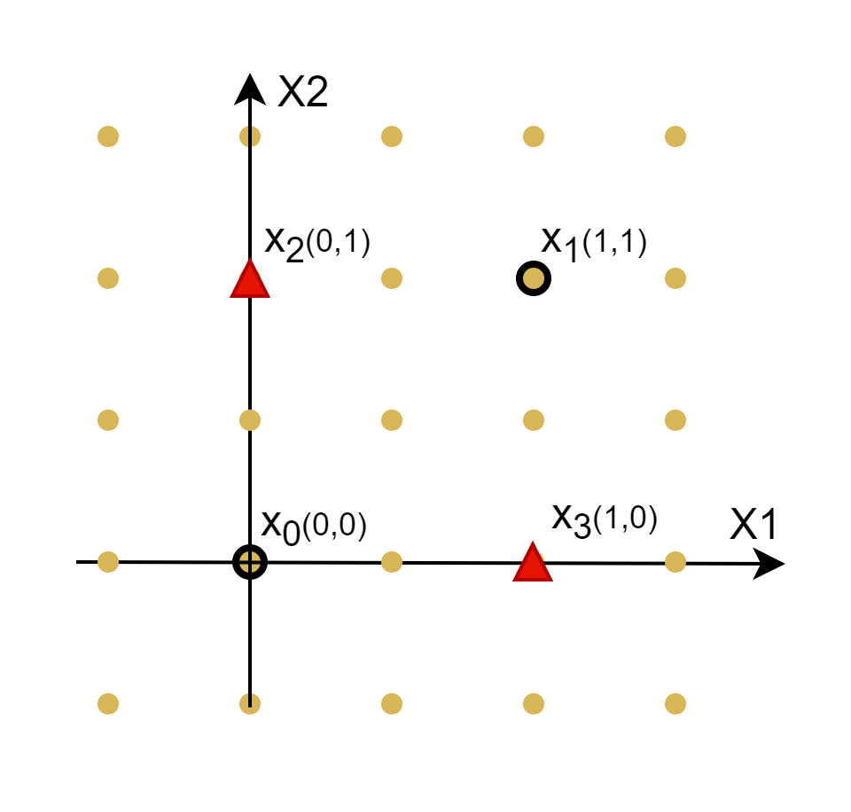
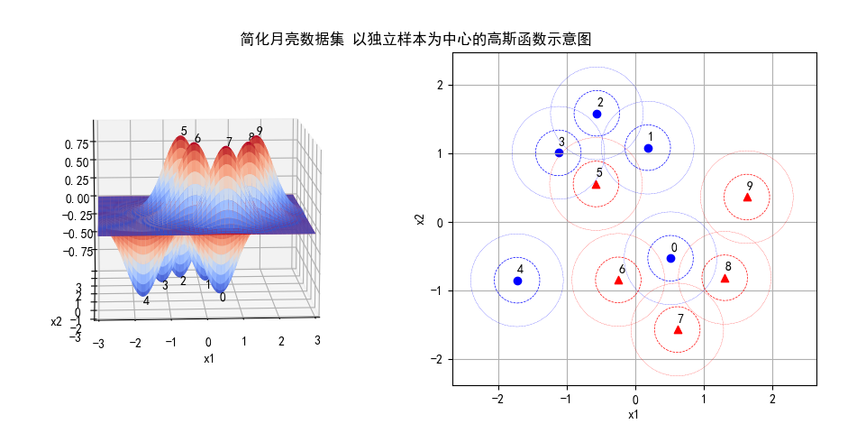
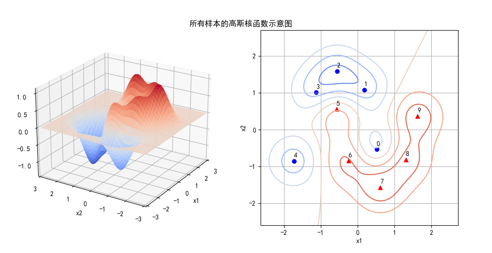

## 11.10 高斯核函数的理解

### 11.10.1 一个更复杂的例子

我们用 sklearn 中的一个叫做 moon 的样本数据来做进一步的理解。



<center>图 11.10.1 </center>

在图 11.10.1 中，左子图有正负样本各 50 个，其中红色三角形为正类样本；右子图只取了处于关键位置的正负样本各 5 个，仍可以代表整个数据集的形状/轮廓。


我们以这 10 个样本为例，再次验证高斯核函数的特征映射。

首先做标准化（均值为 0 方差为 1），然后建立特征数据矩阵：

$$
特征矩阵K=
\begin{pmatrix}
e^{-\gamma\parallel x_0 - x_0 \parallel^2} & e^{-\gamma\parallel x_0 - x_1 \parallel^2} & \cdots & e^{-\gamma\parallel x_0 - x_{9} \parallel^2}
\\\\
e^{-\gamma\parallel x_1 - x_0 \parallel^2} & e^{-\gamma\parallel x_1 - x_1 \parallel^2} & \cdots & e^{-\gamma\parallel x_1 - x_{9} \parallel^2}
\\\\
\vdots & \vdots &  \ddots & \vdots
\\\\
e^{-\gamma\parallel x_9 - x_0 \parallel^2} & e^{-\gamma\parallel x_9 - x_1 \parallel^2} & \cdots & e^{-\gamma\parallel x_9 - x_9 \parallel^2}
\end{pmatrix}
\tag{11.10.1}
$$

然后仍然使用**线性 SVM 分类器**，验证新的特征矩阵是否可以线性可分。得到的打印输出如下：

```
权重: [[-1.16076927 -1.11328038 -0.65285093 -1.25970266 -1.10970314  1.05151307
   1.12589867  0.82036897  1.03337237  0.87829645]]
支持向量个数: [5 5]
支持向量索引: [0 1 2 3 4 5 6 7 8 9]
支持向量ay: [[-2. -1.39209098 -0.09042443 -1.9120296  -1.13078953  2.
  1.54903647  0.75518565  1.37140957  0.84970285]]
准确率: 1.0
```

- 使用样本数据在训练好的模型上做预测的准确率为 1.0，表明分类正确。
- 所有的样本点都是支持向量，正负类各 5 个。

绘制可视化分类结果如图 11.10.2 所示，可以看到最关键的 0 号样本和 5 号样本，都处于正确的分类区中。本图中的样本是经过标准化的，所以坐标范围与图 11.10.1 不同。


<center>图 11.10.2 简化月亮数据集的分类结果</center>

这部分代码在 Code_11_8_4_moon.py 中，读者可以运行、阅读，并修改其中一些参数来加深理解。


### 11.10.2 进一步理解高斯核函数

在二维平面中，每个样本点都可以对应一个以该样本点 $(x_1,x_2)$ 为中心的二维高斯函数，如式 11.10.2：

$$
f(x,y)=\exp \left ( -\frac{(x-x_1)^2}{2 \sigma_1^2} - \frac{(y-x_2)^2}{2 \sigma_2^2} \right ) = e^{-\gamma \Big[(x-x_1)^2+(y-x_2)^2 \Big]} \tag{11.10.2}
$$

用如下代码实现式 11.10.2：

```python
# 三维高斯图像
def gaussian_3d(gamma, center, scope):
    xx = np.linspace(scope[0], scope[1], scope[2])
    yy = np.linspace(scope[3], scope[4], scope[5])
    P,Q = np.meshgrid(xx, yy)
    R = np.exp(-gamma * ((P-center[0])**2 + (Q-center[1])**2))
    return P, Q, R
```
其中的 center 指的是“以每个样本点为中心”，计算高斯函数。

由此，我们可以绘制出 10 个样本点各自的高斯函数如图 11.10.3，其中左子图是三维图像，右子图是在 x/y 平面上的投影。

在左子图中，正类样本绘制在了上方，为了视觉上不互相干扰，负类样本绘制在了下方，可以认为是标准高斯函数乘以标签值：

$$
f(x,y)=y_i \ e^ {-\gamma \Big[(x-x_1)^2 + (y-x_2)^2 \Big]} \tag{11.10.3}
$$


如果各个样本点独立地看（即不考虑两个样本点之间的相互关系），从右子图中可以看到，每个样本点都有一个“势力范围”，用两个同心圆表示，比如 1 号样本和 2 号样本距离较近，它们的“势力范围”就有一部分是重叠的；3 号样本和 5 号样本虽然也比较近，但是分别属于不同的类别，所以用特意用红色和蓝色分开，但实际上也是有重叠的。



<center>图 11.10.3 </center>


接下来我们看看高斯核函数的效果，也就是不同样本的高斯函数的内积（相乘后再积分）。


```python
# 显示高斯核函数，即所有样本点之间的内积
def show_result_2(gamma, X, weights, scope, title):
    # 基本绘图设置
    mpl.rcParams['font.sans-serif'] = ['SimHei']  
    mpl.rcParams['axes.unicode_minus']=False
    fig = plt.figure()
    plt.title(title)
    plt.axis('off')

    RR = None
    for i in range(X.shape[0]):
        P,Q,R = gaussian_kernal(gamma, X[i], weights[i], scope)
        if (RR is None):
            RR = R
        else:
            RR += R
```


图 11.10.4 展示了所有样本点之间的高斯核函数的数值之和，形成一个凹凸不平的曲面（左子图），而右子图是它的等高线，对比图 11.10.2 分类结果的右子图，可以看到二者完全吻合。

从等高线图上，我们可以发现令人意想不到的问题：一般都会认为 2 号样本和 7 号样本是本类的核心，应该“地位较高”，但实际上 2 号样本处于负类等高线的边缘地带，“深入敌后”的 0 号样本和 5 号样本反而处于本方的制高点。



<center>图 11.10.4 </center>


<center>图 11.10.5 </center>


高斯核 κ(x1,x2)=exp(−∥x1−x2∥22σ2) ，这个核就是最开始提到过的会将原始空间映射为无穷维空间的那个家伙。不过，如果 σ 选得很大的话，高次特征上的权重实际上衰减得非常快，所以实际上（数值上近似一下）相当于一个低维的子空间；反过来，如果 σ 选得很小，则可以将任意的数据映射为线性可分——当然，这并不一定是好事，因为随之而来的可能是非常严重的过拟合问题。不过，总的来说，通过调控参数σ ，高斯核实际上具有相当高的灵活性，也是使用最广泛的核函数之一。
线性核 κ(x1,x2)=〈x1,x2〉 ，这实际上就是原始空间中的内积。这个核存在的主要目的是使得“映射后空间中的问题”和“映射前空间中的问题”两者在形式上统一起来了。


$\gamma$ 缺省取值为特征数的倒数，比如一共有 4 维特征，则 $\gamma=0.25$。

径向基（Radial Basis Function）核，对于样本噪音有较好的抗干扰能力


具体对于C（惩罚系数）：C越大，越容易过拟合。
gamma：隐含地决定了数据映射到特征空间后的分布，gamma越大，支持向量越少，导致过拟合。


### 思考和练习

1. 对于异或数据，如果不做标准化而是直接做特征映射，那么线性分类的结果如何？请修改 Code_11_8_3_Xor.py 尝试。
2. 