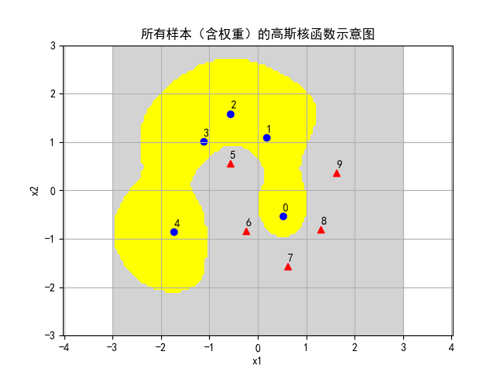
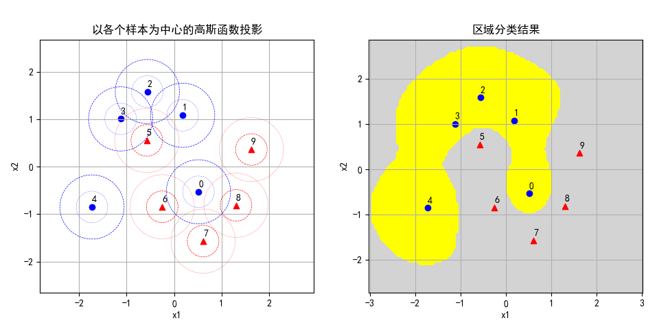
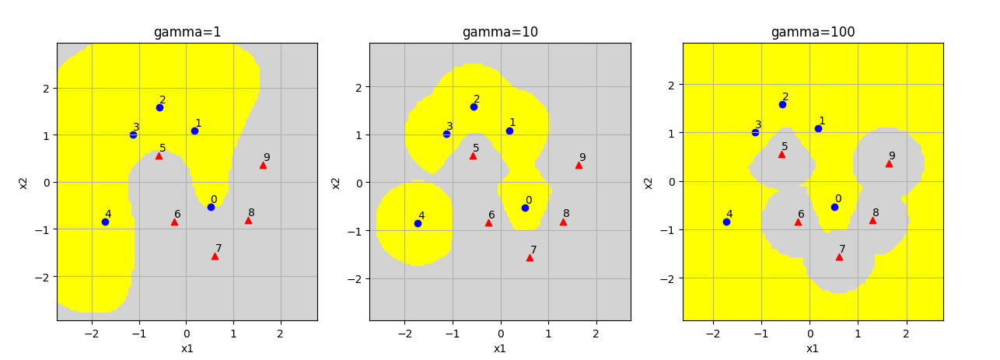
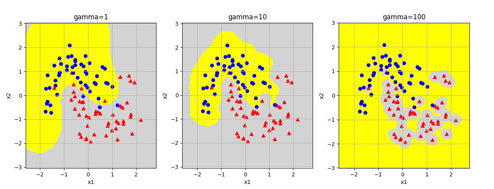
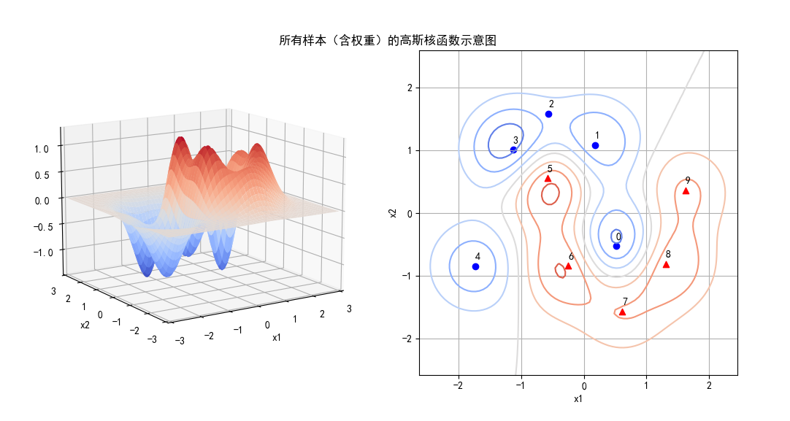

## 11.11 高斯核函数的理解

### 11.11.1 选取地标点的另外一种方法

我们用 sklearn 中的一个叫做 moon 的样本数据来做进一步的理解。


<center>图 11.11.1 </center>

在图 11.11.1 中，左子图有正负样本各 50 个，其中红色三角形为正类样本；右子图只取了处于关键位置的正负样本各 5 个，仍可以代表整个数据集的形状/轮廓。

上一小节中，我们发现地标的密度对样本分类的准确率有影响，直观上猜测，地标的数量应该和样本的数量在同一个水平上。那么如果我们不用规则的网格做地标，而是直接使用样本做地标，其效果如何呢？

我们以图 11.1.1 右子图中这 10 个样本为例，验证上面的想法。

1. 加载数据，首先做标准化（均值为 0，方差为 1）。

```python
    file_name = "Data_moon_10.csv"
    X_10, Y_10 = load_data(file_name, 10)

    ss = StandardScaler()
    X = ss.fit_transform(X_10)
```

2. 然后建立特征数据矩阵 K：

$$
K=
\begin{pmatrix}
e^{-\gamma\parallel x_0 - x_0 \parallel^2} & e^{-\gamma\parallel x_0 - x_1 \parallel^2} & \cdots & e^{-\gamma\parallel x_0 - x_{9} \parallel^2}
\\\\
e^{-\gamma\parallel x_1 - x_0 \parallel^2} & e^{-\gamma\parallel x_1 - x_1 \parallel^2} & \cdots & e^{-\gamma\parallel x_1 - x_{9} \parallel^2}
\\\\
\vdots & \vdots &  \ddots & \vdots
\\\\
e^{-\gamma\parallel x_9 - x_0 \parallel^2} & e^{-\gamma\parallel x_9 - x_1 \parallel^2} & \cdots & e^{-\gamma\parallel x_9 - x_9 \parallel^2}
\end{pmatrix}
\tag{11.11.1}
$$

代码如下：

```python
    gamma = 2
    X_new = Feature_matrix(X, X, gamma)
```
在Feature_matrix()中，第二个变量应该传入 Landmark 值，我们直接使用 X 代替。

实际的映射结果为：

```
映射结果：
[[1.    0.004 0.    0.    0.    0.009 0.255 0.112 0.243 0.017]
 [0.004 1.    0.2   0.033 0.    0.181 0.    0.    0.    0.005]
 [0.    0.2   1.    0.273 0.    0.119 0.    0.    0.    0.   ]
 [0.    0.033 0.273 1.    0.    0.361 0.    0.    0.    0.   ]
 [0.    0.    0.    0.    1.    0.001 0.013 0.    0.    0.   ]
 [0.009 0.181 0.119 0.361 0.001 1.    0.016 0.    0.    0.   ]
 [0.255 0.    0.    0.    0.013 0.016 1.    0.079 0.008 0.   ]
 [0.112 0.    0.    0.    0.    0.    0.079 1.    0.122 0.   ]
 [0.243 0.    0.    0.    0.    0.    0.008 0.122 1.    0.051]
 [0.017 0.005 0.    0.    0.    0.    0.    0.    0.051 1.   ]]
```

上述的特征矩阵值实际上是每个样本点与其它样本点的**相关性**，比如：

- 每个样本和自己的相关性为 1，处于对角线上。
- 0 号样本与 2、3、4 号样本的相关性为 0，因为距离太远了。

相关性值与正负类别无关，只与距离有关。

3. 仍然使用**线性 SVM 分类器**，验证新的特征矩阵是否可以线性可分。

```python
    # 尝试用线性 SVM 做分类    
    C = 2
    model, score = linear_svc(X_new, Y_10, C)
```

得到的打印输出如下：

```
权重: [[-1.161 -1.113 -0.653 -1.26  -1.11   1.052  1.126  0.82   1.033  0.878]]
支持向量个数: [5 5]
支持向量索引: [0 1 2 3 4 5 6 7 8 9]
支持向量 a*y: [[-2.    -1.392 -0.09  -1.912 -1.131  2.     1.549  0.755  1.371  0.85 ]]
准确率: 1.0
```

- 使用样本数据在训练好的模型上做预测的准确率为 1.0，表明分类正确。
- 所有的样本点都是支持向量，正负类各 5 个。
- 0、5 号样本的 $\alpha=2=C$，处于间隔边界线之内的软间隔范围内，因为它们距离对方的类别的样本距离较近，不容易被分离出来。
- 从权重值上看，2、7 号样本的权重值最低，$\alpha$ 值也最小，处于分类间隔边界线上，因为它们的作用可以被周围的 1、3 和 6、8 号样本所代替。

假设在二维坐标系上，这几个样本的相对位置示意图如图 11.11.2 的左子图所示。



<center>图 11.11.2 简化月亮数据集的分类结果</center>

绘制可视化分类结果如图 11.11.2 的右子图所示，可以看到最关键的 0 号样本和 5 号样本，都处于正确的分类区中。本图中的样本是经过标准化的，所以坐标范围与图 11.11.1 不同。


### 11.11.2 使用高斯核函数

透彻理解了高斯核函数的特征映射原理后，我们现在直接使用高斯核函数对月亮数据集做分类，而不需要先把数据处理成线性可分的。

加载只有 10 个样本的月亮数据集，先进行标准化处理，然后直接调用 SVM-RBF 函数：

```python
# 高斯核函数 SVM
def rbf_svc(X, Y, C, gamma):
    model = SVC(C=C, gamma = gamma, kernel='rbf')
    model.fit(X,Y)
    return model
```

其中参数 C=2，gamma=2，沿用了 11.11.1 小节中的参数值，便于对比结果。

然后，绘制两张图，一是原始样本点的高斯函数投影，一是区域分类结果：

```python
    # 显示高斯函数投影
    scope = [-3,3,100,-3,3,100]
    ax1 = fig.add_subplot(121)
    show_sample_gaussian(ax1, gamma, X, Y, scope)

    # 显示分类预测结果
    ax2 = fig.add_subplot(122)
    show_predication_result(ax2, model, X, Y, scope)
```
结果如图 11.11.3 所示。



<center>图 11.11.3 </center>

左子图是原始样本点为中心的高斯函数，其中 0、5 号“深入敌后”，势力范围与异类交织在一起；右子图是分类结果，与图 11.11.2 的结果相比较，除了分辨率不同，看不出其它本质上的区别。

### 11.11.3 Gamma 参数的影响

当选用 kernal='rbf'时，即高斯核函数，我们还需要设置的就是 gamma 参数，

```python
model = SVC(C=C, gamma = gamma, kernel='rbf')
```




<center>图 11.11.4 </center>




<center>图 11.11.5 </center>


接下来我们看看高斯核函数的效果，也就是不同样本的高斯函数的内积（相乘后再积分）。


```python
# 显示高斯核函数，即所有样本点之间的内积
def show_result_2(gamma, X, weights, scope, title):
    # 基本绘图设置
    mpl.rcParams['font.sans-serif'] = ['SimHei']  
    mpl.rcParams['axes.unicode_minus']=False
    fig = plt.figure()
    plt.title(title)
    plt.axis('off')

    RR = None
    for i in range(X.shape[0]):
        P,Q,R = gaussian_kernal(gamma, X[i], weights[i], scope)
        if (RR is None):
            RR = R
        else:
            RR += R
```


图 11.11.4 展示了所有样本点之间的高斯核函数的数值之和，形成一个凹凸不平的曲面（左子图），而右子图是它的等高线，对比图 11.11.2 分类结果的右子图，可以看到二者完全吻合。

从等高线图上，我们可以发现令人意想不到的问题：一般都会认为 2 号样本和 7 号样本是本类的核心，应该“地位较高”，但实际上 2 号样本处于负类等高线的边缘地带，“深入敌后”的 0 号样本和 5 号样本反而处于本方的制高点。


<center>图 11.11.6 </center>




<center>图 11.11.7 </center>


高斯核 κ(x1,x2)=exp(−∥x1−x2∥22σ2) ，这个核就是最开始提到过的会将原始空间映射为无穷维空间的那个家伙。不过，如果 σ 选得很大的话，高次特征上的权重实际上衰减得非常快，所以实际上（数值上近似一下）相当于一个低维的子空间；反过来，如果 σ 选得很小，则可以将任意的数据映射为线性可分——当然，这并不一定是好事，因为随之而来的可能是非常严重的过拟合问题。不过，总的来说，通过调控参数σ ，高斯核实际上具有相当高的灵活性，也是使用最广泛的核函数之一。
线性核 κ(x1,x2)=〈x1,x2〉 ，这实际上就是原始空间中的内积。这个核存在的主要目的是使得“映射后空间中的问题”和“映射前空间中的问题”两者在形式上统一起来了。


$\gamma$ 缺省取值为特征数的倒数，比如一共有 4 维特征，则 $\gamma=0.25$。

径向基（Radial Basis Function）核，对于样本噪音有较好的抗干扰能力


具体对于C（惩罚系数）：C越大，越容易过拟合。
gamma：隐含地决定了数据映射到特征空间后的分布，gamma越大，支持向量越少，导致过拟合。


### 思考和练习

