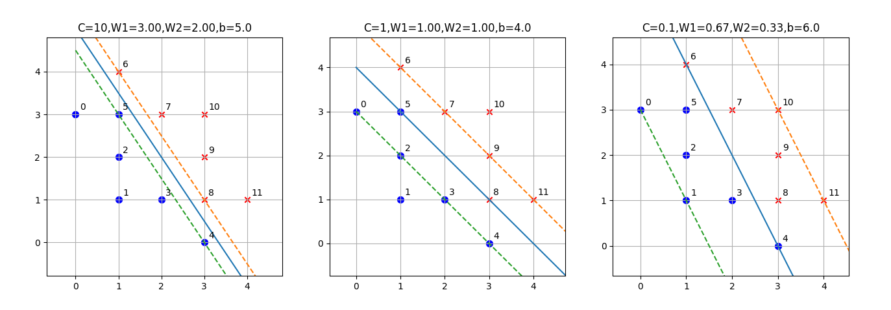

## 对 C 值的理解

我们用图 5.7.1 的问题来学习一下 C 值对分类结果的影响。

### 基本代码

首先定义数据：

```Python
def main():
    X = np.array([[0,3],[1,1],[1,2],[2,1],[3,0],[1,3],[1,4],[2,3],[3,1],[3,2],[3,3],[4,1]])
    Y = np.array([-1,-1,-1,-1,-1,-1,1,1,1,1,1,1])
```

如果绘制到图中观察，可以发现正负类样本实际上是成对称分布的，中间有一个很宽的分类间隔，但是由于负类样本点 5 和正类样本点 8 的存在，破坏了原有的分类间隔，所以必须重新计算分界线及分类间隔。

接下来在代码中分别设置 C 的值为 10、1、0.1，看看分类效果如何：

```Python
    fig = plt.figure()
    ax = fig.add_subplot(131)
    C = 10
    svc(ax, C, X, Y)
    ax = fig.add_subplot(132)
    C = 1
    svc(ax, C, X, Y)
    ax = fig.add_subplot(133)
    C = 0.1
    svc(ax, C, X, Y)
    plt.show()
```

上述代码中的 svc 函数内部实际上是调用 sklearn 的 SVM 模块中的 SVC 方法来实现的：

```Python
from sklearn.svm import SVC

def svc(ax, C, X, Y):
    model = SVC(C, kernel='linear')
    model.fit(X,Y)
    ......
```
SVC 这个名字的含义是 Support Vector Classifier，支持向量分类器。SVM 中还有一个叫做 SVR 的方法，含义是 Support Vector Regression，支持向量回归，是用 SVM 算法做回归预测的。

训练结束后绘制样本点：

```Python
    for i in range(Y.shape[0]):
        if (Y[i] == 1):
            # 正类样本
            ax.scatter(X[i,0], X[i,1], marker='x', color='r')
        else:
            # 负类样本
            ax.scatter(X[i,0], X[i,1], marker='.', color='b', s=200)
        # 样本编号
        ax.text(X[i,0]+0.1, X[i,1]+0.1, str(i))
```

同时，把分界线及分类间隔绘制出来：

- 分界线方程
  
  $w_1 x_1 + w_2 x_2 + b = 0$，转换成 $y=ax+b$ 的形式，即：$x_2 = -\frac{w_1}{w_2}x_1-\frac{b}{w_2}$，

- 分类间隔边界的方程

  $w_1 x_1 + w_2 x_2 + b = \pm 1$，转换成 $x_2 = -\frac{w_1}{w_2}x_1-\frac{b}{w_2} \pm \frac{1}{w_2}$

在下面的代码中，$w$ 矢量的下标是从 0 开始的，所以 $w_1 = w[0]，w_2=w[1]$：


```Python
    w = model.coef_[0]
    a = -w[0] / w[1]
    b = -model.intercept_[0] / w[1]
    x = np.linspace(0,5,10)
    # 分界线
    y0 = a * x + b
    # 分类间隔上边界
    y1 = a * x + b + 1/w[1]
    # 分类间隔下边界
    y2 = a * x + b - 1/w[1]
    ax.plot(x,y0)
    ax.plot(x,y1,linestyle='--')
    ax.plot(x,y2,linestyle='--')
```

### 结果分析

运行代码 5-8-1.py 后得到图 5.8.1。



<center>图 5.8.1 </center>

||C=10|C=1|C=0.1|
|--|--|--|--|
|W|[3,2]|[1,1]|[0.66,0.33]|
|斜率 a (-w1/w2)|-1.5|-1|-2|
|截距 b|5|4|6|
|支持向量|4,5; 8|4,5; 7,8|0,1,2,3,4,5; 6,7,8,9,10,11|

- C=10

  - 要求尽量分开两类样本，分类间隔会变窄。
  - 支持向量只有 3 个，序号为 4、5、8 的三个样本，都处于间隔边界上。其实 6 也可以是支持向量，只不过有 4、5、8 三个样本点已经能够完全决定分类间隔的形状了。
  - 不参与计算的向量有 9 个。

- C=1

  - 属于比较中庸的选择，结果也比较合理，间隔宽度居中。
  - 支持向量有 4 个，序号为 4、5、7、8。本来 5 号和 8 号样本点应该算是噪音，所以这种选择把 5、8 放在了分界线上。
  - 把 0、2、3、4 放在了分类间隔下界，同时把 6、7、9、11 放在了分类间隔上届。但是为什么只有 4、7 是支持向量呢？这与算法的实现有关系，与理论无关，原则上从 0、2、3、4 中任选一个，再从 6、7、9、11 中任选一个，都可以构成支持向量。

- C=0.1

  - 要求分类间隔尽量宽，所以与左图相比，分界线顺时针旋转了一些，使得分类间隔在三种情况中最宽。
  - 以牺牲 4、6 号样本点为代价（让它们处于模棱两可的状态中）。
  - 造成了所有样本点都处于分类间隔之内，即都是支持向量。

