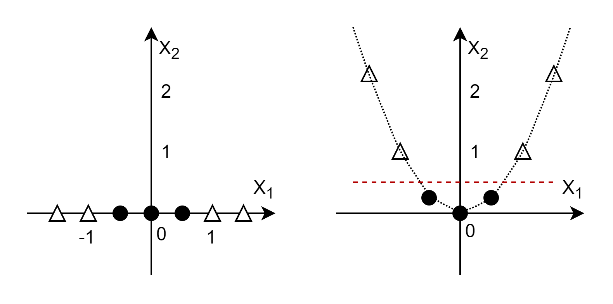
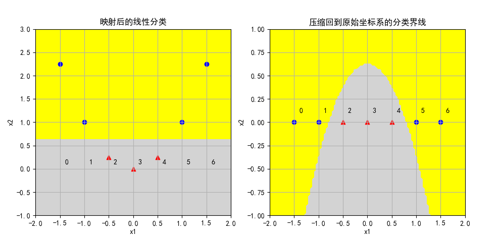

## 11.4 核函数

### 11.4.1 一维非线性到线性的映射

我们先看一个简单的例子，假设有 7 个样本，其中 4 个正类样本 $x_{1}=[-1.5,\ -1,\ 1,\ 1.5]$，3 个负类样本 $x_{1}=[-0.5,\ 0,\ 0.5]$，它们都排列在 $x_{1}$ 轴上（即 $x_{2}=0$），如图 11.4.1 的左子图所示。



<center>图 11.4.1 </center>

我们无法将这两类样本点做线性分割。但是，如同前面学习的多项式回归一样，如果令 $x_{2}=x_{1}^2$，则可以得到表 11.4.1 中的数据，也就是说，把一维的特征无形中增加了一维，变成二维的了。

上述的过程叫做**映射**，可以定义映射函数为 $f(z)=[z,z^2]$。映射函数包含了两个步骤：
1. 先计算原始特征的平方值，即 $z^2$，得到**新特征值**；
2. 把**新特征值**与**原始特征值**拼在一起形成**新的二维特征**。

请读者注意区分**特征**与**特征值**的含义，**特征**是包含了一组**特征值**的向量。

表 11.4.1 增加了一维特征后的样本数据

|样本|$x_{1}$|$x_{2}$|$y$|
|--|--:|:--|--:|
|1|-1.5|2.25|1|
|2|-1.0|1.0|1|
|3|-0.5|0.25|-1|
|4|0.0|0.0|-1|
|5|0.5|0.25|-1|
|6|1.0|1.0|1|
|7|1.5|2.25|1|

把表 11.4.1 的新生成的样本数据绘制到图 11.4.1 的中子图，得到一条抛物线，可以明显看出用一条红色的水平虚线就能够轻松地分开两类样本点。

以中子图为基础，现在想象把各个样本点的 $x_{2}$ 值都“压回”到原始值（$x_{2}=0$），那么红色分界线也会随之变化，但不再是直线，而是会变成右子图的样子，形成一条反向的抛物线，也可以分割正负类样本，但是 SVM 是不能形成这种弯曲的分界线的。

### 思考和练习

1. 使用 linear SVC 函数，用代码实现图 11.4.1 的分类过程，

### 11.4.2 二维非线性到线性的映射

下面看一个二维的例子。

首先，我们使用 sklearn 库自带的一个 make_circle 函数来生成一组数据：

```python
from sklearn.datasets import *

x,y = make_circles(n_samples=100, factor=0.5, noise=0.1)
```
生成的 100 个样本，取出前 10 个列在表 11.4.2 的 $x_{1}、x_{2}、y$ 三列，其中，$x_{1}、x_{2}$ 可以理解为横纵坐标，$y$ 是标签值，$x_{3}$ 列在后面的内容中学习。

表 11.4.2

|样本抽样|$x_{1}$|$x_{2}$|$y$|$x_{3}$|
|--|--|--|--|--|
|1| 0.53858017 | 0.7196477 | 0| 0.80796142|
|2|-0.46733293 |-0.19705021| 1| 0.25722885|
|3|-0.53760253 |-1.00181067| 0| 1.29264109|
|4| 0.3153812  | 0.96721292| 0| 1.03496614|
|5| 0.69355719 |-0.63648615| 0| 0.8861362 |
|6|-0.90985023 | 0.514321  | 0| 1.09235353|
|7| 0.45511405 | 0.3035365 | 1| 0.29926321|
|8| 0.51479245 |-0.73060581| 0| 0.79879612|
|9|-0.37485252 | 0.06953759| 1| 0.14534989|
|10|-1.03307039 | 0.31019711| 0| 1.16345667|

我们可视化一下生成好的数据。由于样本数据把正负类混放在了一起，所以首先要根据标签数据 $y$ 区分开正负样本。

```python
    pos = (y == 1)
    neg = (y == 0)
    
    fig = plt.figure()
    ax1 = fig.add_subplot(131)
    ax1.axis('equal')
    ax1.scatter(x[pos,0], x[pos,1], marker='^')
    ax1.scatter(x[neg,0], x[neg,1], marker='o')
    ax1.set_xlabel("x1")
    ax1.set_ylabel("x2")
```

后面几行代码绘制正类样本为圆点，负类样本为三角。这里吐槽一下 sklearn 的函数，居然把 inner（内圆） 样本作为正类，而把 outer（外圆）样本作为负类，这样会造成“负类样本大于正类样本”的假象，不利于读者理解。

最后画出图 11.4.2 的左子图。



<center>图 11.4.2 </center>

通过观察左子图的样本分布，可以知道是线性不可分的，但是直观上看可以用一个圆形来分开两类样本点之间，根据圆的方程：$r^2=x^2+y^2$，我们试试给样本增加一个维度：$x_{3} = x_{1}^2 + x_{2}^2$，于是得到了表 11.4.2 的最后一列特征值。

代码如下，计算前两个特征值的平方和得到 $x_{3}$，然后加到原有的 $x$ 矩阵的最后一列，得到 $X$：

```python
    x3 = x[:,0]**2 + x[:,1]**2
    X = np.hstack((x,x3.reshape(-1,1)))
```

然后在三维坐标系中绘制新的样本分布，调整观察角度后得到图 11.4.2 的中子图和右子图：

- 中子图，从顶面观察样本分布，似乎和原始分布相同。
- 右子图，从侧向观察样本分布，可以看到在正负类样本点之间有一个明显的线性分隔带。

所以通过从二维到三维的升维，我们又可以顺利解决原始的线性不可分的问题。


### 11.4.3 更高维的映射

在第一个例子中，$x$ 从一维的 $[x_1]$ 变成了二维 $[x_1, x_1^2]$，可以定义一个映射函数 $f(z) = [z, z^2]$。

在第二个例子中，$x$ 从二维的 $[x_{1}, x_{2}]$ 变成了三维的 $[x_{1}, x_{2}, x_{1}^2+x_{2}^2]$，也可以定义一个映射函数 $f(z) = [z_1, z_2, z_1^2+z_2^2]$，当然，也可以定义 $f(z)=[z_1,z_2,z_1^2,z_2^2,z_1 z_2]$。

现在看看三维的例子。

当样本有三维特征时，其一般形式为：$\boldsymbol{z}=[z_1,z_2,z_3]$。下面定义只包括二次项的映射函数：

$$
f(z)=[z_1 z_1,z_1 z_2,z_1 z_3,z_2 z_1,z_2 z_2,z_2 z_3,z_3 z_1,z_3 z_2,z_3 z_3]
\tag{1}
$$

其中 $z_i z_j$ 表示 $z_i \times z_j$

现在有两个样本，

$\boldsymbol{x}_i=[1,2,3]$

$\boldsymbol{x}_j=[4,5,6]$

$f(x_i)=[1,2,3,2,4,6,3,6,9]$

$f(y_j)=[16,20,24,20,25,30,24,30,36]$


现在计算 $f(x_i) \cdot f(x_j)$ 的内积......稍等，有的读者会问：
1. 为什么要计算内积？
2. 为什么要计算映射函数 $f(x_i)$ 和 $f(y_j)$ 的内积？

因为式 5.5.8 如下：
$$
D(\alpha)=\sum_{i=1}^n\alpha_i-\frac{1}{2}\sum_{i=1}^n\sum_{j=1}^n\alpha_i \alpha_j y_i y_j (x_i \cdot x_j)
$$

它需要计算样本数据 $(x_i \cdot x_j)$ 的内积，这就回答了第 1 个问题，为什么要计算内积。

那为什么要计算映射函数 $f(x_i)$ 和 $f(x_j)$ 的内积呢？因为从上面两个例子中，我们已经得到了一个初步的认识：当样本在原始空间线性不可分时，如果映射到高维空间，是有可能变成线性可分的，而且维数越高，可能性越大，那么在映射之后，就可以使用 SVM 来做分类了，只不过要把原来的 $(x_i \cdot x_j)$ 替换成 $f(x_i) \cdot f(x_j)$。

好，接下来计算：
$$
\begin{aligned}
f(\boldsymbol{x}_i ) \cdot f(\boldsymbol{x}_j )&=[1,2,3,2,4,6,3,6,9] \cdot [16,20,24,20,25,30,24,30,36]
\\\\
&=1 \times 16 + 2  \times 20 + 3  \times 24 + 2  \times 20 + 4  \times 25 + 6  \times 30 + 3  \times 24 + 6  \times 30 + 9  \times 36
\\\\
&=16+40+72+40+100+180+72+180+324
\\\\
&=1024
\end{aligned}
\tag{1}
$$


可以看到式 1 的计算过程相当繁琐

进行一下简单的反向公式推导

$$
\begin{aligned}
   
f(x_i) \cdot f(x_j) &= [x_{i,1} x_{i,1},x_{i,1} x_{i,2},x_{i,1} x_{i,3},x_{i,2} x_{i,1},x_{i,2} x_{i,2},x_{i,2} x_{i,3},x_{i,3} x_{i,1},x_{i,3} x_{i,2},x_{i,3} x_{i,3}]
\\\\
& \cdot [x_{j,1} x_{j,1},x_{j,1} x_{j,2},x_{j,1} x_{j,3},x_{j,2} x_{j,1},x_{j,2} x_{j,2},x_{j,2} x_{j,3},x_{j,3} x_{j,1},x_{j,3} x_{j,2},x_{j,3} x_{j,3}]
\\\\
&=x_{i,1}^2 x_{j,1}^2 + x_{i,2}^2 x_{j,2}^2 + x_{i,3}^2 x_{j,3}^2 + 2 x_{i,1} x_{j,1} x_{i,2} x_{j,2}+ 2 x_{i,1} x_{j,1} x_{i,3} x_{j,3} + 2 x_{i,2} x_{j,2} x_{i,3} x_{j,3}
\\\\
&=(x_{i,1} x_{j,1} + x_{i,2} x_{j,2} + x_{i,3} x_{j,3})^2
\\\\
&=[(x_{i,1},x_{i,2},x_{i,3}) \cdot (x_{j,1}, x_{j,2}, x_{j,3})]^2
\\\\
&=(\boldsymbol{x}_i \cdot \boldsymbol{x}_j)^2
\end{aligned}
\tag{2}
$$

令：

$$
K(\boldsymbol{x}_i,\boldsymbol{x}_j)=(\boldsymbol{x}_i \cdot \boldsymbol{x}_j)^2 \tag{3}
$$

则式 3 就是核函数的定义。

这样做的好处显而易见

将 $\boldsymbol{x}_i、\boldsymbol{x}_j$ 的具体值带入式 3 进行验证

$$
\begin{aligned}   
K(\boldsymbol{x}_i,\boldsymbol{y}_j)&=K([1,2,3],[4,5,6])=([1,2,3] \cdot [4,5,6])^2
\\\\
&=(1 \times 4 + 2 \times 5 + 3 \times 6)^2 = (4+10+18)^2=32^2
\\\\
&=1024
\end{aligned}

$$

实现映射函数：

```python
def f(z):
    n = z.shape[1]
    Z = np.zeros(shape=(1,n*n))
    # 生成[z_1 z_1,z_1 z_2,z_1 z_3,z_2 z_1,z_2 z_2,z_2 z_3,z_3 z_1,z_3 z_2,z_3 z_3]
    for i in range(3):
        for j in range(3):
            Z[0,i*3+j] = z[0,i]*z[0,j]
    return Z
```
计算映射后的内积：

```python
def fx_fy(x,y):
    fx = f(x)
    fy = f(y)
    result = np.inner(fx, fy)
    return result
```

如果直接实现核函数的话，会非常简单：

```python
def k(x,y):
    result = np.inner(x, y)**2
    return result
```

可以做一个对比，分别调用 fx_fy(x,y) 函数和 k(x,y) 函数各 100000 次，在笔者的电脑上，得到如下运行信息：

```
原始输入维数: 3
映射空间维数: 9
[[1024.]] [[1024]]
fx_fy(x,y)运行时间: 1.4461944103240967
K(x,y)运行时间: 0.190537691116333
```

- 首先获得原始特征维数为 3，而映射后的特征维数为 9；
- 其次确定二者的计算结果都是 1024，相等；
- 最后比较运行时间，用映射函数的内积运算，需要 1.54 秒；而直接计算核函数只需要 0.19 秒。后者比前者快一个数量级。这里有两个原因：

1. 函数 f(z) 生成映射特征时需要花费时间；
2. 映射后从 3 维特征变成了 9 维特征，计算内积需要花费更多的时间。


$[x_{1},x_{2}]$ 可以映射成 $[x_{1}^2, x_{2}^2, x_{1} x_{2}, x_{1}, x_{2}]$，即从 2 维变成 5 维；从 3 维的原始特征 $[x_{1},x_{2},x_{3}]$，如果只构造二次项的话，新的特征空间会有 9 维；如果构造三次项的话，可以映射成 19 维的新特征空间：

$$
f(x)=[1,x_{1},x_{2},x_{3}, x_{1}^2,x_{2}^2,x_{3}^2,x_{1} x_{2}, x_{1} x_{3}, x_{2} x_{3},x_{1}^3,x_{2}^3,x_{3}^3,x_{1}^2 x_{2},x_{1}^2 x_{3},x_{2}^2 x_{1},x_{2}^2 x_{3},x_{3}^2 x_{1},x_{3}^2 x_{2}]
$$

第一个 1 相当于 $x_{1}^0 x_{2}^0 x_{3}^0$，即零次项，后面接一次项，二次项，三次项。

- 在生成二次项的时候（d=2），如果是两个特征（k=2），需要遍历 $2^2$ 次；
- 在生成二次项的时候（d=2），如果是三个特征值（k=3），需要遍历 $3^2$ 次；
- 在生成三次项的时候（d=3），如果是两个特征值（k=2），需要遍历 $2^3$ 次；

一般地，对于多项式核函数，如果 $x$ 是 k 维空间特征，生成 d 次项，需要遍历 $k^d$ 次，即算法复杂度为 $O(k^d)$，但是使用核函数计算的复杂度为 $O(k)$。

常用核函数

https://blog.csdn.net/mengjizhiyou/article/details/103437423


|名称|表达式|说明|
|--|--|--|
|线性核|$x_i \cdot x_j  + c$|不能把非线性问题转换成线性问题|
|多项式核|$[\gamma (x_i \cdot x_j) + c]^d$|$\gamma$ 一般取值为 1/特征数，d一般取值为 2，常用形式为 $[\gamma(x_i \cdot x_j)+1]^2$|
|高斯核|$\exp(-\frac{\parallel x-y \parallel^2}{2 \sigma^2})$ |径向基（Radial Basis Function）核，对于样本噪音有较好的抗干扰能力|
|高斯核变种|$\exp (-\gamma \parallel x-y \parallel^2 )$ | $\gamma$ 一般取值为 1/特征数|
|拉普拉斯核|$\exp (- \frac{\parallel x-y \parallel)}{\sigma})$ ||
|指数核|$\exp(-\frac{\parallel x-y \parallel}{2 \sigma^2})$||
|逻辑核|$\tanh(a x\cdot y +c)$|主要用于神经网络;正常 alpha=1/m, m是数据特征维度alpha>0,c<0;非正定核|

- 如果特征的数量大到和样本数量差不多，则选用LR或者线性核的SVM；
- 如果特征的数量小，样本的数量正常，则选用SVM+高斯核函数；
- 如果特征的数量小，而样本的数量很大，则需要手工添加一些特征从而变成第一种情况。
- 实际上使用可以对多个核函数进行测试，选择表现效果最好的核函数。

说明：n为特征数，m为样本个数
（1）若n相对m比较大，如n=10000, m=10~1000, 使用logistic/ SVM（线性核）均可；
（2）若n较小， m中等大小，如n=1~1000, m=10~10000, 使用SVM高斯核；
（3）若n较小，m较大，如n=1~1000, m=50000+, 那么需增加特征，此时用多项式核或高斯核;
(4)更一般：m小，用简单模型；m大用复杂模型。


（1）linear核：无需设置参数；
（2）poly核 ：degree, gamma, coef0；
（3）brf核：gamma；
（4）sigmoid核：gamma, coef0；

具体对于C（惩罚系数）：C越大，越容易过拟合。
gamma：隐含地决定了数据映射到特征空间后的分布，gamma越大，支持向量越少，导致过拟合。


