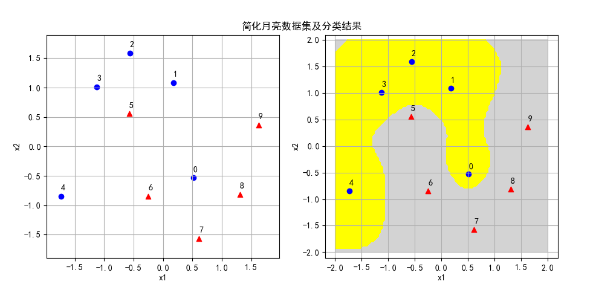
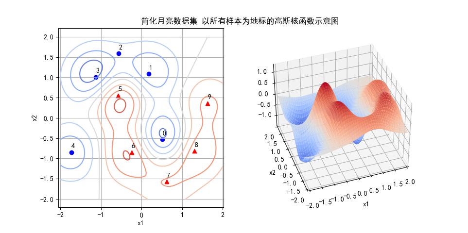

## 11.8 高斯核函数

### 11.8.1 高斯核函数

$$
K(x_i,x_j)=e^{-\frac{\parallel x_i-x_j \parallel^2}{2 \sigma^2}}=\exp(-\frac{\parallel x_i-x_j \parallel^2}{2 \sigma^2})
\tag{11.8.1}
$$

但是由于 $\sigma$ 在分母上，理解起来要绕一下，所以一般写成式 11.8.2 的形式，即令：$\gamma = \frac{1}{2\sigma^2}$，变形为：

$$
K(x_i,x_j)=e ^ {-\gamma \parallel x_i-x_j \parallel^2 }=\exp (-\gamma \parallel x_i-x_j \parallel^2 )
\tag{11.8.2}
$$

### 11.8.2 高斯核函数的映射函数

式 11.8.2 从形式上看，和前面学习的核函数都不一样：

1. 看不出来有内积计算；
2. 看不出有多维特征映射。

为了解释上面两个问题，下面我们把式 11.8.2 展开，为了方便，可以令 $\gamma=1$：

$$
\begin{aligned}
K(x_i,x_j)&=e^{-||\boldsymbol{x}_i-\boldsymbol{x}_j||^2} \quad(接下来展开求二范数的公式)
\\\\
&=e^{-\boldsymbol{x}_i^2}e^{-\boldsymbol{x}_j^2}e^{2 \boldsymbol{x}_i \cdot \boldsymbol{x}_j} \quad(接下来利用泰勒公式表示第三项)
\\\\
&=e^{-\boldsymbol{x}_i^2}e^{-\boldsymbol{x}_j^2} \left [ \sum_{n=0}^\infty \frac{(2 x_i \cdot x_j)^n}{n!} \right] \quad (接下来展开求和项)
\\\\
&=e^{-x_i^2}e^{-x_j^2} \left [ 1 + \frac{2x_i \cdot x_j}{1!} + \frac{(2x_i \cdot x_j)^2}{2!} + \frac{(2x_i \cdot x_j)^3}{3!} + \cdots \right ] \quad (接下来变成内积形式)
\\\\
&=\left [ e^{-\boldsymbol{x}_i^2}(1 \quad \sqrt{\frac{2}{1!}}x_i \quad \sqrt{\frac{2^2}{2!}}x_i^2 \quad \sqrt{\frac{2^3}{3!}}x_i^3 \cdots) \right ] \cdot \left [ e^{-\boldsymbol{x}_j^2}(1 \quad \sqrt{\frac{2}{1!}}x_j \quad \sqrt{\frac{2^2}{2!}}x_j^2 \quad \sqrt{\frac{2^3}{3!}}x_j^3 \cdots) \right ]
\\\\
&=\phi(x_i) \cdot \phi(x_j)
\end{aligned}
\tag{11.8.3}
$$

式 11.8.3 的最后一行，就是内积计算的形式了。所以，高斯核函数的映射函数可以表示为式 11.8.4：

$$
\phi(z)=e^{-z^2}
\begin{pmatrix}
1 \quad \sqrt{\frac{2}{1!}}z \quad \sqrt{\frac{2^2}{2!}}z^2 \quad \sqrt{\frac{2^3}{3!}}z^3 \cdots   
\end{pmatrix}
\tag{11.8.4}
$$

如果用式 11.8.1 的形式，则高斯核的映射函数为：

$$
\phi(z)=\exp(-\frac{z^2}{2\sigma^2}) \left [1, \sqrt{\frac{2}{1!}}\frac{z}{\sigma}, \sqrt{\frac{2^2}{2!}}(\frac{z}{\sigma})^2,\sqrt{\frac{2^3}{3!}}(\frac{z}{\sigma})^3, \dotsb \right ]
\tag{11.8.5}
$$


在式 11.8.5 的内部，每一项都可以看作是一维特征，一共是无穷维的特征。这样就解释了前面的两个问题。

### 11.8.3 验证理论上的特征映射函数

我们仍然使用异或问题来验证一下式 11.8.5 的映射函数可以得到什么？

异或问题的样本如下：

```
X 的原始值：
[[0 0]
 [1 1]
 [0 1]
 [1 0]]

Y 的原始值：
[-1 -1  1  1]
```

X 经过标准化后（均值为 0，方差为 1）得到：

```
X 标准化后的值：
[[-1. -1.]
 [ 1.  1.]
 [-1.  1.]
 [ 1. -1.]]
```

下面用式 11 的映射函数对标准化后的数据做映射，可以取 n=4，以便得到 4 维特征。代码如下：

```python
# 求 x 矢量的模，是一个标量
x_norm = np.linalg.norm(X[i])
# 第 0 维
Z[i,0] = np.exp(-gamma * (x_norm**2))
# 第 1 维
Z[i,1] = np.sqrt(2) * x_norm * Z[i,0]
# 第 2 维
Z[i,2] = np.sqrt(2**2/2) * (x_norm**2) * Z[i,0]
# 第 3 维
Z[i,3] = np.sqrt(2**3/6) * (x_norm**3) * Z[i,0]
```

运行后得到的 Z 值：

```
X 标准化后映射的特征值：
[[0.01831564 0.03663128 0.05180445 0.05981863]
 [0.01831564 0.03663128 0.05180445 0.05981863]
 [0.01831564 0.03663128 0.05180445 0.05981863]
 [0.01831564 0.03663128 0.05180445 0.05981863]]
```

到这里可以停止了！因为 4 个样本的第一个特征值都是 0.01831564，第二个特征值也都一样，第三个、第四个也是如此，就是说经过式 11 的映射函数后，所有的样本都变成了四维空间中的同一个点，这样无论如何是无法做分类的。

这是为什么呢？因为对于公式 $||\boldsymbol{x}||=\sqrt{x_1^2 + x_2^2}$，无论 $x_1,x_2$ 是 1 还是 -1，总是等于 $\sqrt{2}$。

可能有读者怀疑是不是因为做了标准化造成的这个结果，因为标准化得到的值全都是 1 或 -1。那我们就不做标准化再做一次映射：

```
X 不做标准化直接做映射的特征值：
[[1.         0.         0.         0.        ]
 [0.01831564 0.03663128 0.05180445 0.05981863]
 [0.13533528 0.19139299 0.19139299 0.15627172]
 [0.13533528 0.19139299 0.19139299 0.15627172]]
```

从上面映射后的结果可以看到，映射函数把后两个正类样本映射到了一个点上，这是因为 [0,1] 和 [1,0] 这两个样本，经过映射后的值恰巧相同。这只是一种巧合，算法是不能依赖数据在数值上的特性来工作的。

所以，我们可以得出结论：**高斯核函数的映射函数只是一种理论解释，而不是实际的算法工作原理。**

以上代码在 Code_11_8_1_Xor.py 中，读者可以自行修改映射函数试验其它方法。


### 11.8.4 连续函数的内积定义

要想透彻理解高斯核函数的含义，先从理解函数内积及高斯函数入手。

两个连续函数 $f(x),g(x)$ 在区间 $[p,q]$ 内可积且平方可积，则式 11.8.6 称作函数的内积：

$$
\langle f,g \rangle  = \int_p^q f(x) g(x) dx \tag{11.8.6}
$$

比较离散变量的内积公式：

$$
\langle \boldsymbol{x}, \boldsymbol{y} \rangle  = \sum_{i=0}^n x_i  y_i, \quad (\boldsymbol{x} ,\boldsymbol{y} 是两个相同维数的矢量)  \tag{11.8.7}
$$

两者的含义是相同的：
1. 按位相乘。
   
   这在式 11.8.7 中很明显：相同位置 $i$ 的特征值相乘。
   
   在式 11.8.6 中，可以理解为在 $[p,q]$ 区间内的所有相同 $x$ 值对应的 $f(x)$ 和 $g(x)$ 的值相乘。

2. 把 1 的结果相加。
   
   在式 11.8.7 中，用求和符号实现。在式 11.8.6 中，用积分符号实现。

再看高斯函数的定义：

$$
f(x)=\frac{1}{\sigma \sqrt{2\pi}} \exp \left [-\frac{(x-\mu)^2}{2\sigma^2} \right ] \tag{11.8.8}
$$

我们使用 Code_11_8_2_Gaussian.py 代码来绘制了高斯函数的形态，在图 11.8.1 左子图中，展示了4个不同参数组合的高斯函数的形态，其中：

1. 参数 $\mu$ 用于定位中心轴，值为 2 时，函数图像整体向右移动两个单位。
2. 参数 $\sigma$ 用于控制高度和宽度，该值越大，函数图像越加的扁宽。
3. $\frac{1}{\sigma\sqrt{2\pi}}$ 是归一化参数，为了让曲线下（从 $-\infty$ 到 $+\infty$）的面积为 1，所以当高度低时，宽度就大。


<center>图 11.8.1 </center>

接下来我们先忽略 $\sigma$ 的影响，只看 $\mu$ 值。假设有两个高斯函数的 $\mu$ 值分别为 $a,b$ ：

$$
f_a(x)=\frac{1}{\sigma \sqrt{2\pi}} \exp \left [-\frac{(x-a)^2}{2\sigma^2} \right ] \tag{11.8.9}
$$
$$
f_b(x)=\frac{1}{\sigma \sqrt{2\pi}}\exp \left [-\frac{(x-b)^2}{2\sigma^2} \right ]  \tag{11.8.10}
$$

为了计算内积，先做乘法：

$$
\begin{aligned}
f_a(x) f_b(x) &= \frac{1}{2\pi\sigma^2} \exp \left[ -\frac{(x-a)^2}{2\sigma^2} \right] \exp \left[ -\frac{(x-b)^2}{2\sigma^2} \right]
\\\\
&=\frac{1}{2\pi\sigma^2} \exp\left[ -\frac{(x-a)^2+(x-b)^2}{2\sigma^2} \right]
\\\\
&=\frac{1}{2\pi\sigma^2}\exp \left [ -\frac{2x^2+a^2+b^2-2x(a+b)}{2\sigma^2} \right ]
\\\\
&=\frac{1}{2\pi\sigma^2}\exp  \left \{ -\frac{1}{\sigma^2} \left [\left (x - \frac{a+b}{2}\right )^2+ \left(  \frac{a-b}{2}  \right )^2 \right ] \right \} \quad (令 \mu = \frac{a+b}{2})
\\\\
&=\frac{1}{2\pi\sigma^2}\exp  \left [ -\frac{\left (x - \mu \right )^2}{\sigma^2}   \right ] \exp  \left [ -\frac{(a-b)^2}{4\sigma^2}   \right]
\end{aligned} \tag{11.8.11}
$$

下面求积分以便得到内积。对式 11.8.11 中的 $x$ 求不定积分，后面的一项成为常数项，可以提出到积分符号之外：

$$
\begin{aligned}
\int_{-\infty}^{+\infty} f_a(x)f_b(x) &=\frac{1}{2\pi\sigma^2}\exp  \left [  -\frac{(a-b)^2}{4\sigma^2} \right] \int_{-\infty}^{+\infty} \exp  \left [ -\frac{\left (x - \mu \right )^2}{\sigma^2}   \right ] dx  
\\\\
&=\frac{1}{2\pi\sigma^2} \cdot \exp \left [  -\frac{(a-b)^2}{4\sigma^2} \right] \cdot \sigma \sqrt{\pi}
\\\\
&=\frac{1}{2 \sigma \sqrt{\pi}} \exp \left [  -\frac{(a-b)^2}{4\sigma^2} \right]
\end{aligned}
\tag{11.8.12}
$$

式 11.8.12 的函数图像如图 11.8.1 右子图所示：

- 两个较高的函数图像分别是 $f_a(x),f_b(x)$，其中 a=1，b=-2；
- 中间比较矮的函数图像是 $f_a(x)f_b(x)$ 的乘积，最高处的 $x$ 坐标（即 $\mu$ 值）为 1.5，应该是 1 和 -2 的中点。
- $f_a \cdot f_b$ 曲线下的面积就是式 11.8.12 的积分结果，可以验证约等于 0.0297。


```python
# 验证 fa·fb 的积分值
def f(x):
    sigma=1
    # 式 11.8.11, 令 a=1,b=-2,sigma=1
    f = np.exp(-(2*x*x + 2*x + 5)/(2*sigma*sigma)) / (2*np.pi*sigma*sigma)
    return f

# 式 11.8.12
def integrate_fab():
    return integrate.quad(f,-100,100)
```
上面代码中首先按照式 11.8.11 定义函数形态 $f(x)$，然后调用 scipy 库中的积分函数计算积分值，得到：

```
积分结果：
(0.029732572305907347, 4.179708708779781e-12)
```
其中，0.0297（保留4位小数）是积分结果，后面的数值是误差。把 a=1，b=-2 带入式 11.8.12 中，可以得到同样的结果：$\frac{1}{2 \times 1 \times \sqrt{\pi}} \exp[-\frac{(1-(-2))^2}{4 \times 1^2}] \approx  0.0297$。


### 11.8.5 实际的映射函数

观察式 1.8.12，可以看到指数部分的分子中有 $(a-b)^2$ 项，这与式 11.8.2 所定义的高斯核函数的形态 $||x_i-x_j||^2$ 非常相似，只不过前者是标量数值计算，后者是矢量计算，但其含义相同。由此可以得到推论：**高斯核函数就是高斯函数的内积。** 

这就真正理解了高斯核函数的含义：**把 $x_i$ 看作是以样本 $x_i$ 为中心的高斯函数（高维），把 $x_j$ 看作是以样本 $x_j$ 为中心的高斯函数（高维），则 $e^{-\gamma||\boldsymbol{x}_i-\boldsymbol{x}_j||^2}$ 就是两个样本的高斯函数的内积。**


注意到幂的表达式是 $-\gamma||x_i - x_j||^2$，其中 $i,j$ 表示样本序号。所以对于 4 个样本的异或问题，应该构造这样的特征矩阵：

$$
异或问题特征矩阵=
\begin{pmatrix}
e^{-\gamma\parallel x_1 - x_1 \parallel^2} & e^{-\gamma\parallel x_1 - x_2 \parallel^2} & e^{-\gamma\parallel x_1 - x_{3} \parallel^2} & e^{-\gamma\parallel x_1 - x_{4} \parallel^2}
\\\\
e^{-\gamma\parallel x_2 - x_1 \parallel^2} & e^{-\gamma\parallel x_2 - x_2 \parallel^2} & e^{-\gamma\parallel x_2 - x_{3} \parallel^2} & e^{-\gamma\parallel x_2 - x_{4} \parallel^2}
\\\\
e^{-\gamma\parallel x_3 - x_1 \parallel^2} & e^{-\gamma\parallel x_3 - x_2 \parallel^2} & e^{-\gamma\parallel x_3 - x_{3} \parallel^2} & e^{-\gamma\parallel x_3 - x_{4} \parallel^2}
\\\\
e^{-\gamma\parallel x_4 - x_1 \parallel^2} & e^{-\gamma\parallel x_4 - x_2 \parallel^2} & e^{-\gamma\parallel x_4 - x_{3} \parallel^2} & e^{-\gamma\parallel x_4 - x_{4} \parallel^2}
\end{pmatrix}
\tag{11.8.13}
$$

式 11.8.13 实际上就是核矩阵，它的具体含义分成两步解释：
1. 首先看图 11.8.1 的左子图。

    以式 11.8.13 的第三行元素为例，分别计算从样本 $x_3$ 到其它四个样本（包括自己）之间的距离，即二范数的平方 $d=||x_3-x_j||^2，j=1,2,3,4$。


<center>图 11.8.1 </center>


2. 然后把 $d$ 乘以 $-\gamma$，再求自然指数。如图 11.8.1 的右子图。

    由于 $||x_i-x_j||^2 \ge 0$，且限定 $\gamma \ge 0$，所以 $-\gamma ||x_i-x_j||^2 \le 0$，从图 11.8.1 的函数图像来看，$K(x_i,x_j)$ 的定义域是 $(-\infty,0]$，值域是 $(0,1]$，即：

   - 两个样本的距离越大，其核函数值 K 越小，趋近于 0；
   - 两个样本点的距离越小，其核函数值越大，趋近于 1；
   - 特殊地，某个样本和它本身的核函数值为 1。


### 11.8.6 验证映射函数

首先按照式 11.8.13 生成特征矩阵，代码如下：

```python
# 用 K 函数做映射，形成核函数矩阵
gamma = 2
X_new = K_matrix(X, X, gamma)

# 映射成核矩阵
# X - 样本数据
# L - 地标 Landmark，在此例中就是样本数据
def K_matrix(X, L, gamma):
    n = X.shape[0]  # 样本数量
    m = L.shape[0]  # 特征数量
    K = np.zeros(shape=(n,m))
    for i in range(n):
        for j in range(m):
            # 计算每个样本点到其它样本点之间的高斯核函数值
            K[i,j] = np.exp(-gamma * np.linalg.norm(X[i] - L[j])**2)

    print("映射结果：")
    print(np.round(K,3))
    return K   
```

注意 K_matric(X, L, gamma) 函数有三个输入值：
- X，表示原始样本，可以看作是式 11.8.13 中的 $x_i$；
- L，表示Landmark（地标），也就是所有的样本点都要计算到这些样本地标的高斯核函数值，可以看作是式 11.8.13 中的 $x_j$。在生成训练样本数据的特征时，X 和 L 是同一数据，即样本数据以自己为地标；
- gamma 值保持和生成训练样本时一致即可。

该函数的输出是一个矩阵，行数等于输入样本 X 的数量，列数等于输入地标 L 的数量。

```
映射结果：
[[1.    0.    0.018 0.018]
 [0.    1.    0.018 0.018]
 [0.018 0.018 1.    0.   ]
 [0.018 0.018 0.    1.   ]]
```
先看映射结果，由于设定保留 3 位小数，可以看到特征值已经很稀疏了，接近于对角阵，说明 4 个新的特征向量之间近似于正交，保证线性可分。

接下来用新的样本特征做分类训练。定义一个线性的 SVC 函数，注意，我们设置 kernal = 'linear'，没有用到任何非线性核，即，我们对于前面做的特征映射，已经可以保证新的特征值是线性可分的了，所以只需要用一个线性分类器来检验一下结果。

```python
def linear_svc(X,Y):
    model = SVC(C=1, kernel='linear')
    model.fit(X,Y)

    print("权重:",model.coef_)
    print("支持向量个数:",model.n_support_)
    print("支持向量索引:",model.support_)
    print("支持向量:",np.round(model.support_vectors_,3))
    print("支持向量ay:",model.dual_coef_)
    print("准确率:", model.score(X, Y))

    return model
```

运行代码 Code_11_8_3_Xor.py后，打印输出结果如下：

```
权重: [[-0.96370418 -0.96370418  0.96370418  0.96370418]]
支持向量个数: [2 2]
支持向量索引: [0 1 2 3]
支持向量: 
[[1.    0.    0.018 0.018]
 [0.    1.    0.018 0.018]
 [0.018 0.018 1.    0.   ]
 [0.018 0.018 0.    1.   ]]
支持向量ay: [[-1. -1.  1.  1.]]
准确率: 1.0
```

用线性分类器得到的准确率是 1.0，即全部分类正确，4 个样本都是支持向量，且权重相同，这也符合预期。因为 4 个样本的位置比较独立并且全方位对称，重要性相同，所以其参数也应该是相等的。

接下来可视化分类结果。

```python
# 展示分类结果
def show_result(model, gamma, X_sample, Y):
    # 基本绘图设置
    mpl.rcParams['font.sans-serif'] = ['SimHei']  
    mpl.rcParams['axes.unicode_minus']=False
    fig = plt.figure()
    plt.title(u"异或问题的分类结果")
    plt.grid()
    plt.axis('equal')
    # 生成测试数据，形成一个点阵来模拟平面
    x1 = np.linspace(-1.5, 1.5, 10)
    x2 = np.linspace(-1.5, 1.5, 10)
    X1,X2 = np.meshgrid(x1,x2)
    X12 = np.c_[X1.ravel(), X2.ravel()]
    # 用与生成训练数据相同的函数来生成测试数据特征
    X12_new = K_matrix(X12, X_sample, gamma)
    # 做预测
    pred = model.predict(X12_new)
    # 变形并绘制分类区域
    y_pred = pred.reshape(X1.shape)
    plt.contourf(X1,X2, y_pred)
    # 绘制原始样本点用于比对
    draw_2d(plt, X_sample, Y)

    plt.show()
```

在上面的代码中，X12_new = K_matrix(X12, X_sample, gamma) 这一句需要说明一下：
- X12，是用来测试的覆盖整个平面的网点数据；
- X_sample，就是地标，用的是样本点，与生成训练数据时的地标一致，以保证在预测时参考的地标与训练时一致；
- gamma参数与生成训练数据时的地标一致。

最后得到分类结果可视化效果如图 11.8.3 所示。


<center>图 11.8.3 异或问题分类结果</center>

图 11.8.3 中，左上角和右下角被判定为正类区域，右上角和左下角被判定为负类区域。可以想象，如果样本数据不是 4 个样本，而是每类样本都各有很多的话，也是会分布在这四个区域，并且可以被正确分类。

两个相邻的分类区域之间为什么有过渡带呢？这不是分类结果不精确，而是我们用于模拟平面的点阵的密度不够，所以绘图时会有插值。如果把下面的代码中：
```python
x1 = np.linspace(-1.5, 1.5, 10)
x2 = np.linspace(-1.5, 1.5, 10)
```
如果第三个参数设置为 100，则会得到非常锐利的分类边界，读者可以自行实验。

### 11.8.7 一个更复杂的例子

我们用 sklearn 中的一个叫做 moon 的样本数据来做进一步的理解。


<center>图 11.8.4 </center>

在图 11.8.4 中，左子图有正负样本各 50 个，其中红色三角形为正类样本；右子图只取了正负样本各 5 个，可以看到它们都处于关键位置，仍可以代表整个数据集的形状轮廓。


我们以 10 个样本为例，首先做标准化（均值为 0 方差为 1），然后建立特征数据矩阵：

$$
特征数据矩阵=
\begin{pmatrix}
e^{-\gamma\parallel x_0 - x_0 \parallel^2} & e^{-\gamma\parallel x_0 - x_1 \parallel^2} & \cdots & e^{-\gamma\parallel x_0 - x_{9} \parallel^2}
\\\\
e^{-\gamma\parallel x_1 - x_0 \parallel^2} & e^{-\gamma\parallel x_1 - x_1 \parallel^2} & \cdots & e^{-\gamma\parallel x_2 - x_{9} \parallel^2}
\\\\
\vdots & \vdots &  \ddots & \vdots
\\\\
e^{-\gamma\parallel x_9 - x_0 \parallel^2} & e^{-\gamma\parallel x_9 - x_1 \parallel^2} & \cdots & e^{-\gamma\parallel x_9 - x_9 \parallel^2}
\end{pmatrix}
\tag{11.8.14}
$$

然后仍然使用线性 SVM 分类器，验证新的特征矩阵是否可以线性可分。得到的打印输出如下：

```
权重: [[-1.16076927 -1.11328038 -0.65285093 -1.25970266 -1.10970314  1.05151307
   1.12589867  0.82036897  1.03337237  0.87829645]]
支持向量个数: [5 5]
支持向量索引: [0 1 2 3 4 5 6 7 8 9]
支持向量ay: [[-2. -1.39209098 -0.09042443 -1.9120296  -1.13078953  2.
  1.54903647  0.75518565  1.37140957  0.84970285]]
准确率: 1.0
```

- 使用样本数据在训练好的模型上做预测的准确率为 1.0，表明分类正确。
- 所有的样本点都是支持向量，正负类各 5 个。

绘制可视化分类结果如图 11.8.5 所示，可以看到最关键的 0 号样本和 5 号样本，都处于正确的分类区中。



<center>图 11.8.5 </center>


在二维平面中，每个样本点都可以对有一个该样本点为中心的二维高斯函数，如式 11.8.15：

二维高斯函数

$$
f(x,y)=\exp \left ( -\frac{(x-x_1)^2}{2 \sigma_1^2} - \frac{(y-x_2)^2}{2 \sigma_2^2} \right ) \tag{11.8.15}
$$

由此，我们可以绘制出 10 个样本点各自的高斯函数如图 5.11.7，其中左子图是在 x-y 平面上的投影，右子图是三维图像。左子图中，每个样本点都有一个“势力范围”，用两个同心圆表示，比如 1 号样本和 2 号样本距离较近，它们的相关性就就高，那它们的内积也就较大。3 号样本和 5 号样本虽然也比较近，但是分别属于不同的类别。


<center>图 11.8.6 </center>

接下来我们看看高斯核函数的效果，也就是不同样本的高斯函数的内积（相乘后再积分）。

图 11.8.7 展示了所有样本点之间的高斯核函数的数值之和，形成一个凹凸不平的曲面，左子图是它的等高线，对比图 11.8.6 的右子图，可以看到二者完全吻合。

从等高线图上，我们可以发现令人意想不到的问题：一般都会认为 2 号样本和 7 号样本是本类的核心，应该“地位较高”，但实际上 2 号样本处于负类等高线的边缘地带，“深入敌后”的 0 号样本和 5 号样本反而处于本方较高的位置。



<center>图 11.8.7 </center>


高斯核 κ(x1,x2)=exp(−∥x1−x2∥22σ2) ，这个核就是最开始提到过的会将原始空间映射为无穷维空间的那个家伙。不过，如果 σ 选得很大的话，高次特征上的权重实际上衰减得非常快，所以实际上（数值上近似一下）相当于一个低维的子空间；反过来，如果 σ 选得很小，则可以将任意的数据映射为线性可分——当然，这并不一定是好事，因为随之而来的可能是非常严重的过拟合问题。不过，总的来说，通过调控参数σ ，高斯核实际上具有相当高的灵活性，也是使用最广泛的核函数之一。
线性核 κ(x1,x2)=〈x1,x2〉 ，这实际上就是原始空间中的内积。这个核存在的主要目的是使得“映射后空间中的问题”和“映射前空间中的问题”两者在形式上统一起来了。


$\gamma$ 缺省取值为特征数的倒数，比如一共有 4 维特征，则 $\gamma=0.25$。

径向基（Radial Basis Function）核，对于样本噪音有较好的抗干扰能力


具体对于C（惩罚系数）：C越大，越容易过拟合。
gamma：隐含地决定了数据映射到特征空间后的分布，gamma越大，支持向量越少，导致过拟合。


