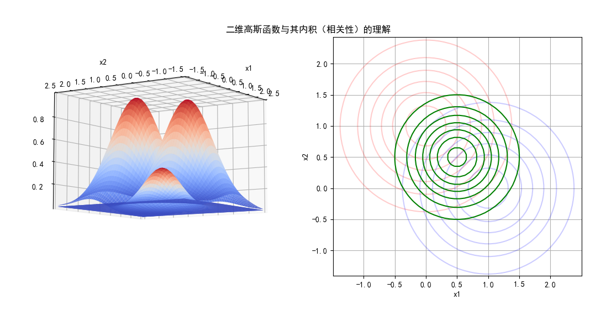

## 11.9 高斯核函数

### 11.9.1 连续函数的内积定义

要想透彻理解高斯核函数的含义，先从理解函数内积及高斯函数入手。

两个连续函数 $f(x),g(x)$ 在区间 $[p,q]$ 内可积且平方可积，则式 11.8.6 称作函数的内积：

$$
\langle f,g \rangle  = \int_p^q f(x) g(x) dx \tag{11.9.1}
$$

比较离散变量的内积公式：

$$
\langle \boldsymbol{x}, \boldsymbol{y} \rangle  = \sum_{i=0}^n x_i  y_i, \quad (\boldsymbol{x} ,\boldsymbol{y} 是两个相同维数的矢量)  \tag{11.9.2}
$$

两者的含义是相同的：
1. 按位相乘。
   
   这在式 11.9.2 中很明显：相同位置 $i$ 的特征值相乘。
   
   在式 11.9.1 中，可以理解为在 $[p,q]$ 区间内的所有相同 $x$ 值对应的 $f(x)$ 和 $g(x)$ 的值相乘。

2. 把 1 的结果相加。
   
   在式 11.9.2 中，用求和符号实现。在式 11.9.1 中，用积分符号实现。

### 11.9.2 高斯函数的内积

再看高斯函数的定义：

$$
f(x)=\frac{1}{\sigma \sqrt{2\pi}} \exp \left [-\frac{(x-\mu)^2}{2\sigma^2} \right ] \tag{11.9.3}
$$

我们使用 Code_11_9_1_Gaussian.py 代码来绘制了高斯函数的形态，在图 11.9.1 左子图中，展示了4个不同参数组合的高斯函数的形态，其中：

1. 参数 $\mu$ 用于定位中心轴，值为 2 时，函数图像整体向右移动两个单位。
2. 参数 $\sigma$ 用于控制高度和宽度，该值越大，函数图像越加的扁宽。
3. $\frac{1}{\sigma\sqrt{2\pi}}$ 是归一化参数，为了让曲线下（从 $-\infty$ 到 $+\infty$）的面积为 1，所以当高度低时，宽度就大。


<center>图 11.9.1 一维高斯函数与内积</center>

接下来我们先忽略 $\sigma$ 的影响，只看 $\mu$ 值。假设有两个高斯函数的 $\mu$ 值分别为 $a,b$ ：

$$
f_a(x)=\frac{1}{\sigma \sqrt{2\pi}} \exp \left [-\frac{(x-a)^2}{2\sigma^2} \right ] \tag{11.9.4}
$$
$$
f_b(x)=\frac{1}{\sigma \sqrt{2\pi}}\exp \left [-\frac{(x-b)^2}{2\sigma^2} \right ]  \tag{11.9.5}
$$

为了计算内积，先做乘法：

$$
\begin{aligned}
f_a(x) f_b(x) &= \frac{1}{2\pi\sigma^2} \exp \left[ -\frac{(x-a)^2}{2\sigma^2} \right] \exp \left[ -\frac{(x-b)^2}{2\sigma^2} \right]
\\\\
&=\frac{1}{2\pi\sigma^2} \exp\left[ -\frac{(x-a)^2+(x-b)^2}{2\sigma^2} \right]
\\\\
&=\frac{1}{2\pi\sigma^2}\exp \left [ -\frac{2x^2+a^2+b^2-2x(a+b)}{2\sigma^2} \right ]
\\\\
&=\frac{1}{2\pi\sigma^2}\exp  \left \{ -\frac{1}{\sigma^2} \left [\left (x - \frac{a+b}{2}\right )^2+ \left(  \frac{a-b}{2}  \right )^2 \right ] \right \} \quad (令 \mu = \frac{a+b}{2})
\\\\
&=\frac{1}{2\pi\sigma^2}\exp  \left [ -\frac{\left (x - \mu \right )^2}{\sigma^2}   \right ] \exp  \left [ -\frac{(a-b)^2}{4\sigma^2}   \right]
\end{aligned} \tag{11.9.6}
$$

下面求积分以便得到内积。对式 11.9.6 中的 $x$ 求不定积分，后面的一项成为常数项，可以提出到积分符号之外：

$$
\begin{aligned}
\int_{-\infty}^{+\infty} f_a(x)f_b(x) &=\frac{1}{2\pi\sigma^2}\exp  \left [  -\frac{(a-b)^2}{4\sigma^2} \right] \int_{-\infty}^{+\infty} \exp  \left [ -\frac{\left (x - \mu \right )^2}{\sigma^2}   \right ] dx  
\\\\
&=\frac{1}{2\pi\sigma^2} \cdot \exp \left [  -\frac{(a-b)^2}{4\sigma^2} \right] \cdot \sigma \sqrt{\pi}
\\\\
&=\frac{1}{2 \sigma \sqrt{\pi}} \exp \left [  -\frac{(a-b)^2}{4\sigma^2} \right]
\end{aligned}
\tag{11.9.7}
$$

式 11.9.7 的函数图像如图 11.9.1 右子图所示：

- 两个较高的函数图像分别是 $f_a(x),f_b(x)$，其中 $a=1,b=-2$；
- 中间比较矮的函数图像是 $f_a(x)f_b(x)$ 的乘积，最高处的 $x$ 坐标（即 $\mu$ 值）为 1.5，应该是 1 和 -2 的中点。
- $f_a \cdot f_b$ 曲线下的面积就是式 11.9.7 的积分结果，可以验证约等于 0.0297。


```python
# 验证 fa·fb 的积分值
def f(x):
    sigma=1
    # 式 11.9.8, 令 a=1,b=-2,sigma=1
    f = np.exp(-(2*x*x + 2*x + 5)/(2*sigma*sigma)) / (2*np.pi*sigma*sigma)
    return f

# 式 11.8.12
def integrate_fab():
    return integrate.quad(f,-100,100)
```
上面代码中首先按照式 11.9.6 定义函数形态 $f(x)$，令 $a=1,b=-2$：

$$
\begin{aligned}
f_a(x)f_b(x)&=\frac{1}{2\pi\sigma^2}\exp \left [ -\frac{2x^2+a^2+b^2-2x(a+b)}{2\sigma^2} \right ] 
\\\\
&= \exp \left [ -(2x^2+2x+5) / {2\sigma^2} \right ] / 2\pi\sigma^2
\end{aligned}
\tag{11.9.8}
$$

然后调用 scipy 库中的积分函数计算积分值，得到：

```
积分结果：
(0.029732572305907347, 4.179708708779781e-12)
```
其中，0.0297（保留4位小数）是积分结果，后面的数值是误差。把 a=1，b=-2 带入式 11.8.12 中，可以得到同样的结果：$\frac{1}{2 \times 1 \times \sqrt{\pi}} \exp[-\frac{(1-(-2))^2}{4 \times 1^2}] \approx 0.0297$。

### 11.9.3 实际的映射函数

观察式 11.9.7，可以看到指数部分的分子中有 $(a-b)^2$ 项，这与式 11.8.2 所定义的高斯核函数的形态 $||x_i-x_j||^2$ 非常相似，只不过前者是标量数值计算，后者是矢量计算，但其含义相同：

- 在一维高斯函数中，$a,b$ 代表以它们为中心轴的两条高斯曲线的位置；
- 在二维高斯函数中，$x_i,x_j$ 表示以它们为中心的两个高斯曲面的位置。

由此可以得到推论：**高斯核函数（式 11.8.1）就是高斯函数的内积（式11.9.7）。** 

这就真正理解了高斯核函数的含义：**把 $x_i$ 看作是以样本 $x_i$ 为中心的高斯函数，把 $x_j$ 看作是以样本 $x_j$ 为中心的高斯函数，则 $e^{-\gamma||\boldsymbol{x}_i-\boldsymbol{x}_j||^2}$ 就是两个样本的高斯函数的内积。** 对一维、二维或更高维的高斯函数都是如此。


注意到高斯核函数幂的表达式是 $-\gamma||x_i - x_j||^2$，其中 $i,j$ 表示样本序号。所以对于 4 个样本的异或问题，应该构造这样的特征矩阵：

$$
特征矩阵 K=
\begin{pmatrix}
e^{-\gamma\parallel x_1 - x_1 \parallel^2} & e^{-\gamma\parallel x_1 - x_2 \parallel^2} & e^{-\gamma\parallel x_1 - x_{3} \parallel^2} & e^{-\gamma\parallel x_1 - x_{4} \parallel^2}
\\\\
e^{-\gamma\parallel x_2 - x_1 \parallel^2} & e^{-\gamma\parallel x_2 - x_2 \parallel^2} & e^{-\gamma\parallel x_2 - x_{3} \parallel^2} & e^{-\gamma\parallel x_2 - x_{4} \parallel^2}
\\\\
e^{-\gamma\parallel x_3 - x_1 \parallel^2} & e^{-\gamma\parallel x_3 - x_2 \parallel^2} & e^{-\gamma\parallel x_3 - x_{3} \parallel^2} & e^{-\gamma\parallel x_3 - x_{4} \parallel^2}
\\\\
e^{-\gamma\parallel x_4 - x_1 \parallel^2} & e^{-\gamma\parallel x_4 - x_2 \parallel^2} & e^{-\gamma\parallel x_4 - x_{3} \parallel^2} & e^{-\gamma\parallel x_4 - x_{4} \parallel^2}
\end{pmatrix}
\tag{11.9.9}
$$

式 11.9.9 实际上就是核矩阵，它的具体含义分成两步解释：
1. 首先看图 11.9.2 的左子图。

    以式 11.9.9 的第三行元素为例，分别计算从样本 $x_3$ 到其它四个样本（包括自己）之间的距离，即二范数的平方 $d=||x_3-x_j||^2，j=1,2,3,4$。



<center>图 11.9.2 异或问题特征矩阵的生成方式</center>


2. 然后把 $d$ 乘以 $-\gamma$，再求自然指数。如图 11.9.2 的右子图。

    由于 $||x_i-x_j||^2 \ge 0$，且限定 $\gamma \ge 0$，所以 $-\gamma ||x_i-x_j||^2 \le 0$，从图 11.8.1 的函数图像来看，$K(x_i,x_j)$ 的定义域是 $(-\infty,0]$，值域是 $(0,1]$，即：

   - 两个样本的距离越大，其核函数值 K 越小，趋近于 0；
   - 两个样本点的距离越小，其核函数值越大，趋近于 1；
   - 特殊地，某个样本和它本身的核函数值为 1。


### 11.9.4 验证映射函数

首先按照式 11.9.9 生成特征矩阵，代码如下：

```python
# 用 K 函数做映射，形成核函数矩阵
gamma = 2
X_new = K_matrix(X, X, gamma)

# 映射成核矩阵
# X - 样本数据
# L - 地标 Landmark，在此例中就是样本数据
def K_matrix(X, L, gamma):
    n = X.shape[0]  # 样本数量
    m = L.shape[0]  # 特征数量
    K = np.zeros(shape=(n,m))
    for i in range(n):
        for j in range(m):
            # 计算每个样本点到其它样本点之间的高斯核函数值
            K[i,j] = np.exp(-gamma * np.linalg.norm(X[i] - L[j])**2)

    print("映射结果：")
    print(np.round(K,3))
    return K   
```

注意 K_matric(X, L, gamma) 函数有三个输入值：
- X，表示原始样本，可以看作是式 11.8.2 中的 $x_i$；
- L，表示Landmark（地标），也就是所有的样本点都要计算到这些样本地标的高斯核函数值，可以看作是式 11.8.2 中的 $x_j$。在生成训练样本数据的特征时，X 和 L 是同一数据，即样本数据以自己为地标；
- gamma 值保持和生成训练样本时一致即可。

该函数的输出是一个矩阵，行数等于输入样本 X 的数量，列数等于输入地标 L 的数量，在本例中都是 4。

```
映射结果：
[[1.    0.    0.018 0.018]
 [0.    1.    0.018 0.018]
 [0.018 0.018 1.    0.   ]
 [0.018 0.018 0.    1.   ]]
```
先看映射结果，由于设定保留 3 位小数，可以看到特征值已经很稀疏了，接近于对角阵，说明 4 个新的特征向量之间近似于正交，保证线性可分。

接下来用新的样本特征做分类训练。定义一个线性的 SVC 函数，注意，我们设置 kernal = 'linear'，没有用到任何非线性核，即，我们对于前面做的特征映射，已经可以保证新的特征值是线性可分的了，所以只需要用一个线性分类器来检验一下结果。

```python
def linear_svc(X,Y):
    model = SVC(C=1, kernel='linear')
    model.fit(X,Y)

    print("权重:",model.coef_)
    print("支持向量个数:",model.n_support_)
    print("支持向量索引:",model.support_)
    print("支持向量:",np.round(model.support_vectors_,3))
    print("支持向量ay:",model.dual_coef_)
    print("准确率:", model.score(X, Y))

    return model
```

运行代码 Code_11_9_2_Xor.py后，打印输出结果如下：

```
权重: [[-0.96370418 -0.96370418  0.96370418  0.96370418]]
支持向量个数: [2 2]
支持向量索引: [0 1 2 3]
支持向量: 
[[1.    0.    0.018 0.018]
 [0.    1.    0.018 0.018]
 [0.018 0.018 1.    0.   ]
 [0.018 0.018 0.    1.   ]]
支持向量ay: [[-1. -1.  1.  1.]]
准确率: 1.0
```

用线性分类器得到的准确率是 1.0，即全部分类正确，4 个样本都是支持向量，且权重相同，这也符合预期。因为 4 个样本的位置比较独立并且全方位对称，重要性相同，所以其参数也应该是相等的。

接下来可视化分类结果。

```python
# 生成测试数据，形成一个点阵来模拟平面
def prediction(model, gamma, landmark, scope):
    # 生成测试数据，形成一个10x10点阵来模拟平面
    # scope=[-1.5,1.5,10,-1.5,1.5,10]
    x1 = np.linspace(scope[0], scope[1], scope[2])
    x2 = np.linspace(scope[3], scope[4], scope[5])
    X1,X2 = np.meshgrid(x1,x2)
    # 把测试数据点从矩阵变成一维排列，便于做预测
    X12 = np.c_[X1.ravel(), X2.ravel()]
    # 用与生成训练数据特征相同的函数来生成测试数据特征
    X12_new = K_matrix(X12, landmark, gamma)
    # 做预测
    pred = model.predict(X12_new)
    # 变形并绘制分类区域
    y_pred = pred.reshape(X1.shape)

    return X1, X2, y_pred
```

在上面的代码中，X12_new = K_matrix(X12, X_sample, gamma) 这一句需要说明一下：
- X12，是用来测试的覆盖整个平面的网点数据；
- X_sample，就是地标，用的是样本点，与生成训练数据时的地标一致，以保证在预测时参考的地标与训练时一致；
- gamma参数与生成训练数据时的地标一致。
- 最后输出的 X12_new 是用测试数据 X_12 生成的类似式 11.8.13 的特征矩阵，只不过结果矩阵是 100 x 4 的。行数 100 是测试样本的数量，测试样本是一个 10 x 10 的网格，所以是 100；列数是地标的数量，也就是 4 个训练样本点。

最后得到分类结果可视化效果如图 11.9.3 所示，注意样本值是经过标准化的。


<center>图 11.9.3 异或问题分类结果</center>

图 11.8.3 中，左上角和右下角被判定为正类区域，右上角和左下角被判定为负类区域。可以想象，如果样本数据不是 4 个样本，而是每类样本都各有很多的话，也是会分布在这四个区域，并且可以被正确分类。

中心区域为什么有一个黄色的过渡带呢？这不是分类结果不精确，而是我们用于模拟平面的点阵的密度不够，所以绘图时会有插值。如果把测试样本密度设置为 100 x 100，则会得到非常锐利的分类边界，读者可以自行实验。

这部分的代码在 Code_11_9_2_Xor.py 中。

### 思考和练习

1. 对于异或数据，如果不做标准化而是直接做特征映射，那么线性分类的结果如何？请修改 Code_11_9_2_Xor.py 尝试。
2. 