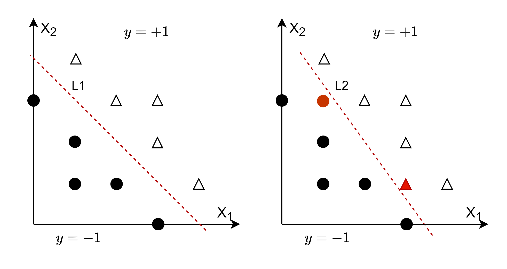

## 11.1 松弛变量与软间隔

### 11.1.1 现实世界中的两类常见问题

在前面学习的内容中，正负两类样本有比较清晰明确的分类间隔，而且分类间隔比较宽。但是，在实际问题中，经常会有两类问题出现：

- 分类间隔变窄的问题

  如图 11.1.1 所示。

  

  
图 11.1.1 分类间隔变窄的问题

  图 11.1.1 的左子图，是一个分类间隔较宽的线性可分问题，但是当正负两类各增加了一个样本点后，如右子图中的红色圆点和红色三角形所示，我们不得不调整分界线 L1 的角度成为 L2，达到可以完全分开正负类的效果，这就会使分类间隔变窄。

  但是新增加的样本点很可能是噪音，由于支持向量机的算法特性，使得这些噪音样本成为了支持向量，鲁棒性降低。

- 分类边界模糊的问题

  而在很多时候，由于两类样本距离较近，混杂在一起，或者由于采样噪音的原因，造成分类边界不清楚。如图 11.1.2 所示。

  

  
图 11.1.2 分类边界模糊的问题

  图 11.1.2 的左子图中，分界线 L1 将好分开两类样本，但是在右子图中，增加了一个负类的噪音样本（红色圆点），无论如何调整 L2，都无法分开两类样本了。

  但是从整体上看，该问题在去除掉几个特异样本点（outlier）之后，还是属于线性可分的范畴。比如，去掉最右侧的负类样本，或者去掉最下面的两个正类样本，则仍然是线性可分的问题。

由于上述两类问题的存在，我们考虑是否可以增加一些容忍度，来更合理地确定分界线及分类间隔？如果把前几个小节讲述的具有清晰的分界线的问题称作硬间隔的话，在这里就可以引入松弛变量和软间隔的概念。

### 11.1.2 松弛变量

如果对于每个样本点，都附加一个误差变量 $s_i$，表示样本点到分类间隔的距离（注意，不是到分界线的距离），这样就可以通过衡量**误差总和**的大小来确定新的优化目标。这个误差变量就叫做**松弛变量**。

式 10.1.20 是硬间隔（理想环境下）的优化目标，在它的基础上我们增加对误差变量的优化考量：

$$
\underset{w,b,s}{\min} \ f(w,b,s) =\frac{1}{2}||w||^2 + C \sum_{i=1}^n s_i
\tag{11.1.1}
$$

式 11.1.1 相当于对式 10.1.19 增加了一个正则化项，来限制分类间隔的一些形态。

如果 $s_i$ 有正有负的话，则其和会相互抵消，所以我们要求 $s_i \ge 0$。其中的 $C$ 是一个参数（经验值），用于决定对误差的容忍程度：

- $C$ 值变大时，会要求 $\sum_{i=1}^n s_i$ 非常小，也就是要求误差很小，表明我们希望尽量正确地划分样本数据，可能造成的结果是分类间隔变窄，泛化能力变低，在预测是对有一些误差的样本做错误地分类。
- $C$ 值变小时，对 $\sum_{i=1}^n s_i$ 的要求就降低了，可以稍微大一些，表明我们希望分类间隔宽一些，处于边界附近的样本可能就不会被正确地划分，但是对将来的预测有好处。

如果有成千上万个样本点，每个样本都有一个误差的话，那其和就会非常大。所以，并不是每个样本的松弛变量都有效的，而是有一些特殊的样本的松弛变量才会大于 0，其它的都会等于 0。

我们看图 11.1.3。

图 11.1.3 软间隔中的各种典型样本点

假设有 1000 个样本点（正负类各 500 个样本），分类的结果如图 11.1.3 所示，但是图中只画出了几个具有代表性的样本。其中，正类样本 5 个，负类样本一个。

表 11.1.1 在图 11.1.3 中各类典型样本的值

|典型样本|类别|分类结果|支持向量|$\alpha$值|$s$值|位置|距离值$y_i(\boldsymbol{w} \cdot \boldsymbol{x_i}+b)$|
|--|--|--|--|--|--|--|--|
|$p_1$|负类|正确|是|$\alpha_1<C$|$s_1=0$|间隔边界线上|$=1-s_1=1$|
|$p_2$|正类|正确|非|$\alpha_2=0$|$s_2=0$|间隔边界之外|$>1-s_2=1$。
|$p_3$|正类|正确|是|$\alpha_3<C$|$s_3=0$|间隔边界线上|$= 1-s_3=1$|
|$p_4$|正类|正确|是|$\alpha_4=C$|$0<s_4<1$|分界线与间隔边界之间|$= 1-s_4<1$|
|$p_5$|正类|两可|是|$\alpha_5=C$|$s_5=1$|分界线（超平面）上|$=1-s_5=0$|
|$p_6$|正类|错误|是|$\alpha_6=C$|$s_6>1$|分界线（超平面）另一侧|$=1-s_6<0$|

由于$s_6>1$，所以距离分界线的值为 $1-s_6<0$，这与该点在分界线之下的情况吻合。

综合表 11.1.1 最右一列的情况，式 10.1.16 的约束条件就会变成：

$$
y_i(\boldsymbol{w} \cdot \boldsymbol{x_i}+b) \ge 1-s_i \tag{11.1.2}
$$

那么，图 11.1.2 中两条黑色虚线边界线所形成的间隔就叫做**软间隔**，它可以容忍有不正确的样本划分结果。

从图 11.1.2 我们还可以知道，只有 $p_4,p_5,p_6$ 这三类样本点才会有 $s_i > 0$ 的情况，其它样本的 $s_i$ 都为 0，所以也不必担心 $C \sum_{i=1}^n s_i$ 的值会大得不可收拾。

### 11.1.3 拉格朗日对偶问题

- 原始问题

具有软间隔的优化问题就会转换为：

$$
\begin{aligned}
\underset{w,b,s}{\min} & \ f(w,b,s) =\frac{1}{2}||w||^2 + C \sum_{i=1}^n s_i  
\\\\
s.t. & \ y_i(\boldsymbol{w} \cdot \boldsymbol{x_i}+b) \ge 1-s_i
\\\\
& \ s_i \ge 0, & i=1,...,n
\end{aligned}
\tag{11.1.3}
$$

把式 11.1.3 变成标准的拉格朗日约束问题所要求的形式：

$$
\begin{aligned}
\underset{w,b,s}{\min} & \ f(w,b,s) =\frac{1}{2}||w||^2 + C \sum_{i=1}^n s_i  
\\\\
s.t. & \ 1-y_i(\boldsymbol{w} \cdot \boldsymbol{x_i}+b)-s_i \le 0
\\\\
& \ -s_i \le 0, & i=1,...,n
\end{aligned}
\tag{11.1.4}
$$

构造出来的拉格朗日函数是：

$$
L(w,b,s,\alpha,\beta)=\frac{1}{2}||w||^2 + C \sum_{i=1}^n s_i + \sum_{i=1}^n \alpha_i [1-y_i(\boldsymbol{w} \cdot \boldsymbol{x_i}+b)-s_i]+\sum_{i=1}^n \beta_i (-s_i)
\tag{11.1.5}
$$

再根据前面学习的对偶问题解决方法，先求最小值，再求最大值。

- 求最小值

对式 11.1.5 求各个变量的导数，并令结果为 0：

$$
\nabla_w L(w,b,s,\alpha,\beta)=\boldsymbol{w}-\sum_{i=1}^n \alpha_i y_i \boldsymbol{x}_i=0 \tag{11.1.6}
$$

$$
\nabla_b L(w,b,s,\alpha,\beta)=-\sum_{i=1}^n \alpha_i y_i =0 \tag{11.1.7}
$$

$$
\nabla_{s_i} L(w,b,s,\alpha,\beta)=C-\alpha_i-\beta_i=0 \tag{11.1.8}
$$

由于有个求和符号 $\sum$，所以式 11.1.8 可以用实例化的方法推出来，比如令 n=2，则：

$$
\begin{aligned}
\nabla_{s_1} L(w,b,s,\alpha,\beta)&=\nabla_{s_1}(Cs_1+Cs_2-\alpha_1 s_1-\alpha_2 s_2 - \beta_1 s_1 - \beta_1s_2)
\\\\
&= C-\alpha_1-\beta_1=0
\\\\
\nabla_{s_2} L(w,b,s,\alpha,\beta)&=C-\alpha_2-\beta_2=0
\end{aligned}
$$

把 1,2 换成 $i$ 就可以得到式 11.1.8 了。

下面将 11.1.6~11.1.8 代回式 11.1.5 得到：

$$
\begin{aligned}
D(\alpha,\beta)&=\underset{w,b,s}{\min} \ L(w,b,s,\alpha,\beta)
\\\\
&=\frac{1}{2} \boldsymbol{w} \boldsymbol{w}^T + (C-\alpha_i-\beta_i)\sum_{i=1}^n s_i + \sum_{i=1}^n \alpha_i - \boldsymbol{w} \sum_{i=1}^n a_i y_i \boldsymbol{x}_i - b \sum_{i=1}^n \alpha_i y_i
\\\\
&=\sum_{i=1}^n\alpha_i-\frac{1}{2}\sum_{i=1}^n\sum_{j=1}^n\alpha_i \alpha_j y_i y_j (x_i \cdot x_j) 
\end{aligned}
\tag{11.1.9}
$$

- 求最大值

下面求式 11.1.9 的极大值，目标为：

$$
\begin{aligned}
\underset{\alpha}{\max} & \ \sum_{i=1}^n\alpha_i-\frac{1}{2}\sum_{i=1}^n\sum_{j=1}^n\alpha_i \alpha_j y_i y_j (x_i \cdot x_j)
\\\\
s.t. & \ \sum_{i=1}^n \alpha_i y_i =0
\\\\
& \ C - \alpha_i - \beta_i =0
\\\\
& \ \alpha_i \ge 0
\\\\
& \ \beta_i \ge 0, & i=1,...,n
\end{aligned}
\tag{11.1.10}
$$

将 $C - \alpha_i - \beta_i =0$ 变形得到 $C - \alpha_i = \beta_i$。由于 $\beta_i \ge 0$，所以 $C - \alpha_i \ge 0$，即$C \ge \alpha_i$，结合 $\alpha_i \ge 0$，有：

$$
0 \le \alpha_i \le C \tag{11.1.11}
$$

与式 10.1.20 相比，由于优化目标相同，只是约束条件有变化，所以接下来仍然可以使用 SMO 算法来解决式 11.1.10 的优化问题。
