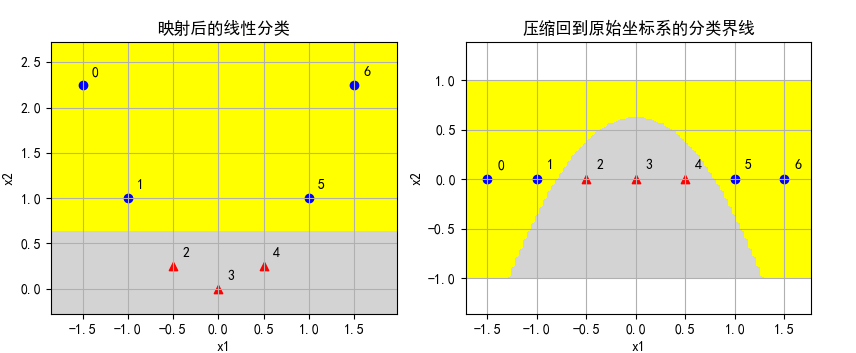

## 12.1 解决一维非线性问题

我们在前面学习的 SVM 算法都是针对线性可分数据的，下面我们学习如何解决非线性可分的问题。

### 12.1.1 原始问题

我们先看一个简单的例子，假设有 7 个样本，其中 4 个正类样本 $x_{1}=[-1.5,\ -1,\ 1,\ 1.5]$，3 个负类样本 $x_{1}=[-0.5,\ 0,\ 0.5]$，它们都排列在 $x_{1}$ 轴上（即 $x_{2}=0$），如图 12.1.1 的左子图所示。我们无法将这两类样本点做线性分割。


<center>图 12.1.1 </center>

### 12.1.2 增加一维新特征

但是，如同前面学习的多项式回归一样，如果令 $x_{2}=x_{1}^2$，则可以得到表 12.1.1 中的数据，也就是说，把一维的特征增加了一维，变成二维的了。

表 12.1.1 增加了一维特征后的样本数据

|样本|$x_{1}$|$x_{2}$|$y$|
|--|--:|:--|--:|
|1|-1.5|2.25|1|
|2|-1.0|1.0|1|
|3|-0.5|0.25|-1|
|4|0.0|0.0|-1|
|5|0.5|0.25|-1|
|6|1.0|1.0|1|
|7|1.5|2.25|1|

上述的过程叫做**映射**，可以定义映射函数为：

$$
\phi(z)=[z,\ z^2] \tag{12.1.1}
$$

映射函数包含了两个步骤：
1. 先计算原始特征的平方值，即 $z^2$，得到**新特征值**；
2. 把**新特征值**与**原始特征值**拼在一起形成**新的二维特征**。

请读者注意区分**特征**与**特征值**的含义，**特征**是包含了一组**特征值**的向量。

把表 12.1.1 的新生成的样本数据绘制到图 12.1.1 的中图，得到一条抛物线，可以明显看出用一条红色的水平虚线就能够轻松地分开两类样本点。

其实，即使不使用二维特征，而只是把 $x^2$ 作为唯一的特征，也已经可以分开两类样本点了，如图 12.1.1 右子图所示，相当于把位于左半侧的样本折叠到右半侧。

### 12.1.3 代码验证

为此我们可以做一个简单代码验证。

先定义原始数据：

```python
    X_raw = np.array([[-1.5,0], [-1,0], [-0.5,0], [0,0], [0.5,0], [1,0], [1.5,0]])
    Y = np.array([-1,-1,1,1,1,-1,-1])
```
注意，原始数据 X 中，第二维的数据全都是 0，相当于是一维数据，这样便于在二维坐标系中绘图。

现在把数据从一维变换到二维：

```python
# 把数据从一维变换到二维(x2_new = x1*x1 + x2_origin)
def transform(X_raw):
    X = np.zeros_like(X_raw)
    X[:,0] = X_raw[:,0]
    X[:,1] = X_raw[:,0] ** 2 + X_raw[:,1]
    return X
```

然后使用线性 SVM 分类分类：

```python
# 线性SVM分类器
def linear_svc(X,Y):
    model = SVC(C=3, kernel='linear')
    model.fit(X,Y)
    return model
```

结果如图 12.1.2 所示。



<center>图 12.1.2 试验结果</center>

可以看到，在图 12.1.2 左图中，增加一维特征后，父类样本点都升高了，正类样本点升高幅度较小，可以用线性分类器轻松分界，黄色区域被预测为负类，灰色区域被预测为正类。

现在想象把各个样本点的 $x_{2}$ 值都“压回”到原始值（$x_{2}=0$），那么分界线也会随之变化，但不再是直线，而是会变成图 12.1.2 右图的样子，形成一条反向的抛物线，也可以分割正负类样本，但是线性分类器是不能形成这种弯曲的分界线的。

在有些资料中，作者凭着想象把图 12.1.2 右子图的分界线的画成开口向上的曲线，请读者注意，这是不正确的。


> 以上结果请运行代码 Code_12_1_1D.py 得到。

### 思考和练习

1. 使用 12.1.2 小节中提到的折叠法，把平方后的一维样本传递给线性 SVM 函数进行分类，并绘图观察其效果。

