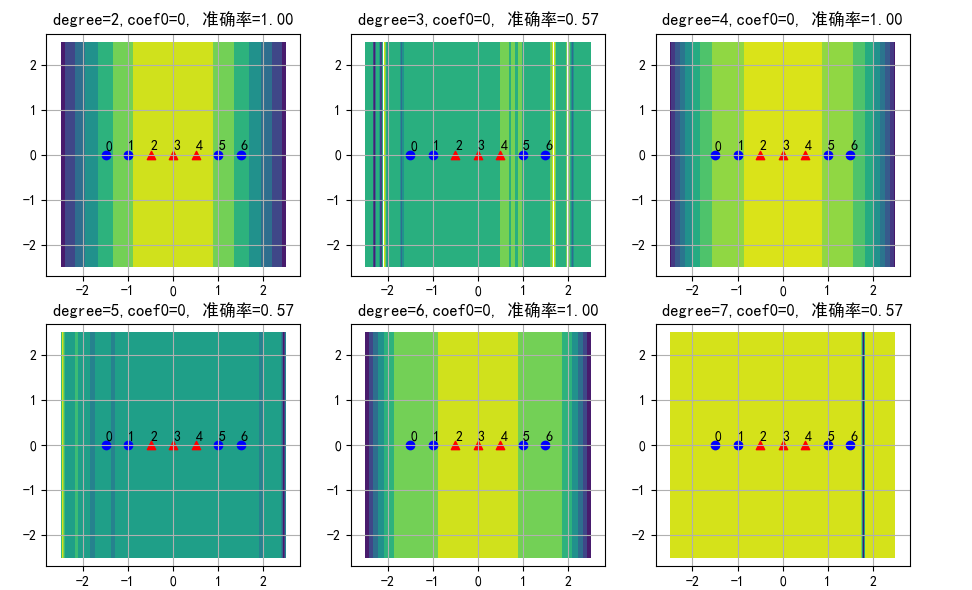
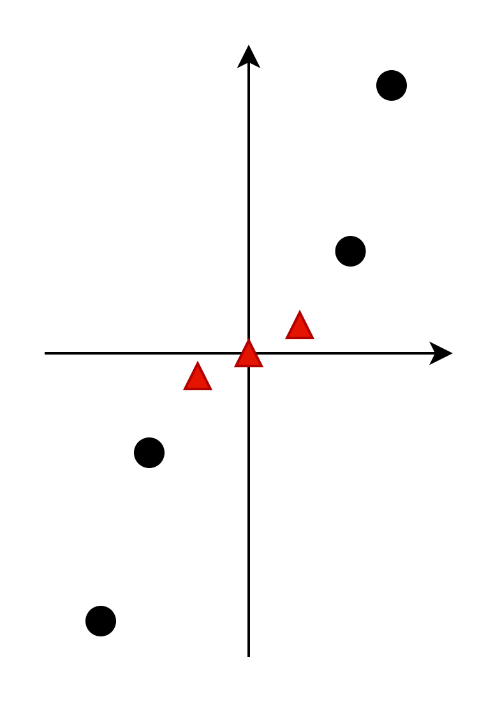
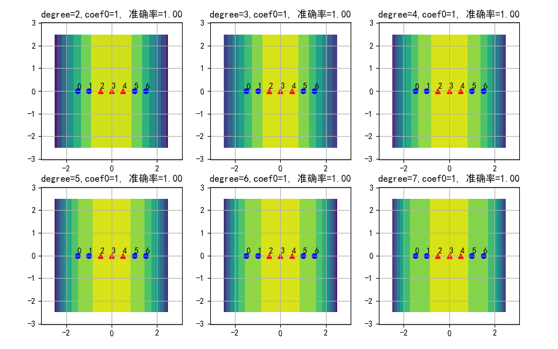
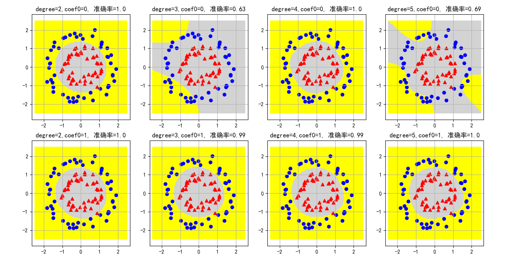
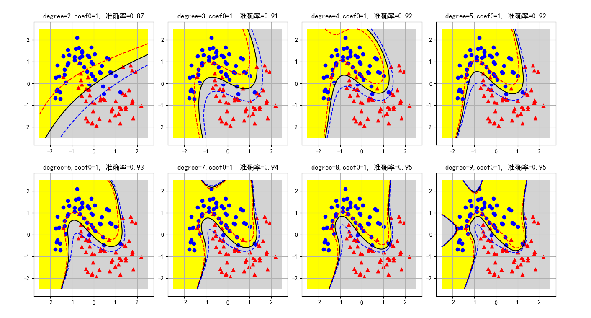

## 11.4 多项式核函数

多项式核函数的一般性公式为：

$$K(\boldsymbol{x}_i, \boldsymbol{x}_j)=[\gamma (\boldsymbol{x}_i \cdot \boldsymbol{x}_j) + r]^d \tag{12.4.1}$$

### 11.4.1 验证一维非线性问题

我们先用多项式核函数验证一下 12.1 小节中的一维非线性问题。

关键的函数调用代码如下：

```python
def poly_svc_1(X, Y, d):
    model = SVC(kernel='poly', degree=d)
    model.fit(X,Y)
```

其中 d 表示多项式的次数，如果不指定的话，缺省值为 3。我们分别指定 degree=2,3,4,5，得到的分类结果如图 12.4.1。



<center>图 12.4.1 </center>

这是用颜色渐变的方式显示的分类结果，黄色为正类区域，绿色为负类区域。可以看到一个奇怪的现象：degree=2,4,6 时，分类结果是正确的；degree=3,5,7 时，分类结果错误。一个是奇数，一个是偶数。这是为什么呢？

仔细查看 SVC 函数的文档，得知当式 12.4.1 中的 $r$ 不指定时，缺省为 0。令 $\gamma=1$，则式 12.4.1 变为：

$$K(\boldsymbol{x}_i, \boldsymbol{x}_j)=(\boldsymbol{x}_i \cdot \boldsymbol{x}_j)^d, \quad d=2,3,4,5,6,7 \tag{12.4.2}$$

在 12.1 节中，经过试验，确定了式 12.4.3 所示的映射函数是可以完成从线性到非线性的映射的，

$$
\phi(z)=[z,\ z^2] \tag{12.4.3}
$$

那么下面就可以验证一下当 d=2,3 两种情况时，式 12.4.2 展开为映射函数后，是否与式 12.4.3 一致。注意在本例中是一维特征，所以 $\boldsymbol{x}$ 展开后只有 $x_1$ 项，而不是 $x_1,x_2$ 等等。

- d=2 时

$$
K(\boldsymbol{x}_i, \boldsymbol{x}_j)=(\boldsymbol{x}_i \cdot \boldsymbol{x}_j)^2=(x_{i1} x_{j1})^2=x_{i1}^2 x_{j1}^2
\tag{12.4.4}
$$

所以映射函数是：
$$
\phi(z)=[z^2] 
\tag{12.4.5}
$$

具有 $z^2$ 项特征，对于该问题来说已经足够了，因为原始样本特征值会从 $[-1.5,-1,-0.5,0,0.5,1,1.5]$ 将会变成 $[2.25,1,0.25,0,0.25,1,2.25]$，其中，小于等于 0.25 的样本会被分类为正类，大于等于 1 的样本为负类，具体的分界线值可能是 (0.25,1) 之间的一个数值。

所以 d=2 时可以正确分类。

- d=3 时

$$
K(\boldsymbol{x}_i, \boldsymbol{x}_j)=(\boldsymbol{x}_i \cdot \boldsymbol{x}_j)^3=(x_{i1} x_{j1})^3=x_{i1}^3 x_{j1}^3
\tag{12.4.6}
$$

所以映射函数是：
$$
\phi(z)=[z^3] 
\tag{12.4.7}
$$

根据式 12.4.7，原始样本特征值会从 $[-1.5,-1,-0.5,0,0.5,1,1.5]$ 将会变成 $[-3.375,-1,-0.125,0,0.125,1,3.375]$，这与原始样本值在性质上没有差别。在二维坐标系上绘制出这些样本点（横坐标为原始特征值，纵坐标为 $x^3$ 项特征值），实际上就是 $y=x^3$ 的曲线，也不是线性可分的。见图 12.4.2。



图 12.4.2 

所以 d=3 时不能正确分类。

$z^2$ 项在上面的试验中起到了重要作用，因为经过平方运算后，把负号变成了正号。

> 以上结果请运行代码 Code_12_4_Poly_1D.py 得到。

### 11.4.2 正确使用多项式核函数

问题来了：多项式核函数有这么弱吗？我们是不是忽略了什么细节？

根据式 12.4.1，里面的参数 $r$ 并没有体现出来。仔细看 SVC 函数的文档，会发现有一个 coef0 参数，解释得比较含糊：
```
    coef0 : float, default=0.0
        Independent term in kernel function.
        It is only significant in 'poly' and 'sigmoid'.
```
但是文档里既然说这个参数是很重要（significant），所以不妨试一下。修改代码如下：

```python
def poly_svc(X, Y, d, r):
    model = SVC(kernel='poly', degree=d, coef0=r)
    model.fit(X,Y)
```

在调用时指定 r=1，得到如下结果：



<center>图 12.4.3 </center>

这一次，无论 degree 是奇数还是偶数，结果都是正确的。正负类各有两个支持向量，分别是 2、4 和 1、5 号样本。

这是为什么呢？

原因还要从式 12.4.1 说起，如果令 $\gamma=1,r=1,d=3$，式 12.4.1 实例化为式 12.4.8（用一维特征做实例化推导）：

$$
\begin{aligned}
K(x_i, x_j)&=[(\boldsymbol{x}_i \cdot \boldsymbol{x}_j)+1]^3
\\\\
&=(\boldsymbol{x}_i \cdot \boldsymbol{x}_j)^3+3(\boldsymbol{x}_i \cdot \boldsymbol{x}_j)^2+3(\boldsymbol{x}_i \cdot \boldsymbol{x}_j)+1
\\\\
&=x_{i1}^3 x_{j1}^3 + 3 x_{i1}^2 x_{j1}^2 + 3 x_{i1} x_{j1} + 1
\end{aligned}
\tag{12.4.8}
$$

因为是一维特征，所以式 12.4.8 中只会有 $x_{i1},x_{j1}$ 等等，而不会出现 $x_{i2},x_{j2}$。

则映射函数为：

$$
\phi(z)=[z_1^3,\sqrt{3}z^2, \sqrt{3}z,1] \tag{12.4.9}
$$

可以看到在映射函数中有 $z^2$ 项特征，这个特征已经足够把两类样本分开了。

下面我们来验证一下这个推论是否正确。首先按式 12.4.9 做特征映射：

```python
# 按照式 12.4.9 建立映射函数
def mapping(X_raw):
    # 申请一个7行4列的新特征矩阵
    X_new = np.zeros(shape=(X_raw.shape[0],4))
    # 第0列填入 z^3
    X_new[:,0] = X_raw[:,0] ** 3
    # 第1列填入 sqrt(3) * z^2
    X_new[:,1] = math.sqrt(3) * X_raw[:,0] ** 2
    # 第2列填入 sqrt(3) * z
    X_new[:,2] = math.sqrt(3) * X_raw[:,0]
    # 第3列填入 1
    X_new[:,3] = 1

    return X_new
```
打印出 X_new 的值为：
```
# x^3     x^2    x      1
[[-3.375  3.897 -2.598  1.   ]
 [-1.     1.732 -1.732  1.   ]
 [-0.125  0.433 -0.866  1.   ]
 [ 0.     0.     0.     1.   ]
 [ 0.125  0.433  0.866  1.   ]
 [ 1.     1.732  1.732  1.   ]
 [ 3.375  3.897  2.598  1.   ]]
```
注意 $x^2,x$ 两列是乘以 $\sqrt{3}$ 后的结果。其实如果某列中的数值统一乘以一个系数，那么就相当于没用，因为大家都放大或缩小了同样的倍数，做标准化后就会忽略这种放大或缩小。

然后经过标准化，再输入到 **线性 SVC** 中，看看 X_new 是不是线性可分的：

```python
    ss = StandardScaler()
    X = ss.fit_transform(X_new)
    # 注意这里使用了线性分类器 linear
    model = SVC(kernel='linear')
    model.fit(X,Y)
```
打印输出训练结果：

```
权重: [[ 0.    -1.732 -0.     0.   ]]
支持向量个数: [2 2]
支持向量索引: [1 5 2 4]
支持向量ay: [[-1. -1.  1.  1.]]
准确率: 1.0
```
- 准确率为 1.0，说明分类正确。
- 支持向量的情况与预测的相同，只有 1,5,2,4。
- 特别要注意权重值，只有 $x^2$ 项特征的权重有值，为 -1.732，其它特征项的权重都为 0，说明式 12.4.9 中，只有 $\sqrt{3}z^2$ 特征项有用。


由此我们可以得到一般性的结论：

1. 尽量给与算法更多的特征值。
2. 算法会自动选择有用的特征值。
3. 算法不会被无效的特征干扰。
4. 同时放大或缩小所有样本的同一特征值没用。

> 以上结果请运行代码 Code_12_4_Poly_1D_Mapping.py 得到。

### 12.4.3 验证二维非线性问题

下面我们先用双圆形数据来验证二维的问题。

在图 12.4.4 中，四列分别代表 degree=2,3,4,5 时的结果，两行分别代表 r=0 和 r=1 的情况。灰色为正类区域，黄色为负类区域。黑色实线是分界线，红色虚线是负类的分类间隔边界，蓝色虚线是正类的分类间隔边界。



<center>图 12.4.4 </center>

先看第一行，r = 0，依然是当 degree 为偶数时，可以正确分类；为奇数时，不能正确分类。而在第二行中，由于 r = 1，所以都可以正确分类。

- r = 0, degree = 3 时，多项式核函数可以分解为：

$$
\begin{aligned}
K(x_i, x_j)&=[(\boldsymbol{x}_i \cdot \boldsymbol{x}_j)+0]^3=(\boldsymbol{x}_i \cdot \boldsymbol{x}_j)^3
\\\\
&=(x_{i1} x_{j1} + x_{i2} x_{j2})^3
\\\\
&=x_{i1}^3 x_{j1}^3 + 3 x_{i1}^2 x_{j1}^2 x_{i2} x_{j2} + 3 x_{i1} x_{j1} x_{i2}^2 x_{j2}^2 + x_{i2}^3 x_{j2}^3
\end{aligned}
\tag{12.4.10}
$$

所以映射函数为：

$$
\phi(z)=[z_1^3,\ \sqrt{3}z_1^2z_2,\ \sqrt{3}z_1z_2^2,\ z_2^3] \tag{12.4.11}
$$

在式 12.4.11 中，并没有独立 $z^2$ 项作为特征，所以无法正确分类。

- r = 1, degree = 3 时，具有两个特征值（$x_{i1},x_{i2}$）的多项式核函数可以分解为：

$$
\begin{aligned}
K(x_i, x_j)&=[(\boldsymbol{x}_i \cdot \boldsymbol{x}_j)+1]^3
\\\\
&=(\boldsymbol{x}_i \cdot \boldsymbol{x}_j)^3+3(\boldsymbol{x}_i \cdot \boldsymbol{x}_j)^2+3(\boldsymbol{x}_i \cdot \boldsymbol{x}_j)+1
\\\\
&=(x_{i1} x_{j1} + x_{i2} x_{j2})^3 + 3 (x_{i1} x_{j1} + x_{i2} x_{j2})^2 + 3 (x_{i1} x_{j1} + x_{i2} x_{j2}) + 1
\\\\
&=x_{i1}^3 x_{j1}^3 + 3 x_{i1}^2 x_{j1}^2 x_{i2} x_{j2} + 3 x_{i1} x_{j1} x_{i2}^2 x_{j2}^2 + x_{i2}^3 x_{j2}^3
\\\\
&+3 x_{i1}^2 x_{j1}^2 + 6 x_{i1} x_{j1} x_{i2} x_{j2} + 3 x_{i2}^2 x_{j2}^2 + 3 x_{i1} x_{j1} + 3 x_{i2} x_{j2} + 1
\end{aligned}
\tag{12.4.12}
$$

所以映射函数为：

$$
\phi(z)=[z_1^3,\ \sqrt{3} z_1^2 z_2,\ \sqrt{3}z_1 z_2^2,\ z_2^3,\ \sqrt{3}z_1^2, \ \sqrt{6}z_1z_2,\ \sqrt{3}z_2^2, \ \sqrt{3}z_1,\ \sqrt{3}z_2, \ 1] \tag{12.4.13}
$$

式 12.3.13 中，含有 $z_1z_2, z_1^2, z_2^2$ 等项，可以形成有效的特征值，其它特征项可以忽略。

> 以上结果请运行代码 Code_12_4_Poly_Circle.py 得到。

### 12.4.4 验证多项式次数对分类结果的影响

下面我们用月亮数据集来学习多项式次数对分类结果的影响。

在图 12.4.5 中，8 个子图分别代表 degree=2,...,9 的分类情况，degree=2 表示二次多项式，以此类推。



<center>图 12.4.5 </center>

随着多项式次数的增加，分类准确率不断提高，最后可以达到 0.95，由于有几个噪音样本的存在，不能达到 100% 的正确分类。

从分类间隔形状上看，二次多项式没有学习到原始样本的形状，是因为二次多项式最高只能产生 $x^2,x_1x_2,x_1^2+x_2^2$ 等特征，形成圆形或者抛物线形（凸函数），而原始样本的分界线是需要“拐两个弯儿的”。

三、四、五、六、八次多项式比较完美，七次和九次多项式在上方和左侧多出来一个灰色正类区域，这属于无中生有了。但是八次项和九次项可以达到 0.95 的准确率，次数再高的话估计也无能为力了，读者可以自行试验。

在算法运行时间上，笔者故意在代码中循环 100 次，得出结果如下：

```
time= 0.09638309478759766
time= 0.08351397514343262
time= 0.09265899658203125
time= 0.09453201293945312
time= 0.08172273635864258
time= 0.08605217933654785
time= 0.10483551025390625
time= 0.10648965835571289
```

最上面的二次多项式用时 0.09 秒，最下面的九次多项式用时 0.1 秒，相差不多，这就是核函数的威力，虽然九次比二次多了很多，但是对于计算机来说，计算式 12.4.1 的核函数并无很大差别，因为不需要做特征映射，不会增加很多特征项。

> 以上结果请运行代码 Code_12_4_Poly_Moon.py 得到。

### 思考与练习

1. 根据式 12.4.13，生成这 10 个特征项，然后用线性 SVC 分类器分类，观察分类后的权重值与特征项的对应关系，分析哪些特征项是有用的，哪些是没用的。
2. 使用更高的多项式次数验证图 12.4.5 是否可以达到大于 0.95 的准确率。
