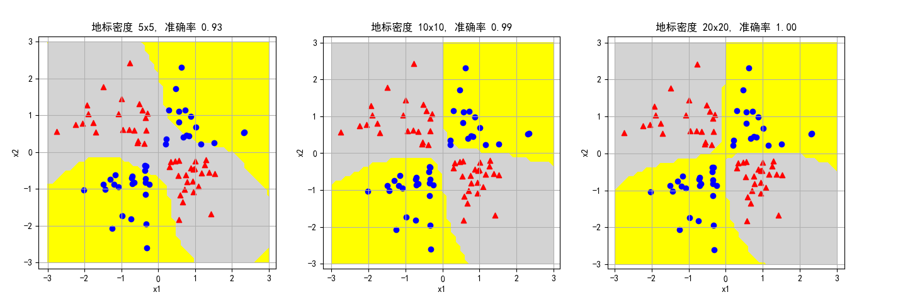

## 12.7 高斯核函数的映射函数

### 12.7.1 实际的映射函数

上一节中，我们推导了连续高斯核函数的内积形式，这一节我们继续 11.8 的话题，研究高斯核函数的映射函数，以及如何应用到离散变量，这样我们才能真正理解高斯核函数的工作原理。

我们仍以异或问题为例，讲解映射函数的特征矩阵生成方式。

从 11.9 节的图 11.9.2 中，读者可能意识到一个样本所处的位置对它的周围的“影响力”可以用一个高斯函数来表达，如果要判断空间中的一个点是正类还是负类，需要计算其周围多个样本的合作用力，当正类的作用力大于负类时，就属于正类，反之亦然。

但是高斯函数是连续的，样本是离散变量，如何把连续值变成离散值呢？当然是采样！而且要求采样的方法对于所有样本是公平的。

所以我们按以下步骤


1. 首先在内定义一个区域，这个区域比样本空间略微大一些。比如在图 12.7.1 中，样本空间的区域是 $x_1 \in [0,1], x_2 \in [0,1]$，则该区域可以定义为 $x_1 \in [-0.5,1.5], x_2 \in [-0.5,1.5]$，这样就可以涵盖所有 4 个样本点。


<center>图 12.7.1 异或问题特征矩阵的生成方式</center>

2. 由于是离散问题，所以在上述区域内定义一个 5x5 的网格，一共有 25 个采样点，我们把这些采样点叫做地标（Landmark），每个地标 $L_i$ 都有自己的坐标：

$$L_i=(l_{i,1},l_{i,2}), \quad i=0,...,24$$

如：左上角 $L_0=(-0.5,1.5)$, 右下角 $L_{24}=(1.5,-0.5)$。

代码如下：

```python
# 采样范围和密度
scope = [-0.5,1.5,5, -0.5,1.5,5]

def create_landmark(scope):
    #scope = [-0.5,1.5,5, -0.5,1.5,5]
    x1 = np.linspace(scope[0], scope[1], scope[2])
    # x2从1.5到-0.5，相当于y值从上向下数，便于和图12.7.1的上下位置吻合
    x2 = np.linspace(scope[4], scope[3], scope[5])

    landmark = np.zeros((scope[2]*scope[5], 2))
    for i in range(scope[2]):
        for j in range(scope[5]):
            landmark[i*scope[2]+j,0] = x1[j]
            landmark[i*scope[2]+j,1] = x2[i]

    return landmark
```

其中，-0.5 表示起始位置，1.5 表示终止位置，5 表示采样密度，也就是每行每列都有 5 个采样点，一共 25 个。

3. 对于每个样本 $x_i$，定义以该样本坐标为中心的高斯函数：
   
$$
f(x_i) = e^{-\gamma \big [(X_1-x_{i,1})^2+(X_2-x_{i,2})^2 \big ]} =e^{-\gamma ||X-x_{i}||^2}
\tag{12.7.1}
$$

其中，$X_1,X_2$ 表示二维坐标轴。

比如，对于样本点 $x_2(0,1)$，有 $f(x_2)=e^{-\gamma \big[(X_1-0)^2+(X_2-1)^2\big]}$。

4. 把所有的 $L_0,...,L_{24}$ 代入式 12.7.1 实例化 $X_1,X_2$，计算出 25 个值，就得到每个样本的 25 个特征值。

实际会形成式 12.7.2 的特征矩阵：

$$
K = 
\begin{pmatrix}
e^{-\gamma ||L_0-x_0||^2} & e^{-\gamma ||L_1-x_0||^2} & \cdots & e^{-\gamma ||L_{24}-x_0||^2}
\\\\
e^{-\gamma ||L_0-x_1||^2} & e^{-\gamma ||L_1-x_1||^2} & \cdots & e^{-\gamma ||L_{24}-x_1||^2}
\\\\
e^{-\gamma ||L_0-x_2||^2} & e^{-\gamma ||L_1-x_2||^2} & \cdots & e^{-\gamma ||L_{24}-x_2||^2}
\\\\
e^{-\gamma ||L_0-x_3||^2} & e^{-\gamma ||L_1-x_3||^2} & \cdots & e^{-\gamma ||L_{24}-x_3||^2}
\end{pmatrix}
\tag{12.7.2}
$$

矩阵 K 的行数是样本的数量，列数是地标的数量。

代码如下：

```python
# 映射特征矩阵
# X - 样本数据
# L - 地标 Landmark，在此例中就是样本数据
# gamma - 形状参数
def Feature_matrix(X, L, gamma):
    n = X.shape[0]  # 样本数量
    m = L.shape[0]  # 特征数量
    X_feature = np.zeros(shape=(n,m))
    for i in range(n):
        for j in range(m):
            # 计算每个样本点在地标上的高斯函数值，式 12.7.1 
            X_feature[i,j] = np.exp(-gamma * np.linalg.norm(X[i] - L[j])**2)

    return X_feature
```

上述代码计算了异或问题的 4 个样本的 25 个特征值，打印输出如下：

```
Feature Matrix=
[[0.082 0.105 0.082 0.039 0.011 0.287 0.368 0.287 0.135 0.039 0.607 0.779 0.607 0.287 0.082 0.779 1.    0.779 0.368 0.105 0.607 0.779 0.607 0.287 0.082]
 [0.082 0.287 0.607 0.779 0.607 0.105 0.368 0.779 1.    0.779 0.082 0.287 0.607 0.779 0.607 0.039 0.135 0.287 0.368 0.287 0.011 0.039 0.082 0.105 0.082]
 [0.607 0.779 0.607 0.287 0.082 0.779 1.    0.779 0.368 0.105 0.607 0.779 0.607 0.287 0.082 0.287 0.368 0.287 0.135 0.039 0.082 0.105 0.082 0.039 0.011]
 [0.011 0.039 0.082 0.105 0.082 0.039 0.135 0.287 0.368 0.287 0.082 0.287 0.607 0.779 0.607 0.105 0.368 0.779 1.    0.779 0.082 0.287 0.607 0.779 0.607]]
```
其中，把 2 号样本的特征值变成 5x5 的矩阵如下：
```
2 号样本的特征值矩阵：
[[0.607 0.779 0.607 0.287 0.082]
 [0.779 1.    0.779 0.368 0.105]
 [0.607 0.779 0.607 0.287 0.082]
 [0.287 0.368 0.287 0.135 0.039]
 [0.082 0.105 0.082 0.039 0.011]]
```
上述的特征矩阵值的具体含义，实际上就是高斯函数在离散的地标点上采样的具体数值。

以 2 号样本为例：
- 第 2 行第 2 列的值为 1，即该地标点与样本点重合，为高斯函数的最高点；
- 由于高斯函数是对称的，所以样本点上下左右的地标的采样值都是 0.779，四个斜角的地标的采样值都是 0.607；
- 距离最远的右下角的地标采样值最小，为 0.011。

所以，这个特征矩阵描述了每个样本点在此区域内的“势力范围”，距离越近，影响越大，附近区域的分类越趋向于该样本点的类别。这也就是径向基函数（RBF, Radial Basis Function）的概念，即沿径向对称的标量函数，通常定义为空间中任一点到某个地标的欧氏距离的单调函数，起作用是局部的，距离越远，函数值越小。


<center>图 12.7.2 </center>

图 12.7.2 中，左子图显示了 4 个样本的二维高斯函数曲面，正类样本为红色突起，负类样本为蓝色凹陷。右子图是等高线（平面投影）。


5. 当在 SVM 算法中需要计算 $\langle x_i,x_j \rangle$ 的内积时，把两行数据按位相乘再相加即可。比如 $\langle x_1,x_3 \rangle$ 的内积就是 Feature Matrix 中第一行和第三行数据的内积。

这里我们只取了 25 个地标，得到了 25 维特征，当然可以取更密集的地标，以便得到更多、更精确的特征。由于高斯函数是连续的，所以理论上可以取**无穷维的特征**，那么高斯核函数的高维映射的实际含义在此可以解释清楚了。

> 以上结果请运行 Code_12_7_Xor_Landmark.py 得到。

### 12.7.2 验证线性可分性

在上面的第 4 步中，已经生成好了特征矩阵 Feature Matrix，命名为 X_feature，把它作为**线性 SVM** 的特征数据，训练出一个模型，代码如下：

```python
    C = 1
    model = linear_svc(X_feature, Y, C)
```
打印输出：
```
权重: [[ 0.453 0.426 0. -0.426 -0.453 0.426 0.4 0. -0.4 -0.426 0. 0. 0. 0. 0. -0.426 -0.4 0. 0.4 0.426 -0.453 -0.426 0. 0.426 0.453]]
权重5x5:
 [[ 0.453  0.426  0.    -0.426 -0.453]
  [ 0.426  0.4    0.    -0.4   -0.426]
  [ 0.     0.     0.     0.     0.   ]
  [-0.426 -0.4    0.     0.4    0.426]
  [-0.453 -0.426  0.     0.426  0.453]]
支持向量个数: [2 2]
支持向量索引: [0 1 2 3]
支持向量 a*y: [[-1. -1.  1.  1.]]
准确率: 1.0
```

四个样本都作为支持向量参与分类，且 a 值都是 1，说明都在分类间隔边界线上。

得到的分类结果 score=1.0，表明样本分类正确，特征数据建立成功！特征权重是一个 25 维的数组，也就是我们在前面建立的 25 个地标。

由于 25 维数据无法可视化，所以用原始的二维空间可视化方法观察一下分类效果，代码如下：

```python
    # 定义预测区域样本密度
    scope3 = [-0.5,1.5,50, -0.5,1.5,50]
    # 预测
    X1,X2,y_pred,prob = prediction(model, gamma, L, scope3)
    print(y_pred)
    # 可视化结果
    show_result(X1, X2, y_pred, X_raw, Y, prob, scope3)
```
y_pred 是做完符号函数后的结果，所以只有 1 和 -1：
```
[[-1 -1 -1 ...  1  1  1]
 [-1 -1 -1 ...  1  1  1]
 [-1 -1 -1 ...  1  1  1]
 ...
 [ 1  1  1 ... -1 -1 -1]
 [ 1  1  1 ... -1 -1 -1]
 [ 1  1  1 ... -1 -1 -1]]
```

prob 是 model.decision_function(x) 返回的，x 是被预测的样本，prob 是各个样本距离分界线的距离，也可以理解为是一种分类概率，大于 0 的是正类，值越大距离分界线越远。

绘图结果如图 12.7.3 所示。
- 左子图是按区域分类，灰色为正类区域，黄色为负类区域。细心的读者可能会发现在上面的 y_pred 矩阵中，左上角是 -1，代表负类区域，与本图中的颜色正好相反。这是因为 y_pred 矩阵定义与实际显示的图像是上下颠倒的，第一行数据表示实际图像的最下边，最后一行数据表示实际图像的最上边。

- 右子图显示了一种概率，颜色越暖（红色），属于正类的可能性越大；颜色越冷（蓝色），属于负类的可能性越大；接近灰色


<center>图 12.7.3 分类结果</center>

下面分析一下 25 维特征的权重，把权重数据按地标的排练方式 reshape 成 5x5 打印：
```
权重5x5:
 [[ 0.453  0.426  0.    -0.426 -0.453]
  [ 0.426  0.4    0.    -0.4   -0.426]
  [ 0.     0.     0.     0.     0.   ]
  [-0.426 -0.4    0.     0.4    0.426]
  [-0.453 -0.426  0.     0.426  0.453]]
```

可以发现处于十字中心线的几个地标上的权重值为 0，对应到图 12.7.4 上，就是绿色的位置的地标的权重值为 0，也就是说这个 9 个特征是无效的。


<center>图 12.7.4 线性分类后得到的权重</center>

这是因为原始样本点是中心对称分布的，所以在其中间地带的特征有二义性，不能被用于识别类别。

> 以上结果请运行 Code_12_7_Xor_Landmark.py 得到。

### 12.7.3 在更多的异或数据上验证

有些读者可能会怀疑只有 4 个样本点的数据还不能说明问题，因为太稀疏了，所以接下来我们用更多的样本点来验证上面得到的高斯核函数的特征映射方法。

1. 首先生成数据，然后保存在本地，供后面反复使用。

```python
X, Y = load_data("Data_11_10_xor.csv")
```
2. 定义函数 classify，完成创建地标、特征映射、线性分类、可视化结果的一系列操作。

```python
def classify(ax, scope):
    # 创建地标
    landmark = create_landmark(scope)
    
    # 特征映射
    gamma = 1
    X_feature = Feature_matrix(X, landmark, gamma)

    # 线性分类
    C = 1
    model, score = linear_svc(X_feature, Y, C)

    # 可视化结果
    X1,X2,y_pred = prediction(model, gamma, landmark, scope)
    show_result(ax, X1, X2, y_pred, X, Y)
    ax.set_title(str.format("地标密度 {0}x{1}, 准确率 {2:.2f}", scope[2], scope[5], score))
```

3. 设置不同密度的地标来测试分类准确度。

```python
    # 5x5=25
    scope = [-3,3,5, -3,3,5]
    ax1 = fig.add_subplot(131)
    classify(ax1, scope)

    # 10x10=100
    scope = [-3,3,10, -3,3,10]
    ax2 = fig.add_subplot(132)
    classify(ax2, scope)

    # 20x20=400
    scope = [-3,3,20, -3,3,20]
    ax3 = fig.add_subplot(133)
    classify(ax3, scope)
```

输出的可视化结果如图 12.7.5。


<center>图 12.7.5 线性分类后得到的权重</center>

图 12.7.5 中，显示了三类不同密度的地标的分类结果：

- 左子图，密度为 5x5=25，一共 25 个地标，最后的分类准确率为 0.93。
- 中子图，密度为 10x10=100，一共 100 个地标，最后的分类准确率为 0.99。
- 右子图，密度为 20x20=400，一共 400 个地标，最后的分类准确率为 1.0。

由此可见，地标的密度对分类准确率有很大的影响。

> 以上结果请运行 Code_12_7_Xor_MoreData.py 得到。

### 思考和练习

1. 打印输出上述代码中特征权重矩阵（5x5, 10x10, 20x20），观察其数值。
2. 修改地标密度，测试分类准确率。
3. 对于异或数据，如果不做标准化而是直接做特征映射，那么线性分类的结果如何？请修改代码进行尝试。
