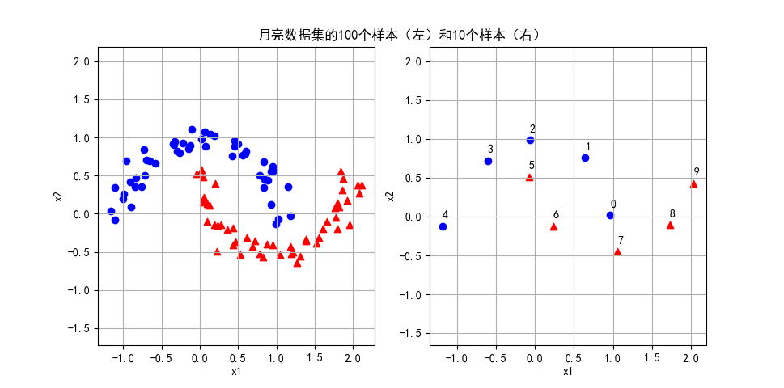
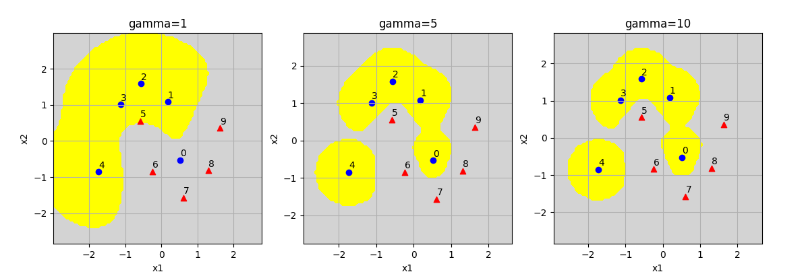
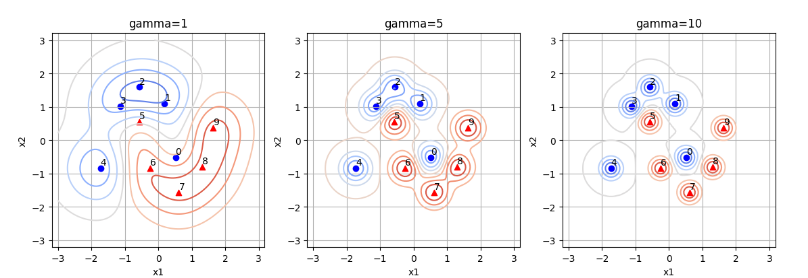
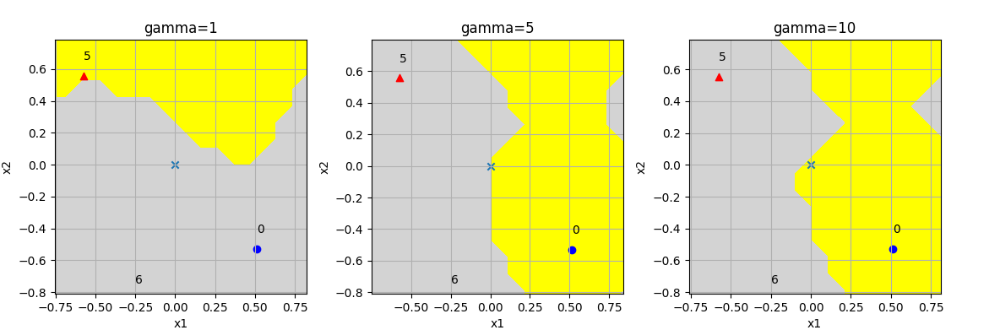

## 12.8 高斯核函数的理解

### 12.8.1 选取地标点的另外一种方法

我们用 sklearn 中的一个叫做 moon 的样本数据来做进一步的理解。



<center>图 12.8.1 </center>

在图 12.8.1 中，左子图有正负样本各 50 个，其中红色三角形为正类样本；右子图只取了处于关键位置的正负样本各 5 个，仍可以代表整个数据集的形状/轮廓。

上一小节中，我们发现地标的密度对样本分类的准确率有影响，直观上猜测，地标的数量应该和样本的数量在同一个水平上。那么如果我们不用规则的网格做地标，而是直接使用样本做地标，其效果如何呢？

我们以图 11.1.1 右子图中这 10 个样本为例，验证上面的想法。

1. 加载数据，首先做标准化（均值为 0，方差为 1）。

```python
    file_name = "Data_moon_10.csv"
    X_10, Y_10 = load_data(file_name, 10)

    ss = StandardScaler()
    X = ss.fit_transform(X_10)
```

2. 然后建立特征数据矩阵 K：

$$
K=
\begin{pmatrix}
e^{-\gamma\parallel x_0 - x_0 \parallel^2} & e^{-\gamma\parallel x_0 - x_1 \parallel^2} & \cdots & e^{-\gamma\parallel x_0 - x_{9} \parallel^2}
\\\\
e^{-\gamma\parallel x_1 - x_0 \parallel^2} & e^{-\gamma\parallel x_1 - x_1 \parallel^2} & \cdots & e^{-\gamma\parallel x_1 - x_{9} \parallel^2}
\\\\
\vdots & \vdots &  \ddots & \vdots
\\\\
e^{-\gamma\parallel x_9 - x_0 \parallel^2} & e^{-\gamma\parallel x_9 - x_1 \parallel^2} & \cdots & e^{-\gamma\parallel x_9 - x_9 \parallel^2}
\end{pmatrix}
\tag{12.8.1}
$$

矩阵 K 是一个方阵，行数和列数都等于样本数量。

代码如下：

```python
    gamma = 2
    X_new = Feature_matrix(X, X, gamma)
```
在Feature_matrix()中，第二个变量应该传入 Landmark 值，我们直接使用 X 代替。

实际的映射结果为：

```
映射结果：
[[1.    0.004 0.    0.    0.    0.009 0.255 0.112 0.243 0.017]
 [0.004 1.    0.2   0.033 0.    0.181 0.    0.    0.    0.005]
 [0.    0.2   1.    0.273 0.    0.119 0.    0.    0.    0.   ]
 [0.    0.033 0.273 1.    0.    0.361 0.    0.    0.    0.   ]
 [0.    0.    0.    0.    1.    0.001 0.013 0.    0.    0.   ]
 [0.009 0.181 0.119 0.361 0.001 1.    0.016 0.    0.    0.   ]
 [0.255 0.    0.    0.    0.013 0.016 1.    0.079 0.008 0.   ]
 [0.112 0.    0.    0.    0.    0.    0.079 1.    0.122 0.   ]
 [0.243 0.    0.    0.    0.    0.    0.008 0.122 1.    0.051]
 [0.017 0.005 0.    0.    0.    0.    0.    0.    0.051 1.   ]]
```

上述的特征矩阵值实际上是每个样本点与其它样本点的**相关性**，比如：

- 每个样本和自己的相关性为 1，处于对角线上。
- 0 号样本与 2、3、4 号样本的相关性为 0，因为距离太远了。

相关性值与正负类别无关，只与距离有关。

3. 仍然使用**线性 SVM 分类器**，验证新的特征矩阵是否可以线性可分。

```python
    # 尝试用线性 SVM 做分类    
    C = 2
    model, score = linear_svc(X_new, Y_10, C)
```

得到的打印输出如下：

```
权重: [[-1.161 -1.113 -0.653 -1.26  -1.11   1.052  1.126  0.82   1.033  0.878]]
支持向量个数: [5 5]
支持向量索引: [0 1 2 3 4 5 6 7 8 9]
支持向量 a*y: [[-2.    -1.392 -0.09  -1.912 -1.131  2.     1.549  0.755  1.371  0.85 ]]
准确率: 1.0
```

- 使用样本数据在训练好的模型上做预测的准确率为 1.0，表明分类正确。
- 所有的样本点都是支持向量，正负类各 5 个。
- 0、5 号样本的 $\alpha=2=C$，处于间隔边界线之内的软间隔范围内，因为它们距离对方的类别的样本距离较近，不容易被分离出来。
- 从权重值上看，2、7 号样本的权重值最低，$\alpha$ 值也最小，处于分类间隔边界线上，因为它们的作用可以被周围的 1、3 和 6、8 号样本所代替。

假设在二维坐标系上，这几个样本的相对位置示意图如图 12.8.2 的左子图所示。


<center>图 12.8.2 简化月亮数据集的分类结果</center>

绘制可视化分类结果如图 12.8.2 的右子图所示，可以看到最关键的 0 号样本和 5 号样本，都处于正确的分类区中。本图中的样本是经过标准化的，所以坐标范围与图 12.8.1 不同。

> 以上结果请运行 Code_12_8_Moon_Landmark.py 得到。

### 12.8.2 使用高斯核函数

透彻理解了高斯核函数的特征映射原理后，我们现在直接使用高斯核函数对月亮数据集做分类，而不需要先把数据处理成线性可分的。

加载只有 10 个样本的月亮数据集，先进行标准化处理，然后直接调用 SVM-RBF 函数：

```python
# 高斯核函数 SVM
def rbf_svc(X, Y, C, gamma):
    model = SVC(C=C, gamma=gamma, kernel='rbf')
    model.fit(X,Y)
    return model
```

其中参数 C=2，gamma=2，沿用了 12.8.1 小节中的参数值，便于对比结果。

然后，绘制两张图，一是原始样本点的高斯函数投影，一是区域分类结果：

```python
    # 显示高斯函数投影
    scope = [-3,3,100,-3,3,100]
    ax1 = fig.add_subplot(121)
    show_sample_gaussian(ax1, gamma, X, Y, scope)

    # 显示分类预测结果
    ax2 = fig.add_subplot(122)
    show_predication_result(ax2, model, X, Y, scope)
```
结果如图 12.8.3 所示。


<center>图 12.8.3 </center>

左子图是原始样本点为中心的高斯函数，其中 0、5 号“深入敌后”，势力范围与异类交织在一起；右子图是分类结果，与图 12.8.2 的结果相比较，除了分辨率不同，没有本质上的区别。

> 以上结果请运行 Code_12_8_Moon_Rbf.py 得到。

### 12.8.3 Gamma 参数的影响

当在 SVC 函数中选用 kernal='rbf'时，径向基函数（即高斯核函数），除了 C 值统一设置为 1 以外（在图 12.8.3 中，C=2），我们还需要设置的就是 gamma 参数：

```python
model = SVC(C=1, gamma=gamma, kernel='rbf')
```

回忆高斯核函数的定义：$K(\boldsymbol{x}_i,\boldsymbol{x}_j)=\exp(-\frac{\parallel \boldsymbol{x}_i-\boldsymbol{x}_j \parallel^2}{2 \sigma^2})=\exp (-\gamma \parallel \boldsymbol{x}_i-\boldsymbol{x}_j \parallel^2 )$。当 $\gamma$ 值越小时，相当于 $\sigma$ 值越大，函数形态越“宽扁”（图 11.9.1），即覆盖范围大，但是较矮。

1. gamma=1 时

    从图 12.8.4 的左子图（gamma=1）中可以看出，黄色区域的边界都是比较圆滑的，5 号样本处于负类区域的边缘，差一点儿就会产生分类误差，而 0 号样本已经被误分类了。可以从图 12.8.5 的对应位置的左子图看到等高线的形态：

    - 不论红（正类）蓝（负类），等高线都只有三圈，说明峰值比较矮。
    - 坡度比较舒缓，连贯性好，相当于“丘陵”地貌。



<center>图 12.8.4 </center>

2. gamma=5 时

    图 12.8.4 和 图 12.8.5 的中子图，分类可以保证100%正确了，等高线有 4 圈，比起 gamma=1 时要高，但是黄色区域覆盖面积小，形成了一座座独立的“山峰”，各个“山峰”之间还有些连接。只是 4 号样本由于距离“组织”较远，分类区域被割裂了。



<center>图 12.8.5 </center>

3. gamma=10 时

    图 12.8.4 和 图 12.8.5 的右子图，分类正确，每个样本点形成的“山峰”更加陡峭，程锥形，并且与其他“山峰”之间的连接不多，基本上是独立的，分类边缘比较锐利。

表 12.8.1 10个样本下的三种情况的总结

|gamma|准确率|支持向量数量|分类区域与边界|
|--|--|--|--|
|1|0.8|[5,5]|边界平滑，坡度舒缓|
|5|1.0|[5,5]|起伏明显，边界清晰|
|10|1.0|[5,5]|陡峭锐利，各自独立|


下面我们用 100 个样本的月亮数据集来测试一下分类效果，可视化结果如图 12.8.6 所示。


<center>图 12.8.6 </center>

在产生这 100 个样本时，我们设置 noise=0.3（最大值为 1）：

```python
X, Y = make_moons(n_samples=n_samples, noise=0.3, shuffle=False)
```
这样就会产生一些“深入敌后”的样本点，比如在第二象限有两个红色三角形正类样本混在了蓝色的负类样本之中。

我们依然使用不同的 gamma 值来试验高斯核函数的分类效果，总结在表 12.8.2 中。

表 12.8.2 样本数量较多时三种情况的总结

|gamma|准确率|支持向量数量|简单说明|
|--|--|--|--|
|1|0.92|[19,22]|由于样本噪音，准确率较低，分类边界平滑|
|10|0.94|[43,42]|提高了准确率，允许有噪音的存在，预测时鲁棒性较好|
|100|1.0|[49,49]|克服了样本噪音，准确率高，但是分类边界过于锐利，容易过拟合|

当 gamma=100 时，位于第二象限的两个红色样本，以及位于第四象限的两个蓝色样本，都被正确的分类了，这在某种程度上来说并非好事，而是过拟合，但也说明了高斯核函数的强大能力。

简单总结一下高斯核函数的特性：

1. $\gamma$ 缺省取值为特征数的倒数，比如一共有 4 维特征，则 $\gamma=0.25$。
2. $\gamma$ 隐含地决定了数据映射到特征空间后的作用，该参数值越大，特征值越多，支持向量越多，导致过拟合。
3. 作为径向基（Radial Basis Function）核，对于样本噪音有较好的抗干扰能力
4. 具体对于C（惩罚系数）：C越大，越容易过拟合，当然这是 SVM 算法中的通用特性。

> 以上结果请运行 Code_12_8_Moon_Rbf_Gamma.py 得到。

### 12.8.4 预测方法

预测一个点在已经分类完毕的模型中是正类还是负类的方法如式 12.8.2 所示：

$$
f(x)=sign \big ( \sum_{i=1}^n  a_i y_i e^{-\gamma ||x-x_i||^2} + b \big ) \tag{12.8.2}
$$

其中 $x$ 是被预测的矢量，$x_i$ 是模型所有的支持向量。式 12.8.2 实际上就是要分别计算被预测点到每个支持向量的核函数值再乘以 $a_iy_i$，对于所有支持向量累加结果值，最后再加上偏移量 $b$。如果是正数，不论大小，都判为正类，反之亦然。

图 12.8.7 展示了这种方法，假设图中的五个样本（三个红色正类样本，两个黑色负类样本）都是支持向量。这令我们想起了 K 紧邻算法，X 的类别由周围的支持向量共同决定。如图 12.8.7 这种情况，X 属于红色正类的可能性较大。


<center>图 12.8.7 </center>

对于具有 10 个样本的月亮数据集，我们想计算一下 $x_0$ (0,0) 点属于哪个类别。从图 12.8.8 可以看到，根据输入的参数 gamma 的不同，$x_0$ 分别有可能处于正类、边界、负类。如图 12.8.8 所示。



<center>图 12.8.8 </center>


SVC 函数的返回结果 model，具备了可以计算式 12.8.2 的所有属性，打印输出如下：

```
gamma = 1
支持向量个数 (model.n_support_): [5 5]
支持向量索引 (model.support_): [0 1 2 3 4 5 6 7 8 9]
支持向量 (model.support_vectors): 
[[ 0.514 -0.529]
 [ 0.181  1.087]
 [-0.563  1.588]
 [-1.125  1.01 ]
 [-1.729 -0.849]
 [-0.575  0.556]
 [-0.249 -0.845]
 [ 0.612 -1.569]
 [ 1.306 -0.813]
 [ 1.63   0.364]]
支持向量ay (model.dual_coef_): [[-1.    -1.    -0.454 -1.    -1.     1.     1.     0.655  0.897  0.903]]
偏移值 (model.intercept_): [0.07904587]
```
用上面的打印输出的数据带入式 12.8.2，由于 $x_0=(0,0)$，所以省去了计算 $||x_i-x_0||^2$ 的麻烦，而是直接计算 $||x_i||^2=x_{i,1}^2+x_{i,2}^2$：

$$
\begin{aligned}
f(x_0)&=sign \big [(-1·e^{-[0.514^2+(-0.529)^2]})+(-1·e^{-[0.181^2+1.087^2]})+(-0.454·e^{-[(-0.563)^2+1.588^2]})
\\\\
&+(-1·e^{-[(-1.125)^2+1.01^2]})+(-1·e^{-[(-1.729)^2+(-0.849)^2]})
\\\\
&+(1·e^{-[(-0.575)^2+0.556)2]})+(1·e^{-[(-0.249)^2+(-0.845)^2]})+(0.655·e^{-[0.621^2+(-1.569)^2]})
\\\\
&+(0.897·e^{-[1.306^2+(-0.813)^2]})+(0.903·e^{-[1.63^2+0.364^2]})+0.0790 \big ]
\\\\
&=sign(-0.5804-0.2969-0.0265-0.1017-0.0245+0.5274+0.4602+0.0380+0.0841+0.0555+0.0790)
\\\\
&=sign(0.2142)=1
\end{aligned}
\tag{12.8.3}
$$

为了手工计算方便，我们在上面只保留了 4 位小数。

编写符号函数括号内的代码如下：
```python
num = np.sum(model.n_support_)
sum = 0
for j in range(num):
    # a * y * exp(-gamma * ||x-x_i||**2)
    # 由于 x=(0,0)，所以简化为 ||x_i||**2
    sum += model.dual_coef_[0,j] * np.exp(-gamma[i] * np.linalg.norm(model.support_vectors_[j])**2)
# 最后加上偏移值
distance = sum + model.intercept_
```
上述代码被称为手工计算过程，结果为 0.21431864，与纯手工计算的 12.8.3 的结果 0.2142 基本一致。如果我们使用 model.decision_function() 判定函数可以得到同样的结果，说明该函数的实现方法就是式 12.8.2。

```python
# 判定函数 x_0=[0,0]
model.decision_function([[0,0]]
```
最后我们再用预测函数验证一下前面的计算，这个函数只返回 1 或 -1，没有具体的数值：
```python
# x_0=[0,0]
model.predict([[0,0]]))
```
三种计算的结果如下：
```
手工计算结果: [0.21431864]
判定函数结果: [0.21431864]
预测分类结果: [1.]
```
由于结果值大于 0，所以被符号函数判定为正类。

上述结果是当 gamma=1 时得到的，当 gamma=5 和 10 时，对于 $x_0$ 的分类归属计算结果如下：

```
gamma=5
手工计算结果: [0.009332]
判定函数结果: [0.009332]
预测分类结果: [1.]

gamma=10
手工计算结果: [-0.00137926]
判定函数结果: [-0.00137926]
预测分类结果: [-1.]
```
当 gamma=5 时，$x_0$ 点属于正类；当 gamma=10 时，$x_0$ 点属于负类。实际的数值计算结果在小数点后第三位才能体现出来，越是靠近分类边界的点，这种情况越明显（数值会越小，并且随着 gamma 值的变化会在 0 左右漂移）。

> 以上结果请运行 Code_12_8_Moon_Rbf_Inference.py 得到。

### 思考和练习

