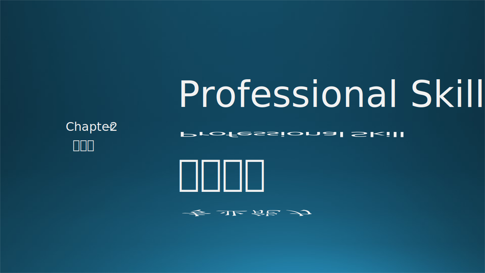
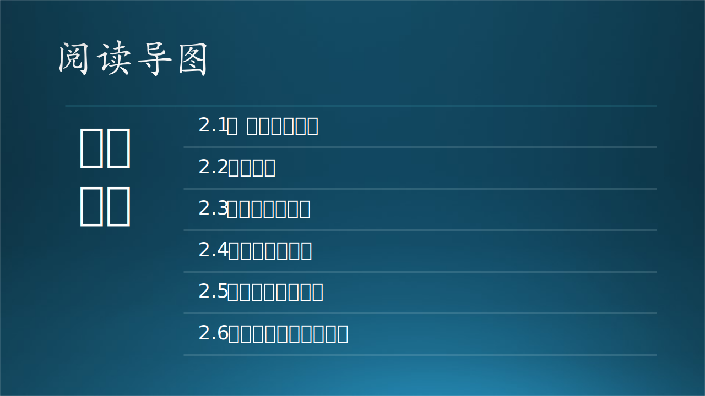

# 第二章 专业能力

本章仍然以木头在微软的（真实）面试故事开头，讲解微软对软件工程师的要求，进而引入做一名合格的软件工程师所需要的专业技术能力，如：算法（Algorithm）、代码（Coding skill）、建模（Design pattern）、设计（System design）、测试（Testing）等。在最后，还列出了软件工程师的常见误区。

本章将会就这几个专业能力展开讨论。

