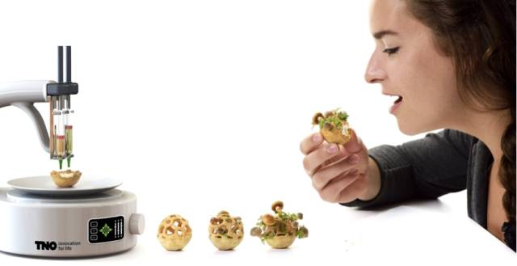
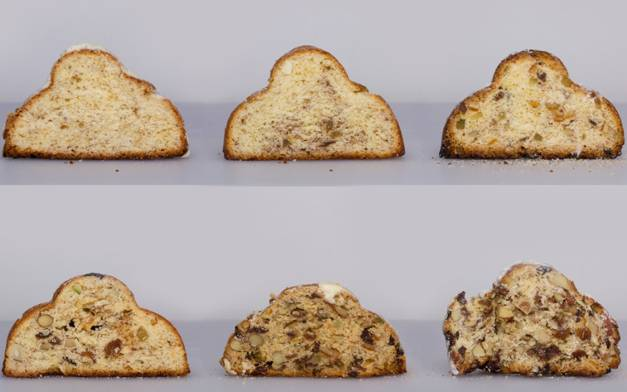
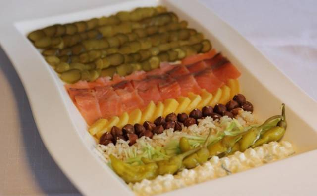
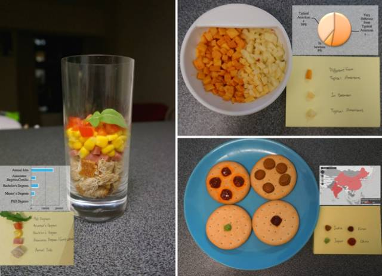
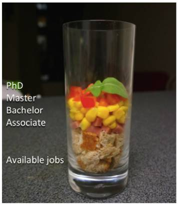
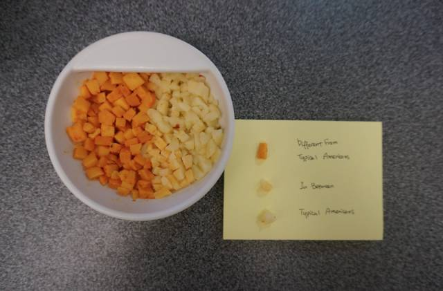
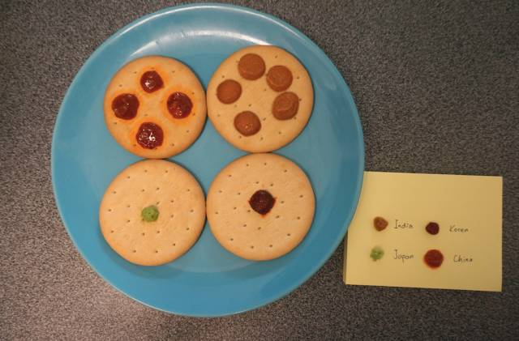
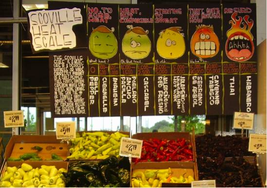
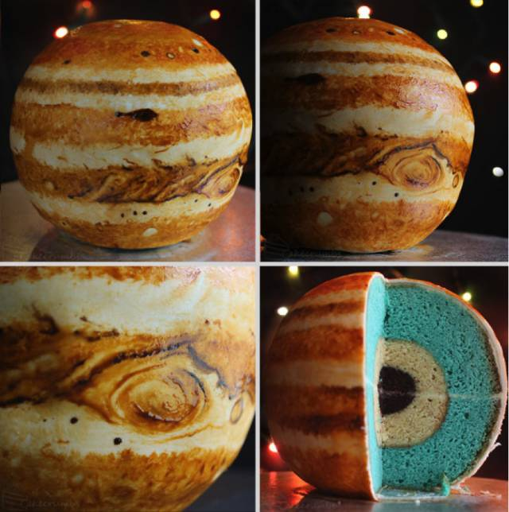
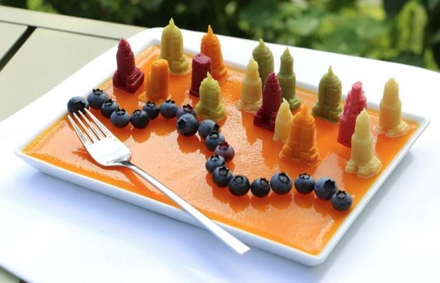

吃货的福音

是否有人想过，当我们拿到一份“奇怪”的数据汇总时，我们需要将它......放进嘴里？研究人员对传统的数据可视化技术进行了创新，创造出一种可以吃的数据。或许在未来，这种可食用的数据将会对人类认知数据的习惯产生重要的影响。或许有一天，你的经理会对你说，“小张，明天中午各地子公司的代表会来总部做这个月的汇总报告，你跟我一起去吧。当他们把麻辣小龙虾和芝士蛋糕端出来的时候，你可千万得拉住我......”

本小节摘录了来自微软亚洲研究院的一份有趣的研究报告，它描述了数据与食物的可比性，把“可视化”变成了“可食化”。

中文标题：数据可食化—用食物表示数据
原文标题：Data Edibilization:Representing Data with Food
作者：Yun Wang, Xiaojuan Ma, Qiong Luo, Huamin Qu.
原文链接: http://dl.acm.org/citation.cfm?id=2892570
主要作者简介：

王韵，微软亚洲研究院主管研究员，主要研究领域是人机交互、数据可视化、和人工智能。博士毕业于香港科技大学计算机科学与工程系，本科毕业于复旦大学软件学院，复旦大学大数据学院导师。其研究主要以增强人与数据的交互为目标——通过探索人工智能算法，人机协同的模式，和自然语言界面，提升人对数据的分析-理解-表达-创作的能力及效率。研究成果发表在 IEEE TVCG、IEEE VIS、ACM CHI、EuroVis 等顶级学术期刊和会议。担任 IEEE TVCG, ACM CHI, IEEE VIS 等顶级期刊与会议的审稿人。详细信息请访问：https://www.microsoft.com/en-us/research/people/wangyun/。

### 问题

在大数据时代的今天，我们每时每刻的行为数据都在被采集，收集，分析。数据分析让我们的世界变得更便捷，更智能，更美好。然而，对数据的研究往往止步于数据研究者科学家。作为数据的生产者，怎样才能更好地理解抽象而庞大的数据呢？

数据可视化是一个常用方法。通过将数据映射到简单的可视化图表，例如柱状图，树图，雷达图，平行坐标等等，人们可以更直观的理解数据的现状并预测未来的发展趋势。在此基础上，数据研究者专注于开发和研究更有效的映射技术与更完善的系统，进而分析更高维度，更复杂的数据。

然而我们作为数据的生产者，除了采用可视化图表的形式，是否有一个更有效的渠道，让数据的理解和分析，自然地融入我们的生活？除了通过看可视化图表来体会数据的面貌，我们是不是还有可能吃到，尝到，闻到数据？

### 方法

为了让理解抽象而庞大的数据变得更生动，我们的“数据可食化”通过使用各种可以吃的食物原材料，来烹饪一道道美味的数据菜肴。让品尝美食，这原本就足够诱人的行为，变成一个更有趣、更丰富的体验。

我们提出了两种制作数据美食的方法。一种数据美食来源于常见的菜肴本身，在此基础上对食物进行数据的映射，比如图中的果仁蛋糕，虽然外表形状相同，而其中干果的数量不同。当每只蛋糕中干果的数量与你的本月的收入或花费产生关联，一口咬下去，尝到的是满嘴蛋糕屑，还是满口果仁？它们都能客观地反映和理解这个月的你的生活状态。

另一种则是基于数据的特点，借鉴传统数据可视化来设计菜肴。比如可视化中的堆叠图，常常用来表示简单的数值数据。在此基础上设计的图中的意面，可以展现不同种类数据的比例。比如下图中，占了大面积的绿色的酸黄瓜，和略少面积的三文鱼，看起来是不是让人垂涎欲滴？这样的数据菜肴采用面积来，颜色，高度，来表示不同的类别，也是数据可视化领域中常用的方法，它能更精确地展现数据。

### 初期用户实验

为了研究用户怎样通过数据菜肴感知数据，我们设计了三种数据菜肴，并将它们与常见的数据可食化一起呈现对比。我们邀请了15位参与者来参与我们的“数据品尝”讨论会，对他们进行观察，采访，并邀请他们填写李克特7级量表，并进行定性定量的实验和分析。

#### 1. 数据色拉

第一个数据集是STEM专业每年不同学位者获得者的数量与工作机会的数量进行比较（数据来源于劳动统计局）。可视化的形式由柱形图表示。我们用一个田园色拉来表示该数据。在底部的面包屑对应于现有工作，咸火腿代表专科学位，甜玉米粒表示学士学位，切块番茄是硕士学位，芝麻菜象征的博士学位生。我们把这些材料按顺序叠置在透明的玻璃杯中，每种成分的量反映了数据值值。最终数据菜肴就像是一个还未混合的色拉。

#### 2. 芝士拼盘

这个数据集的可视化形式使用一个饼图来展示。我们使用的数据是亚裔美国人对自己的认知，饼图的比例表示他们认为自己与典型的美国人“非常不同”，“非常相似”，或是“在此之间”。这道数据菜肴的外观与饼图的可视化图表类似，用不同颜色和风味的芝士颗粒，来映射百分比。白色是“非常相似“，橙色表示”非常不同“，而黄色表示在此之间。 

#### 3. 蘸酱饼干

我们选用四个亚洲国家（中国、印度、日本、韩国）的农业就业率作为数据集。这个数据集的可视化和数据菜肴的呈现方式比较不同。我们用一个地理热力图的可视化来表示数据。而数据菜肴，我们则选用了四个国家最著名的蘸酱——用豆瓣酱表示中国，咖喱表示印度，芥末表示日本，泡菜辣酱表示韩国。在四块相同的饼干上放置不同的蘸酱，蘸酱的多少对应数据的大小。究竟对应了什么国家，就要靠我们的参与者亲口品尝。不同的蘸酱实际上是用口味和文化背景来暗示数据的类型。

### 实验分析

我们的参与者提供了许多有价值的反馈，我们总结了发现数据可食化的以下特点：

#### 1. 吸引力(Attractiveness)

食物是人类赖以生存的基本，因此食物对大多数人有自然地吸引力。尤其是当你饥肠辘辘的时候，是想盯着电脑里的柱状图报表，还是来点数据意面？一位参与者（P15）表示，虽然芝士拼盘看起来并不那么华丽，但是对还没有吃午餐的自己来说，还是非常的吸引注意。

#### 2. 感官上的丰富性(Sensory Richness)

与二维屏幕上的图标相比，数据菜肴有更多感官上的丰富性。不仅仅可以用外观，颜色，形状，大小，也可以用香味，味道，质地，甚至吃起来的声音来表达数据。当我们的参与者们看到了数据色拉，上面的一片叶子引发了他们的激烈探讨，究竟是为什么要用一片叶子来代表博士生的数量？一位勇士大胆地卖出了这一步，首先尝了尝，啊，原来这片生菜叶是苦的！大家这才恍然大悟。

#### 3. 更深的内涵(Intangible Richness)

除了感官上的丰富性，不同的食物也有不同的文化内涵。比如用不同酱料来表达不同的地域——看到老干妈豆瓣酱，大家自然地想到了中国。一位来自泰国的参与者（P11）表示，这些酱料都很有特色，不过如果我尝到了来自我们泰国的酱料，大概会觉得更有趣更有共鸣！

#### 4. 记忆(Memorability)

我们的实验参与者都表示，对比起可视化图表，通过食物来表达数据，可以让他们更好的记住数据。当数据菜肴呈现在你面前，飘来或浓或淡的香气，能激发大家的想象，也能让大家对数据的记忆更深刻。数据菜肴如用在教育业，可能会大幅度提高对儿童青少年的学习兴趣和对知识的记忆；如用于营销展览，也可能给人们留下深刻的印象。

#### 5. 感情性(Affectiveness)

过去的研究表明，食物本身具备一些表达感情的作用。总体而言，人们对食物有更多的正向的情感。而香味和味道，也自然地对应不同的情绪。比如，人们会称呼爱人为“甜心”，或用酸、甜、苦、辣来表示心情。另外，吃东西的动作也似乎有更深刻的内涵。我们的一个参与者（P8）想象，假如我吃下我的过去一学年的成绩数据，就好像能感觉到我在接受、理解和消化我过去或好或坏的成果，并且会吸收其中的营养，进而成长和更好地展望未来。

#### 6. 社交性(Sociability)

从东方到西方，饮食都是一个传统的社交方式。会议中的茶歇，恋人的约会，亲友的聚会，都离不开食物。数据可食化自然地将数据引入到了人们的社交生活中，成为大家社交生活中谈论的话题。参与者（P5）说：我们聚在一起，尝试着吃这些新奇的食物，猜测、讨论、甚至争论数据是怎么被显性或隐性表达，这真是一项充满乐趣的活动。

数据可食化的研究正在它的初期，我们实验中的案例和数据映射也较为简单，然而我们还是能想象到它广阔的应用场景，譬如娱乐，教育，健康等产业。同时，数据可食化也面临一些新的挑战，比如食物文化背景的差异，人与人敏感度的差异，食物保存和营养健康方面的考量等等。但是我们仍然相信，随着技术的发展，比如物联网，智能食物生产，大数据菜谱生成，3D食物打印，这些技术的不断成熟能帮助我们克服上述挑战，将生活中产生的数据和我们的生活本身更紧密地关联起来，让我们能更好地获取、理解和消化数据。未来的我们也许再也不用看着手机吃饭。而是一边吃饭，一边细细品尝，咀嚼，体会，探讨我们自己所生成的数据，以及用数据描绘的我们的世界。
