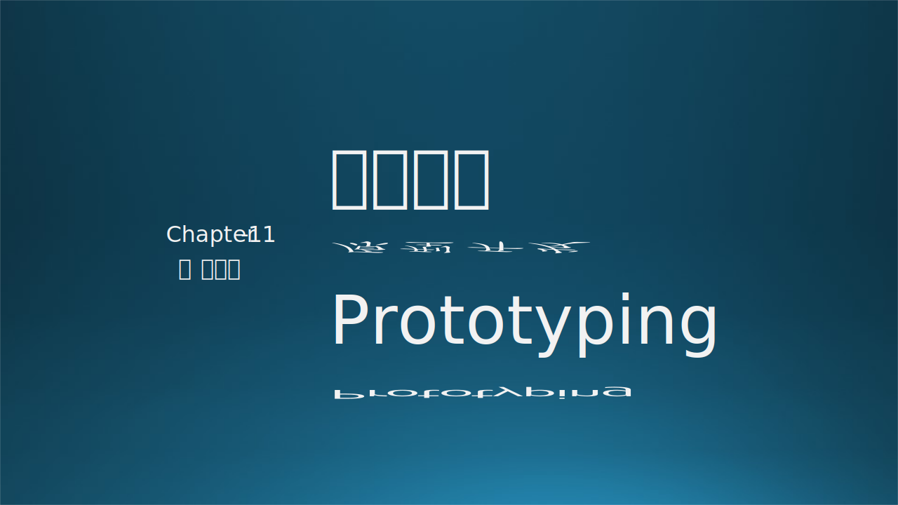
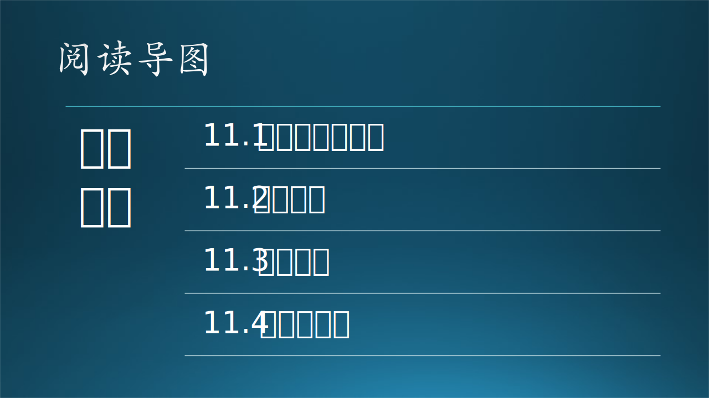

# 第十一章 原型开发

原型开发是需求与设计的中间阶段，经常被忽视。因为它既不属于需求，也不属于设计。那么它存在的意义是什么呢？

在本章中，木头还是会先讲一个 UWP 原型开发故事，进而引入原型开发的概念、目的。对于一个新产品来说，技术选型是原型开发的主要工作内容，而熟悉原型模型理论对于原型开发的深度和广度有重大的指导意义。

在原型开发结束后，我们才能正确估计一个系统的真实开发时间，制定合理的开发计划。

