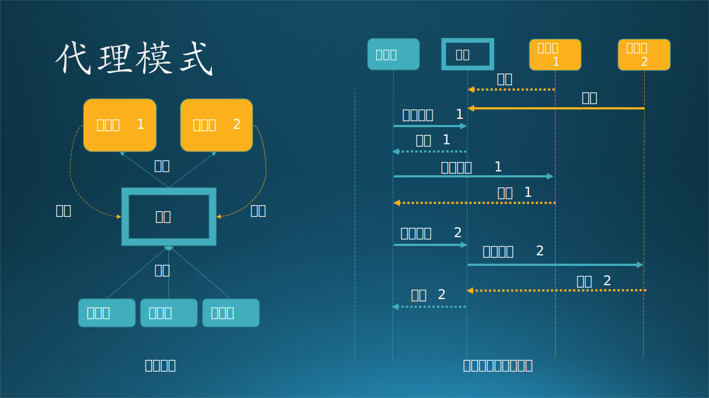
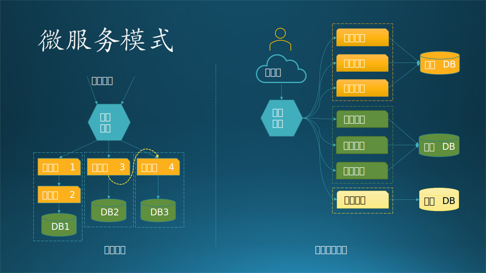
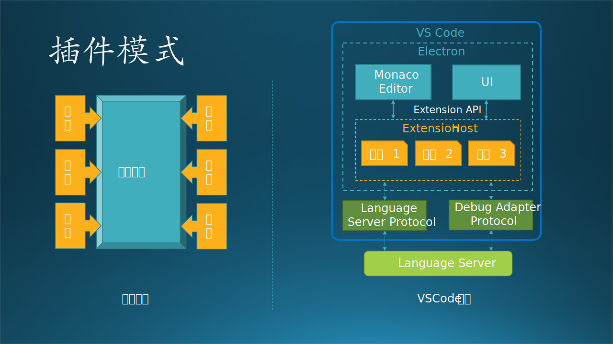

## 12.5 树形系统架构模式

树形系统是星形系统的一种扩展，在星形系统中，子节点只有一级，而且所有的子节点都是同类的。而树形系统中的下级节点可以是多级，并且各自都不同。树形系统可以理解为是具有分布式架构的系统。

### 12.5.1 代理模式 (Broker)

#### 1. 几种“代理”的区别

本小节中描述的代理都是具备 **A$\leftrightarrow$代理$\leftrightarrow$B 三个角色**的，其中，代理帮助 A 完成访问 B 的任务，但形式上有细微差别，见表 12-3 和图 12-12。

表 12-3 几种“代理”的区别

|英文|中文/性质|解释|比喻|
|-|-|-|-|
|Agent|自主性代理<br>独立主体<br>有独立决策能力|A 不知道 B 或 C 的存在。<br>代理接收到 A 的请求，自主决定访问 B 还是访问 C，然后把返回结果告诉 A。|各国驻联合国代表；<br>保险公司的代理代表<br>保险公司的利益|
|Broker|中介性代理<br>独立主体<br>无自主决策<br>能力|B 在代理注册，A 通过代理得知 B 的存在，但不知道如何访问 B。<br>A 发送请求给代理，代理把该请求变成 B 可以听懂的语言发送给 B 并获得结果返回给 A|股票经纪人；<br>保险代理代表客户的<br>利益；<br>各类专卖店|
|Proxy|透传性代理<br>非独立主体|A 知道 B 的存在，但不能直接访问 B。<br>代理把 A 的请求原封不动地传给 B，再把 B 的响应原封不动地回传给 A。|语言翻译；<br>代理服务器|

还有一种叫做 Delegate 即“委托性代理”的概念，它只涉及两个方面的角色，即委托人和被委托人，没有第三方，所以不符合本节中的“代理”概念。



图 12-12 代理模式

#### 2. 架构说明

在复杂系统中经常遇到的情况是，服务器可能暂时不能用，或者是有比以前更多的服务器可用，但是客户端并不知道。所有有必要增加一个中间代理来解决这个问题。见图 12-12。

该模式由三部分组成：

- 服务器，提供服务，并向代理注册，以便让客户端知道自己的调用方法或者访问位置。
- 代理，保持注册信息，当客户端的请求到达时，根据注册信息访问服务器，并把结果传回客户端。
- 客户端，向代理发出服务请求。

代理模式用于在结构化系统中对组件解耦。系统内各组件间采用远过程调用（remote service invocations）的方式交互。代理（Broker）组件充当组件间通讯的协调角色。服务器将其能力（服务以及特性）发布（注册）给代理，客户端均向代理请求服务，由代理将请求重定向到先前已发布过对应服务的服务器进行处理。

以上是 Broker（中介性代理）的典型行为。对于 Agent 和 Proxy 代理有一些例外情况：服务器不需要向代理注册，代理预先知道服务器的能力和访问地址。

对于 Broker 模式，客户端很可能存在一个 proxy API，客户端软件在本地调用这个 proxy API 提供的方法，这个 proxy API 负责访问远程的 Broker 或服务器来完成服务请求。这就简化了客户端的开发复杂度，通信过程由 proxy API 来完成。

#### 3. 应用场景

局域网中的计算机都没有公网的 IP 地址，所以必须通过代理服务器访问互联网上的任何主机。而通过代理即使能访问很多国内网站了，但是有些国外的网站无法访问，这样就必须通过一个特殊的网关去访问，也叫做代理。需要在客户端做配置，指明代理服务器的地址。

以上情况中，服务器只能知道代理的存在，而不知道真正的客户端是谁，这叫做正向代理。下面的情况正相反：请求来源很明确，但是不知道是哪个服务器来响应。比如 Nginx 服务器把客户端的请求按照一定的规则发送给后端的诸多服务器之一处理，而客户端不需要任何特殊配置。这叫做反向代理，它代理的是服务器端。负载均衡就是一种反向代理。

图 12-12 右侧的流程实例中，有两种方式：

初始化：

（1）服务器 1 向代理注册（也可能不需要注册，适用于 Agent 和 Proxy 模式）；
（2）服务器 2 向代理注册（适用于 Broker 模式）。


方式一（直连）：

（1）客户端发起请求 1；
（2）代理告诉客户端服务器 1 的地址；
（3）客户端直接发请求给服务器 1；
（4）服务器 1 返回结果 1 给客户端。

DNS 就属于第一种方式，但是并不是典型的代理模式。

方式二（转发）：

（1）客户端发起服务请求 2；
（2）代理把服务请求 2 转发给服务器 2；
（3）服务器 2 返回结果 2 给代理；
（4）代理把结果 2 转发给客户端。

这是典型的代理模式的行为。

#### 4. 优缺点

优点：
- 允许动态更改、添加、删除和重新定位服务，符合开闭原则。
- 在一定程度上降低了系统的耦合度。
- 可以增加额外的保护措施来做权限分级和保护服务器。

缺点：

- 要求对服务描述进行标准化，使用代理模式时则需要考虑异步处理机制、协议创建流程和错误环境控制，比较的繁琐。
- 可能会造成请求的处理速度变慢，甚至带来通信瓶颈。
- 实现代理模式需要额外的或重复的工作，不易开发。

### 12.5.2 微服务模式（Microservices）

#### 1. 架构说明

在多层架构模式中，一个应用程序的所有功能都运行在一个进程中，称作单体结构（Monolithic Architecture）。当业务增长使得应用逻辑变得复杂时，代码量骤增，其增加新功能、修改、维护的成本非常高，测试、部署所花的时间也很长。因此，人们想到了面向服务（Service Oriented）这个概念。**面向对象可以封装类，而面向服务可以封装业务逻辑。**

面向服务的架构中又可以分为两类，第一类是基于事件驱动模式的（基于数据协议的松耦合合作关系），第二个是基于 REST API 调用的，微服务模式属于第二种。

当将应用程序作为一组微服务编写时，实际上就是在编写可以协同工作的多个应用程序。其中每个微服务都有自己的职责，每个开发团队都可以独立于其他微服务进行开发。这些微服务之间唯一的依赖就是通信。当微服务彼此通信时，必须确保它们之间发送的消息能够向后兼容（因为微服务可以很快地升级）。



图 12-13 微服务模式

此架构拓扑中有三个部分，见图 12-13：

- 网关服务：负责鉴别服务请求，然后通过 REST API 调用对应的微服务。
- 微服务：具有很多种类的微服务，每个种类完成一个任务。当同时有很多请求到达时，可以临时创建微服务实例来应对。
- 数据库/存储：每个服务种类都有单独的数据库/存储。所以，在微服务和数据库外面画了一个虚线框，表示它们是紧密集成的。当然，有时候可以在两类微服务间共享数据库。

微服务之间可能存在调用关系，如图 12-13 拓扑结构中的黄色虚线所示，但是需要事先注册，以便可以互相发现。

#### 2. 应用场景

电子商务类的互联网应用非常适合用微服务架构模式，见图 12-13 右侧，是一个外卖网站的实例。

- 处于上方（橙色）的派送管理、餐馆管理、客户管理，都是基于静态信息的管理服务。
- 处于中间（绿色）的订单服务、餐馆服务、派送服务，都是以订单为中心的动态信息的业务服务。
- 最下方的计费服务是大家共用的服务。

另外，客户端软件也可以使用微服务模式，比如 Microsoft OneNotes 应用。该应用中集成了非常多的 Microsoft Office 办公套件的功能，可以自由展示各类文档，还能允许用户在上面随手写写画画。

各种文档格式之间没有多大关系，所以完全可以封装成一个个微服务，各自处理好文档的展示、编辑、保存等功能。总之就是一个文档的仓库。

#### 3. 微服务模式的最佳实践

【最佳实践：何时可以采用微服务模式】

满足以下条件时，可以考虑使用此模式：

- 响应需求变慢，需求开发时间变长。
- 交付的效率变差，bug 数越来越多。
- 业务复杂度变高，子系统达到 3 个或 3 个以上，或者模块达到 5 个或以上。
- 团队人数变多，开发至少有5人以上，运维至少2人。
- 项目需要长期迭代维护，至少一年以上。

但是在决定之前，还是要首先考虑单体模式，毕竟它比较成熟。

【最佳实践：如何拆分服务】

- 基于业务逻辑拆分
   根据团队规模划分业务模块的粒度。

- 基于可扩展拆分
   将系统中的业务模块按照稳定性排序，将已经成熟和改动不大的服务拆分为稳定服务，将经常变化和迭代的服务拆分为变动服务。

   稳定的服务粒度可以粗一些，即使逻辑上没有强关联的服务，也可以放在同一个子系统中

   不稳定的服务粒度可以细一些，但也不要太细，始终记住要控制服务的总数量。

- 基于可靠性拆分
   将系统中的业务模块按照优先级排序，将可靠性要求高的核心服务和可靠性要求低的非核心服务拆分开来，这样可以单独保证核心服务的高可用。

- 基于性能拆分
   类似基于可靠性拆分，基于性能拆分将性能要求高或者性能压力大的模块拆分出来，避免性能压力大的服务影响其他服务。

- 综合
   以上几种拆分方式不是多选一，而是可以根据实际情况自由排列组合。
   例如可以基于可靠性拆分出服务 A，基于性能拆分出服务 B，基于可扩展拆分出 C/D 两个服务，加上原有的服务 X，最后总共拆分出 5 个服务（A/B/C/D/X）。


#### 4. 优缺点

优点：

- 可以分别编写，维护和部署每个微服务
- 易于扩展，因为你可以仅扩展需要扩展的微服务
- 更新迭代应用程序的各个部分比较容易，因为它们较小，并且与其他部分的耦合较少
- 高度可维护和可测试–微服务模式满足快速频繁的开发和部署
- 更好的开发规模，更快的开发速度。
- 支持水平缩放和细粒度缩放。
- 小体量，较低了开发人员的认知复杂性。

缺点：

- 一旦部署就很难下线进行改动，所以会一直保留旧版本，那么就要一直向后兼容，增加开发负担。
- 当微服务数量很多时会带来管理困难。
- 复杂性从代码转移到基础设施。
- RPC 调用和网络通信的大量增加。
- 整个系统的安全性管理更具有挑战性。
- 整个系统的设计变得更加困难。
- 引入了分布式系统的复杂性。

### 12.5.3 插件模式（Plug-in）

#### 1. 架构说明

插件模式架构模式也称为微内核（Micro-Kernal）。这种模式允许你将其他应用程序功能作为插件添加到核心应用程序，从而提供可扩展性以及功能分离。

微内核架构模式由两种类型的架构组件组成：核心系统和插件模块。
- 核心系统仅包含使系统运行所需的最小功能。
- 插件模块，提供应用程序功能和自定义处理逻辑的可扩展性，灵活性和隔离性。

读者都熟悉我们日常使用的计算机系统，一般是由主板+CPU+内存+硬盘+键盘鼠标，即可完成基本任务，称作核心系统。在主板上有很多扩展槽，可以插上声卡，计算机便具有声音的输入输出功能；还可以插上 USB 设备，便具有该 USB 设备提供的功能。这些外设可以叫做插件。

更严格地说，硬盘、鼠标、键盘都不是核心系统，也算作插件。

见图 12-14。



图 12-14 插件模型

#### 2. 应用场景

很多允许第三方进行扩展的软件都设计成插件模式。这种插件，可以按功能设计，也可以都是同一个功能但是服务于不同类型的用户（因为应用场景不同）。

我们一起看一下 VSCode 组成结构，就是一个典型的插件模式，见图 12-14 右侧。

VSCode 是基于 Electron 构建的，主要由三部分构成：

- Electron，包括 Monaco Editor 和 UI，Extension Host。

   Monaco Editor 是一个基于网页的编辑器，可以进行高亮、悬停提示，导航到定义、自动补全、格式化等功能。

   VSCode 的主进程和插件进程是分开管理的，Extension Host 就是用来管理插件进程的。

   VSCode 中的大部分功能都是通过 Extension Host 来实现的。符合语言服务协议的插件对应的高亮等语言特性就会反映到 Monaco Editor 上。VSCode 默认集成了各种语言的插件。

- Language Server Protocol 和 Debug Adapter Protocol，语言服务协议Debug 适配协议。

   这两个协议主要是为了将编辑器和编程语言/调试服务的功能分离开，实现任何语言只要编写对应的语言服务即可。目前各大编辑器都已经支持了这个协议。

- Language Server
   外部的 Language Server 语言服务需要单独实现，就是各种编程语言（如 Java, Python, C#）和编辑语言（如 Markdown）的各种特性定义。

Extension Host 是用来确保插件：
- 不影响启动速度
- 不会减低 UI 响应速度
- 不会改变 UI 样式

因此保证 VSCode 的稳定和快速的密码就在于使用 Extension Host 将主进程和插件进程分开，使插件不会影响到 VSCode 主进程的性能和稳定。

在编写插件的时候 VSCode 可以让插件设置 Activation Events 来对插件懒加载。比如只有打开了 Markdown 文件才打开对应的插件。这样可以降低无谓的 CPU 和内存使用。


还有一种编程模式，常用于 Unix/Linux 的命令行模式中，如下伪代码片段：

```python
while(True):
   sleep(10)  # 休眠 10 毫秒
   event = check_event(device1)  # 检测事件
   if event is not None:
      process(event)  # 处理事件
   
   event = check_event(device2)  # 检测事件
   if event is not None:
      process(event)  # 处理事件
```

这是用一个 ```while(True)``` 写的“死循环”，它不断地检测每个设备上有没有新的事件到来，如果有，就进行相应的处理。为了不让 CPU 持续运转，在每次循环开始都要休眠 10 毫秒，否则 CPU 会被 100% 占用。

这种模式常用于通信场景中，因为通信板卡都是以事件的形式把各种通信事件发送给应用程序，比如响铃、摘机、按键、挂机等。而应用程序处理这些事件也是非常地迅速，向设备发送一个命令后，就可以异步地立刻返回而无需等待，基本可以在毫秒级返回。

对于不同的设备，采用轮询方式依次进行检测，通常这些设备之间是独立的，没有任何关系。

其实在 Windows 操作系统上的编程模式也是一个消息循环，这在 Win32 API 中非常典型，但是在后续的升级 API 中使用了事件、委托等方式，避免让程序员直接看到消息循环，提高了系统的安全性。

#### 3. 优缺点

优点：

- 极大的灵活性和可扩展性，能够快速响应不断变化的环境。
- 高性能，因为你可以自定义和简化应用程序以仅包括所需的那些功能。
- 良好的便携性， 且易于部署。
- 插件模块可以单独进行测试。

缺点：

- 核心系统的框架需要设计得非常鲁棒和巧妙。
- 对插件的控制需要特别地精细，预先设计好接口协议。
- 以上两点都造成这类架构模式不易实现，一旦实现后会出现很多意外的 bug，而且如果接口协议太复杂的话，没有第三方会使用这个系统。
