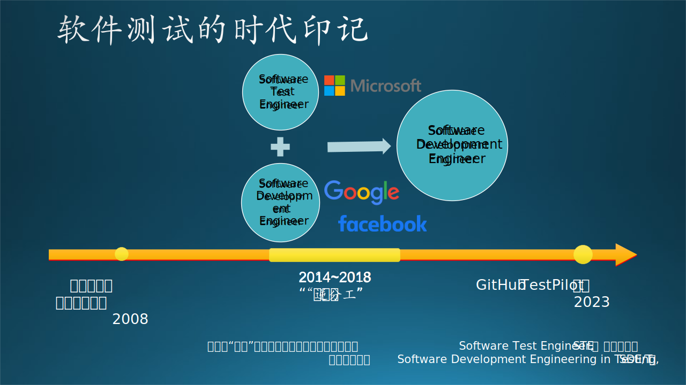
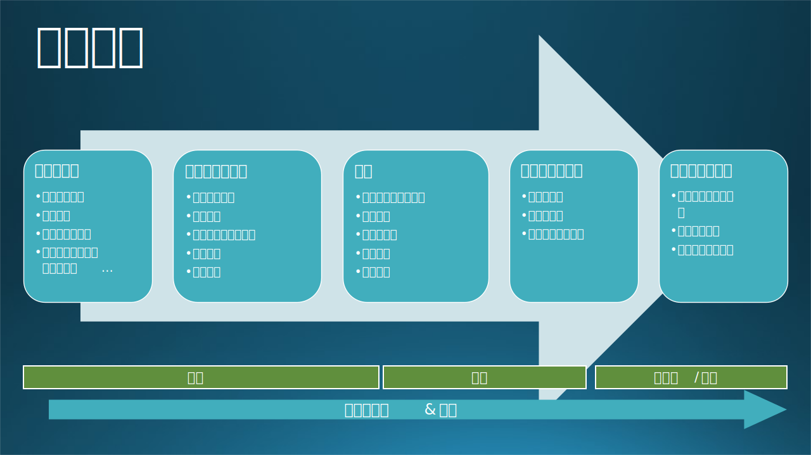

## 15.5 软件测试在微软

微软是毫无疑问的软件行业巨头，在全球有超过18万员工，很多产品线活跃用户数都是亿级别或者十亿级别，因此微软非常重视软件测试和软件质量保障，其在测试领域的实战和发展历程也十分有参考意义和代表意义。

### 15.5.1 发展历程

如果想了解微软是如何进行软件测试的，有一本书《微软的软件测试之道》（How We Test Software at Microsoft）是我们通过搜索引擎很容易定位到的。这是一本由前微软公司的测试专家Alan Page、Ken Johnston等于2008年合著、2009年翻译在国内出版的一本软件测试方面书籍。该书探讨了微软在软件测试领域的实践经验和方法，并分享了他们在微软测试团队所采用的测试策略和技术。《微软的软件测试之道》是一本重要的软件测试指南，对于想要了解和改进软件测试实践的人员来说具有很高的参考价值。然而这本书毕竟距现在“年代久远”，软件行业发展迅速，微软也在2010年后历经组织变革和业务战略调整。

实际上，微软曾经设立过SDET（Software Development Engineer in Test）这一职位，专门负责撰写测试代码、驱动工程自动化和建立质量控制系统，但在2015至2018年期间微软进行了多次组织架构和角色调整，逐步将SDET测试开发职位与SDE开发职位进行合并，逐步取消了SDET这一个头衔。

因此，为了促进更紧密的跨职能的团队合作，如今的微软已不再设立专门的SDET职位，而是将大部分测试工作融入到开发工程师的角色中。曾经在2008年，微软测试和开发人员的占比几乎是1:1；而今天，“纯粹”的测试工作一般由外包人力承担。专职测试人员在人数上相对于开发的少了很多（小于10%），主要负责手工测试、增量验证、探索测试等测试内容的执行，在微软内部仍然扮演着重要角色。

这当然不意味着微软不重视测试和质量方面的工作，《微软的软件测试之道》一书的作者也在这些变革发生后，表达了自己的看法：这一变革突出了对于用户需求和团队成员技能多样性的重视，通过融合提升团队敏捷性，让软件工程师的技能更全面，从而更灵活、更能适应变化。微软依然保留了Software Quality Engineering这一专业化分工（人员占比小，同时Quality也比Testing的责任范围更大："Software Quality Engineering"，软件质量工程，是一个更广泛的领域，它涵盖了软件开发和测试过程中的质量保证、质量控制和质量改进等方面），负责确保软件的质量和稳定性。

这种“逆分工”的变化趋势并非微软独有，Google和Facebook也在同一时期完成了类似的转变。这一变化，一方面明确了开发团队应该同时负责和推动自动化测试的搭建，提高效率，并为质量负责；另一方面，也反映了软件开发流程和商业模式的演化。早期互联网基础设施并不发达的时候，软件通过软盘、光盘等实体介质分发销售、拷贝，所以软件分发、更新的灵活性都比较差，软件如果无法在分布前充分测试导致遗漏严重的Bug、漏洞一起刻入发行版光盘中，可能会造成非常难以处理的线上事故，造成“覆水难收”的困局，直接攸关软件的成败和生死。所以软件交付需要极高的计划性和严格的质量把控，投入大量软件测试。

然而，随着互联网的迅速发展，以下几点变化，是这一融合的重要背景：
1. 软件分发基础设施的完善：软件产品、各类应用通过网络分发、“打补丁”的成本在逐步降低，且发布平台、分发渠道也变得越发完善。
2. 用户数据收集渠道的完善：收集线上用户反馈和诊断数据的渠道越来越通畅和多元：期初可能以邮件沟通为主，用户使用软件遇到问题就通过邮件联系开发团队；后来，各种应用内问题反馈，第三方的反馈平台、诊断数据平台、灰度测试平台、实验控制平台，使得软件团队可以“分包”一部分测试给愿意承担更大风险、提前尝鲜的内测（Alpha/Beta）用户，更早地以更小的代价发现软件问题并着手修复。
3. DevOps持续集成系统的完善：CI/CD系统（例如微软的Azure DevOps）可以很容易地将各种类型的自动化测试嵌入到软件研发流程中，成为整个工作流的一部分自动触发。

总之，这种趋势和整个软件工程基础设施的升级密不可分，同时也蕴含了对软件工程人才综合能力的更高要求。软件工程师团队需要应用各种手段、更强大的工程能力高效地交付高质量的产品。通过将测试技能融入开发过程中，微软希望工程师团队能够综合参与和统筹需求分析、流程架构设计和编码，更好地理解软件系统和功能，进而更好地设计测试和质量保障方案。此外，这种整合也寄希望于加强开发团队对自己开发的软件产品质量的责任感，加强团队协作。

> 咬文嚼字的讲，“程序员”的主要活动应该是写产品代码，“测试人员”则负责执行测试任务，所有参与软件交付的人员都是“开发人员”。然而在一个敏捷团队中，每一个成员都应关注于交付具有业务价值的高质量产品。软件开发工程师SDE应该跳出框架去思考，着眼于整个产品和产品的生产流水线。

### 15.5.2 微软的测试实践

在上文中提到的团队整合的大背景下，微软内部的软件测试实践在各个产品团队的工程师（Software Development Engineer，SDE）们的主导下，呈现出百花齐放的态势：不同产品研发团队各自有自己的测试实践方案。因此很难说微软目前在测试上有一套统一标准的流程，或者说有具体的最佳实践。处于不同成熟度阶段的产品、或不同的技术栈、前端或后端、不同的商业模式（2B或2C），采取的测试策略、模式和目标都不尽相同。不过，微软各个团队在工程师主导、敏捷开发、持续集成等理念上具备共识基础，也最大程度上在复用同一套基础设施，在软件测试采用了很多共性的策略和方法，以下是一些比较常见的实践。

#### 1. 持续集成和敏捷测试

微软绝大部分产品研发团队都在Azure DevOps或GitHub平台上进行开发、验证集成和发布。Azure DevOps（简称ADO）平台内置支持的敏捷开发方法，可以方便地实现持续集成和持续交付流程。这意味着软件的功能和改进会定期地集成到主干代码中，自动在代理机器（Build Agent，通常为连接至平台流水线的物理或虚拟机器）上完成构建，并自动化触发测试流程来进行验证。很多团队还会使用Azure DevOps中的测试计划功能来创建和管理测试计划（Test Plan）、测试套件（Test Suite）和测试用例（Test Case）。Azure Test Plans一般用于组织手动测试的信息和记录执行，定制测试需求、跟踪测试进度和与其他团队分享测试用例；也可用于自动化测试。

Azure DevOps中的“Pipeline”，构建任务流水线，是CI持续集成和CD持续部署的核心组织单元，可以帮助团队串联开发构建任务，实现测试的集成和自动执行。这点和Jenkins、Travis CI等持续集成系统很相似，不过ADO的功能更丰富、更灵活易用。ADO和GitHub也可以无缝集成，是一个综合性、完整度很高的DevOps开发系统，几乎可以覆盖从软件计划到发版的全流程，广泛地被微软各个团队采用

在代码提交或者创建Pull Request后，Azure DevOps可以自动触发“Pipeline”运行，我们可以在其中内嵌软件测试任务，自动运行包括单元测试、集成测试和其他自动化测试。有了这样的平台之后，我们可以灵活的选择在各个关键环节插入合适的测试流程，来让代码改动可能引入的不同程度的问题适时暴露，从而时刻“拱卫”软件质量。

> 这里有几个问题：一般有哪些关键环节？什么叫“合适”的测试流程？如何理解“不同程度的问题”？又何谓“适时”暴露？这是几个层层递进的问题，涉及到软件开发中质量、效率和成本之间的平衡，我们将在下一个章节“高效测试”深入探讨。

在一次常规的开发、发版流程中（不考虑存在紧急热修复hotfix、A/B testing、或商务合作内测），自动或手工测试可以介入验证的几个关键的时间点包括：

1. 开发人员创建Pull request之前进行本地编译和测试验证。
2. 创建Pull request之后，代码合入开发代码主干之前。
3. 代码合入主干之后，或主干上签入了新的改动之后。
4. 在主干分支进行定期测试验证，比如每小时一次或者每天两次。
5. 从开发主干签出发版节点之后。
6. 发版版本构建完成后，部署到内测环境之前。
7. 发版版本部署到内测环境之后，部署到生产环境之前。
8. 在生产环境发布之后，进行回归测试和持续监控。

至于具体如何选择时机，和执行什么程度的测试，可以考虑如下的原则：

1. 测试覆盖率：较早的测试时间点可以在问题进入主干前发现和解决，但由于频次高、效率成本高，无法覆盖所有功能和路径。较晚的测试时间点频次更低，可以进行更全面的测试，包括集成测试和端到端测试。
2. 问题修复成本：较早的测试时间点发现的问题修复成本较低，因为问题可能较小且影响范围有限。较晚的测试时间点发现的问题可能会很难排查、对整个产品计划造成较大的影响，修复成本更高。
3. 发布进度和风险：较早的测试时间点可以尽早发现问题并提前解决，有助于确保发布进度。较晚的测试时间点可以降低发布到生产环境中出现问题的风险。
4. 团队协作和沟通：早期的测试时间点需要开发人员和测试人员之间更密切的协作和沟通，确保及时修复问题。较晚的测试时间点可能需要更多的测试资源和时间，以进行全面的测试。
5. 整体质量控制：结合多个时间点的测试可以提高整体质量控制的效果。早期的测试时间点可以发现和解决明显的问题，较晚的测试时间点可以验证整体系统的稳定性和一致性。

综合考虑上述因素，微软研发团队里的常见的实践是把他们结合起来：早期的测试时间点（相对高频次）侧重于单元测试、集成测试和代码审查，以尽早发现和解决问题。较晚的测试时间点（相对低频次）侧重于系统测试、端到端测试和用户验收测试，以验证整体系统的质量和功能。这样可以兼顾质量控制的全面性和有效性。

通过提供全面的功能和集成，Azure DevOps将敏捷测试流程“集约化”，提高了协作效率。它支持手动和自动化测试，团队可以利用Azure DevOps的各项功能来实现软件测试的自动化、跟踪、协作和报告。并帮助高效交付高质量的软件，因而在微软内部广泛采用。

#### 2. 自动化测试

微软非常注重自动化测试，由于专职的测试人员比例逐步降低，且多通过外包团队执行（有可能开发团队和外包团队不在同一个国度），反向“倒逼”研发团队充分利用各种测试框架和工具来执行自动化测试来保证产品质量。自动化测试当然好处多多，可以提高测试效率、减少人为错误。如上文提到，微软的开发团队可以使用Azure DevOps中的自动化测试功能来运行和管理自动化测试用例。

奉行测试金字塔的原则，研发团队实施自动化测试会针对不同层次、不同阶段地执行包括单元测试、集成测试、系统测试和用户界面测试等进行综合验证。Azure DevOps（以下简称ADO）平台的pipeline可以在物理机、虚拟机或基于云测试的代理容器上配置测试环境，执行基于Selenium、Appium、NUnit、MSTest、playwright和Visual Studio Test Professional等各类测试任务。ADO通过插件平台“Visual Studio Marketplace”提供了广泛的第一方和第三方的各类Pipeline任务插件，实现第三方测试工具和服务集成。Pipeline运行的代理Agent也支持灵活的配置、镜像复用，为测试环境创建和管理资源、配置环境参数、部署应用程序和数据库等提供方便。通过ADO的内置的测试环境管理，开发团队可以更好地控制和管理测试环境、配置测试环境变量和测试数据集，以确保一致性和可重复性的测试和其在受控且可重复的环境中进行。

微软内部基于其在GitHub上的开源方案 Hydra Lab 搭建的内部云测试服务，就实现了物理设备上云，全球共享测试资源。Hydra Lab也提供了ADO插件，在ADO平台上可以方便地为流水线集成测试定义和部署任务，完成和持续集成系统的无缝兼容。除了测试运行本身的自动化之外，利用Azure DevOps平台，微软的开发工程师们还会力争在如下两个测试结束后的环节完成自动化：

- [测试结果展现和分析自动化]：构建流水线运行测试的自动化测试的结果将在任务结果页呈现，为开发人员提供即时反馈。测试结果、覆盖率、缺陷趋势等关键指标可以通过Azure DevOps的仪表板和报表进行展示和共享。Azure DevOps还提供错误分析、趋势可视化等功能，以深入方便开发团队了解的测试活动。
- [缺陷管理和跟踪自动化]：Azure DevOps支持缺陷（Bug）和开发任务（Work Item）管理：当测试结果出现问题的时候，平台可以配置自动创建Bug开来捕获、跟踪测试中反映出的问题。测试人员或开发者可以将其与相关的测试用例和测试结果关联起来，实现缺陷和相关测试之间的追溯。

关于自动化测试在微软的更多实践，我们将在下一个章节“高效测试”进行更深入的探讨和案例呈现，这里主要想给读者一个概要性的认知，微软一直在依托平台建设和测试基础设施的完善，来努力推进全流程的自动化，并且已经取得显著成效。这也包括引入AI、LLM、图像识别等技术来使自动化测试进一步智能化。自动化测试可能短期无法完全替代手工测试（Manual Test），但未来的软件测试一定是想着更高效、更自动、更智能的方向发展的。

#### 3. 自测、内测和用户反馈

当一个公司的工测试人员来越少时，我们可以通过测试“众包”的方法，首先让开发团队、公司员工广泛的参与到软件产品自测活动当中，“公司员工自己应该是自己产品的第一批小白鼠”，其次，建立内部测试用户，Alpha/Beta用户，群助我们试用和测试早期版本，发现问题。内测用户群，通常愿意更早的体验新功能。对风险有更高的接受度。这种方法相当于把内部的手工测试的力转嫁转移给了公司内部员工。内测用户的身上。，只要我们能够建立有效的用户反馈渠道。收集他们在测试体验中的问题，就可以很大程度上提高发现软件缺陷的效率。

在一个团队的集中于测试的资源变得越来越少的情况下，我们可以先采用内部"众包"的方法来解决测试验证软件质量的问题。这是提高测试效率的另一个思路：找到一群愿意“免费”承担风险、帮忙测试和验证产品新功能的群体。具体而言，这样的群体大概有这么几波人：
1. 开发团队本身；
2. 公司同事；
3. 该软件用户中的“发烧友”，通常也叫Alpha/Beta用户。

微软内部一般一个完整的产品团队都能达到百人规模，而全公司员工有近20万人。所以对于微软而言，如果妥善经营，第一波和第二波群体是庞大的，而且公司内部同事之间的沟通渠道是非常顺畅的。我们可以建立一定的渠道和技术，提升产品在公司内部的知名度，让开发团队和公司员工们广泛参与到软件产品的自测活动中。从立场上讲，每个产品开发成员都应该成为自己产品的第一批“小白鼠”，此乃“分内之事”；而公司内部的员工资源，则是“近水楼台”，可能也关心和乐意试用公司内部的其他产品，可以进一步帮忙扩大测试的覆盖范围和深度。其次，建立内部测试用户群，包括Alpha/Beta用户，他们将在早期版本中试用和测试软件，并帮助我们发现潜在问题。这些内测用户通常对新功能有更高的兴趣和接受度，他们愿意成为早期采用者并提供反馈。通过建立这样的用户群，我们可以将一部分手工测试的工作转移到公司内部的员工身上，他们将成为测试团队的延伸。

从本质上讲，专业的黑盒测试、探索性测试都是在通过不同的视角验证产品，这种“视角”本身蕴含着巨大的价值。开发人员对自己开发的产品、功能往往缺失“外部视角”。“众包”测试的妙处在于，通过相对安全的“人海战术”提供了多样化的视角，“多线程”地去探索软件的“逻辑黑盒”，找到和暴露问题。同时，也提升了产品和新功能在开发人员、公司同事、内测用户群范围内的知名度，是一个一举多得的聪明的办法，在微软内部非常常见。笔者在微软经常收到Microsoft Teams、Office等团队发来的内测邀请邮件，发现有趣的产品就试一试，如果正巧发现了问题就跑到Windows Feedback Hub或者内部的Yammer、Teams Channel上吼一声。

这种方法的关键前提是要建立一定的有效用户反馈渠道。通过收集内测用户在测试过程中的问题、诊断信息和建议，我们可以更快地发现软件缺陷并着手修复。很多国内的互联网企业，在推出新功能之前，向长期维护的Alpha/Beta内测用户QQ群发出测试邀请，并实时在群里沟通问题，只要合规合法，这种沟通渠道能带来意想不到的收益，确保了新功能的稳定性和用户满意度。

当然，为了确保这种"众包"的有效性和高效性，还有一些技巧和注意事项需要考虑：

1. 提供清晰的测试指导：特别是针对开发团队自测的情况，有的时候测试需要一定的环境配置，为了确保测试参与者能够执行准确和一致的测试，明确定义被测试的软件产品功能、目标和范围，包括确定要测试的功能、预期的测试结果和所需的测试资源，提供清晰的测试指导可以帮助团队在真实的环境中进行测试。测试指导也可以包括如一定的测试用例、测试步骤和相应的预期结果等。
2. 注重用户体验和反馈：测试"众包"不仅仅是为了发现软件缺陷，也是为了提供更好的用户体验。因此，鼓励测试参与者从用户角度出发，关注软件的易用性、界面设计和功能完整性等方面。虚心收集用户各方面的反馈和建议，并视情况采纳为改进软件的重要依据，让反馈掷地有声，也是增进社区和自测团队的积极性的好办法。
3. 建立沟通和反馈渠道：建立一个开放和透明的沟通渠道，使测试参与者可以随时提问、报告问题或分享意见。这可以通过电子邮件、聊天工具、在线论坛或定期会议等方式实现。
4. 激励参与和奖励机制：为了鼓励测试参与者积极参与测试活动，可以考虑设立一定的激励和奖励机制。例如，给予发现bug最多的同学“捉虫达人”的称号，并提供一定的礼品测试参与者奖励或奖金，或在公司内部设立测试竞赛和排名等。这将提高测试参与者的积极性和参与度。

在微软，测试内部“众包”活动一般被叫做"Bug Bash"，在很多产品团队广泛采用。通过充分利用公司内部的资源和智慧，建立提供清晰的测试指导、大家实时沟通交流，激励参与和奖励测试参与者，加强了大家对内部产品的了解和团队间的联系，有的时候还会有“吐槽大会”的效果，十分有趣也很有意义。当然，测试"众包"并不能取代专业测试团队，而是一种补充和增强的方式。专业测试人员负责既定测试策略的制定执行、高级测试技术的应用和质量控制的监督。通过合理结合专业测试和内部众包测试，可以实现更全面、高效和质量的软件测试。

#### 4. 安全、无障碍和合规测试

微软作为一家体量巨大、服务众多个人和企业主体用户的软件服务提供商，保护用户隐私、数据安全，重视产品体验的无障碍，既是企业文化和道德的体现，也是商业责任的一部分，并在这些领域投入了大量的资源和实践。

1) 无障碍测试

为了让微软的软件产品和服务对于所有人群都更易用，微软遵循了 W3C (万维网联盟) 制定的 WCAG (网络内容无障碍指南)，在全公司内提供了无障碍测试的基础设施、工具和流程机制，来确保产品在视觉、听觉和运动方面都能提供良好的用户体验。微软开发了 Accessibility Insights、Accessibility Developer Tools、Accessibility Testing Services等工具，内部还会建立评价体系，鼓励各个产品达到金牌标准。笔者的团队产品每次在评比中获得无障碍金牌评级，都要为此小小的庆贺了一番。

2) 合规测试

微软软件开发中的合规（Compliance）一般包括安全和数据隐私保护两个方面，首先要确保软件产品和服务符合各国家地区适用的数据隐私、儿童保护等相关法律、法规和行业标准，比如 GDPR (通用数据保护条例)、PIPL等。可以说，很多法律条款的要求，也是对产品需求的直接要求，可以转化为测试用例。比如PIPL要求“用户给予数据授权之前，应用程序不应有任何网络通信行为”，就提供里比较明确的软件行为预期，形成测试用例。安全方面，微软使用了一套名为 SDL (Security Development Lifecycle) 的流程，并提供了内置在ADO持续集成系统的工具（如静态代码分析、构建依赖扫描）和资源（如安全培训课程体系），将软件安全的要求和检验渗透到软件开发的各个阶段：需求分析、设计、实现、验证、发布和响应（监控），从而确保每个阶段都有相应的安全活动和最佳实践。从软件测试的角度看，微软很多团队都会实施渗透测试、漏洞分析、网络扫描服务、安全审计等：有的团队是内部通过自动化测试完成，有的则聘请外部的专业公司完成。

通过这些实践，微软可以提供更安全、可访问、隐私保护和合规的产品和服务，面向全球用户提供专业的软件产品。

以上只是微软在软件测试方面的一些常见做法，实际上微软内部不同团队、不同产品有着多样化的确保产品的质量和用户体验的方法。下一章我们将讨论如何“高效测试”，将有机会进行更多探究。
