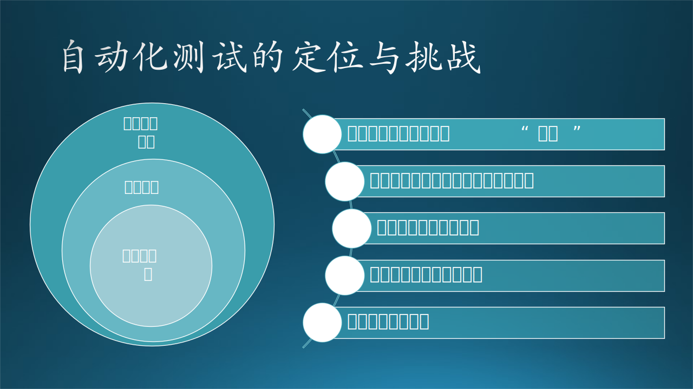

## 16.1 一场关于自动化测试的大讨论

最近一次组织调整后，木头所在的团队负责了一款新的产品的开发，叫“Phone Link”和“Link to Windows”，这是一款微软推出的手机和PC协同体验的跨平台应用，方便用户在Windows上可以直接享用手机上的数据和功能，实现跨屏互联。

### 16.1.1 让测试“自动"起来

星期一的组织站会上，木头的同事小陈接到“神圣使命”，请他负责给该应用搭建自动化测试系统。小陈犯了老大难，跑到木头的工位前来吐槽。

“咱们这个软件太特殊了，需要电脑和手机配对后，放一块用，才能用起来。比如要在Windows的Phone Link上打开手机屏幕，先得拿出手机扫码和电脑配对，然后再到电脑上打开手机屏幕。一个测试用例要来回操作，这个要搞成端到端的自动化，可有点麻烦。”小陈眉头紧皱，一边琢磨一边问。

木头点了点头，表示理解。“的确，咱们这个软件系统，涉及到跨系统跨设备，可测试性上有些挑战。”

小陈叹了口气，然后继续说：“而且呢，对这种复杂场景进行自动化测试，估计本身就会有很多的麻烦和不稳定的情况，我刚刚写了个python脚本试图去驱动，跑了三次，都是一些脚本和驱动层面的奇奇怪怪的错误。这东西能自动化测试当然好，可以提高效率和质量，眼下没有靠谱的方案，要不咱们还是手工测试吧，更可靠一些。”

旁边的老张本来一直在敲键盘疯狂输出，这会儿听见聊得有趣，主动加入进来：“凭我十年工程经验观察，你这活不好干。”小陈心想：“这还用你说。”

“BUT！你首先要明白，自动化测试，Test Automation，就是让测试自动起来，可不只是UI自动化测试。你刚刚讲的端到端测试，其实是在讲UI测试的自动化。领导让你搞的是自动化测试，没限定在UI测试，对吧？”老张讲的兴致勃勃。

小陈若有所悟，说道：“嗯，张哥说的有道理。我的思路确实应该打开。不过，打开了思路，又有点不知道具体要干什么了...”

“可能要从现在的产品开发测试的实际情况出发，从需求出发，把当前没有自动化的测试变成自动的，你看看现在大家是怎么跑单元测试的，是不是自动化的，再看看咱们测试团队现在手里有什么手动测试用例；另外有没有聚焦在软件性能上的测试，是否可以自动化，等等。”老张边想边说：“后端有没有API测试，压力测试的用例，没自动的都让它自动运行起来。”

木头接起话茬，说道：“还别说，老张思路很赞啊，这么脚踏实地一想，还是有很多事情可以做。”

“好像单元测试已经自动化在跑了，目前单元测试不通过的代码修改是无法合入到主分支的。后端的API测试我还不太熟悉。性能测试可能也要基于一些用户场景吧。感觉还是需要从UI测试的自动化方案上突破。”小陈又把问题拉了回来。

老张说：“我能理解你的想法，不过还是有很多方案值得一试，不一定一开始就直接搞手机和PC端到端的UI测试。单一端的冒烟测试或者集成测试和一些针对典型安全问题的漏洞扫描测试，都可以探索。”

木头看到小陈的眉头越皱越紧，心知老张给的选项有点太多了，微微一思忖，说道：“其实端到端的自动化测试，也可以搞，我之前有朋友搞过，跨平台的自动化测试方案也有的，好像叫Appium，听说是封装了统一的接口，可以兼顾浏览器、Windows、iOS、Android的UI测试。”

小陈的眼神终于闪过一丝光彩：“你说的测试框架叫什么？Appium是么，我去学习一下。”

木头继续说：“是的。老张说的很有道理，你如果使用这个框架，可能也是从冒烟测试、简单的用户场景开始做起，一步步把自动化体系搭建起来。”

老张也发表总结陈词：“没错，小陈你一步步来，这个事情不好做，但是大有可为。可能也要考虑考虑，领导让我们做自动化测试，无非是为了提高测试效率，并且通过自动化的手段不断的为产品发现问题，保证一些固定场景的可靠性。所以提升一定高度的讲，你做的事情意义重大啊。此外，这个事情的不好做，还有一个层面。你刚刚提的是技术上、产品上测试的问题。流程上和团队合作上也有挑战，这方面我是过来人，比如，自动化框架搭好了，谁来负责丰富测试用例，谁来负责维护：比方说，后面软件功能改了，自动化用例没有相应调整，导致自动化测试运行出了问题怎么办之类的，都是问题...”

老张当然是一片好心，热心分享“经验之谈”和“大智慧”，却不可避免的让小陈的头越听越大。

“到饭点了，咱们去吃饭吧！”木头看出来小陈面露难色，及时转移话题，为这场自动化测试真理问题的大讨论按下了暂停。

### 16.1.2 挑战背后的机遇

距离上一次自动化测试大讨论已经有月余，小陈针对于本部门产品“Phone Link”和“Link to Windows”搭建的自动化测试框架已经小有规模，能够定时运行一些基本的冒烟测试、性能测试，检测到问题后能自动发出邮件报告；小陈还运用了创新的技术手段，把手机扫码这一难题攻破了，大家交口称赞。团队里也有成员向小陈寻求自动化测试支持；小陈也把测试结果汇总成邮件报告，分享给团队。一切比最初预想的顺利。不过，老张在最初提到的问题，比如测试可能运行不稳定、团队合作模式的建立，都依然是遗留挑战。感激之余，小陈经常和木头、老张进行饭聊，在团队的自动化推进道路上寻求启发。

随着越来越多的实践、尝试和思考，小陈逐渐感觉到，软件测试像是一个围绕软件行为预期、质量情况的命题，客观评判软件“好不好”，而自动化测试是一个双重命题：既要评判软件“行不行”，又要自动评判，要“快”，帮助整个团队提高测试的可行性，提升“人效”，把宝贵的开发人员的精力从重复性的工作中解放出来。自动化测试的核心依然是测试：如果是无效的测试，自动化起来也没有任何意义；不能为了自动化而自动化，如果搭建了一套自动化的流程，结果维护起来的成本还高于手动测试的执行成本，而收益又没有明显差异，那就需要斟酌自动化的必要性。

“如果计算机能自己理解软件、探索软件、识别问题，从而对软件进行测试就好了，也不用维护自动化的测试用例，一切会容易很多。”一次午餐时，小陈对木头和老张说。