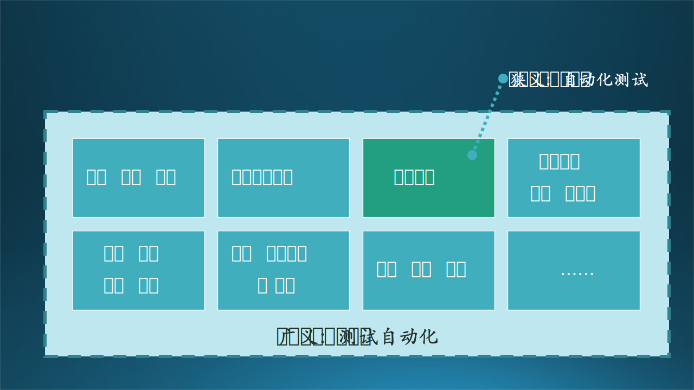
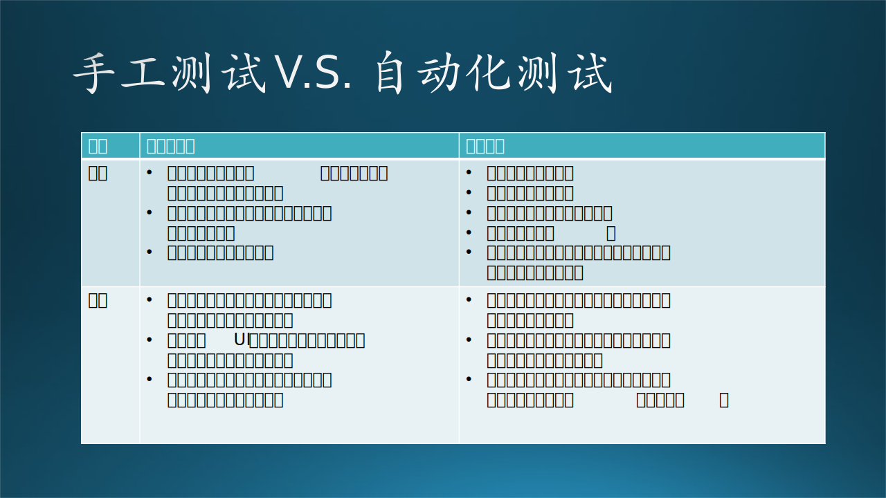

## 16.2 从手动到自动

上一章的内容已经触及到了很多关于测试效率的话题，软件测试是一个包含众多子类型和实践的领域，这其中不乏重复性的工作。比如每次发版前执行的回归测试、每次修改代码后运行的单元测试和冒烟测试等等。这些既定的、有明确的的输入和预期输出定义的测试，可以比较方便地进行自动化。在瀑布流开发时代，当开发和测试周期转化相对低频，测试更趋向于在相对长的周期内“一次性”的时候，将测试自动化起来并不是一个十分重要、核心的议题。当敏捷开发、极限编程等强调快速迭代、频繁交付和及时反馈的开发理念和实践流行起来后，测试的频次明显提高，软件复杂度也加速提升，重复的执行一些测试变得“反人性”，从效率和方法上，也都“很low”。

> PractiTest提供的软件测试年度报告中在过去的一年中有51%的手工测试被自动化测试所替代，但是自动化测试依然无法被当做解决测试问题的“银弹”。

### 16.2.1 狭义自动化与广义自动化

简言之，自动化测试就是把测试自动“跑”起来，是利用软件工具和脚本来执行测试任务和验证软件系统的过程，它是持续集成和持续交付（CI和CD， Continuous Integration 和 Continuous Delivery）的核心概念和重要构成。有的关于自动化测试的著述中，将“自动化测试”和“测试自动化”两个概念进行了区分，认为自动化测试仅仅指“测试用例运行”的自动化，而“测试自动化”指测试全流程的自动化，包括对测试的环境准备（Setup）、执行（Execution）、结果分析（Analysis）、报告（Report）、环境清理（Cleanup）和其他辅助流程（Help）的全面（SEARCH全流程）自动化。这有点像“Automated testing”和“Test automation”之间的区别，区分出了“狭义”和“广义”。本书不再进行这样的区分，自动化测试即“Test automation”，指广义的软件测试全流程自动化，这就让我们可以探讨的内涵更加丰富；而且，全流程的自动化也是高效软件开发、时代发展的要求。

因此，自动化测试不再是软件测试的一个单一分类，而是一个发展方向，一个对测试的全面“加成”、“赋能”，而且是从深度和广度两个方面上：从深度上，按照上一章的测试分类中的所有测试都可以自动化；从广度上，测试的从测试环境准备、测试数据生成到结果分析的全流程也都可以自动化：
- 不同的“端”：移动端Android和iOS、桌面端Windows和Mac OS、浏览器、服务端等等。
- 不同的测试类型：UI测试、性能测试、可用性测试、无障碍测试等等。
- 不同的流程和环节：测试环境配置、测试数据生成、测试结果分析、测试报告、结果可视化等等。
- 测试平台化：测试任务调度、测试设备管理、测试稳定性提升。

> 上一小节的故事中，“Phone Link”和“Link to Windows”项目的单元测试（白盒测试）已经是自动化的状态了，而更偏向于黑盒测试的UI测试、端到端测试，还没有自动化跑通；而且该测试涉及到多个平台：Windows和Android，还涉及到物理设备（Android手机）扫二维码问题的解决；而小陈将框架搭建起来后，将测试失败后自动发出错误报告给团队的功能也做了出来，这就覆盖了测试报告的自动化；不要小瞧这个自动报告的功能，这个功能对于开发团队非常有用，是串联整个自动化和持续集成的关键的“最后一公里”，而且可以大大提升小陈工作的可见度（visibility）和影响力（impact），可谓一举多得。

笔者相信，软件自动化测试领域是大有可为的。当下，这个领域的成熟的框架和工具已经非常多，但还没有一个框架、解决方案或平台能通吃这个领域，更多的是在某一个子命题下深耕。同时，从深度上看，探索型测试被认为是手工测试的“皇冠”，具有很高的专业性、需要刁钻的思考角度，探索型测试人员常常能发现一般手工测试无法发现的严重问题，因而通常被认为无法自动化。那么事实如此吗？随着AI、AIGC、LLM、计算机视觉（CV）和强化学习技术（RL）的发展，也许有一天探索型测试也能被自动化驱动。

### 16.2.2 一定要自动么？

在上一小节小陈、木头和老张的讨论中，我们已经可以大致了解自动化测试对于一个开发团队的意义。更确切的说，一个团队要做自动化测试，大多出于以下几个原因：
- 提高效率：自动化测试可以自动执行大量的测试用例，比手工测试更快速和高效。它可以在较短的时间内完成大量重复的测试工作。
- 提高测试覆盖率：自动化测试可以覆盖更广泛的功能和测试场景，确保系统的各个部分都得到测试。
- 提高测试质量：自动化测试可以减少人为错误和疏忽带来的问题。它可以按照预定义的标准和规则执行测试，减少人为判断的主观性。
- 提升持续集成和交付能力：自动化测试可以与持续集成和持续交付流程集成，帮助团队更频繁地进行集成和交付，从而加快软件交付速度。

在考虑一种测试需求或类型是否要自动化、还是采用专职测试人员进行手工测试的时候，我们可以从以下方面综合考虑：

此外，测试的自动化还能带来更长远的价值：当我们能利用好自动化实现了软件产品的持续集成和持续测试，下一步的软件测试的工程化就已经初具雏形，可以进而考虑更高集成度的工程系统方案，点亮整个“技能树”：比如考虑利用容器化来构建测试环境，或者引入机器学习来实现测试数据或用例的自动生成。这对一个纯手工的测试团队是无法触达的。