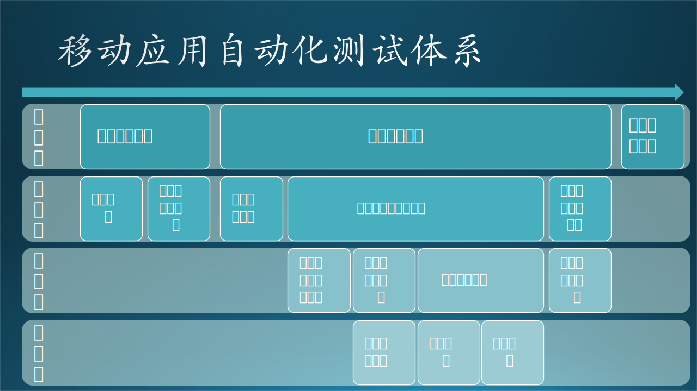

## 16.3 移动应用的自动化测试

2007年，苹果公司发布了第一代iPhone，开启了智能手机和移动元年，并推出了App Store，成为第一个真正成功的移动应用市场。随后，随着Google Android的入局，移动应用（Mobile Application）市场加速发展。2014年前后，移动手机出货量超越PC；同年，微软提出“Mobile First, Cloud First”战略，强调了移动设备的普及和智能手机的快速发展对于用户的重要性，并通过云计算提供无缝的跨设备和跨平台体验，满足用户在移动环境下的多样需求。随着3G/4G网络的普及，移动市场的用户规模不断增长，并继续扩大其对互联网使用的主导地位。

移动应用开发也逐步成为软件开发的主旋律之一，新技术层出不穷、百花齐放，从最初的Android的Java技术栈、iOS的Objective-C、和移动浏览器的JavaScript主导，到今天Kotlin、Swift、Flutter、React Native等原生和跨平台技术的融合迭代，移动应用开发依然在快速发展和不断创新。

### 16.3.1 移动应用自动化测试的特点

移动应用开发出现在DevOps和敏捷开发理念普及之后，所以自动化测试和持续集成的实践在移动领域成为“标配”和“常规操作”，相应的平台一般都有原生的技术支持。因此，以其独特的复杂性、时代要求，移动应用的自动化测试也呈现出以下特点：

1. 丰富的平台测试工具：根据移动应用的平台（iOS、Android）和技术栈，选择适合的自动化测试工具。常见的移动应用自动化测试工具包括Espresso、XCUITest、Playwright等。选择合适的自动化测试工具。以下是笔者汇总的常见移动或跨平台测试框架，以及一些基本的参考信息（2023年7月数据）：

| 框架名称        | 支持平台                                       | 黑盒or白盒  | 所属社区                                      |
| :-------------- | :--------------------------------------------- | :---------- | :-------------------------------------------- |
| Espresso        | Android                                        | White&Black | Google Android 官方测试框架                   |
| XCTest          | iOS                                            | White&Black | Apple iOS/Mac OS 基于XCode平台的官方测试框架  |
| Xamarin.UITest  | iOS and Android                                | White&Black | Microsoft Xamarin跨平台应用技术社区研发和主导 |
| Playwright      | Cross-browser web应用自动化，移动Web应用       | Black       | GitHub 52.6K stars                            |
| Selenium        | Web applications and websites                  | Black       | GitHub 21.1K stars                            |
| Appium          | Android, iOS, Windows, Web应用                 | Black       | GitHub 16.6K stars                            |
| Nightwatch.js   | Web applications and websites                  | Black       | GitHub 11.4K stars                            |
| Detox           | Android, iOS                                   | Gray        | GitHub 10.4K stars                            |
| Robot Framework | Web, Android, Windows (with tools lib support) | --          | GitHub 8.2K stars                             |
| Airtest         | Android, iOS, Windows, Web（基于游戏场景定制） | Black       | GitHub 7.2K stars                             |
| maestro         | Android, iOS, ReactNative, Flutter应用         | Black       | GitHub 4K stars                               |
| WinAppDriver    | Windows App                                    | Black       | GitHub 3.2K stars                             |

> 可以看到，移动测试框架种类繁多。开发者可以根据自己的平台需求、测试策略、社区活跃度需求等因素进行综合评定，选择最适合自己的。

2. 考虑跨平台、硬件兼容性：如同浏览器应用需要考虑不同浏览器平台的兼容性，移动应用的自动化测试需要考虑平台系统平台和手机硬件兼容性。相较于苹果设备，安卓平台碎片化更严重（不同的设备型号、操作系统版本和屏幕尺寸），这种系统定制的自由度和体验的碎片化（比如，不同系统的应用权限管理的位置可能各自有一套逻辑），让移动和开发的动开发和测试的复杂性都上升了一个台阶。如果你的应用在需要多个平台上运行（比如同时开发iOS和安卓应用）或使用混合应用开发框架（如React Native、Flutter），那么就更需要确保自动化测试覆盖多个平台和设备。

> 选择在真机还模拟器运行移动端应用的自动化测试，是一个永恒的问题。真机和模拟器在运行测试方面各有优势。真机往往性能更好、运行速度更快，而且和用户实际体验更为接近。而模拟器定制性强，系统环境干扰因素少，资源权限和灵活度更高；最重要的是成本低，一般无需采购硬件设备。这里笔者的建议是，经费允许的情况下，能选真机选真机，上手更方便，而且优先选择谷歌自家出品的机器，原生支持更好。但如果打算利用灵活度和定制性更高的模拟器，那么自己去调试模拟器也是可以的；有的开发人员把模拟器玩出了花样，做出成熟方案后开公司去了（比如Arnaud在2011年前后创立的Genymotion）。

3. 移动场景的性能要求：相比于桌面端电脑设备，移动设备的硬件限制和环境变化都会更多。一般而言，移动应用的内存、存储空间、电池电量、网络环境以及CPU占用，都和桌面端、浏览器端的应用在要求上更苛刻。虽然移动端设备的性能，现在正在逐渐追赶PC，手机内存RAM也来到了12GB时代；苹果公司的M系列芯片也下沉到了移动端。但没有发生变化的是，移动设备必须便携和具备持久的续航。而所有的资源消耗，最终都可能会关乎耗电量和设备的续航。

> 当然，如果有一天手机上可以配备核燃料电池，有取之不尽的电量能源，那么性能消耗也许不再是一个瓶颈；但手机CPU、GPU散热依然会是一个问题，不然会引爆核燃料电池。

此外，移动场景下的网络环境也更复杂，如果用户覆盖足够广，横跨亚非拉美欧大陆，可以考虑搭建自动化测试能够模拟不同类型的移动网络，例如2G、3G、4G、Wi-Fi和边缘网络，以验证应用在不同网络环境下的表现。

总之，对于移动应用，性能测试的意义很大，如果能够自动化运行，在开发进程中不断进行自动回归验证，及时发现问题（regression），那么自动化的价值会得到凸显。

4. 独特的交互方式：移动应用的交互方式与桌面应用和浏览器有很多不同之处，手机大多是通过一块触屏完成几乎所有的交互，此外一部“小小”的手机上还配备着诸多IO（输入输出）设备（麦克风、震动马达、陀螺仪、摄像头等），用于实现不限于多点捏合、拖拽、长按、滑动、震动反馈、屏幕方向感应、语音输入输出、生物信息识别（3D面容和指纹等）、光线感应、运行状态感应等等交互方式。此外，还有基于后置摄像头的扫码、拍照、AR（增强现实）交互等纷繁多样的创新交互；近年出现的折叠屏手机上，连屏幕铰链都成为了交互方式新变量。

所以，还真的别看手机体型不大，里面的IO设备可着实不少，创意、玩法繁多。有些场景，尤其是基于摄像头的AR、扫码、面容识别等等，不搭建一间测试实验室（Test Lab），提供工业级别的管理，还真的是很难进行全自动化的测试。

关于移动应用的自动化测试特性，我们不再进一步详细展开。以上四个方面已经概括了软硬件层面绝大多数的特殊性。这些要点即使特性，也引出了移动应用测试的挑战：
- 测试本身的稳定性不高（High Flakiness）：测试无法在本机上运行，中间依赖的环节多（驱动层、连接层、测试执行层），黑盒多。
- 移动测试运行环境特殊（Environment Diversity）：需要“跑”在移动设备上，而移动设备是一个广阔的集合，各类系统、各类配置、各类形态。
- 几乎无限可能的交互方式（Limitless UX Complexity）：移动场景下的交互创新千变万化，层出不穷，为测试带来了新的挑战。
- 性能很重要（Performance Matters）：测试需要深入的性能层面。

总之，移动测试需要HELP！接下来，我们将从一个实际的案例出发，尝试将移动应用的自动化测试流程化、体系化，于DevOps开发系统进行集成，给出敏捷开发场景下的综合解决方案。

### 16.3.2 搭建移动应用自动化测试体系

搭建一套完整的移动应用自动化测试体系是实现持续集成的重要一环，我们希望借此确保每次代码提交都会触发移动应用的自动化测试，并将测试结果综合分析和反馈给工程系统，在一定的标准上保障代码质量。下面我们将这个体系拆分成关键的模块，然后结合一个移动应用开发的案例，了解其运作方式：

假设我们正在开发一款新的移动应用。开发者会在**代码仓库**中创建和维护源代码。每当开发者提交新的代码到代码仓库，**持续集成系统**就会自动触发，开始一个新的**构建任务流水线**的“线上任务”。

构建任务流水线首先会从代码仓库拉取最新的代码，然后在构建任务管理和执行系统的控制下，进行编译、静态代码分析、单元测试等一系列操作，最后生成可部署的应用程序，将其与测试用例、测试需求一起交给**测试管理系统**。

然后，**测试设备管理平台**会根据需要，为即将进行的测试任务分配合适的测试设备。**测试任务分发和管理系统**会根据预先定义的测试策略，创建并分发各种测试任务。接着，**测试设备和环境控制系统**会根据测试需求，调整设备的状态和环境配置，如网络连接、电池电量、地理位置等。

一切就位后，**移动设备测试驱动**会启动并运行应用程序，而**测试任务执行器**会按照指定的测试脚本进行操作，如点击按钮、滑动屏幕、输入文本等。在测试过程中，**测试日志和结果记录器**会持续收集和记录应用的运行情况，如运行时数据、错误日志、崩溃信息等。同时，**录屏和截屏系统**会记录应用的视觉表现，以供后续分析。

所有的测试结果最后会汇总到**测试结果分析系统**进行分析。该系统会识别问题、计算测试覆盖率、性能基准等，并生成测试报告。如果在测试过程中发现了任何问题，测试管理系统会将这些问题发送给**问题发现和跟踪系统**来记录，并追踪其解决过程。



利用上面的体系架构，我们可以梳理清楚完整的、现代化的移动测试自动化系统的周期和组件关系，用以支持快速、自动、系统地进行应用测试，确保移动应用的质量。接下来，我们将简单介绍利用开源方案Hydra Lab搭建上述测试管理系统。

### 16.3.3 使用Hydra Lab搭建移动云测平台

上文中，我们介绍了一套移动测试自动化的工程方案。其中，代码托管（Code Repo）、测试运行框架（Test Runner/Framework）和持续集成系统(DevOps System or CI/CD System)等部分已经有了非常完善的开源或商业解决方案（Jenkins，JUnit，Azure DevOps等）可供复用。然而，在测试设备管理、测试任务分发和测试任务调度等方面，我们还缺乏一个平台能够帮助我们将这些重要的测试流程服务化，从而真正做到全流程自动化。我们调研了市面上一些比较成熟的商业化移动云测平台。这些平台大都提供了全面的功能，且收取的费用并不高。但是，该领域还没有一个成熟的开源方案能够支持更高程度的测试运行定制化和更灵活的测试设备管理方案。因为手机硬件发布更新迭代快，有时开发者需要将自己手中的定制化测试设备（比如企业定制Android扫码器）或者最新发布的手机接入到测试云服务中，并与DevOps系统联动集成，第三方商业化的平台目前无法提供这样的定制化和安全可控服务。

微软于2023年初开源了Hydra Lab，填补了该领域开源解决方案的空白。它基于Spring Boot和React构建，支持包括Appium、Espresso、XCTest等多个测试框架，致力于提供一站式的、跨平台的云测试服务。这款框架集成了测试运行部署、测试设备管理、低代码测试等功能，支持Docker部署、开箱即用。Hydra Lab的初衷是为移动跨平台应用的开发团队提供快速、自我管理的云测试基础设施，提高开发效率和质量保障能力。具体来说，借助Hydra Lab，开发团队可以直接利用已经采购的测试设备，搭建一套内部的持续测试的工程化系统，也可以通过配置 Hydra Lab Agent 将自己手头的测试设备接入到已有的 Hydra Lab Center节点上。Hydra Lab目前的主要特性包括：

1. **分布式测试设备管理**：基于center-agent分布式设计实现可扩展的测试设备管理。
2. **测试任务管理**：Hydra Lab提供了全面的测试任务管理功能，方便开发者追踪和调整测试任务的状态和进度。
3. **测试结果可视化**：提供测试结果数据图表、录屏展示等。
4. **广泛的测试支持**：Hydra Lab支持Android Espresso、Appium、XCTest、maestro，并且借由Appium可以实现更多跨平台（Windows、iOS、Android、浏览器）的测试。
5. **智能测试**：Hydra Lab还支持无用例的自动化测试，如Monkey test和智能探索型测试。
6. **测试稳定性监控**：Hydra Lab在Docker端集成了Prometheus和Grafana，可以实时监控测试设备状态和测试任务运行状态，支持在测试设备掉线、任务失败自动发邮件报警。

关于Hydra Lab智能化的探索，以下是一段Hydra Lab开发者团队的自述：

> 不同于一般的测试框架，Hydra Lab 旨在提供一套测试工程化解决方案，或者说是一套开源云测平台，我们希望它方便地能够与 DevOps 系统、编译系统或 GitHub 等开发工具或平台结合，给开发团队带来低成本的测试全流程方案。同时，我们将智能化引入其中，大家可以在这个项目中看到一些自动化生成测试用例的模块、方案以及相关的prompt。工程化和智能化是Hydra Lab的两个核心关键词，而工程化是智能化赋能的基础，一旦有了工程化的平台，很多痛点的解决方案都可以沉淀在这个平台中。比如，UI自动化测试任务可能会出现一些不稳定的情况，突然找不到某个元素，或者出现一些意外遮挡情况。这种情况下的测试任务失败可能没有反映真实的质量问题。而有了 Hydra Lab  这样的平台级方案，我们可以对这类 flakiness 做识别，重新运行任务，从而提高稳定性。这同时也相当于我们把识别和处理测试不稳定因素的经验沉淀到了Hydra Lab开源工程中，一人贡献，全社区受益。

搭建Hydra Lab云测平台大致分成三个步骤：
- 将Hydra Lab管理中心服务（management center service）的docker image部署到云服务器或者云计算服务容器上。
- 在测试机器上启动 Hydra Lab 代理服务（agent service），并将其注册到管理中心。
- 通过调用Hydra Lab管理中心服务暴露的 RESTful API 运行测试。

该平台还提供了一个Uber版本方便一键部署，作为试用体验尝鲜：

```bash
docker run -p 9886:9886 --name=hydra-lab ghcr.io/microsoft/hydra-lab-uber:latest
```

在Hydra Lab服务部署好后，开发者可以通过Hydra Lab提供的Gradle插件或Azure DevOps插件的方式触发测试任务的运行。更详细的内容可以在其GitHub平台上提供的Wiki（https://github.com/microsoft/HydraLab/wiki）上进一步学习了解，包括定制化的功能、部署方式等等。