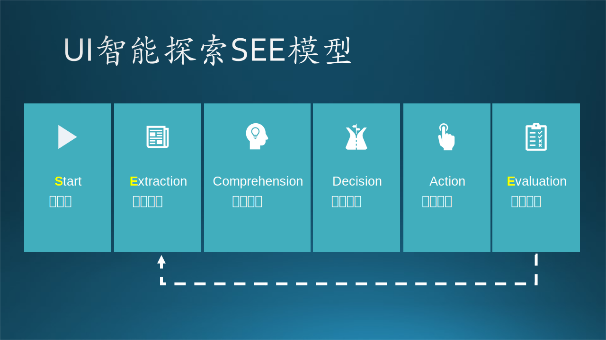

## 16.5 从自动到智能

2023年是人工智能发展的有一个里程牌年份，ChatGPT横空出世，再次点亮了AI赛道曙光。在这个智能化加速的时代，软件应用的广泛普及和不断增长的软件复杂性对软件测试提出了更高的要求。过去几十年，我们目睹了软件测试的自动化发展。然而，随着人工智能（AI）和生成式人工智能（AIGC）的快速发展，软件测试被智能赋能成为了一个必然的方向，很多企业和开发团队已经走在探索的道路上。

回顾过去，软件测试的自动化已经极大地改善了测试效率和质量。自动化测试工具和框架的出现使得测试人员能够快速执行大量的测试用例，减少了手工测试的繁琐工作。然而，随着软件系统越来越复杂，测试环境的多样性增加，传统的自动化测试面临着挑战，如UI变化频繁、新功能的探索性测试等。强化学习、生成式AI、AIGC以及各类Copilot“副驾驶”工具、Auto-GPT、LangChian等相关技术的飞速发展，使得在AI赋能下提高测试的全面性和深度具备更高的可行性，为软件测试带来了新的机遇和可能性，包括且不限于以下方面：

- 测试环境的模拟生成。
- 测试数据生成。
- 智能探索型测试。
- 测试用例生成和优化。
- 测试结果分析解读。
- 测试智能调度和重试：提升运行稳定性提升。
- 基于测试结果的诊断建议。
- 对话式测试体验的构建。
...

未来，随着AI技术的不断进步和应用，智能化将在软件开发生命周期的各个阶段发挥更大的作用：一方面，借助一些基于LLM技术下的软件测试场景的prompt engineering技术，智能化测试将推动自动化测试更加自动；另一方面，软件测试也在从自动化时代迈向智能化时代，“测试智能体”将有能力更好地理解和分析软件系统（从代码到界面、白盒到黑盒），从大规模的测试数据中挖掘出隐藏的缺陷模式和异常行为，降低自动化测试用例的维护成本，进一步减少测试人员的工作量和时间成本。

总之，我们可以期待智能化测试在未来的软件开发中发挥更重要的作用。接下来，我们将在有限的篇幅里展开探讨几个智能测试的想法和实践探索，启发读者在该领域前行成为先驱（trailblazer）。

### 16.5.1 智能探索型测试

用手工方式对软件进行的黑盒UI测试是笔者认为测试这个领域内最接近用户视角的方式。这种方式既可以非常按图索骥，也可以是充满创造性的探索型测试。在2010年前后微软团队出品的《探索式软件测试》这本书中，讲这种测试的深入剖析出了哲学的意味，提出多种不同思路（Money Tour卖点漫游, Landmark Tour地标漫游, Obsessive-Compulsive Tour强迫症式漫游, Saboteur破坏性漫游等等）的漫游测试，来快速穷尽用户视角下的应用使用路径、用户场景，暴露问题。在自动化测试中，有一种类型的测试叫随机测试，其英文是Monkey Test，执行测试的是一只猴子。这来源于想法“如果让一百万只猴子在一百万个键盘上敲一百万年，从统计学角度，他们最终就可能写出莎士比亚的话剧”。当我们大量执行随机测试的时候，就是在应用这种“猴海战术”。

但试想，如果这个猴子聪明一点，能理解应用程序的界面或者接口，并能实施相对合理的交互，是不是不一定要依赖“猴海战术”，可以在更短的时间内发现问题？在人工智能、机器学习、大语言模型快速发展的今天，更聪明的猴子已经成为可能。智能探索型软件测试具有以下优势：
- 自主学习能力：测试代理通过强化学习算法不断优化测试策略，提高测试效率和准确性。
- 自动化和持续性：智能测试代理可以自动执行测试，并且可以持续地进行测试，减少了人工测试的工作量和时间成本。
- 边界情况探索：通过探索系统的边界情况和异常情况，智能测试代理能够发现更多的错误和潜在问题。

智能探索式测试的可行思路是利用计算机视觉、屏幕元素识别和自然语言处理的技术，解析和理解屏幕上的元素或者程序接口的语义，然后做出交互动作。这是一种黑盒视角的智能测试，基本的思路为：
1. **Start**：启动软件和测试智能体。
2. **Extraction**：提取软件UI、接口信息（API描述、UI截图以及DOM元素信息）。
3. **Comprehension**：识别软件界面或交互接口，运用模型进行理解，得出解析值（向量）。
4. **Decision**：将识别结果（即解析值，也或包含动作历史、反馈信息）向量交给决策模型，得出动作向量。
5. **Action**：执行动作向量中描述动作。
6. **Evaluation**：执行动作后触发软件变化（也可能没有变化），然后重复2。

这是笔者团队提出的简单流程，该抽象模型很像马尔科夫决策过程中涉及的概念：决定下一步动作（Action）或策略（Policy）的包括当前的状态（State），也可能会包括之前的路径轨迹（Trajectory）。但是这个问题和强化学习所要解决的问题可能并不完全相同。探索性测试可能是有多元目标的，而其中对于测试覆盖率的追求，是一个很复杂的指标：对于测试智能体而言，我们可能无法事先知道应用内有多少状态、多少界面，甚至开发团队也不清楚。因此这比一般的强化学习问题更复杂，我们很难设计出合理的反馈函数，使得模型收敛。而即使一个模型针对于一个应用收敛了，对于一个全新的应用又可能遇到截然不同的情况。以强化学习和图像识别为驱动的黑盒视角下的智能探索型软件测试是一种新兴的测试方法，把应用程序当做“游戏”来“玩”和探索，在这种测试方法中，强化学习被用作一种自主学习的方法，使软件测试代理能够通过与系统进行交互来学习和改进测试策略。这样的想法在很多学术研究机构和大学的论文中也有论述，但目前还没有看到成熟的可以应用于软件工业领域的完整方案。

此外，智能探索还有更简单的思路，即把应用内部的状态跳转看做一个状态转换图（State Transition Graph），然后采用深度优先或者广度优先的基本思路去遍历这张图。这种方法简单可行，相当于简化了上文提到的Decision决策的步骤，采用了基于简单策略或规则的方式选取元素进行交互，使得探索的过程可解释性更强，灵活度更高。

总体而言，采用模型进行决策的思路（Model-based）更接近“聪明的猴子”的概念，而采用固定策略、算法或规则（Rule-based）更可控、更容易实现。此外借助于近期的LLM、ChatGPT的快速发展，我们是否可以借助他的力量，提出更有趣的方向：LLM-based动作决策体系？或者，结合LangChain等相关技术，当我们可以把软件接口表示（比如DOM文本、截屏图像向量），序列化成prompt的时候，上述Comprehension的流程是否也可以让LLM参与进来？这两个问号就留给读者进行探索了。

### 16.5.2 测试用例生成

在大语言模型的赋能下，白盒测试视角的测试用例生成，尤其是针对局部、单个类的单元测试用例的生成，已经非常成熟了，一些常见的思路如下：

1. **生成测试用例描述：** 可以让模型帮忙生成特定函数或方法的测试用例描述。
2. **生成测试代码：** 对于一些常见的编程语言，如 Java、Python 或 JavaScript，你可以告诉模型直接生成可执行的测试代码。
3. **提供测试覆盖率建议：** 还可以让模型生成关于如何提高测试覆盖率的建议。我们可以给大语言模型一个已有的测试套件，并让模型给出增加测试覆盖率的建议。
4. **边界条件检查：** 模型可以用来生成针对特定函数或方法的边界条件测试。
5. **生成异常测试用例：** 模型可以用来生成检查特定函数或方法异常行为的测试用例。

这方面比较流行的ChatGPT、GitHub Copilot已经非常成熟，读者可以用自己手头的代码试下，提示词一般形如“针对如下由三个破折号分割的代码内容，请生成若干单元测试，提供较高的测试覆盖率：---<代码内容>---”。这里笔者就不再举例赘述。可以看出来，这种方法的最大限制来自于提示词Token数量的上限，在代码体量较大的情况下，想生成高质量的跨模块的集成测试代码基本很难实现。

此外，我们是否有可能利用大语言模型的特性，辅助黑盒视角的测试用例生成？我们以移动应用的UI测试为例，探讨一些可能的思路。上文的智能探索测试的讲述中，我们提出应用内部的状态跳转看做一个状态转换图（State Transition Graph），那么如果我们可以通过智能探索测试绘制出这张状态转换图，再通过一定的剪枝算法将其转化为树的数据结构，我们就可以以叶子节点作为一个用户场景、测试用例的终点，将交互的路径作为测试用例序列化出来。

我们前面小节提到的 Hydra Lab 就对这一思路进行了实现，总结来讲就是：先探索，再利用。先通过一些策略探索和漫游一个软件，然后转换理解，形成数据结构，即“状态转换图”，最后再利用这些结构化的数据，作为后续探索和用例生成的基础。这就相当于，对软件黑盒内部逻辑进行了总结提炼，完成了一次“有损压缩”。这也很像一个测试人员第一次用一个软件，一定会先探索理解，同时在旁边整理一个信息图，这在测试领域被称为“功能图”或“状态图”，然后再设计用例；这非常自然和接近人的操作。如果我们能用计算机做这件事情，就能自动化地完成探索，绘制状态图，并生成测试用例。

最后，我们可以把这个信息作为prompt提示词的一部分来利用大模型进行用例生成，整个过程充分自动化和智能化，仅需要较少人工干预对生成的内容进行校验和调试，这也能让相应的测试用例、测试流程随着应用内部的变更进行调整和兼容。

### 16.5.3 测试结果分析

软件测试的一大挑战在于测试结果的解读和分析。以用户界面（UI）测试为例，一次测试的运行可能会产生大量的应用日志内容、捕获测试异常信息、生成测试的最终结论。在UI测试过程中，为了更好地理解测试过程和结果，我们甚至可能会截取软件的屏幕图像或录制整个测试过程的视频。简而言之，测试过程会产生海量的诊断信息和数据。

现在，问题来了：能否利用大语言模型的能力，深度分析这些庞大数据中的异常情况，为我们提供明确的结论？LLM能否告诉开发者这次测试的异常是源于哪个模块，以及如何修复它？更进一步，能否在分析代码的同时，给出一些具体的修复建议？这些都是我们需要探索的问题。整体来看，我们认为测试结果分析和大语言模型的结合，可以从以下四个方向进行深入探索：

1. **测试异常可靠性推断：**通过大语言模型的分析，我们可以对测试结果的可靠性进行推断，理解测试异常是否是偶发事件、被测应用的Bug，还是存在其他系统性的问题。
2. **测试失败原因分析：**大语言模型可以帮助我们理解测试失败的原因，从日志中提取关键信息，定位出导致问题的代码模块，甚至是具体的代码行。
3. **测试失败修复建议：**结合源代码分析，大语言模型可以为开发者提供针对性的修复建议，从而帮助他们更有效地解决问题。
4. **性能测试数据分析、异常检测：**对于性能测试，大语言模型能够分析大量的性能数据，检测出性能的瓶颈，提供优化建议。

总的来说，大语言模型在处理复杂、多源的测试数据方面有着天然的优势，如果我们能有效地利用这些优势，相信能够为软件测试带来实质性的提升。

### 16.5.4 智能测试：以AI为对象的测试

咬文嚼字地讲，智能测试和测试智能化是两个截然不同的概念。智能测试，或者说智能体测试是指对AI、智能体、机器学习模型或智能应用进行测试，验证其有效性、召回率等指标的测试，这是一个近年来逐步受到越来越多关注的新兴方向。以下是针对人工智能（Artificial Intelligence，AI）、智能体、机器学习（Machine Learning，ML）模型等智能应用的测试，存在一些前沿实战和技术：

1. 数据集测试：测试训练数据集和测试数据集的质量、多样性和覆盖度，以确保模型在各种情况下具有良好的性能。
2. 边界条件测试：测试模型在边界条件和极端情况下的行为，以评估模型的鲁棒性和稳定性。
3. 强化学习测试：针对强化学习算法和智能体的测试，包括对策略、价值函数和环境模型的验证和评估。
4. 可解释性测试：测试模型的解释能力和可解释性，以理解模型的决策过程和推理过程。
5. 对抗性测试：随着对抗性攻击的出现，对抗性测试变得越来越重要，用于评估模型的鲁棒性和安全性。
6. 自适应测试：随着模型的在线学习和自适应能力的增强，测试需要考虑模型的持续更新和迭代过程。
7. 对抗性测试：通过构造对抗性样本或攻击来评估模型的抗干扰能力和安全性。
8. 模型评估和验证：使用评估指标和度量标准来评估模型的性能、准确性、召回率、精确度等。

目前，随着人工智能和机器学习的广泛应用，对智能应用的测试需求越来越重要，我们既要保证其能满足用户需求，还要保证构建 Responsible AI，即可信人工智能。研究者和学术界也在积极探索新的测试技术和方法，以应对智能应用的特殊要求。该领域挑战之一是测试数据的获取和准备，这些数据代表了正确价值的导向，是评价标准的核心。