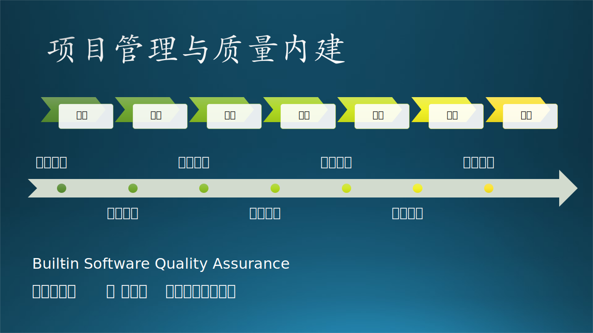
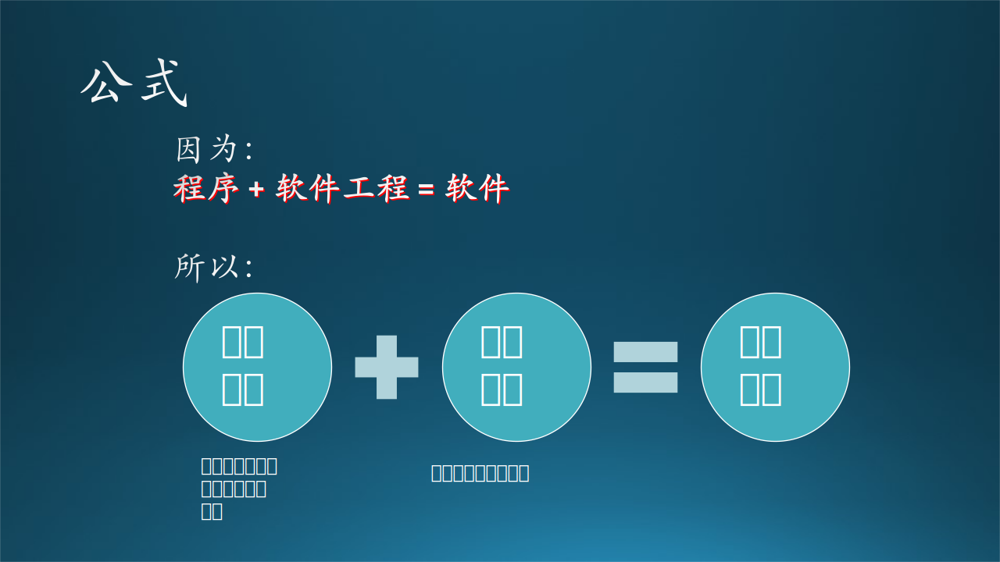
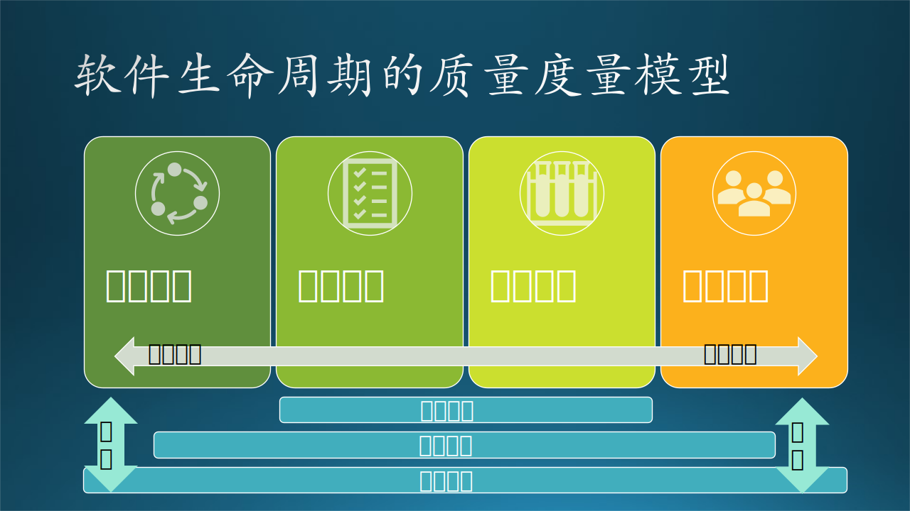
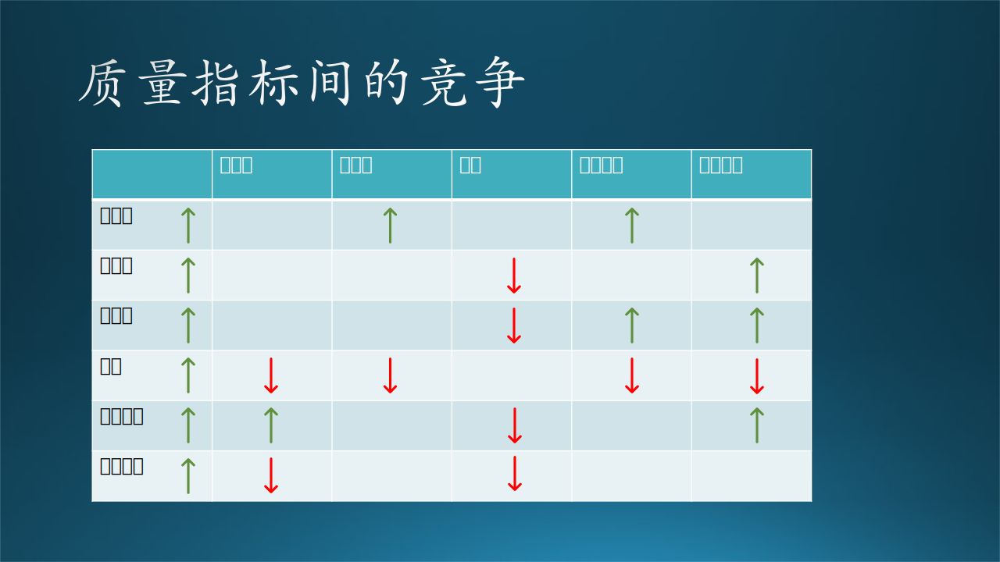
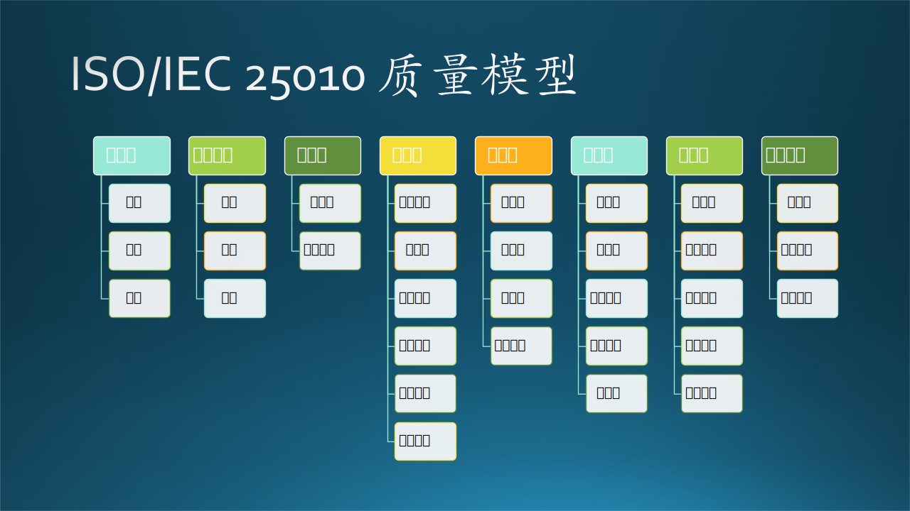

## 17.2 软件质量保障概述

软件质量保障（Software Quality Assurance，简称SQA）是一个比软件测试范围要更大、更泛的话题。从项目管理的视角上看，质量保障是确保产品可以达到其客户或者雇主设定的交付标准所制定的流程。具体到软件开发，软件质量保障是一系列活动，包括规划、定义、控制、保障和改进那些影响产品质量的过程和相关活动，覆盖了软件产品开发的整个生命周期，从需求获取、软件设计和编码，到测试和维护。一般认为测试是质量保障的一部分。

### 17.2.1 软件质量保障 V.S. 软件质量控制

为了进一步说明软件质量保障（Quality Assurance）的含义，我们把它和另一个经常被提及的概念，软件质量控制（Quality Control），进行一轮对比：

- 软件质量保证是一种预防性活动，重在防止问题的发生，通过制定和实施质量计划、设置标准和流程、培训团队成员等方法提升软件开发过程的质量。它的目标是保证软件开发过程符合预期的质量标准，最大程度降低缺陷和问题的风险。
- 软件质量控制则更多是检测性活动，侧重于评估软件的质量并找出并修复其中的缺陷。它主要通过执行测试、代码审查、缺陷管理等手段来保证软件质量的达标。软件质量控制的目标是在软件交付前检测和修复软件中的缺陷，并保证软件满足预期的质量标准。

简单来说，软件质量保证着眼于预防问题发生，通过规范和改进过程来达成质量标准；软件质量控制则是在产品层面，通过检测和验证以发现和修复问题。敏捷软件开发中的软件质量内建"Built-in Quality"，强调从一开始就把质量纳入到产品的设计和开发过程中，更接近于质量保障的范畴。

换言之，软件质量保障的“终极目标”是使产品达到预期标准，并通过流程实现“长治久安”，而不仅仅是避免、发现或者修复缺陷。这个定位和软件测试以及软件质量控制都不同。可以认为，SQA追求的是扁鹊长兄的“于病视神，未有形而除之”。

### 17.2.2 软件质量的内涵

那么，质量保障这个“大问题”该如何分解到开发实践当中？首先，我们要保障“质量”，那就要明确软件的“质量”到底指的什么。在本书的最初我们提到过：

$$
软件 = 程序 + 软件工程 \tag{17.1}
$$

这就意味着，一个优秀的软件不仅仅是由其程序代码决定的，更在于软件开发和管理过程的质量和有效性。那么“代入”质量，我们可以得出如下的进一步公式：

$$
软件的质量 = 程序的质量 + 软件工程的质量 \tag{17.2}
$$

这就展开了“软件的质量”的含义。这里，软件质量被分解为“程序的质量”和“软件工程的质量”。这意味着，优秀的代码（程序质量）和优秀的开发、测试和维护流程（软件工程质量）是确保软件质量的关键。

笔者认为，放到更大的时间尺度上，质量最终要落到“人”上，和团队的质量意识、文化密不可分，在实际的操作上，这个文化会体现在团队的流程设计的完善度、QA团队的话语权等等，而并非虚无缥缈的政治口号。因此，这里可以加一个“buff”：

$$
长期的软件质量 = (程序的质量 + 软件工程的质量) * 团队的质量文化系数 \tag{17.3}
$$

优秀的团队质量文化，如开放的沟通、积极的学习、持续的改进等，能够有效地提升软件的质量。反之，如果团队的质量文化弱，那么即使程序的质量和软件工程的质量都很高，如果出现流程混乱、关注点缺失、优先级错配，就很难说质量可以“长治久安”。

上面的内容讨论中，我们尝试联系前面的公式，拆解了软件质量的概念。在我国的软件工程向拼质量的相关标准中，就分四个层面提出了过程质量、内部质量、外部质量和使用质量，来展开软件质量的内涵：

- **过程质量**：过程质量衡量软件的研发过程对于质量的保证程度，较好的过程质量意味着软件的研发过程是按照比较科学的方式方法进行，也就是我们上面说的“长治久安”。
- **内部质量**：内部质量是指软件研发过程中软件的质量，在这个过程中会产生的需求文档、概要设计、详细设计等文档和编码实现，这些共同影响内部质量。内部质量是由开发来把控。
- **外部质量**：外部质量指地是软件开发完成后，整体运行时暴露出来质量特性，外部质量的界定是由系统测试的来对软件进行质量评判的工作。
- **使用质量**：当软件交付用户后，由用户在使用时感受及目标的符合程度，简单来说就是用户说你的软件好不好，这就是使用质量。

前面的过程、内部、外部质量都可以由公司的内部人员来进行评估；而使用质量一般是用户或企业客户说了算。以上四个维度的质量和我们上面说的质量拆解法的异曲同工之处在于，两者都强调了质量既是一个“结果”，也是一个“过程”，因此需要体系化、标准化的手段来保障。

### 17.2.3 常见的软件质量标准

软件质量标准的定义是质量保障的起始点，对于软件产品，我们可以参考ISO/IEC 25010 系统和软件工程质量评估模型，来构建一个初步的质量标准框架：

我们选取一些比较常用的核心指标，并把它们按照不同的开发阶段来进行梳理解读如下：

- 开发期代码质量：
    - 易理解性（Understandability）：指设计被开发人员理解的难易程度。
    - 可扩展性（Flexibility）：软件因适应新需求或需求变化而增加新功能的能力，也称为灵活性。
    - 可测试性（Testability）：对软件测试以证明其满足需求规范的难易程度。
    - 可重用性（Resuability）：指重用软件系统或某一部分的难易程度。
    - 可维护性（Maintainability）：当需要修改缺陷、增加功能、提高质量属性时，定位修改点并实施修改的难易程度；
    - 可移植性（Portability）：将软件系统从一个运行环境转移到另一个不同的运行环境的难易程度。
- 运行期产品质量需求：
    - 性能（Performance）：性能是指软件系统及时提供相应服务的能力，包括时间（Time Behavior，一般和速率相关，软件执行功能时的响应、处理时间和吞吐率
）、资源利用（Resource Utilization，软件执行功能时所使用的资源数量和类型）和容量消耗（Capacity，产品或系统参数最大限度满足需求的程度，和服务的持续高速性相关）三方面的要求。
    - 安全性（Security）：指软件系统同时兼顾向合法用户提供服务，以及阻止非授权使用的能力。
    - 易用性（Usability）：指软件系统易于被使用的程度。
    - 可伸缩性（Scalability）：指当用户数和数据量增加时，软件系统维持高服务质量的能力。例如，通过增加服务器来提高能力。
    - 互操作性（Interoperability）：指本软件系统与其他系统交换数据和相互调用服务的难易程度。
    - 可靠性（Reliability）：软件系统在一定的时间内无故障运行的能力。
    - 可观测性（Observability）：指能够通过检查系统或应用的输出、日志和性能指标来监控、测量和理解系统或应用的状态。。
    - 持续可用性（Availability）：指系统长时间无故障运行的能力，与可靠性相关联，常将其纳入可靠性中。
    - 鲁棒性（Robustness，差错防御）：是指软件系统在一些非正常情况（如用户进行了非法操作、相关的软硬件系统发生了故障等）下仍能够正常运行的能力，也称健壮性或容错性。

同时，开发期的质量体现和运行期的质量需求是可以相互联系在一起的。比如：

- 易理解性和可维护性可以直接影响产品的性能和可靠性。如果代码的设计和架构不易理解，那么开发人员可能会在修改和优化代码时遇到困难，从而可能会导致性能下降、出现新的错误或增加错误修复的时间；
- 开发期的可测试性也可以直接影响运行期的可靠性和鲁棒性。只有当软件的所有部分都可以被有效地测试时，才能保证在各种环境和条件下都能正常工作。较低的可测试性可能导致整体测试覆盖率无法突破瓶颈，可能在面对非常规情况或者用户非预期的操作时，出现无法预测的错误，影响软件鲁棒性（Robustness）；
- 开发期的可扩展性和可移植性也对运行期的可伸缩性和互操作性有着重要的影响，云环境下，高可扩展性更可能应对大规模的用户和数据增长。可移植性则保证了软件可以在不同的环境或平台上运行，使得与其他系统的交互成为可能；
- 开发期的可重用性可以影响到运行期的各个方面。通过重用经过严格测试和验证的代码，可以提高开发效率，同时减少出错的可能性，提高软件可靠性和安全性。

更多的标准之间的相互关联性、竞争性，可见下表：

### 17.2.4 软件质量保障的重要性

亚里士多德说过：“我们反复做的事情塑造了我们，因此卓越不是一种行为，而是一种习惯。”质量和卓越一样，不是可以简单完成的任务或清单，而是需要在开发和服务生命周期中持续、习惯性的投入。在微软，质量保障被认为是"卓越软件工程"（Engineering Excellence，简称EE）的关键部分，并提出质量开发生命周期“Quality Development Lifecycle”，将对质量的重视和实践贯穿于定义、设计、开发、运维和学习精进的周期中。对软件质量的重视和“以用户为中心”的理念密不可分，而不是一句空谈。

在上一小节的故事中，我们能非常深刻的感受到开发团队对质量的重视：项目经理虽然急切想要发版，使得合作伙伴能尽快试用上新功能，但这不能以牺牲软件质量为代价；生产环境有严格的软件可靠性指标，即使是只有千分之一的概率偶现问题，研发经理也坚持修复后在发布；QA工程师有很高的一票否决权，这源于对软件质量情况的准确把控。开发团队有能力搞清楚自己开发的软件质量的“真相”是非常重要的，这是质量内建和质量保障的立足点。

良好的质量保障体系可以提高开发效率，让开发中的逻辑问题尽早暴露，降低修复成本；高质量的软件可以提升用户满意度，和客户建立信任。这些都是软件繁荣发展的基石。下一小节，我们将探讨应用相关技术构建质量保障体系，并展望未来。
