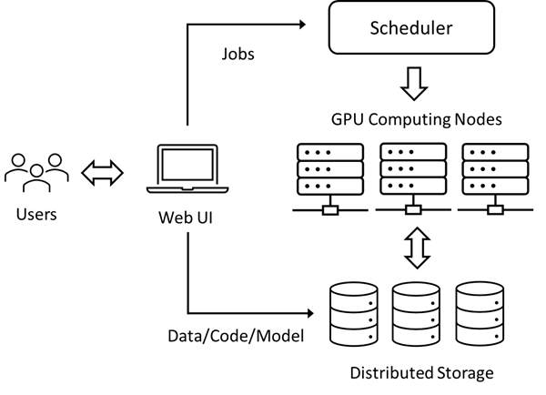

## 18.4 深度学习平台故障的研究

本文摘录了来自微软亚洲研究院系统组的一份研究报告，调研了微软内部使用的深度学习平台的质量问题，给出了分析和解决方案。本文含有一些深度学习的知识，可能有些读者没有相关的背景知识，但是重点不在这里，而是在于通过阅读其研究过程来理解日志分析方法，这对于软件系统的运维能力的提高很有帮助。$^{[4]}$

标题：深度学习平台质量问题的实证研究
原文标题：An Empirical Study on Quality Issues of Deep Learning Platform
原文链接：https://www.microsoft.com/en-us/research/publication/an-empirical-study-on-quality-issues-of-deep-learning-platform/
原文作者：
```txt
· Yanjie Gao, Microsoft Research Beijing China, yanjga@microsoft.com
· Xiaoxiang Shi, Microsoft Research Beijing China, v-xiaoxshi@microsoft.com
· Haoxiang Lin, Microsoft Research Beijing China, haoxlin@microsoft.com
· Hongyu Zhang, Chongqing University Chongqing China, hyzhang@cqu.edu.cn
· Hao Wu, Microsoft Beijing China, wuh@microsoft.com
· Rui Li, Microsoft Beijing China, ruli1@microsoft.com
· Mao Yang, Microsoft Research Beijing China, maoyang@microsoft.com
```

主要作者简介：

高彦杰，微软亚洲研究院高级研发工程师。研究兴趣为深度学习平台工具和大数据系统的鲁棒性，效率与可调试性，积极参与人工智能系统教育。其中多项工作发表在著名系统与软件工程会议ICSE，ESEC/FSE，SoCC，并出版多部技术图书。

### 摘要

近年来，深度学习（Deep Learning，DL）在许多应⽤领域中得到越来越多的采⽤。为了帮助深度学习开发者更好地训练和测试他们的模型，很多云计算服务已经建⽴了专⽤的多租户平台，配备了 GPU 等⼤量计算设备。这些平台的服务质量对系统效率和⽤户体验起着⾄关重要的作⽤。然⽽，确实存在各种类型的质量问题，不仅会严重浪费计算资源，还会严重降低开发效率。在本⽂中，我们对微软的 Platform-X 质量问题进⾏了全⾯的实证研究。 

Platform-X 是⼀个内部使用的深度学习平台，为数千名开发⼈员和研究⼈员提供服务。我们⼿动检查了 360 个真实的问题，并调查了它们的常⻅故障、根本原因和缓解措施。主要发现如下：
- 28.33%的质量问题是由硬件（GPU、⽹络和计算节点）故障引起的；
- 28.33%的原因是系统端故障（如系统缺陷、服务中断）；
- ⽤户端故障（如⽤户BUG、违反政策等）占所有常⻅原因的五分之⼆以上（43.34%）；
- 超过五分之三的质量问题可以通过简单地重新提交作业（34.72%）和改进⽤户代码（24.72%）来缓解。
 
我们的研究结果为从开发和维护两个⽅⾯提升深度学习平台的服务质量提供了有价值的指导，并进⼀步激发了可能的研究⽅向和⼯具⽀持。

索引词：深度学习，深度学习平台，质量问题，实证研究

### 18.4.1 引言

在 Microsoft 内部，数千名开发⼈员和研究⼈员每天使⽤内部⽣产 DL 平台 Platform-X 来训练和测试他们的模型，以完成⼴告和机器翻译等各种任务。 Platform-X 是⽤⼴泛使⽤的开源软件（例如 Kubernetes $^{[13]}$）和商⽤计算硬件（例如 GPU）搭建的，并且在架构上与上述公开的 DL 平台相似。对于Platform X，其核⼼任务之⼀是在遇到意外的硬件和软件故障时，根据它的服务⽔平协议（SLA）保证每个⽤户的服务质量。尽管采取了很多质量保证措施，但实际上，许多 DL 作业仍然存在严重的质量问题，⽆法提交、运⾏速度很慢、挂起，甚⾄意外失败。这些质量问题不仅会影响⽤户体验，还会影响企业⽣产⼒。⽤户在遇到质量问题时，通过问题管理系统反馈，希望服务站点的可靠性⼯程师（SRE）尽快诊断并解决，这也给平台⽀持团队带来了沉重的运维负担。因此，了解 Platform-X 中提出的质量问题，包括它们的故障、根本原因和缓解措施，对于帮助平台⽀持团队最⼤限度地提⾼效率和帮助平台⼯程团队改进系统设计和实施变得尤为重要。

- 以前有很多关于传统软件系统质量问题的⼯作$^{[14...22]}$。例如，Zhou 等⼈$^{[19]}$ 研究了来⾃微软内部⼤数据分析平台的 210 个随机选择的质量问题。

- 最近，我们看到了⼀些与深度学习相关的实证研究 $^{[23...31]}$，重点关注 DL 框架、编译器、程序和作业的失败和错误。例如，Zhang 等⼈$^{[27]}$ 研究了在三周内从 Microsoft 收集的 4,960 个内部 DL 作业失败。然⽽，仍然缺乏关于 DL 平台质量问题特征的专⻔研究。

在本⽂中，我们对深度学习平台的质量问题进⾏了全⾯的实证研究。我们从 Platform-X 的问题管理系统中随机抽取了 2021 年 11 ⽉⾄ 2022 年 2 ⽉开发⼈员和研究⼈员报告的 360 个质量问题。对于每个质量问题，我们收集了其相关信息，例如问题描述，讨论、根本原因、缓解措
施、最终修复解决⽅案等。我们还收集了有关受影响⼯作的相关信息。该研究的⽬的是提供对 DL 平台质量问题的系统和概括的理解。 

由于与公开的平台的软硬件架构相似，因此，这项研究的结果并不特定于微软，也可以应⽤于其他公司的深度学习平台。具体来说，我们的研究旨在解决以下三个研究问题（RQ，Research Question）：

**RQ1：深度学习平台质量问题的常⻅故障是什么？
RQ2：这些质量问题的常⻅根本原因是什么？
RQ3：平台⽀持团队采取的常⻅缓解措施有哪些？**

通过对这三个问题的回答，本⽂做出以下贡献：

- 对⽣产深度学习平台的质量问题进⾏了⾸次全⾯研究，检查了 360 个质量问题并⼿动分析它们的故障、根本原因和缓解措施。
- 指出了我们的发现的意义，并提出了对深度学习平台的开发和运营可能的改进。

### 18.4.2 背景

Platform‑X 是微软的内部生产 DL 平台，服务于数百名开发人员和研究人员。用户每天都会在 Platform‑X 上提交和执行数以千计的 DL 作业，用于他们的日常工作，例如机器翻译、游戏、对象检测和广告。

Microsoft 使用通用的硬件和广泛使用的开源软件构建 Platform‑X。例如，Platform‑X 部署在多个物理 GPU 集群上，并使用 Kubernetes$^{[13]}$进行任务规划、容器编排和异构硬件管理。 Platform‑X 还采用了标准的 DL 编程范式：它准备了由 Python、NVIDIA CUDA/cuDNN/cuBLAS 运行时、 PyTorch $^{[10]}$ 和 TensorFlow $^{[11]}$ 等 DL 框架等组成的各种标准 DL Docker $^{[34]}$ 镜像，以及如 Fairseq $^{[35]}$ 这样的流行库来建立一个封闭的作业执行环境。



图 17-1 Platform-X 概览 

图 17-1 简要说明了 Platform‑X 的工作流程。 Platform‑X 的系统架构和作业管理与Microsoft Azure Machine Learning $^{[6]}$、Amazon SageMaker$^{[7]}$	和 Google Cloud AI $^{[8]}$ 等公共 DL 平台非常相似。用户首先操作门户网站或用于将所有材料（包括输入数据、Python 程序、shell 脚本和可能的模型检查点）上传到分布式存储（例如，Azure Blobs）的命令行工具。接下来，用户为他们的作业指定资源配额（例如，GPU 型号和数量）、Docker镜像、启动 shell 脚本、主要 Python文件、输入/输出路径和其他配置。

用户还可以指定预装了所有依赖库的自定义 Docker 镜像。一旦提交的作业被选择运行，Platform‑X 的调度程序使用群调度 $^{[36]}$ 算法立即分配所有请求的资源，并在一个或多个 GPU 计算节点上实例化容器。Platform‑X 中的计算节点是配备了GPU、CPU、主内存、磁盘和网络接口卡的物理服务器或虚拟机。之后，此类作业的 DL 训练代码会迭代更新可学习参数（即权重和偏差），直到模型学习性能（例如预测准确性）达到我们的预期。最后，当模型训练完成后，作业将最终的模型文件和评估结果保存到分布式存储中。

### 18.4.3 Platform‑X中的质量问题处理

Platform‑X 采用标准且定义明确的流程来处理质量问题。

- 首先，用户从门户网站登录到 Platform‑X 的问题管理系统并创建问题项。他们遵循提供的模板之一来详细描述问题，例如，包括标题、问题描述、建议的严重级别、作业 URL、失败消息和自定义 Docker 映像标签。鼓励以附件形式提交更多补充信息，例如运行时日志和性能指标。

- 然后，问题管理系统将新的质量问题交付给适当的站点可靠性工程师（Site Reliability Engineer, SRE），以根据问题类型和历史统计数据进行调查。SRE 调用一个集成工具来自动发现以前重复的、相似的或相关的质量问题。如果没有找到，SRE 将遵循正式的故障排除指南在自上而下的过程中逐步调查问题。SRE 通过审查错误消息或异常性能指标，从受影响作业流程的故障或异常站点开始。在分析了程序和运行时日志之后，她试图推断出问题的关键路径。在故障排除决策规则的指导下，SRE 深入研究关键路径中的瓶颈或失败阶段，以确定根本原因。

- Platform‑X 为上述问题诊断记录了各种遥测数据。这些数据包含作业元数据、性能指标和运行时日志，其中大部分列在表 17-4 中。作业元数据包括时间统计信息（例如，作业/进程开始和结束时间）、分配的资源（例如，GPU 规格和数量）和依赖软件。性能指标包括各种资源的使用（例如，GPU/CPU 的平均利用率）和节点状态（即，健康或故障）。运行时日志包括由用户代码、运行时、系统组件和硬件驱动程序打印的常规和失败消息。

表 17-4 质量问题分析所依据的日志数据

|维度|分类|举例|
|-|-|-|
|作业信息|Time|作业提交时间，启动和结束时间，排队时间，运行时间|
||Resource|GPU/CPU 数量，输入输出存储|
||Software|GPU驱动，操作系统，NVIDIA驱动，Python版本，平台和库的版本|
|性能指标|Computing|平均和峰值的 GPU/CPU 使用|
||Memory|全部/可用容量，平均/峰值使用量|
||Disk|总容量，可用容量，读写字节数|
||Network|InfiniBand或以太网收发字节数|
||Node|健康或出错状态|
|运行日志|User|user-specified logs in the source code, containing execution progress, input data size, epoch number, batch size, accuracy, loss, model type, etc.|
||System|logs of runtimes, system components, and hardware drivers, such as “NCCL INFO NET/IB: Using $^{[0]}$mlx x:xx”|
||Failure|exception and error messages, such as “uncorrectable NVLink error detected”|


- 接下来，SRE 调整严重级别，并通过服务级别协议（SLA）提出缓解措施，以保持用户的工作继续进行。缓解措施来自针对先前重复/相似/相关质量问题的参考操作、故障排除指南中的说明以及她的领域知识。 SRE 定期通过 Microsoft Teams 或电话与用户联系，讨论细节、寻求澄清并报告进度。与用户的每次交互都会在问题记录中仔细记录下来。

- 最后，如果质量问题是由硬件或平台端故障引起的，SRE 会调查最终修复方案（18.4.6-1 和 18.4.6-2）。有时，问题超出了 Platform‑X 的责任（例如，由完全损坏的计算节点或分布式存储中断引起），因此她将其所有权转移给相应的团队。在关闭质量问题后，SRE 也更新了问题排查指南，方便后续处理类似问题。

### 18.4.4 实证研究方法

#### 1.	研究目标

我们将 Platform‑X 的真正质量问题作为我们的研究对象。它们是开发人员和研究人员在 2021 年 11 月至 2022 年 2 月的四个月期间提交的。存在重复的质量问题，因为多个用户同时受到单个事件的影响（例如，集群不可用）；因此，我们删除了重复数据。最后，我们从整套中随机抽取了 360 个质量问题。

对于每个质量问题，我们收集了所有相关信息以供后续调查，包括例如用户名、组、集群、作业URL、问题标题、描述、附件、问题状态更新的时间戳、严重级别、讨论详细信息、缓解措施操作、根本原因、相关问题和最终修复解决方案。如果作业 URL 存在，我们进一步尝试提取作业元数据（例如，GPU 编号和最终作业状态）、执行日志和各种运行时指标（例如，GPU 利用率和网络发送/接收的字节数）。
 
#### 2. 数据标注

对于 360 个质量问题，我们都仔细检查了其相关信息（特别是问题描述和讨论），并手动标注了故障、根本原因和缓解措施，以回答三个研究问题。为了减少不可避免的主观性，两位作者独立阅读所有与问题相关的信息以进行数据标注。

我们首先提取了上述三个维度的关键句和短语，然后根据已有的相关研究（如Zhou等人$^{[19]}$和Zhang等人$^{[27]}$）将其细化为分类模式和我们的领域知识。当不确定某些细节时，我们直接联系问题提交者和相应的 SRE 寻求帮助。

#### 3.	有效性顾虑

*Threats to Validity，直译为有效性威胁，意为该研究的有效性是不是会被质疑，所以笔者译为“有效性顾虑”。*

- 内部有效性的顾虑

    尽管有一些参考资料（例如问题描述和用户 SRE 讨论）可以帮助调查故障、根本原因和缓解措施，但由于大量的手动工作和深度学习固有的复杂性，主观性是不可避免的质量问题。为了减少这种威胁，两位作者独立分析并标记了每个质量问题，在有分歧的情况努力达成共识。

    当遇到复杂的问题时，我们直接联系提交者和对应的 SRE 寻求帮助。

- 外部有效性的顾虑

    我们对从 Platform‑X 收集的质量问题进行实证研究。因此，某些发现可能仅限于微软，可能不再适用于其他公司的深度学习平台，尽管 Platform‑X 在系统架构、软件堆栈、深度学习工具链、作业管理和质量问题处理方面与它们相似。为了减少这种威胁，我们尽量不在本文中得出仅适用于 Platform‑X 和 Microsoft 的特定结论。我们将在第 18.4.8-1 中讨论我们发现的一般性。


### 18.4.5 常见故障是什么？

在本节中，我们将研究质量问题的常见故障。故障是用户观察到的质量问题的主观证据，可以在问题标题和描述中发现。表 17-5 列出了故障分类，共包括七类。

表 17-5 故障分类

||分类|数量|比例|
|-|-|-|-|
|1|Job Crash 作业崩溃|198|55.00%|
|2|Job Submission Failure 作业提交失败|51|14.17%|
|3|Abnormal Job Behavior 异常行为|46|12.78%|
|4|Job Hang 作业挂起|27|7.50%|
|5|Cluster Unavailability 簇不可用|21|5.83%|
|6|Job Slowdown 作业缓慢|11|3.05%|
|7|Data Loss 数据丢失|6|1.67%|
||Total|360|100.00%|

由于用户更关心他们的 DL 工作，因此绝大多数故障（Job五类共333/92.50%）都与特定工作有关。最大的类别是工作崩溃（198/55.00%），超过总数的一半。例如，一个32‑GPU的分布式训练作业运行了很长时间，突然打印出一条错误消息，报告 NVIDIA 集体通信库（NCCL）$^{[37]}$ 超时，然后崩溃。其余四个与工作相关的类别，按数量排序，分别是工作提交失败（51/14.17%）、工作行为异常（46/12.78%）、工作挂起（27/7.50%）和工作放缓（11/3.05%）。异常作业行为意味着 DL 作业似乎执行良好，但它表现出一些异常行为。例如，一位用户注意到分配的四个 GPU 中只有一个按预期工作，但其他的自作业开始以来一直处于闲置状态。

两类故障与特定的 DL 作业没有直接关系。一是Cluster Unavailability（21/5.83%），这意味着GPU集群无法再为作业提交和执行提供连续服务（例如，由于中断或集群维护）。例如，一位用户发现一个集群的某些 GPU 在 Platform‑X 的门户网站上不可用，并且他和其他同事向该集群提交的任何作业不断失败。另一个是数据丢失（6/1.67%），表示用户突然莫名其妙地丢失了数据。例如，分布式存储上的一个输入数据文件夹毫无征兆地消失了。另一个例子是用户无法查询其历史 DL 作业的日志数据。

**【发现1】几乎所有的常见故障（92.50%）都与具体的深度学习工作直接相关，其中最大的一类是Job Crash（55.00%），超过总数的一半。
【含义】失败的 DL 作业会浪费大量的计算资源和时间。因此，用户和平台应该共同努力减少和容忍作业失败，例如改进用户代码和实施更有效的模型检查点技术。**

此外，我们对质量问题的严重程度进行分类。

如第 18.4.3 节所述，用户在向 Platform‑X 支持团队提交质量问题时需要根据业务影响声明严重级别。问题管理系统和 SRE 参考用户提出的严重性来确定问题处理的优先级（例如，确定缓解措施所需的时间）。请注意，SRE 可能会根据以前/类似的质量问题和她的领域知识来调整严重性级别，以反映更准确的情况。Platform X 采用三个严重级别：高、正常和低。表 17-6 显示了所有问题的严重程度分布。

表 17-6 严重程度分布

|严重程度|数量|比例|
|-|-|-|
|High|19|5.28%|
|Normal|329|91.39%|
|Low|12|3.33%|

我们观察到绝大多数（329/91.39%）的质量问题属于正常级别。只有19个（5.27%）的质量问题是高级别的，这需要支持团队在立刻处理，及时定期向用户更新进度，并在规定的时间内采取成功的缓解措施。其余 12 个（3.33%）问题处于低级别。

### 18.4.6 常见的根本原因是什么？

在本节中，我们将对 360 个问题的常见根本原因进行分类，我们将它们分为三个主要维度：硬件、平台端和用户端，表 17-7 显示了这些维度的总体分布。

表 17-7 故障的总体分布

||维度|数量|比例|
|-|-|-|-|
|1|Hardware Fault 硬件故障|102|28.33%|
|2|Platform-side Fault 平台侧故障|102|28.33%|
|3|User-side Fault 用户侧故障|156|43.34%|
||Total|360|100%|

#### 1. 硬件故障

Platform‑X 由 NVIDIA GPU 和 InfiniBand 网络等异构商品硬件构建，可能会遇到相对较高的硬件故障概率。表 17-7 表明硬件故障是主要的根本原因类型，导致近三分之一（102/28.33%）的质量问题。

硬件故障有 11 分类，我们进一步将它们分为三组：GPU、网络和节点。硬件故障的详细分类和分布如表 17-8 所示。

表 17-8 硬件故障（Hardware Fault）分类

|分组|分类|数量|比例|
|-|-|-|-|
|**GPU**|**Subtotal**|**20**|**5.55%**|
|1|GPU Memory Fault|9|2.50%|
|2|GPU Unavailability|5|1.39%|
|3|NVLink Error|4|1.11%|
|4|Broken GPU Driver|2|0.55%|
|**网络**|**Subtotal**|**25**|**6.95%**|
|1|InfiniBand Port Down|6|1.67%|
|2|InfiniBand Slowdown|5|1.39%|
|3|InfiniBand Other Faults|6|1.67%|
|4|Ethenet Fault|8|2.22%|
|**节点**|**Subtotal**|**57**|**15.83%**|
|1|Node Outage|50|13.89%|
|2|Node Damage|5|1.39%|
|3|Node Preemption|2|0.55%|

（1）GPU

GPU 是深度学习工作的主要计算设备。长时间和繁重的工作量可能导致各种 GPU故障 $^{[38...41]}$。

- 第 1 类是 GPU 内存故障，这意味着 9（2.50%）质量问题是由GPU内存故障引起的。典型案例包括不可纠正的 ECC（纠错码）错误、GPUMMU（内存管理单元）错误、非法内存访问和内存泄漏。例如，具有 56 个 GPU 的长时间运行的分布式训练作业突然抛出 CUDA 运行时错误并失败。在使用 NVIDIA 数据中心 GPU 管理器（DCGM）$^{[42]}$ 进行进一步诊断后，SRE 最终确定此类作业失败的根本原因是一个 GPU 引发了 ECC 错误。
- 有时，DL 作业无法找到或注册分配的 GPU，因为出现 GPU 不可用故障。此类别有 5 个（1.39%）质量问题。
- 第 3 类是 NVLink 错误，包含 4 个（1.11%）质量问题。NVIDIA NVLink 是一种直接的 GPU 到 GPU 互连，可在计算节点内扩展多 GPU 输入/输出$^{[43]}$，用于分布式 DL 训练。下面显示了示例 NVLink 错误的失败日志。

```
1 ...
2 terminate called after throwing an instance of 'c10::Error'
3 what(): CUDA error: uncorrectable NVLink error detected during the execution
4 Exception raised from create_event_internal at CUDACachingAllocator.cpp:687 (most recent call first)
5 ...
6 c10:cuda:CUDACachingAllocator::raw_delete(void *) in /opt/.../torch/lib/libc10_cuda.so
```
- 在第 4 个类别中，两个（0.55%）质量问题根源于 Broken GPU Driver，通常需要重启节点或重新安装驱动程序，因为NVIDIAGPU驱动程序无法正常工作。

（2）网络

跨多个计算节点的分布式深度学习训练在 Platform‑X 中非常普遍。这些节点在内部与高速网络互连（例如，通过 InfiniBand $^{[9]}$）。我们观察到25个（6.95%）质量问题是由四类网络故障引起的，其中三类与 InfiniBand 相关。 InfiniBand 是“一种用于高性能计算的计算机网络通信标准，具有非常高的吞吐量和非常低的延迟”$^{[9]}$，广泛应用于各种领域基于云的平台。

- InfiniBand Port Down 是最大的类别，包含 6 个（1.67%）案例。这意味着电缆的两个 InfiniBand 主机通道适配器之间没有物理连接，因此会触发NVIDIA 集体通信库（NCCL）$^{[37]}$ 的运行时错误。
- 第 2 类是 InfiniBand Slowdown（5; 1.39%），这意味着 InfiniBand 适配器非常慢，有时比正常速度慢一个数量级。结果，DL 作业也会变慢甚至卡住。
- 其他 InfiniBand 故障有 6 个（1.67%），包括适配器初始化失败、平台侧故障驱动程序损坏、写入事务错误和内存注册失败。
- 第 4 个类别，以太网故障。以太网在 Platform‑X 中也大量使用，用于连接分布式存储和内部服务，并方便用户通过安全外壳协议（SSH）调试失败的作业。此类别有 8 个（2.22%）案例，包括瞬态以太网故障、名称解析错误和对等方重置连接等。

（3）节点

Platform‑X 中的计算节点（或简称节点）是一个独特的可调度单元，用于使用GPU、CPU、主内存、磁盘和网络接口卡进行计算。它可以是物理服务器或虚拟机（VM）。由于 Platform‑X使用商品硬件，节点故障在所难免，导致57个（15.83%）质量问题，超过其他两组的总和。
- 其中 50 个（13.89%）是节点中断，例如操作系统内核崩溃和临时磁盘错误，导致 DL 作业失败或挂起。需要注意的是，临时磁盘被创建并附加到计算节点作为临时存储（例如，一个作业拉取并存储其远程输入数据以供以后快速数据访问）。这一类在节点组中是最大的，远超其他两类。
- 节点损坏类别包含5（1.39%）个案例。 Platform‑X 支持团队将立即从所属集群中取消提交（即召回）完全损坏的节点，并将其移交给专门的硬件支持团队进行进一步修复。
- 第 3 类是节点抢占，只有 2 例（0.55%）。用户申请了 spot 节点 $^{[44]}$（即当前未使用的节点，可显着节省成本）；然而，他们并不知道Platform‑X 终止了他们的工作，并为其他支付正常费用的人收回了现场节点。

**【发现2】硬件故障占GPU、网络和计算节点的所有常见原因和结果的近三分之一（28.33%）。
【启示】硬件故障在深度学习平台中是不可避免的。需要开发和应用主动硬件测试（例如，故障注入$^{[45]}$和压力测试$^{[46]}$）和故障预测（例如，使用机器学习预测模型$^{[40,41]}$）技术。**

#### 2. 平台侧（Platform-side Fault）故障

在本节中，我们描述了平台侧故障的研究，其中包括102个（28.33%）案例，并进一步分为六类。表 17-9 显示了详细的分类和分布。

表 17-9 平台侧故障统计

||分类|数量|比例|
|-|-|-|-|
|1|System Defect 系统缺陷| 37| 10.28%|
|2|Resource Overload 资源过载 |21| 5.83%|
|3|Platform Maintenance 平台维护|14| 3.89%|
|4|Resource Contention 资源争抢|10| 2.78%|
|5|Transient Service Outage 瞬态服务中断|11| 3.05%|
|6|Regression 旧伤复发|9 |2.50%|
||Subtotal| 102| 28.33%|

（1）系统故障（System Defect）

系统缺陷是最大的类别，结果为37（10.28%）质量问题。典型缺陷包括：

- 代码错误。例如，Platform‑X 忘记将依赖库打包到官方 Docker 镜像中。再举一个例子，由于存储服务代码中的错误，一些DL作业无法访问分布式存储。
- 服务配置错误。例如，DL 作业因域名系统（DNS）服务配置错误而失败。
- 错误的访问控制。如前所述，分布式存储上的输入数据文件夹在没有警告的情况下消失了。
根本原因是 Platform‑X 错误设置了这样一个文件夹的访问控制，导致同组的另一个同事不小心删除了。

（2）资源超负载（Resource Overload）

对于某些系统资源，Platform‑X 对用户和 DL 作业没有明确的配额控制。因此，如果用户没有意识到这样的系统设计限制并过度使用资源，就会触发资源过载故障。此类有 21 例（5.83%）。例如，用户试图将所有输入数据加载到主内存中以获得最佳性能。然而，数据太大了，主内存很快就用完了。再举一个例子，用户将他们的临时数据（例如模型检查点、评估结果、软件缓存甚至输入数据）存储在计算节点的本地磁盘上是一种常见的做法。有时，用户忘记清理旧文件，磁盘空间很快就会用完。

（3）平台维护（Platform Maintenace）

Platform‑X 定期对 GPU 集群进行平台维护，以进行硬件更换、节点重映像、软件升级和其他任务，这导致了 14 个（3.89%）质量问题。如果用户不进行主动的作业迁移，现有正在运行的DL作业将被 Platform-X 自动终止。偶尔，一些用户不知道维护通知，因此无法持久提交作业。

（4）资源争抢（Resource Contention）

由于多个 DL 作业可能会竞争计算节点上的相同资源，因此它们可能会相互干扰并触发 Resource Contention 故障。此类别包括 10 个（2.78%）案例。例如，DL 作业意外减速。SRE 发现这样的作业获得的 CPU 时间比平时少得多，因为另一个作业同时创建了太多 CPU 任务。Resource Contention 与上面的 Resource Overload 类似，都可以通过采用更合适的系统设计（例如，应用资源隔离和配额控制）来缓解。

（5）暂时性服务中断（Transient Service Outage）

第五类是暂时性服务中断，占所有根本原因的 3.05%（11）。例如，由于 SSH 服务暂时不可用，用户无法连接到分配的计算节点。这些服务中断是暂时的，可以在一段时间后自动恢复。但是，我们没有进一步的细节来推断更根本的原因。

（6）旧伤复发（Regression）

Platform‑X 的工具、运行时和服务的旧伤复发（笔者译）导致 9 个（2.50%）质量问题。例如，更新的作业提交工具更改了某些环境变量，从而破坏了向后兼容性。回归来自 Platform‑X 采用的推出政策。目前，新功能和更新正在逐步推出， Platform-X 逐渐扩大部署范围。所以新旧版本都要维护，需要用户注意。一旦发生回归，用户可以将软件或服务回滚到旧版本以缓解问题。

**【发现3】平台侧故障也占所有常见原因的近三分之一（28.33%），其中系统缺陷、资源过载和平台维护是六类中的前三名。
【含义】平台应改进系统设计和实施，以提供更好的深度学习服务。各种测试技术（例如恶意/压力/回归测试）将有助于尽早暴露平台端故障。**


#### 3. 用户侧故障

虽然通常认为⽤户不应该报告⾃⼰造成的任何问题，但我们惊讶地发现有 156 个（43.34%）质量问题实际上是⽤户⽅⾯的故障造成的。我们进⼀步将它们分为五类，并在表 17-10 中显⽰详细信息。

表 17-10 用户侧（User-side Fault）故障分类

||分类|数量|比例|
|-|-|-|-|
|1|Buggy Code|54|15.00%|
|2|Policy Violation|42|11.66%|
|3|Improper Permission|35|9.72%|
|4|Software Incompatibility|14|3.89%|
|5|Misoperation|11|3.05%|
||Subtotal|156|43.34%|

（1）有缺陷的代码（Buggy Code）

第⼀⼤类是 Buggy Code，涉及 54 例（15.00%），占⽤户端故障总数的近⼀半。这些代码错误存在于深度学习程序、Shell 脚本、配置⽂件和⾃定义 Dockerfile 中，其中许多Zhang 等人在实证研究中已经提到$^{[27]}$。例如，许多错误来自“本地和平台执行环境之间的差异”。$^{[27]}$

下面显示了一个 DL 作业为 TensorBoard $^{[47]}$ 可视化访问了一个不存在的本地文件夹。用户似乎忘记调整代码并在 Platform‑X 上使用路径。

```
1 ...
2 files = $^{[f for f in listdir(logdir) if isfile(join(logdir, f))]}$
3 FileNotFoundError: $^{[Errno 2]}$ No such file or directory: '˜/tensorboard/xxx'
4 ...
```

由于 Platform‑X 执行环境的复杂性，用户应该采用更具防御性的编程来处理各种可能不会暴露在其本地开发机器上的潜在故障。例如，我们注意到一项作业因意外格式的异常数据而崩溃。

更好的做法包括在提交作业之前主动清理数据集和为本地测试采样数据。一些工作依赖外部服务，却忽略了对服务不可用的适当处理；例如，他们无法拉取外部 Docker 镜像、模型或数据集。 Hugging Face$^{[12]}$ 为用户提供了从“机器学习中的参考开源”构建最先进的AI应用程序的工具，其预训练模型和数据集存储在自己的存储库中。

下面显示了错误网关故障，其中 DL 作业无法下载所需的拥抱面模型。为了降低外部服务不可用的概率，鼓励用户切换到等效的内部服务（例如，提前将 Hugging Face 模型上传到内部分布式存储）。

```
1 ...
2 raise HTTPError(http_error_msg, response=self)
3 requests.exceptions.HTTPError: 502 Server Error: Bad Gateway for url:https://huggingface.co/xxx.model
4 ...
```

我们进一步发现了一些 Zhang 等人没有提到的性能错误$^{[27]}$，因为他们只研究了深度学习程序失败。例如，一个作业从分布式存储中读取了大量的小数据文件，严重拖慢了训练过程。作为另一个示例，由于线程之间存在潜在争用，多 GPU 训练作业运行非常缓慢。

我们还注意到一些软件挂起错误$^{[48,49]}$，这些错误使作业无处可去；例如，一项作业在源代码中错误配置了 InfiniBand，挂在了 NVIDIA NCCL通信上。

（2）策略限制（Policy Violation）

Platform‑X 强制执行多项政策规则，以保证用户更恰当、更高效地使用宝贵的平台资源。 Platform‑X 虽然提供了政策说明文档和培训课程，但部分用户仍不了解这些规则，从而引发Policy Violation故障，导致质量问题42起（11.66%）。此类别是第二大类别，约占所有用户侧故障的四分之一。例如， Platform‑X 会自动终止 GPU 在指定时间段内空闲的用户作业，以减少资源浪费并最大限度地提高平台利用率。

我们还注意到一些用户向 Platform‑X 提交交互式深度学习程序（例如， Jupyter $^{[50]}$ notebooks）用于开发和测试目的。由于非确定性交互，无法提前知道 GPU 的使用时间和使用时长。最后，Platform-X 因闲置时间过长而终止了这些交互式作业。其他违反策略规则包括，例如，平台X临时存储上的数据在几天后到期（因此用户需要尽快将它们移动到持久存储）和DL作业没有启动与某些内部服务的太多连接。违反后者会触发服务节流并导致作业放缓甚至服务终止。

（3）不恰当的权限（Improper Permission）

用户及其 DL 作业需要适当的权限才能访问 Platform‑X 的资源；否则，会引发 Improper Permission 错误，导致 35（9.72%）个质量问题。例如，用户无法向某个GPU集群提交任何作业。事实上，他的集群访问请求仍在处理中，因此用户此时没有访问权限。另一个例子是，由于缺少正确的凭据，DL 作业无法从中心拉取 Docker 镜像。

（4）软件不兼容（Software Incompatibility）

第四类是软件不兼容，由14个（3.89%）案例组成。随着越来越多的应用领域采用深度学习，与 DL 相关的软件，例如 NVIDIA 运行时、框架、库和优化工具包，最近一直在快速发展。但是，由于它们是由不同的社区独立开发的，因此不匹配的组件之间可能会出现不兼容的情况。

例如，由于标准 DL Docker映像使用的 NVIDIA CUDA 运行时版本低于本地开发版本，因此作业卡住了。通常，DL 作业会在初始化阶段安装依赖库。如果用户忘记明确指定库版本，他们可能会获得尚未经过自己测试的最新软件，这可能会引发软件不兼容。例如，一个作业安装了一个较新的不兼容版本的 Microsoft DeepSpeed $^{[51]}$（一个优化工具包），然后由于网络吞吐量的下降而明显变慢计算节点。为了减少软件不兼容，用户需要更深入地了解各种 DL 软件组件，并使用预装所有依赖库的自定义 Docker 镜像。

（5）误操作（Misoperation）

用户操作不当造成质量问题的原因有 11 起（3.05%），原因可能是用户不熟悉操作流程。

例如，用户在门户网站上查询信息时应用了错误的过滤器，因此收到了意想不到的结果。另一个例子是用户无意中错误地删除了他的工作区。工作区提供了“一个集中处理您创建的所有工件的地方”$^{[52]}$。因此，用户在不知情的情况下丢失了所有培训工作的历史记录。

**【发现4】用户端故障占所有常见原因的五分之二以上（43.34%），其中代码错误、违反策略和权限不当是五类中的前三名。
【启示】用户应该改进深度学习代码，参考文档，参与训练，以减少自己犯的错误。可以开发静态分析工具来尽早自动检测用户端故障。**

### 18.4.7 从质量问题到缓解措施

站点可靠性工程师（SRE）有责任在报告新的质量问题时迅速采取缓解措施。缓解措施的目的是在尽可能短的时间内使受影响的工作恢复工作或恢复 Platform-X 的服务；否则，业务将受到不利影响，宝贵的资源将被严重浪费。缓解措施通常是一种变通方法，而不是最终修复解决方案，因为后者需要长时间的彻底调查、无错误实施和广泛测试，因此可能无法承受。

在本节中，我们研究了 SRE 采取的常见缓解措施，并将它们分为十类。表 17-11 显示了分类详细信息。请注意，22/6.11% 的质量问题缺乏关于如何缓解的明确细节；因此，我们将他们的缓解措施标记为其他。

表 17-11 缓解措施

||分类|数量|比例|
|-|--|-|-|
|1|Job Resubmission |125 |34.72%|
|2|User Code Improvement |89 |24.72%|
|3|Operation Correction| 26| 7.22%
|4|System Reconfiguration |23| 6.39%|
|5|Software Rollback| 22| 6.11%|
|6|Automatic Healing |22| 6.11%|
|7|System Hotfix |19| 5.28%|
|8|Node De-commission| 5| 1.39%|
|9|Job Killing |4| 1.11%|
|10|Quota Increase |3| 0.84%|
|11|Others∗ |22| 6.11%|
||Total |360| 100.00%|

（1）任务重新提交（Job Resubmission）

任务重新提交是最大的类别，包含125（34.72%）个案例。正如我们在第VI节中看到的，许多作业失败和速度减慢是由各种硬件和平台端故障引起的，其中大多数实际上只影响一个或几个计算节点。一旦SRE识别出一个故障节点，或者Platform‑X 自动检测到一个节点，它就会从所属集群中取消提交以进行离线修复。因此，在不修改任何配置和参数的情况下重新提交受影响的作业将很可能避免出现故障的节点并成功完成作业。

（2）用户代码改进（User Code Improvement）

用户代码改进是第二大类别，适用于89（24.72%）个质量问题。很多是用户端的问题，确实不应该报告给平台支持团队。但是，为了不妨碍我们的业务，SRE积极帮助用户完善他们的代码、访问权限和提交参数。例如，SRE指示用

户针对 InfiniBand 相关问题增加源代码中的 NCCL 超时值。对于部分由 Resource Overload和Resource Contention引起的问题，代码改进也是一种有效的缓解方法。

（3）纠正误操作（Operation Correction）

26（7.22%）质量问题由于误操作、违反政策和不当许可可以通过操作纠正来缓解。例如，正如我们提到的，用户应用了错误的查询过滤器。SRE指导用户如何在 Web 门户上正确查询信息并建议正确的过滤器。

（4）系统重新配置（System Reconfiguration ）

包括 23 个（6.39%）质量问题，主要由 Resource Overload、 Policy Violation 和 Improper Permission 引起。SRE 需要重新配置访问权限、策略规则或服务参数。例如，一个问题报告说存储用完了。为了缓解它，SRE 和集群管理员增加了总存储量并执行了数据清理。

（5）软件版本回滚（Software Rollback）

由软件不兼容、回归和系统缺陷（一个案例）引起的 22 个（6.11%）质量问题通过软件回滚到最后一个有效版本得到缓解。对于系统工具、组件和服务， Platform‑X 保留了几个最新的工作版本。

（6）自动恢复（Automatic Healing）

一些服务中断和硬件故障是暂时的，或者可以由 Platform‑X 自动恢复。因此，有 22 个（6.11%）质量问题通过自动修复得到缓解，这意味着用户无需执行特定操作。

（7）系统补丁（System Hotfix）

许多系统缺陷可能表现出潜在的广泛影响，并且没有简单的缓解措施。因此， Platform‑X 和其他系统服务的支持团队共同努力，尽快交付系统修补程序。例如，由于轻微的不兼容问题，操作系统升级导致存储服务无法正常工作。支持团队很快修复了不兼容问题，然后应用了系统修补程序。该类共计 19 例（5.28%）。请注意，修补程序在成为正式系统补丁之前需要进一步验证和压力测试。

其余三个较小的类别是：

8）节点停用（5/1.39%），立即从集群中消除故障计算节点，仅适用于节点损坏故障。
9）Job Killing（4/1.11%），它减轻了用尽所有资源并停止进一步提交作业的僵尸作业。
10）Quota Increase（3/0.84%），要求用户增加某些资源（如主内存）的配额，以解决 Resource Overload 和Resource Contention 故障。

**【发现5】有十类缓解措施。作业重新提交（34.72%）和用户代码改进（24.72%）缓解了总质量问题的五分之三以上。
【含义】可以开发基于历史统计数据的自动推荐工具来自动化和加速缓解过程。**

### 18.4.8 讨论

#### 1.	本研究的一般性

我们的研究仅在 Microsoft 进行；然而，我们认为所选的深度学习质量问题是普遍存在的，研究结果可以推广到其他DL 平台，例如 Microsoft Azure Machine Learning $^{[6]}$、 Amazon SageMaker $^{[7]}$ 和 Google Cloud AI $^{[8]}$。关键原因是 Platform‑X 与其他平台之间的双重相似性：

- Platform‑X是使用广泛采用的硬件、系统架构和软件堆栈构建的$^{[26]}$、$^{[53]}$、$^{[54]}$，与其他平台类似平台。此外，Platform‑X 采用了类似的作业管理机制（例如，提交和执行）。
- Platform‑X 上运行的 DL 作业采用标准的编程范式。例如，它们使用 Python 语言、流行框架（例如 ONNX $^{[33]}$、PyTorch $^{[10]}$ 和 TensorFlow $^{[11]}$）和库（例如 Fairseq $^{[35]}$ 和 Microsoft Deep Speed $^{[51]}$）进行编程和随机算法。这些工作还针对图像识别、自然语言处理和游戏等常见任务。

研究人员还观察到类似的质量问题和根本原因。之前的工作$^{[38,39,55]}$发现“GPU是故障最严重的前3名硬件之一，GPU内存对不可纠正的错误比主内存更敏感”，$^{[41]}$这与我们的发现一致。OPT（Open Pre‑trained Transformers）开发的编年史 $^{[56]}$描述了 Meta（前身为 Facebook）研究人员如何与各种质量问题作斗争。许多来自硬件故障（例如，InfiniBand 问题和 GPU ECC 错误），导致“每天约有 2 台机器停机”$^{[56]}$ 曾经有一个严重的平台端故障：“云提供商的支持团队在2021年12月21日不小心删除了我们的整个集群。”$^{[56]}$对于用户端故障，现有的与 DL 相关的实证研究$^{[23,27,31]}$提到了一些导致作业崩溃和减速的代码错误。

#### 2. 未来的研究方向

基于我们的研究，我们提出了以下未来的研究方向。

（1）工具支持

- 硬件故障预测

    近三分之一（102/28.33%）的质量问题是由GPU、网络和计算节点的故障引起的。我们可以训练机器学习模型来预测哪个硬件设备会发生故障以及发生故障的时间。例如，刘等人$^{[41]}$使用机器学习技术（例如，LSTM $^{[57]}$、1D‑CNN $^{[58]}$ 和集成学习 $^{[59]}$）根据各种 GPU 和机器参数（例如温度、机器正常运行时间和 GPU）来预测 GPU 错误利用率/类型/位置。

- 挂起分析器

    虽然作业挂起只占质量问题的7.50%（27），但对于 SRE 来说诊断和解决这些问题是相当具有挑战性的。与之前的软件挂起（即无响应或冻结）$^{[48,49]}$不同，作业挂起深入涉及底层 NVIDIA 运行时（即NCCL）和硬件（例如 GPU 和 InfiniBand）。例如，当通信节点数量增加时 NCCL 中存在潜在的死锁。我们可以开发静态和动态挂起分析器，以在提交作业之前主动减少此类问题碰撞容忍度。

- 崩溃容忍

    198（55.00%）质量问题是作业崩溃；因此，最新的训练进度（即模型权重和偏差）将永久丢失。一种常见但简单的防止崩溃的方法是定期保存模型检查点。然而，DL框架的内置模型检查点是初步且低效的。我们可以使用频率自适应性 $^{[60,61]}$增量检查点 $^{[62]}$、异步 $^{[61,63]}$和高性能序列化$^{[64,65]}$来实现更有效的模型检查点。此外，弹性训练$^{[66...68]}$也是一种有用的技术，可以实现动态作业缩放以防止各种崩溃。

- 代码顾问

    在我们的研究中，我们已经看到许多质量问题是由用户代码错误、不当许可和违反政策引起的。因此，我们可以开发基于静态分析的代码顾问，主动检测用户程序、Shell 脚本、Dockerfile 和配置/凭证文件中的各种问题。此外，这些代码顾问可能会提供高级修复建议或自动程序修复功能。

（2）平台改进

- 故障感知作业调度
    在检查所有问题记录并与一些SRE讨论后，我们观察到某些特定的计算节点在重负载下具有更高的中断概率。目前，深度学习平台主要根据所需资源为作业分配节点。这样的平台可以从计算节点的历史故障数据中学习，并将故障意识整合到它们的作业调度程序中。未来可能的工作是使平台能够估计作业工作量并将长时间运行的作业调度到更稳定的节点而不是容易出错的节点。这样，可以减少潜在的工作问题。

- 平台测试

    一半以上的质量问题是由于硬件和平台端的故障。由于计算用于深度学习的设备（例如 GPU 和 TPU）、高速网络（例如 InfiniBand）和软件（例如 Kubernetes 和 NVIDIA 运行时）正在快速发展，平台需要更先进和更全面的测试方法。例如，Microsoft SuperBench $^{[46]}$ 使用代表性的训练工作负载来验证AI基础设施，并检测到许多新的硬件/平台问题。我们还可以采用压力测试$^{[69]}$、故障注入$^{[45]}$、$^{[70]}$和模型检查$^{[71]}$来更彻底、更有效地测试DL平台。


*由于篇幅有限，18.4.9 和 18.4.10 略，参考文章链接没有列出，有兴趣的读者可以阅读原文。*
