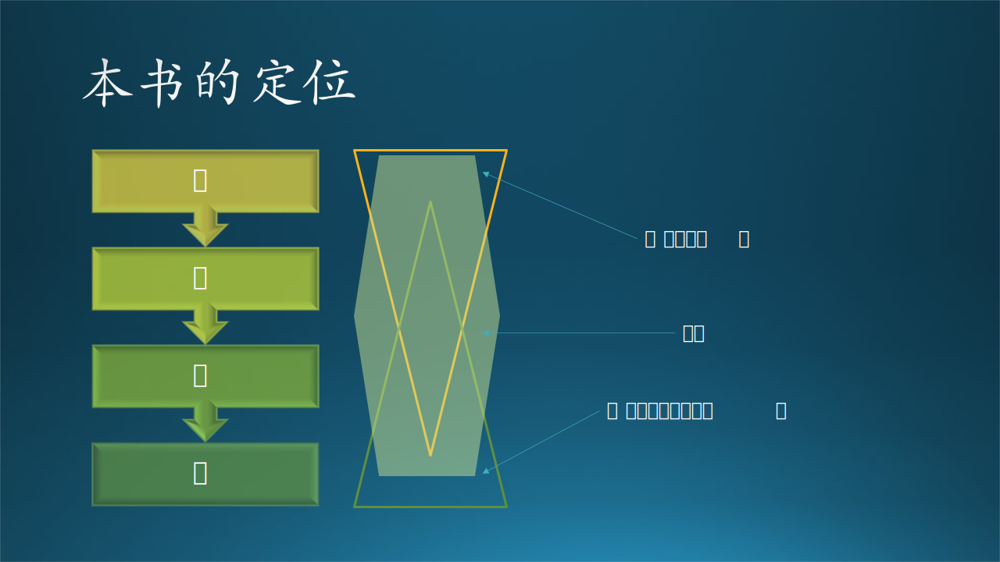

书名候选：

- 软件工程·最佳实践 The Best Practice for Software Engineering
- 微软的软件工程 Software Engineering @ Microsoft
- 微软软件工程实践 Practice of Software Engineering @ Microsoft

#  前言

## 1. 写作动机

笔者在微软（中国）工作多年，是一名名副其实的软件工程师。2018 年，机缘巧合，笔者在《构建之法》的作者邹欣老师的带领下，加入了微软亚洲研究院（Microsoft Research Asia，后文简称为 MSRA）工作。在这期间，邹老师一直是 MSRA 创新班联培博士生的“高级软件工程”课的主讲老师。对参加创新班的学生们（实习生）来说，他们虽然是来自国内各个知名大学中的佼佼者，但是软件工程一门偏实践的课程，不可能从书本上学到。这门课有 5 个学分，MSRA 的教学团队和同学们都非常重视这门课。

后来，邹老师由于家庭原因返回美国微软工作，那么给创新班的同学们讲软件工程课的任务就落到了笔者身上。就此机会，笔者也通读了《构建之法》一书，并结合自己在微软工作的实际经验，在原有课件上做了一些调整和改进。2021 年的秋季，给当年新加入创新班的学生们上了第一次课，每周一次，持续三个月，大概是 24~32 个课时。在课上，同学们以小组为单位，从一开始就选定一个实习项目，带着问题学习软件工程的主要概念和流程，并在每节课后立刻把相应的知识应用到项目上。这种在做中学（Learning by Doing）的讲课和学习方法令同学们感到很兴奋，对知识的记忆、理解、应用非常有帮助。一个学期结束后，同学们给与了积极的反馈，也得到了 MSRA 相关领导和部门的广泛好评，包括周礼栋院长、郭百宁副院长、Lily Sun 教学团队负责人、程骉（当时笔者的领导，很支持笔者的教学活动），以及评审团队和实习生的导师们。在此还要感谢提供工程实践项目的研究员和工程师们（排名不分先后）：谭旭、曹旭、张博、周海涛、王韵、黄河、董航、乔波、周梦宇、吴涛、刘乾、赵立。

这些正面的反馈，让笔者产生了自己写一本软件工程书籍的想法。

## 2. 写作经过

于是构思后动笔，先写的是第四步中的“用户与需求”中的第 6、7、8 等三章。后来发生了一件事令写作进度一度停止。偶然的机会认识了某出版社的一位编辑，就把这三章的草稿发给该编辑预览，几天之后得到的反馈是：“这本书没有很大的技术含量，不具备在我社出版的条件”。这令笔者很受打击：还在襁褓中的书稿就得到了负面的评价。

笔者静下心来仔细分析了一下：

1. 先写“用户与需求”部分，是因为笔者亲身经历或目睹过很多软件项目，在没有很明确的用户需求的前提下就盲目上马，违背了软件工程需求当先的基本规律，最后跌落马下。所以，笔者认为这一部分非常重要，而且是大多数传统的软件工程书籍中没有提及的。
2. 软件工程知识其实并不是主要讲技术，而是讲理念与流程。从本书的第一章中，读者可以知道与软件工程的相关学科数量是多么的庞大，那并非哗众取宠，而是实实在在的知识体系。就拿敏捷开发举例，它并没有讲什么技术，而是实践。
3. 在没有看到其它章节的内容甚至标题之前，这位编辑就反馈说“没有技术含量”，并且声明是“经过专家审阅的”，这令笔者很疑惑。

虽然认为这是那位编辑的一种误判，但是笔者的自信心也受到了一点点打击。而且，对于将要动笔的“设计与实现”部分，还没有什么很好的写作思路，所以就暂时搁置下来，转身去写强化学习书籍的草稿了。

过了大概一年的时间，微软（中国）市场部门的一位朋友韦青先生，请笔者给一个合资公司的员工讲课，话题是“微软的软件工程师文化”。笔者犹豫了一下，但还是答应了。因为这个话题给了笔者一些启示：

1. 既然软件工程不是纯粹讲技术的，那么它可以讲文化呀！
2. 什么是软件工程师文化呢？在微软这个全世界最大的软件工场里工作，它的内部文化、工作流程等等，当然就是软件工程师文化的一个代表，对于行业内的从业人员来说是极具参考价值的。
3. 当初的课件只是给 MSRA 创新班的两届学生（不到 60 人）讲过，不够“本儿”，应该拿出来和更多的人分享。

于是，笔者整理了一下以前的课件的 PPT，增加了一些内容，就去讲了两个小时，得到了很好的反馈。紧接着，微软（中国）研发部门的一位朋友李烨女士，负责 ATP（AI Talent Program）培训项目，请笔者讲同样的话题，但是这次是网络直播。原本预定 40 分钟的直播课程，笔者足足讲了两个小时，受到了热烈欢迎，创下了 ATP 直播课程历史上的最高点赞数量（4 万多点赞）记录。这件事给笔者以极大的动力来继续完成本书的写作。在此特别感谢韦青先生与李烨女士。

笔者并没有责怪当初的那位给与了负面反馈的编辑，因为笔者知道她并不是专家，她找的审稿人也不一定是真的专家（真的专家是在企业中培养的而不是在学校中），所以她的反馈并不一定能代表真实情况。与之相反，笔者从这些起伏转折中得到了启示，对于今后的写作思路非常有帮助。

斯文博士（《基于Python的金融分析与风险管理》一书的作者）说:"作者写书的目的绝对不是为了成就作者，而是为了成就每一位读者。" 所以，为了让读者真正了解软件工程，笔者又在业余时间开始“爬格子”。

在完成了大部分章节之后，笔者又邀请了步绍鹏和莫曲两位同事，分别执笔“测试与质量”和“界面与交互”两个部分。步绍鹏在测试理论与实践上有很深的造诣，有很强烈的写作愿望；而莫曲是一名视觉交互设计师（后文简称为 Designer），参与了很多项目的设计工作。他们的加入为本书提供了更加丰富的内容。

在最后一个部分“前言与探索”中，笔者在征求了一些与软件工程相关的前沿性的文章、论文的作者的同意之后，摘抄了这些文章、论文中的精华，都是与深度学习、ChatGPT 等相关的内容，因为让人工智能帮助人类编写代码是一种提高生产效率的最佳实践。但是笔者要指出的是，人工智能只能是一种辅助工具，而不能代替复杂的软件工程过程。历史上并没有出现过一名工匠创造了一种技术从而让自己失业的情况，这是一种悖论。而通过阅读本书第二部分的内容，读者可以明确知道人工智能只不过是具有超强的记忆和简单的推理能力，就好比人类的计算速度比电子计算器要慢很多，但是计算器代替的只是算盘，而不是人类本身。

在此要感谢提供文章、论文的原作者们（按小节顺序）：复旦大学 CodeWisdom 软件工程研究团队、彭鑫教授、微软亚洲研究院 DKI 组、王韵研究员、高彦杰研发工程师、昝道广研究员、陈蓓研究员。当然还有微软亚洲研究院的张冬梅大姐以及张海东、楼建光、韩石、林庆维等老师的支持。

## 3. 写作体会

纵观那些当作大学教材的传统的软件工程书籍，大概有几种情况：

1. 内容经典但是陈旧，与日新月异的软件工程发展相差较远。
2. 理论知识较多，几乎没有实践。
3. 作者一般都是教育界的，但软件工程却是一门实践课程。

前面提到过，6~8 三个章节是属于不吐不快，因为这些基本知识对于一个软件项目的成败太重要了，这些在传统教材中是没有的。2~5 四个章节属于素质培养，尤其是在写 2,3 两章时，笔者经历了大量的查阅资料与独立思考的过程，结合自身的软件工程实践知识，对简单易懂的理论知识以不同的解读，也重新建立了笔者自己的知识模型与认知模型。11~14 四个章节，属于笔者平时工作时的经历总结，因为在实际的工作中就需要做大量的设计工作，所以积累了很多设计素材，此时拿出来稍加整理即可。

以上这些章节既有理论知识做基础，也有实践过程做佐证，是马克思主义哲学中理论加实践的完美体现。而在中国古代的道家，也有经典的理论，这里不妨把大家耳熟能详的“道、法、术、器、势”拿出来做一个说明：

1. 对于初出茅庐的读者来说，往往是从“**器**”开始的，比如学习一种软件开发语言，掌握一个开发工具的使用等等。“奥迪”是器，“奥拓”也是器。工欲善其事，必先利其器。在走高速的时候，奥迪当然快；走盘山小路时，奥拓会更灵活。
2. 对于有经验的读者来说，学会了 Java，再去学 C#，就会觉得非常轻松，反之亦然。这就上升到了“**术**”的境界，可以融会贯通地掌握各种编程语言、工具、技术。相当于会开奥迪，也会开奥拓，它们没有本质区别。术，可以简单地理解为知识、技术、技能。
3. 有了技能之后，面对一个项目，我们采用什么样的语言、工具、技术来做分析、设计、实现？采用敏捷开发之道呢，还是用传统的瀑布开发模式呢？基于行业和市场分析，该软件产品的目标和策略是什么呢？这就是“**法**”。就好像从北京到哈尔滨，可以选择京哈高速一路到底，当然也可以走一些省道来节省高速费用。法，可以理解为方法，而软件工程主要强调的就是方法。
4. 然后是“**道**”。“朝闻道，夕死可矣”，强调了“道”的重要性，即一通百通的“天地法则”。软件工程中需要的“道”都在本书的各大章节标题中体现，如“基本概念、专业能力、认知能力、团队合作、开发流程、界面设计、交互设计、原型开发、技术架构、概要设计、详细设计、测试、质量控制、前沿探索”。
5. 最后，所谓“**势**”，是一种外部环境，比如市场环境、行业环境、政策环境等等，对于不同的软件而有所不同，这体现在本书的“用户与需求”部分中。前面四个部分是“炼内功”，最后的“势”是讲究顺势而为，不可逆势而行。

## 4. 本书特点

### 4.1 关于定位

作者在写作的时候，往往需要收集整理大量资料，然后把自己认为最重要最正确的精华呈现出来。但是，这样做的问题是，经过萃取的东西，一般读者是看不懂的。这是一种写作误区。笔者在写作本书的时候，同样也参考了很多书籍，包括人民邮电出版社出版的有关软件工程的书籍，其中《构建之法》和《代码中的软件工程》给笔者留下深刻印象。

如下图所示。

1. 《构建之法》是一个倒三角形，更多地侧重在上面的部分（道、法）。
2. 《代码中的软件工程》是一个正三角形，更多地侧重在下面的部分（器、术）。
3. 本书是一个六边形，侧重在“法、术”部分，对于“道、器”也有所涉及。

所以，这三本书形成了一个非常好的组合，能够覆盖软件工程中的道、法、术、器，不同层次的读者可以阅读不同书籍，或者通过组合阅读来获得全面的知识。**在软件工程中，道、法、术、器四个层次同样重要，并没有高低之分**。

笔者建议：

1. 对于没有什么编程经验的读者来说，首先要学习一门编程语言，Java、Python、C# 等等都可以，C++ 就稍微难一些，可以后学。
2. 阅读《代码中的软件工程》，以获得与代码相关的基本知识和一些工具的使用方法。
3. 阅读《构建之法》以获得软件工程的基本概念，也可以从中了解微软的一些历史。
4. 阅读本书以获得软件工程中每个环节的最佳实践指导。

社会上有些人称呼我们软件工程师为“码农”、“猴子”，笔者认为这些都是贬义词，指的是“技能设定简单而基础、可以被轻易取代的程序员或开发人员”，有时候也代指初级程序员。在国外，Code monkey（代码猴子）常被拿来和那些能够对软件/所开发项目提出建设性意见的“IT专家”做对比，以示揶揄和嘲讽。

所以，笔者强烈建议广大软件工程师努力学习技术和工程知识，用知识的力量武装自己，多交流、多思考、多学习、多合作，成为力大无穷的“程序猿”和和攻城拔寨的“攻城狮”，不要被人工智能所取代。

### 4.2 关于内容

本书的章节构成与《构建之法》非常相似，补充了很多《构建之法》中没有提及的知识，二者结合着阅读可以得到良好的效果。全书的 400 张左右的图片提供了非常好的阅读体验，每一章中的一两个故事及故事分析也具有强烈的代入感。

本书只在有必要的章节使用代码或公式来讲解软件工程的概念，绝大部分章节使用了叙事方式，以大量的真实案例恰到好处地引出基本的理论知识，风趣幽默。这类内容的书籍写起来非常枯燥，但是笔者采用了不同的视角和写作方法，一方面让笔者自己有兴趣写下去，另一方面也让读者有兴趣读下去。

**笔者在本书中介绍的关于微软的所有内容，仅代表作者本人的观点，并不代表微软官方**。书中的很多人物都是化名，请不要对号入座。情节上做了消密处理并有艺术加工，符合微软公司关于信息保密的规定。

关于最佳实践（Best Practice），本书中多处提及，是笔者在实践中总结出来的在笔者知识范围之内的“最佳”，不能保证它们在任何情况下都表现最佳，也没有和其它书籍或知识比较的意思。是否真的是“最佳”，请读者自己评判。

全书一共八个部分，十七个章节。软件工程是一个流程，所以这八个部分也是一个流程，所以可以称作为“步”，这让笔者想起了武侠小说中的“八步赶蝉”，也希望读者可以苦练内功，尽快掌握软件工程知识。所以我们不妨称之为软件工程的“八步学习法”。

### 4.3 关于“木头”

“木头”是一名软件工程师，给自己起了一个网名叫“木头”，为人也是有些木讷，在本书中，“木头”同学将成为所有故事的主角。虽然“木头”是一个虚构的人物，但是他所经历的故事都是在真实事件基础上经过微小改编的，只不过故事的原主人公可能是笔者，也可能是笔者的同事或朋友。

木头在公司里组建了一支大乐队，里面包含了若干支小乐队。木头把手中的资源，如排练场地、乐器、电子设备、演出机会等等，都分享给大家，独乐乐不如众乐乐。木头发现，乐队的组织形式和软件工程中的团队组织形式非常相似，经验可以互相借鉴。

## 5. 英文词汇

下表中包含在本书中用英文单词表示的词汇，有几种情况：

- 产品名称，如 Windows，没必要翻译成中文。
- 缩写，如 PM，没有准确的中文对应。
- 语言，如 Python，没有中文对应。
- 专有名词，如 Bug，中文较长：代码或设计中的缺陷。如果只说“缺陷”不够精确。

本书中的常用英文词汇表

|英文|类型|解释|
|:-:|-|-|
|AI|缩写|Artifical Intelligence，人工智能|
|APP|缩写|Application，一般指手机应用程序|
|Azure|产品名称|微软云服务|
|Bing|产品名称|微软必应搜索引擎|
|Bug|专有名词|软件开发中的设计或代码缺陷|
|C#|编程语言|
|Cortana|产品名词|微软小娜语音助手|
|D&I|缩写|Diversity & Inclusive，多元和包容，微软提倡的企业文化|
|Designer|专有名词|视觉和交互设计师，与“美工”区别较大|
|DEV|缩写|Developer，开发人员|
|Dev Lead|专有名词|处于基层开发小组中的组长，与组员有上下级关系|
|Dev Manager|专有名词|处于基层开发团队中的经理，与团队成员有上下级关系|
|DevOps|专有名词|开发人员项目工作流网站|
|Feature Team|专有名词|负责软件产品局部功能的小组，包含Dev、Designer、PM|
|FTE|缩写|Full Time Employee，全职/正式员工|
|GPU|缩写|Graphics Processing Unit，图形处理单元，用于深度学习中的矩阵运算|
|HR|缩写|Human Resource，人力资源|
|Lead|专有名词|小组领导，通常是 Senior 级别|
|Manager|专有名词|大组领导或经理，通常是 Principle 级别|
|ML|缩写|Machine Learning，机器学习|
|Office|产品名称|微软办公套件|
|PM|缩写|Project/Program/Product Manager，项目/过程/产品经理的统称|
|Principle|专有名词|直译没有意义，通常被译为“首席”，如首席工程师|
|Python|编程语言|
|SDE|缩写|Software Development Engineer，软件开发工程师|
|Senior|专有名词|表示职位级别，高级工程师或高级PM|
|Tech Lead|专有名词|处于基层开发小组中的技术指导（组长），与组员没有上下级关系|
|Teams|产品名称|微软在线会议系统|
|Team Worker|专有名词|善于团队合作的人|
|Vendor|专有名词|合同员工，非正式员工，由合作公司派遣来协助工作|
|V-Dev|专有名词|有开发技能的合同工|
|V-Test|专有名词|有测试技能的合同工|
|VS|产品名称|Visual Studio，软件开发工具|
|VSCode|产品名称|Visual Studio Code，软件开发工具|
|Web|专有名词|互联网、网页、页面服务器的统称|
|Windows|产品名称|微软视窗操作系统|
