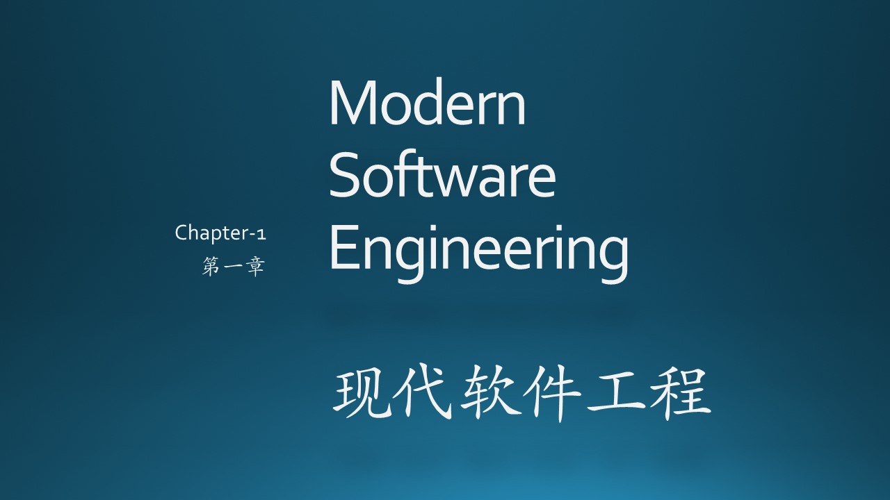
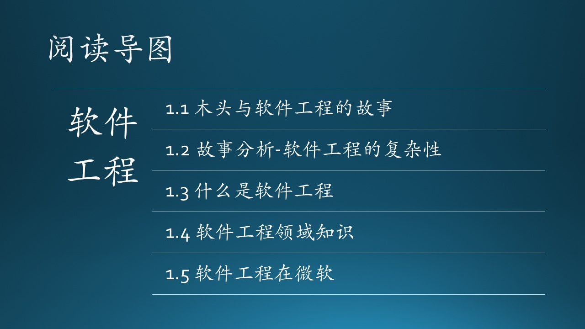

（插入一些说明性文字，重点在介绍上下文，串连）

### 思考与练习

1. 在发布渠道/方式上，你还有什么建议？
2. 你觉得木头后面还会遇到什么麻烦？
3. 除了产品、项目、服务这种分类以外，你还见过什么软件开发组织模式？与这三种有何区别？
4. 微软为什么要取消测试职位？肯定不是缺钱，你能想出来其原因吗？

### 参考资料

1. 故事的原始情节来自于《构建之法》但是有所修改
2. https://en.wikipedia.org/wiki/History_of_software_engineering
3. https://en.wikipedia.org/wiki/Computer_science
4. https://ieeecs-media.computer.org/media/education/swebok/swebok-v3.pdf

### 参考资料

1. 《实用软件工程》第二版，郑人杰等，清华大学出版社
2. 《构建之法》，邹欣，人民邮电出版社
3. https://en.wikipedia.org/wiki/History_of_software_engineering
4. https://en.wikipedia.org/wiki/Computer_science
5. https://ieeecs-media.computer.org/media/education/swebok/swebok-v3.pdf
