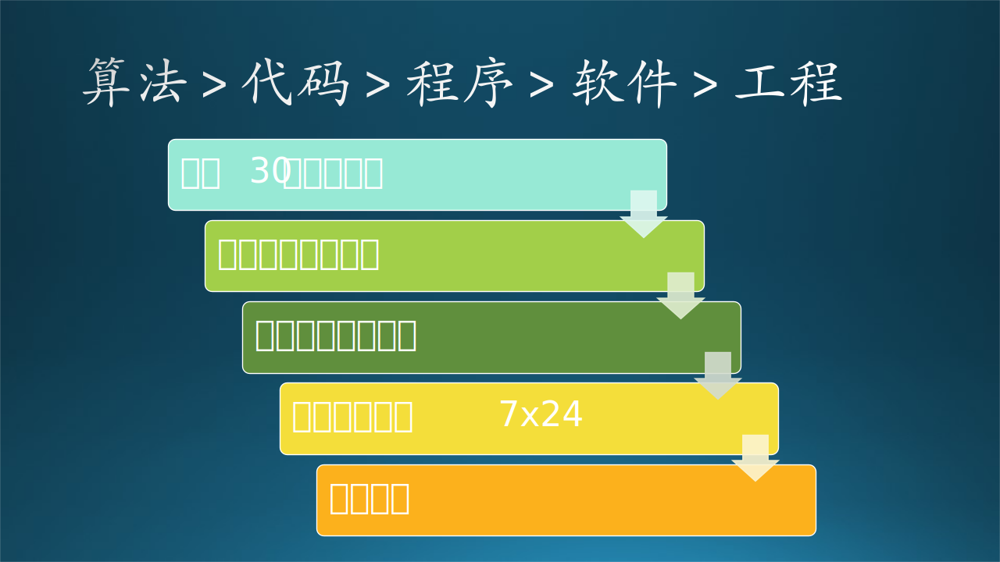

## 1.1 软件工程的故事

“木头”是一名软件工程师，给自己起了一个网名叫“木头”，为人也是有些木讷，在本书中，“木头”同学将成为所有故事的主角。

该故事的原始情节来源于《构建之法》但是有所修改。

木头有个朋友是小学数学老师，在一次聚会闲聊中，这位老师询问能不能用当今热门的 AI 来辅助教育。平时不爱说话的木头一听就来了精气神儿，这个是自己的专业呀！木头借着酒劲儿吹了个牛：“如果是小学数学题的话，根本不需要什么 AI，用个小程序就可以解决了。”

于是，木头为吹牛付出了微小代价：朋友请他实现那个小程序，目标是每天出 20 道 100 以内的加减法算术题。这个对木头来说很容易，花了 1 个小时用 C# 搞定。

故事结束了......吗？刚刚开始呢！一系列“麻烦”在等待着木头。图 1-1 做了一个简单的“麻烦”预告。

图 1-1 木头遇到的麻烦

### 1.1.1 麻烦一：如何运行

木头把 C# 代码传给了朋友，没想到朋友问了一个很初级的问题：如何运行这个程序？

这对于木头来说，就好比问每天如何刷牙洗脸，但是对于朋友（客户）来说，就需要以下步骤来实现运行程序的目标：

（1）确认操作系统是不是 Windows 10，如果不是需要升级；
（2）下载并安装 Visual Studio 2019 Community 版本，有可能朋友搞不清楚“企业版（Enterprise）、专业版（Professional）、社区版（Community）” 三个版本的区别；
（3）打开 Visual Studio 后加载工程，然后运行代码。

这个要求对朋友和他的低配计算机来说就是一个灾难。木头想，那做一个可执行程序吧！因为朋友信赖木头，所以不会怀疑这个可执行程序是带病毒的。可是当得知朋友的计算机操作系统是苹果电脑系统（Mac OS）的时候，木头又犯嘀咕了：很多用户面对好端端的 Windows 10 不用，偏要跟时尚买苹果电脑。我自己又没有苹果电脑，跨平台怎么办？......干脆用 Python 吧！

于是木头又用 Python 实现了那个小程序，然后告诉朋友如何安装 Python 库，如何运行 Python 程序......，反正是花在沟通上的时间比编写程序的时间多很多倍！但是，当朋友磕磕绊绊地运行了程序，得到了第一批 30 道算术题时，双方都认为付出是值得的！

### 1.1.2 麻烦二：如何发布

可是接下来朋友的问题又让木头傻眼了：如何把程序运行的结果发布给学生呢？总不能让学生都安装 Python 后来运行代码吧？这是小学数学课，不是大学计算机课。如果想依赖家长完成安装同样不靠谱，家长的水平也是参差不齐的。

想来想去，想到了微信小程序！于是木头又花了一周的时间学习了如何制作微信小程序，完全是 Mobile 客户端的开发模式，很多概念需要熟悉，还要熟悉框架、组件、API 等等，好多坑要踩！

一周后，当小程序出现在朋友的手机上时，双方又都觉得付出是值得的！！

### 1.1.3 麻烦三：如何使用

小程序发布给学生家长并运行一周后，老师受不了了：家长们把作业结果截屏后都发送给了老师，让老师判作业。但是，有一个问题没有想到：木头使用了随机种子算法，所以每个同学得到的算术题都不一样，答案自然就不一样。如果全部 50 个学生，相当于老师要自己每天做 $50 \times 20=1000$ 道算数题，基本就没时间干别的了，而且还遭到了校长的批评：某某老师上班时间不工作总看微信！(其实是老师在判作业)

木头也觉得过意不去了，赶紧改程序，变成自动判作业：家长口述题目给学生，学生口述答案给家长，家长填写答案。全部完成后，点击“判作业”按钮，再把分数提交给老师。

这一下老师轻松多了，和木头聊天时，双方还是都觉得付出是值得的！！！

### 1.1.4 麻烦四：如何升级

下半学期开始了，同学们要学习乘除法了。如果和加减法混在一起的话，还需要用括号来表示运算优先级。

这难不倒木头，又花了一个周末搞定，让老师重新发布。结果，有的家长升级了小程序，有的家长没有升级，微信群里面很热闹，老师很头疼......

木头在责任心驱使下，再次出马，使用微软云平台（后文简称为 Azure），把出题程序运行在了云端，解决了很多问题：
（1）客户端升级问题不存在了；
（2）给每个同学的题目不一致的问题不存在了；
（3） 家长不用给老师发微信提交作业了，全都在云端存储。

但是这个 Azure 平台也不是免费的呀？好在并不贵，木头自己先垫付了，打算以后和学校商量让学校出钱。木头看到平台每天都在稳定地运行状态，觉得自己为教育做出了贡献，很值得！！！！

### 1.1.5 麻烦五：如何维护

在学校出钱购买了微软云服务后，还付给了木头一小笔劳务费，木头笑纳了，但笑容很快就凝固了：五年级的老师知道了这件事情，希望系统能够出一元二次方程的题目。

家长们也纷纷表示一元二次的题目很便宜了，只需要 0.5 元一次，因为听说有的学校的方程题目要二元一次呢，贵了 4 倍！（哈哈哈哈，家长们很精明。）

另外，还需要能够提供 7x24 小时服务，学生随时可以申请“加餐”做题，而不是只有老师留作业的方式。

木头又搞了几个周末，总算可以出解方程的题目了，并且提供了按需（On Demand）出题的方式。部署到云端后效果非常不错，觉得自己的贡献从一年级到五年级，非常值得！！！！！

### 1.1.6 麻烦六：如何支持

基于微软 Azure 平台的出题系统非常成功，校长到处宣传，逢人便讲。一个国际学校的老师知道了这件事，联系到了木头，希望可以提供英文界面，便于外国学生使用。

木头感觉自己肩上的担子越来越重，那点儿劳务费还不够电费呢......没办法，硬着头皮上吧！后面指不定还有什么需求呢？
