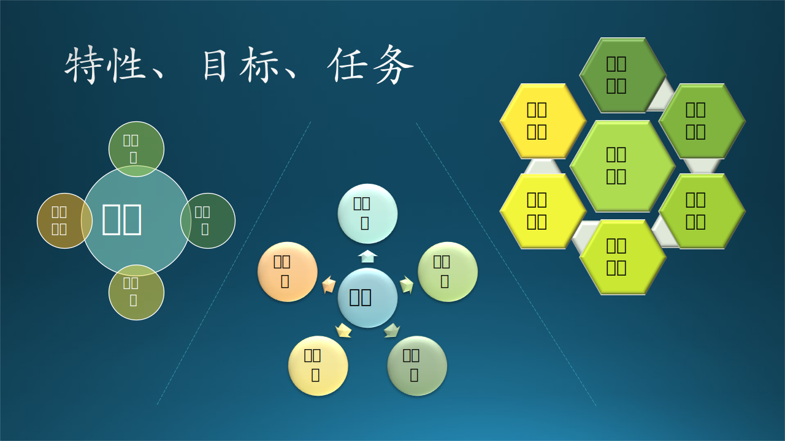

## 1.3 什么是软件工程？

### 1.3.1 定义

好了，我们终于进入正题了：什么是软件工程？

在式 1.1~1.8 中，我们看到了一系列在“软件”这个名词之外的概念，这些概念的组合就是软件工程所涵盖的范围，但还不止于此。

软件工程的完整定义是：

**科学技术知识、方法和经验在软件设计、实施、测试和文档编制中的系统应用，在实施过程中，把系统化、规范化、量化的方法应用在开发、运行、维护中。如果说以上都是手段的话，那么软件工程最终想达到的目的是：建立和使用合理的工程原理，以便经济地开发出可靠的软件，并在真实机器上高效地运行。$^{[1]}$**

### 1.3.2 特性

#### 1. 复杂性

复杂性的根本来源是需求的复杂性，它将会带来以下问题：

- 需求分析过程可能会产生误差，由于需求分析是第一步，它的错误会导致差之毫厘谬之千里。比如，一个用户说“我需要我的三个孩子可以一起玩儿这个秋千”，这就是一个不准确的描述：是一个孩子坐在秋千上另外两个孩子在下面推秋千呢，还是三个孩子都坐在秋千上？

- 设计阶段需要考虑更多的因素。如果秋千只有一个孩子玩儿，那么绳子就不需要非常粗，座椅也不需很大。但是三个孩子一起玩儿，非常有可能他们会同时爬上秋千，那么就需要更安全更舒适的设计。

- 如果项目复杂，会在具体实现时给项目组成员的交流带来困难，从而导致产品的瑕疵、开支过多和时间耽搁。各个功能模块之间的调用关系也会随着软件的复杂度的增加而变得复杂，这使得软件变得很难去使用。

- 在测试时，复杂性给我们穷举所有软件可能的状态带来了不少的困难，进而导致软件最后的不可靠性。

- 复杂的软件结构同样会使得软件的扩展性和安全性受到影响，当然其可维护性也会变得很差，就如同一个管理不善的机房中的盘根错节的电源线和数据线。

所以，一个软件的功能如果从 10 个增加到 20 个，那么可能会花费 3~4 倍的时间来达到同样的质量，使得随着软件规模的增加其复杂度的增加是非线性的。

#### 2. 一致性

一个软件往往是由不同的人一起开发出来的，因此软件开发者不得不设计出符合各种接口的软件来，这个困难往往随着时间变化，甚至随着不同的应用场合而变化。具体表现在：

- 软件不能独立存在，要依附于一定的环境（如硬件、网络、以及其他软件） 。
- 软件必须遵循从人为的惯例并适应已有的技术和系统。
- 软件需要随从接口不同而变化，随着时间推移而变化，而这些变化是不同人设计的结果。

#### 3. 可变性

软件相对于其它的传统产品，要更容易修改，而且修改的频率要比传统的产品大；一个成功的软件必须要能够适应用户的各种需求。比如，有些用户就是喜欢去试探那些超出软件工作域的情形，软件开发者设计的软件必须要能够面对这些挑战而不崩溃。但是在一开始不可能全部知道，所以软件更新是软件发布后的家常便饭，或者因为弥补缺陷，或者因为增加功能。

#### 4. 不可见性

软件不同于其它设计，软件没有空间性，所以具有不可见性的特点。有向图帮了软件工作者一个大忙，软件工作者可以用有向图来表示出控制流，数据流，模式的依赖，时间序列，命名空间的关系，但是尽管是这样软件开发还是存在内在的不可见性，这都将成为阻碍软件设计和各个软件工作者交流的主要障碍。

### 1.3.3 目标

软件工程的基本特性如图 1-4 左侧子图所示，而基本目标如中间子图所示。

图 1-4 软件工程的基本目标

五个基本目标是：

- 功能达标：这是首要的指标，相对来说比较容易衡量，不能达标就不能发布软件。

- 性能良好：在功能达标的基础上，软件运行得越快越好，即提高响应速度，减少用户等待时间，合理使用 CPU 及内存资源。

- 按时交付：根据需求估算好开发时间，做好开发计划，组织足够的资源（人员及软硬件设备）投入，并严格执行软件工程。

- 开发成本低：合理搭配高级开发人员与中低级开发人员，形成良好的开发体系，才会从长远角度降低开发成本。

- 维护费用低：由于软件运行环境发生变化，出现以前没有发生过的故障时，诊断和修复故障的难度要尽量小，所需时间尽量短，所需人员尽量少。另外一种情况是客户在现有功能基础上有新的需求，但并非那种颠覆性的改变，在现有基础上改进即可。这就要求软件当初的设计要合理，流程清晰，接口明确，便于快速确定新功能的插入点；测试手段齐全，运行日志完整不冗余，便于故障定位。

但是，上面几个基本目标大部分是相互矛盾的，比如：

- 如果缩短需求、开发、测试时间，降低对文档的要求，可以缩短整体时间而按时交付，但是会对功能、性能等指标都带来很大的影响。

- 如果招募经验较少薪水低的软件开发人员，或者压缩总体开发时间，将会降低成本，但是将会带来严重的质量问题，功能和性能都很难达标。

### 1.3.4 任务

在一个大型的软件产品项目中，软件工程包括图 1-4 右侧子图所示的这些分阶段的任务：

#### 1. 商业计划

根据客观存在的实际需求，制定软件开发计划，意图用软件系统帮助人们提高工作效率或者提高生活质量，从而使得软件开发商赢得利润。这部分不属于本书讨论的范围。

#### 2. 需求分析

需求工程是关于软件需求的获取、分析、规范和验证。软件需求可以有三种不同类型：有功能需求、非功能需求和领域需求。

- 功能需求处理用户执行的操作，并得到期望的合理输出。

- 非功能需求处理可移植性、安全性、可维护性、可靠性、可伸缩性、性能、可重用性和灵活性等问题。它们分为以下类型：接口约束、性能约束（如响应时间、安全性、存储空间等）、操作约束、生命周期约束（可维护性、可移植性等）和经济约束。在指定非功能需求时，需要了解系统或软件的工作方式。

- 领域需求必须与特定类别或项目领域的特征有关，严格来讲属于非功能的一部分。

#### 3. 系统设计

软件设计是定义系统或组件的架构、组件、接口和其他特性的过程。这也称为软件架构。软件设计分为三个不同的设计层次，分别是界面设计、建筑设计和详细设计。

- 界面设计是系统与其环境之间的交互。这与系统的内部工作一起发生在高抽象级别。
- 架构设计与系统的主要组件及其职责、属性、接口以及它们之间的关系和交互有关。
- 详细设计是所有主要系统组件的内部元素、它们的属性、关系、处理，通常是它们的算法和数据结构。

#### 4. 软件开发

软件构建和开发的主要活动是编程、单元测试和调试的结合。此阶段的测试通常由程序员在软件构建过程中执行，以验证刚刚编写的内容，验证通过后即可进行下一步的工作。

#### 5. 测试分析

软件测试是一项经验性的技术探查，旨在通过不同的测试方法提供有关被测产品或服务质量的信息。这是软件质量的一个方面。作为软件开发的一个独立阶段，它通常由质量保证人员或开发人员执行，而不是编写代码的人员。

软件分析是分析计算机程序的性能、鲁棒性和安全性的过程。它可以在不执行程序（静态程序分析）、运行时（动态程序分析）或两者的组合的情况下执行。

#### 6. 运行维护

软件维护是指在软件产品发布后提供经济高效的支持。软件维护是在发布后修改和更新软件应用程序，以纠正故障并提高其性能。软件与现实世界有很大关系，当现实世界发生变化时，需要软件维护。软件维护包括：纠错、优化、删除未使用和丢弃的功能，以及增强已存在的功能。通常，维护占项目成本的 40% 至 80% 左右，因此，注重维护可以降低成本。

### 1.3.5 简史

我们用一张表简单地说明一下软件工程简史，见表 1-1。

表 1-1 软件工程简史$^{[2]}$

|年代|关键词|事件|
|---|---|---|
|60年代|初创|软件工程被提出并命名|
|70年代|危机|超预算、引发财产损失和生命危险，从关注生产力到关注质量|
|80年代|银弹|从业者从各个角度寻找“银弹”来解决危机，但是每一种方案只能带动局部的改进|
|90年代|互联网|建立在HTML基础上的互联网技术促进了软件行业的发展，出现了浏览器、电子邮件、搜索引擎、多语言系统等等，适用于大型软件的软件工程方法逐步成熟|
|21世纪|轻量|出现了很多轻量级的软件工程方法，适用于中小型软件的开发|

工程的概念早就出现了，从 20 世纪 60 年代开始，软件工程被视为独立的工程类型。此外，软件工程的发展很举步维艰，与硬件的匹配很难，这给软件工程师带来了很多问题。其它问题包括：超出预算，超过截止日期，需要大量的调试和维护，无法满足消费者的需求，甚至根本没有如约完成。

1968 年，北大西洋公约组织（North Atlantic Treaty Organization，NATO）召开了第一次软件工程会议，讨论了与软件相关的问题，制定了软件开发的指导方针和最佳实践。“软件工程”一词的起源有多种来源。“软件工程”一词出现在 1965 年 6 月出版的《计算机与自动化》杂志上的公司提供的服务列表中，并在 1966 年 8 月出版的美国计算机学会通讯（第 9 卷第 8 号）“致美国计算机学会会员的信”中被更正式地使用。

发展了 20 多年后，随着项目的大型化和复杂化，软件工程逐渐出现了危机。超出预算是最主要的经济问题，而由于软件的不稳定造成的财产损失甚至带来生命危险（如航空航天领域）则更加严重。于是，人们逐步从关注生产力（快速地发布软件）过渡到更多地关注软件质量，并达成了共识：只有到达质量标准的软件才算作真正的软件产品。

《没有银弹：软件工程的本质性与附属性工作》（原英文名称：No Silver Bullet—Essence and Accidents of Software Engineering）是 IBM 大型机之父佛瑞德·布鲁克斯（）所发表一篇关于软件工程的经典论文，原先是在1986年都柏林IFIP研讨会的一篇受邀论文，隔年电机电子工程师学会《Computer》也转载了这篇文章，他们用了几张《伦敦狼人》之类的电影剧照来当作说明，还加上了一段“终结狼人”的附注，因为传说要消灭狼人只能用银质的子弹。

银弹是人们试图解决软件危机的方法，但是，最终大家发现，根本没有银弹，只能逐步地从局部改进软件工程中的各种问题，形成严谨的工作流程。到此，软件产品还是以传统的产品生态（图1-3）为主。

到了 90 年代，互联网的出现给软件开发带来了新的要求，也产生了新的软件形式。

到了 2000 年以后的 20 年中，从移动端到云端的发展，构成了现代软件服务的基础。其中，不同于传统观念的轻量敏捷开发广受大家的重视。

