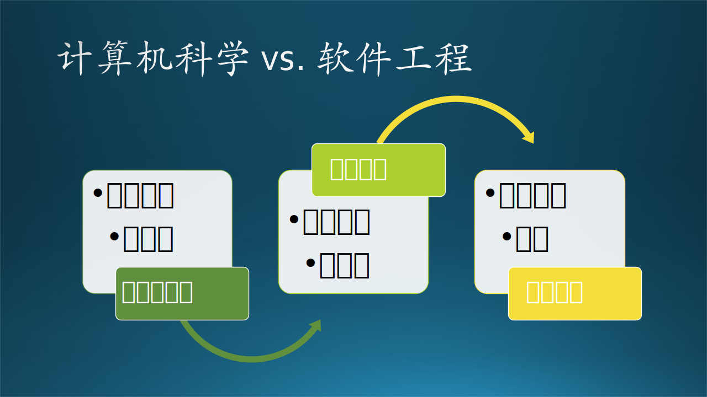

## 1.4 软件工程领域知识

### 1.4.1 软件工程与计算机科学

我们先看一下计算机科学所涵盖的学科$^{[3]}$：

- 理论计算科学（Theoretical computer science）
    - 理论计算（Theory of computation）
    - 信息编码（Information and coding theory）
    - 数据机构与算法（Data structures and algorithms）
    - 编程语言（Programming language theory）
    - 形式化方法（Formal methods）
- 计算机系统（Computer systems）
    - 计算机体系结构与计算机工程（Computer architecture and computer engineering）
    - 计算机性能分析（Computer performance analysis）
    - 并行和分布计算（Concurrent, parallel and distributed systems）
    - 计算机网络（Computer networks）
    - 计算机安全与密码学（Computer security and cryptography）
    - 数据库（Databases）
- 计算机应用（Computer applications）
    - 计算机图形学与可视化（Computer graphics and visualization）
    - 人机交互（Human-computer interaction）
    - 科学计算与仿真（Scientific computing and simulation）
    - 人工智能（Artificial intelligence）
- **软件工程（Software engineering）**
    - 软件需求（Software requirements）
    - 软件设计（Software design）
    - 软件开发（Software development）
    - 软件测试（Software testing）
    - 软件维护（Software maintenance）

**请注意：计算机科学的最后一个子类就是软件工程！我们通常所听说的“二者是并列关系”的说法是不正确的。**

造成误解的原因是，在我国大学教育体系的本科生培养中，与计算机相关的专业有：软件工程、计算机科学、物联网工程、信息安全、数字媒体技术等专业，为了面向职业发展而把这几者混淆在了一起。其中，“理论计算科学”和“计算机系统”两个大类，是为了培养硕士或博士打基础，搞理论研究；“计算机应用”可以有硕士和博士；“软件工程”最高到工学硕士，毕业后“进化为”程序员或工程师。

“程序猿”和“攻城狮”是业界对于程序员和工程师的昵称，笔者认为它们并非贬义词，而是很形象地说明了这种职业的特点：力大无穷（知识的力量），攻城拔寨（解决各种软硬件问题），勇往直前。

表 1-2 计算机科学与软件工程学的比较

||计算机科学|软件工程|
|---|---|---|
|本科生|理学或工学学士|工学学士|
|研究生|理学硕士|工学硕士（较少）|
|博士生|理学博士|无|
|侧重|原创理论研究|成熟应用实践|
|策略|效果影响力优先|成本与效果的折中|
|成果|论文|项目、产品|

表 1-2 展示了二者的区别。简单地说，计算机科学是科学家、研究员们发现规律、研究理论，并试图从根本上把规律理论化、公式化，不太在意成本，只在意效果。在图 1-5 中展示了计算机科学与软件工程之间的衔接关系。

图 1-5 计算机科学与软件工程的关系

软件工程发展了这么多年，早已经形成了一套科学的、成熟的方法做理论指导，当然可以算作计算机科学的一部分。工程师和程序员们，侧重于用成熟的方法解决实际问题，要在成本和效果二者之间做折中考虑。

### 1.4.2 领域知识

在软件工程领域知识（Software Engineering Body of Knowledge，SWEBOK）$^{[4]}$ V3.0  版本中描述了软件工程的领域知识。

我们在这一节中并不展开讲解，只是罗列一下知识领域（Knowledge Area），让大家可以粗略地认识到软件工程的复杂性，便于做好学习本书的充分准备。具体细节会渗透在后面的每一章节中。

图 1-6 软件工程知识领域

图 1-6 列出了 15 个知识领域及其分类，详细说明在表 1-3 中。

表 1-3 软件工程的 15 个知识领域

|序号|英文名称|中文名称|说明|
|--|--|--|--|
||**Development**|**软件开发领域**|**这是初级软件开发人员必须入门的知识领域**|
|1|Software Requirements|软件需求|需求获取、需求分析、需求描述、需求验证、需求变更、需求控制等|
|2|Software Design|软件设计|技术/框架选型、结构/架构设计、用户界面设计、组件/接口设计等|
|3|Software Construction|软件构建|程序编码、单元测试、集成测试的过程|
|4|Software Testing|软件测试|用事先设计的好的测试用例检测软件错误和失败|
||**Management**|**软件管理领域**|**这是一般的管理层需要了解的知识领域**|
|5|Software Maintenance|软件维护|根据反馈意见和新需求做软件的修改、测试、更新|
|6|Software Configuration Management|软件配置管理|简单地理解就是版本控制，是一个时间点上所有与软件相关的信息的快照|
|7|Software Quality|软件质量|目标、评审、总结报告等|
||**Engineering**|**工程实践领域**|**这是比较资深的项目管理者需要了解的知识领域**|
|8|Software Engineering Management|软件工程管理|针对软件开发的启动、规划、实施、监控、结束等|
|9|Software Engineering Process|软件工程过程|软件生命周期过程本身的定义、实现、评估、管理、变更和改进|
|10|Software Engineering Models and Methods|软件工程 模型与方法|在软件的生产与使用、退役等各个过程中的参考模型的总称，诸如需求开发模型、架构设计模型等都属于软件工程模型的范畴；软件开发方法，主要讨论软件开发各种方法及其工作模型|
|11|Software Engineering Professional Practice|软件工程 职业实践|软件工程师应履行其实践承诺，使用软件的需求分析、规格说明、设计、开发、测试和维护成为一项有益受人尊敬的职业；还包括团队精神和沟通技巧等内容|
|12|Software Engineering Economics|软件工程经济|研究为实现特定功能需求的软件工程项目而提出的在技术方案、生产（开发）过程、产品或服务等方面所做的经济服务与论证、计算与比较的一门系统方法论学科|
||**Foundation**|**基础知识领域**|**这是高级软件开发人员需要了解的知识领域**|
|13|Computing Foundations|计算基础|解决问题的技巧、抽象、编程基础、编程语言的基础知识、调试工具和技术、数据结构和表示、算法和复杂度、系统的基本概念、计算机的组织结构、编译基础知识、操作系统基础知识，数据库基础知识和数据管理、网络通信基础知识、并行和分布式计算、基本的用户人为因素、基本的开发人员人为因素和安全的软件开发和维护等方面的内容|
|14|Mathematical Foundations|数学基础|集合、关系和函数，基本的逻辑、证明技巧、计算的基础知识、图和树、离散概率、有限状态机、语法，数字精度、准确性和错误，数论和代数结构等方面的内容|
|15|Engineering Foundations|工程基础|实验方法和实验技术、统计分析、度量、工程设计，建模、模拟和建立原型，标准和影响因素分析等方面的内容|

表 1-4 列出了 7 个相关学科，在大学中都有相关的专业课程来培养软件工程师。

表 1-4 软件工程的 7 个相关学科

|序号|英文名称|中文名称|
|---|---|---|
|1|Computer Engineering|计算机工程|
|2|Computer Science|计算机科学|
|3|General Management|通用管理学|
|4|Mathematics|数学|
|5|Project Management|项目管理|
|6|Quality Management|质量管理|
|7|Systems Engineering|系统工程|

有的读者肯定会有疑问：把稍微沾上点边儿的领域或学科都算作基础，这是不是有些夸大了？

包括笔者在写本书之前，也会有同样的疑问。但是笔者在写作的时候翻阅了大量的资料，除了软件工程本身外，还有教育学、心理学、逻辑学、管理学的书籍文章，甚至有时候要学习一些哲学思想，这才相信上述表格并非夸大其词。
