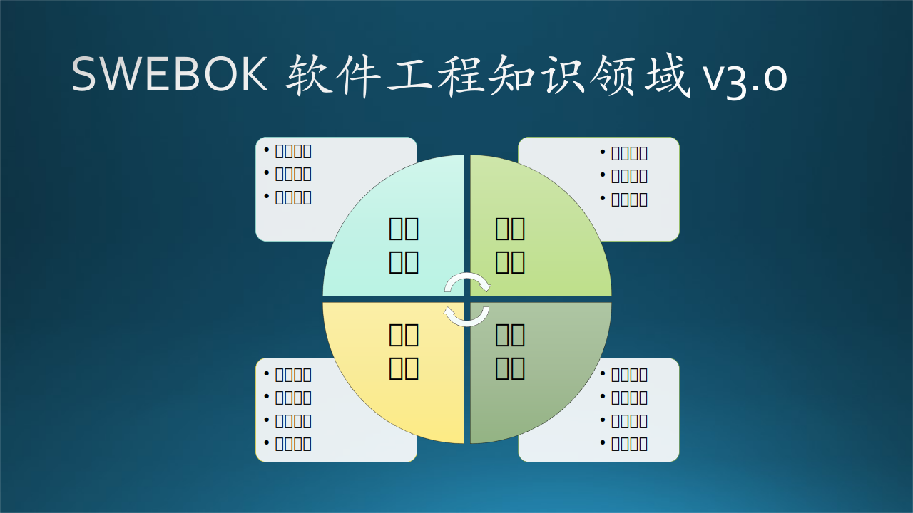
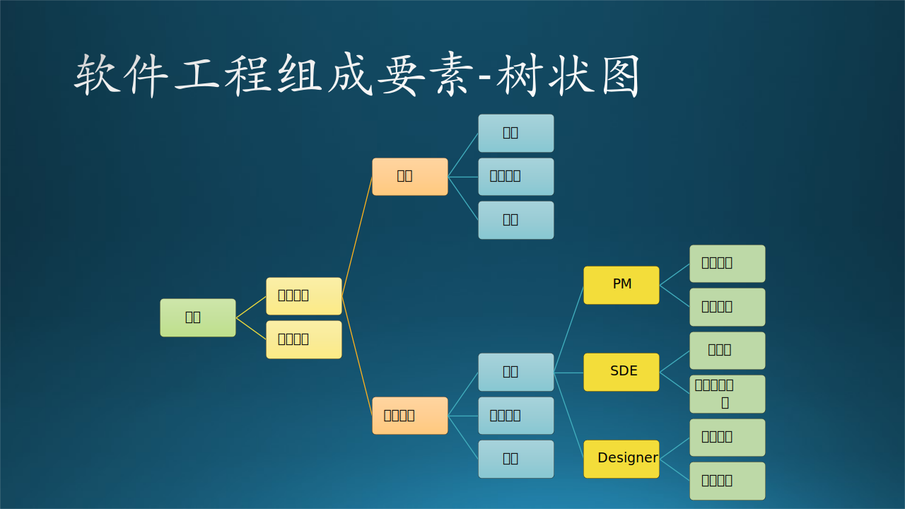

## 1.5 软件工程在微软

### 1.5.1 微软的软件工程组成要素

微软（Microsoft）是以提供软件为主要盈利手段的公司。描述像微软这样的软件公司的软件开发模式也可以使用几个公式，如图 1-8 所示。

图 1-8 微软的软件工程的组成要素（公式）

#### 1. 程序

$$
程序 = 算法+模型+数据结构 \tag{1.9}
$$

传统的程序只是算法和数据结构的组合，但是在 AI 迅猛发展的今天，没有个“模型”在程序里，都不好意思出门和人家打招呼。这虽然只是个笑话，但是说明了 AI 的影响力度和普及速度。

模型，一般是指机器学习或深度学习训练出来的模型（Model），里面既有逻辑又有数据，所以它既不是单纯的算法也不是单纯的数据结构。微软在 AI 领域的积累，使得很多程序都可以有模型的助力而变得“聪明”。

#### 2. 软件开发工程师

在微软的程序员叫做开发人员（Developer，DEV）或者软件开发工程师（Software Development Engineer，SDE），后文中根据不同场景简称为软件工程师（与硬件工程师区分）、工程师（与研究员区分）、开发人员（与项目管理人员区分）、Dev（与测试人员区分）、SDE（与管理者区分）。

以前有测试角色时，开发人员和测试人员（Tester）是独立的，与项目管理人员一起形成铁三角（Triangle，理论上认为具有稳定性），后来取消了测试人员的角色，开发人员同时负责测试，称为软件开发工程师。

$$
软件开发工程师 = 程序员 + 软件工程知识 \tag{1.10}
$$

刚从学校毕业进入微软工作的，只能叫做程序员。经过一段时间培训、磨合之后，软件工程知识越来越多，就可以成为真正的软件工程师了。

有的人会问：在学校里学习的软件工程知识不够用吗？笔者只能说那些知识根本不够用，否则也不会写这本书了。

#### 3. 项目管理人员（PM）

$$
PM = 项目管理 + 产品管理 \tag{1.11}
$$

PM = Program Manager，直译为程序经理，但实际上是项目管理（Project Manager）和产品管理（Product Manager）的二合一角色，所以没有准确的中文翻译（在本书中后续都称作 PM）。

如何定义 PM 的工作呢？简单地说，凡是程序员做不了的事，都由 PM 来做。我们在后面相关章节会有说明。

#### 4. 功能小组（Feature Team）

功能小组是一个团队，在微软叫做 feature team，或者 feature crew。

$$
功能小组 = PM + SDE + Designer \tag{1.12}
$$

Designer 直译就是设计师，负责用户界面和交互的设计。在本书中后续称作 Designer，避免和架构设计师（Architect）混淆。微软有一套 Designer 要遵守的设计概念，使得微软的同类型产品具有整齐划一的界面交互风格。比如，Office（微软办公产品套件）是一类风格，Windows（微软桌面操作系统）有自己的风格，Azure（微软云服务）网页界面也有统一的风格。

通常情况下，PM 和软件开发工程师是长期合作的，但是互相没有下级的汇报（report）关系；而 Designer 有自己的独立组织，与功能小组是临时合作。

以前微软还有测试的职位，后来被取消了，由整个功能小组自己负责测试，并有自动化测试流程辅助。如果需要深度（手工）测试，就请外包测试人员来完成。

#### 5. 软件工程

$$
软件工程 = 功能小组 + 过程定义 + 执行 \tag{1.13}
$$

软件工程不只是软件工程师的事，而是整个功能小组的事。比如需求和过程管理要靠 PM，界面设计要靠 Designer。

#### 6. 软件产品

$$
软件产品 = 程序 + 软件工程 \tag{1.14}
$$

#### 7. 软件公司

$$
微软 = 软件产品 + 商业模式 \tag{1.15}
$$

图 1-9 以树状图的形式展示了微软的软件工程组成要素。

图 1-9 微软的软件工程组成要素（树状图）

### 1.5.2 软件商业模式

商业模式不是本书的讨论范围，但是有三个概念要简单说一下：产品、项目、服务。

表 1-5 软件商业模式

||产品|项目|服务|
|-|-|-|-|
|开发周期|长期迭代|短期完毕|长期迭代|
|目标客户|特定人群|特定客户|组织或公司|
|需求来源|自定义|客户定制|自定义|
|开发模式|功能迭代|特定功能|功能替换|
|团队规模|中|小|大|
|发表渠道|客户端软件|定制软件包|云端服务|
|交付方式|可执行文件|源代码+可执行文件|API调用|
|盈利模式|一次性购置费|项目服务费+后期维护费|一次性购置费+长期的服务费|

表 1-5 展示了它们的区别，下面详细解释一下。

#### 1. 产品

我们以微软为例，产品包括：Windows、Office、Visual Studio 等等，以客户端软件为主。其特点是由微软决定要做什么，给客户提供什么，具有长期规划，不断迭代。比如，微软认为 Windows 要提供给所有使用台式机的用户，Office 要提供给白领办公人群，Visual Studio 只提供给开发人员。每次更新，都是在现有基础上增加一些小的功能；而大版本号的更新则是提供了原有框架之外的功能，比如 Visual Studio 2019 提供了与微软云集成的众多功能，而这些功能在上一个大版本中并不存在。这些产品都是由微软内部专门的团队负责的，通常在 500~5000 人左右。

#### 2. 项目

项目包括两类：一种是狭义的，在销售给客户产品后，再同时开发/提供一些定制软件，比如银行买了微软的服务器和数据库，或者买了云资源，那么会有配套的开发人员进行售后服务，帮助银行开发产品。这种项目的研发人员一般比较少，10 几个人就可以完成。

另外一种是广义的，比如给必应搜索（后文简称为 Bing）做一个局部的服务，或者给 Power Point 增加一个新的功能（feature），都可以用项目的形式来组织，虽然其宿主是服务或者产品。这种组织一般会有 20~50 人不等，然后又会被分成 5、6 个人一组，完成一个小功能。

还有一种外包项目，本质上和第一种项目是一样的。

#### 3. 服务

服务包括：必应搜索、云平台（Azure Cloud Platform，后文简称为 Azure）、办公套件（Office 365，后文简称为 Office）等等，以云端服务为主，具有战略意义。当然要是把服务看作是存在于云端的产品，也是可以的。

这种服务的后台通常有超级复杂的架构体系支撑，在性能、可用性、可靠性上下足了功夫，高并发大容量。由于处于云端，没有客户端的升级压力，所以一般更新比较快，没有需要让用户知晓的版本号（其内部还是有版本控制的）。在微软内部通常由上千人的团队负责开发和维护。在美国，要与谷歌（Google）搜索、亚马逊（Amazon）云竞争；在中国，要与百度搜索、阿里云竞争。

还有一种规模较小的服务，比如买一个家用的监控摄像头，厂家可以提供云端存储，可以存储 14 天的录像，而摄像头内置的存储卡只能存储两天的录像。这种云端存储可以当作增值服务卖给摄像头用户。

### 1.5.3 现实中的计算机科学与软件工程

一个很现实的问题是，计算机科学的本科和硕士毕业生在毕业后找工作比较难，除非一直学到博士毕业，才有可能加入一些大公司的研究机构当研究员，如微软亚洲研究院（Microsoft Research Asia，后文简称为 MSRA）、阿里达摩院、百度研究院等等；而软件工程专业毕业的学生很容易找到程序员、工程师的职位，如微软亚洲软件技术中心（Software Technology Center Asia，后文简称为STCA）、BAT（百度、阿里、腾讯）以及很多中小型软件公司。

但是对于另外一种论调，即“软件工程独立于计算机科学之外”，是因为近些年软件工程发展非常快，处于不确定性，要学习的知识和技能非常多，而计算机科学的理论基础成熟稳定，研究方向相对固定。

在微软亚洲研究院，最开始建立时都是科学家和研究员；而在微软亚洲软件技术中心，都是工程师和程序员。从组织结构上就可以看出两种学科的“并列”关系。但是到了后来，微软亚洲研究院里也会有 10% 左右的工程师，叫做软件研发工程师（Research Software Development Engineer，RSDE），而微软亚洲软件技术中心里也有会 2% 以下的数据科学家（Data Scientist），实际上和研究员类似，也会发表论文，但更偏重为本组的工程项目服务。

无论哪个研究院，都会为企业的商业目标服务。如微软亚洲研究院，强调研究成果的产品转化率越高越好，被称为“黑科技”，实际上就是计算机科学与软件工程结合的产物。可以看到软件工程确实属于计算机科学的一部分，是架设在天（理论研究）与地（应用实践）之间的桥梁。
