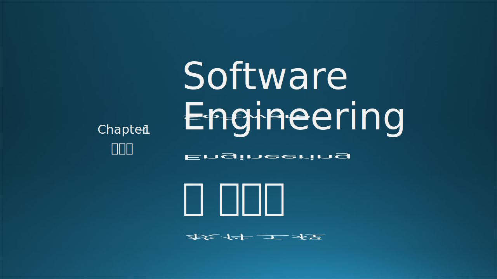
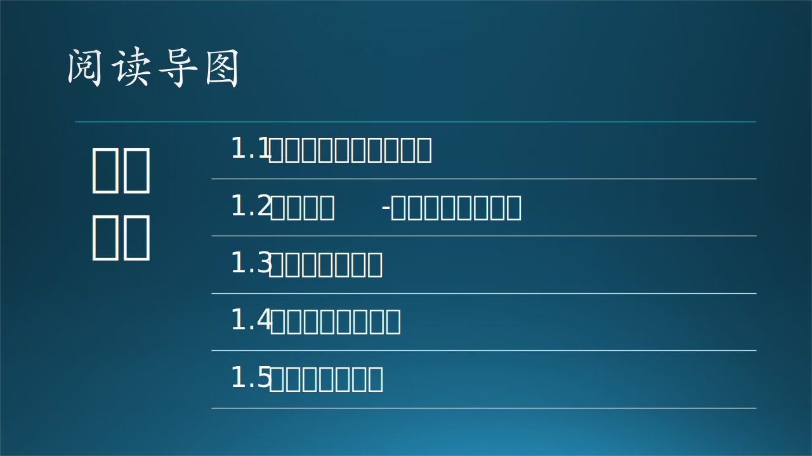

本章从一个软件工程的故事开始，木头带领大家一起初步领略了软件工程的复杂性。然后讲解了软件工程的基本概念及其相关领域学科。最后介绍了微软公司内的软件工程团队体系。

### 思考与练习

1. 在发布渠道/方式上，你还有什么建议？
2. 你觉得木头后面还会遇到什么麻烦？
3. 除了产品、项目、服务这种分类以外，你还见过什么软件开发组织模式？与这三种有何区别？
4. 微软为什么要取消测试职位？肯定不是缺钱，你能想出来其原因吗？

### 参考资料

- Wikipedia，软件工程历史，https://en.wikipedia.org/wiki/History_of_software_engineering
- Wikipedia，计算机科学，https://en.wikipedia.org/wiki/Computer_science
- 软件工程 body of knowledge，https://ieeecs-media.computer.org/media/education/swebok/swebok-v3.pdf
- 《实用软件工程》第二版，郑人杰等，清华大学出版社
- 《构建之法》，邹欣，人民邮电出版社
