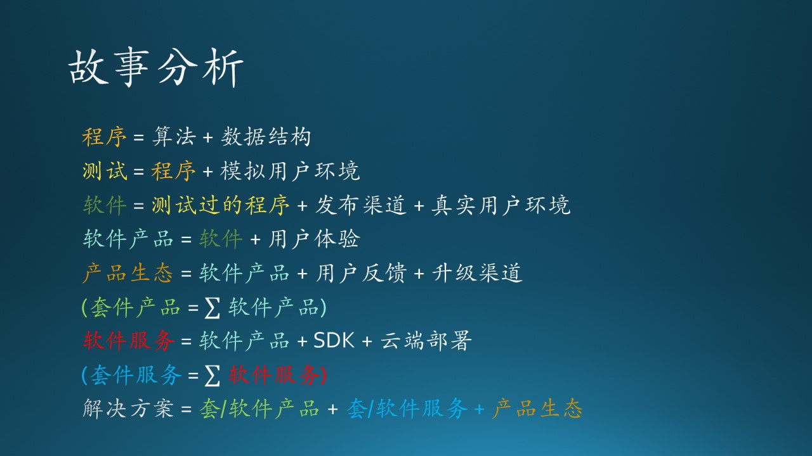
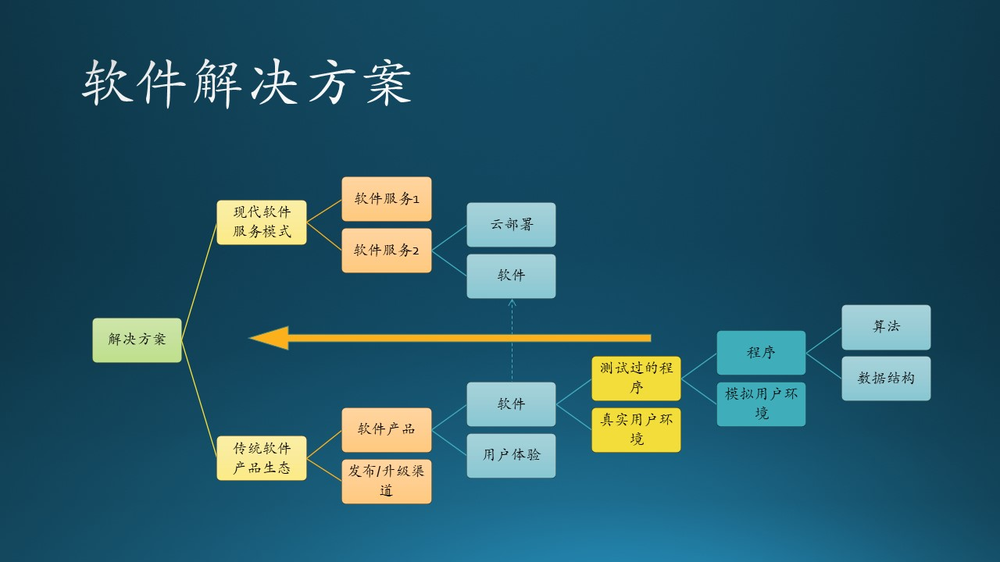

## 1.2 故事分析

从木头遇到的“麻烦”来看，他本人做了一件很了不起的事情：利用自身能力和微软技术为教育做出了贡献！但是，对事态发展估计不足，会给个人以及产品/项目本身带来不好的影响。

我们来分析一下故事的发展脉络，最终用公式的形式体现在图 1.2.1 中。

图 1.2.1 故事分析

### 1.2.1 编写程序/代码（Program/Code）

编写能够生成小学加减法算术题的程序，这个任务只是一个简单的算法（Algorithm）+ 数据结构（Data Structure）的组合就可以解决了，一般的程序员都可以完成，我们称之为程序（Program）。算法可以是随机数生成和加法运算的组合，加法公式和相加的结果需要放在一个数据结构中。

于是我们得到了一个公式：

$$
程序 = 算法 + 数据结构 \tag{1.1}
$$

### 1.2.2 测试程序（Testing）

如果用户信任，你可以发布可执行的二进制文件，用户执行它即可完成测试；如果用户不信任，你就需要发布源代码，有技术能力的用户可以还原你的开发环境，从而测试这些源代码。

在木头的故事里，那位老师就是测试人员，确保木头的程序的运行结果与预期相符。老师可以选择运行二进制文件，或者有技术能力的话，就运行 C# 或者 Python 的源代码。

于是我们得到第二个公式：

$$
测试 = 程序 + 模拟用户环境 \tag{1.2}
$$

### 1.2.3 发布软件（Release）

测试结束后，需要发布给真正的用户去使用，程序真正地运行在用户环境下，才会有价值。当然“用户”有时候可能是你自己，你给自己写了个工具来提高生产力。这时候，“程序”已经升华了，可以称之为“软件”了。

程序升华到软件的公式：

$$
软件 = 测试过的程序 + 发布渠道 + 真实用户环境 \tag{1.3}
$$

### 1.2.4 用户体验（User Experience）

在木头的故事里，家长必须通过微信发送答案，老师忙得整天看微信，用户体验非常不好。用户（老师和家长）从这个软件中获得的好处，如果不能大于使用该软件的付出（包括时间、金钱等），那么这个软件是没有存在的必要的。所以自动判作业的需求就会出现，而对于一个好的软件来说，这也是必不可少的一个过程。

普通软件升级到一个好软件的公式：

$$
软件产品 = 软件 + 用户体验 \tag{1.4}
$$

微软的 Office 办公套件在这方面做得非常的好，功能和用户体验都是经过用户确认的，所以才能被广泛使用，成为了办公系统中的事实上的标准。

### 1.2.5 产品升级（Upgrade）

依赖微信小程序当然是一种解决方案，但并不完美。客户端软件分发也是一个特别麻烦的事情，因为总会有用户不去主动升级，从而造成了软件厂商的维护成本高居不下。所以很多厂商会尝试新的路子，比如微软的 Office 办公套件就推出了 Office 365 服务，用网络服务方式代替分发/下载方式，但是在离线时依然可以使用主要功能，在线时可以同步离线时的工作文档，并与团队中的其它人交互。

$$
产品生态 = 软件产品 + 用户反馈 + 升级渠道 \tag{1.5}
$$

在 Mobile 端开发中，无论是 Android 还是 iOS，平台厂家都提供了升级渠道，软件开发商不需要维护自己的升级体系；Microsoft Store (微软应用商店) 是微软的 UWP（Universal Windows Platform，通用 Windows 10 软件开发平台）的官方发布、升级渠道。这些都叫做 Ecosystem （生态环境），这对于软件产品的发展非常重要。

### 1.2.6 部署到云（Cloud）

如果家长们有的用安卓手机，有的用苹果手机，那么木头就需要做两个 App，分别运行在两种手机操作系统上，这对木头来说显然是不可能的，除非有一个公司专门做类似的教育服务软件。

于是木头把一个客户端软件改成了部署在服务器（云）端的一个服务（Service），升级完全在服务器端完成，用户在使用时，可以用浏览器打开网页，即可“不得不”使用最新版本的软件，数据也是在云端存储，老师不用每天盯着微信看了。

当然，客户端仍然可以用微信小程序用 SDK 访问服务器端的固定 RESTful API，然后在小程序内部解释服务器端下发的数据，并在客户端上渲染用户界面。

$$
软件服务 = 软件 + SDK + 云端部署 \tag{1.6}
$$

### 1.2.7 套件产品或服务（Service）

如果有一个语文老师，想请木头制作一套古诗背诵、接下句、作诗的程序（但是估计木头是断然拒绝的），然后又有一个英语老师，想请木头制作一套背英语单词的程序（如微软小英），那么语文和数学或者英语等就形成了软件服务的组合，我们称之为软件套件服务。如果是客户端软件，称作套件产品。

$$
套件产品 = \sum_{i=1}^m 软件产品 \tag{1.7.1}
$$

这种是传统的产品形式。

$$
套件服务 = \sum_{i=1}^m 软件服务 \tag{1.7.2}
$$

这种是现代的产品形式。

但是套件不是必须的，很多情况下没有成套的软件。

### 1.2.8 解决方案（Solution）

- 当木头解决了一元二次或者二元一次方程的问题后，可以为小学五年级的老师同学提供服务了，这相当于做了一次服务“功能”升级；
- 当可以提供 7x24 小时的服务后，相当于做了一次服务“质量”升级；
- 当可以面向个人用户（学生）按需出题时，相当于做了一次服务“体验”升级；
- 当可以为国际学校提供英文界面时，相当于做了一次服务“范围”（受众用户）升级。

当可以为小学一年级到五年级都可以提供出题服务时，那么就成为了一种全栈的解决方案了（Solution），于是有公式：

$$
解决方案 = （传统）套/软件产品 + （现代）套/软件服务 \tag{1.8}
$$

这样的话，木头就可以开一个软件服务公司了，名字已经想好了，叫做 WoodySoft，很洋气，哈哈。

图 1.2.2 软件解决方案

