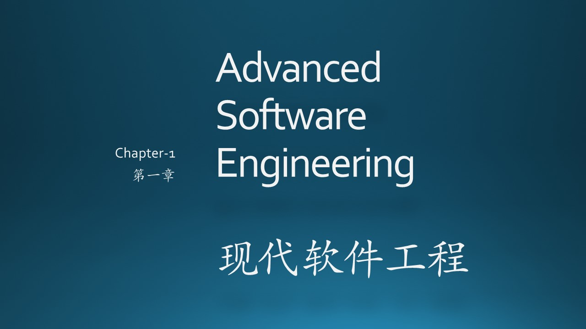

（插入一些说明性文字，重点在介绍上下文，串连）

### 参考资料

1. 《实用软件工程》第二版，郑人杰等，清华大学出版社
2. 《构建之法》，邹欣，人民邮电出版社
3. https://en.wikipedia.org/wiki/History_of_software_engineering
4. https://en.wikipedia.org/wiki/Computer_science
5. https://ieeecs-media.computer.org/media/education/swebok/swebok-v3.pdf
