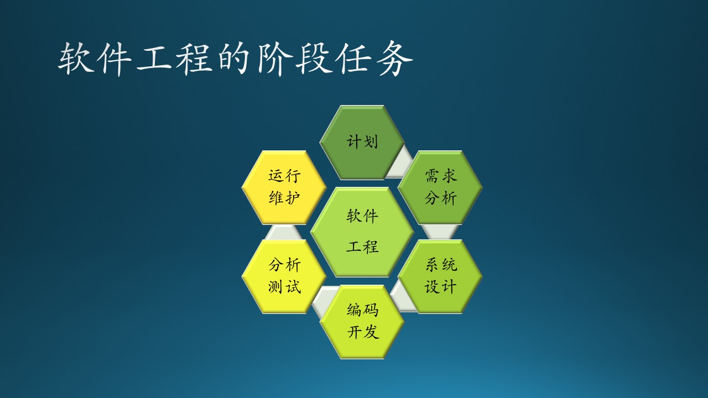
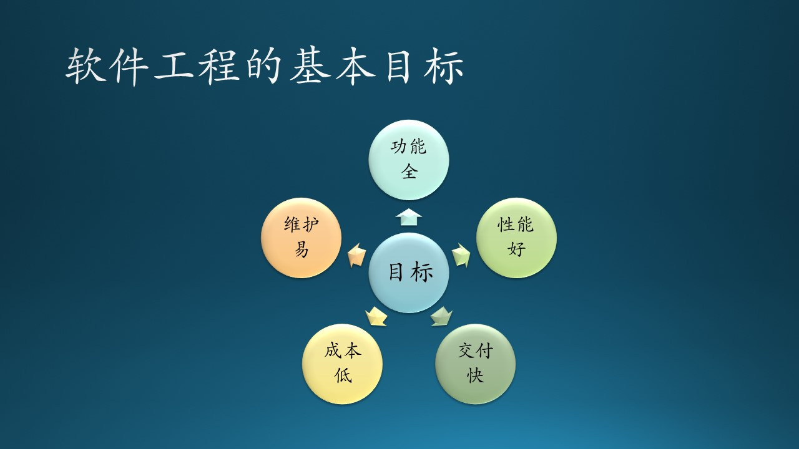
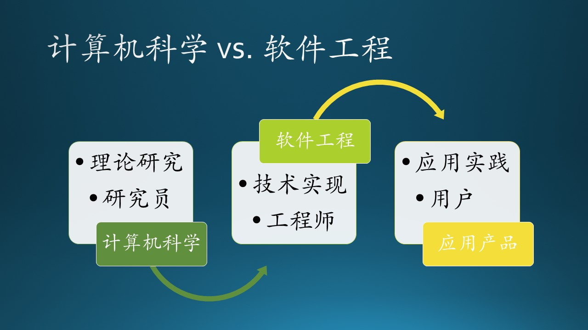

## 1.3 什么是软件工程？

### 1.3.1 定义

好了，我们终于进入正题了：什么是软件工程？

在公式1.1~1.8中，我们看到了一系列在“软件”这个名词之外的概念，这些概念的组合就是软件工程所涵盖的范围，但还不止于此。

软件工程的完整定义是：

**科学技术知识、方法和经验在软件设计、实施、测试和文档编制中的系统应用，在实施过程中，把系统化、规范化、量化的方法应用在开发、运行、维护中。如果说以上都是手段的话，那么软件工程最终想达到的目的是：建立和使用合理的工程原理，以便经济地开发出可靠的软件，并在真实机器上高效地运行。**

### 1.3.2 阶段任务（生存期 life cycle）

图 1.3.1 软件工程包含的阶段任务

在一个大型的软件产品项目中，软件工程包括图 1.3.1 所示的这些分阶段的任务：

#### 商业计划

根据客观存在的实际需求，制定软件开发计划，意图用软件系统帮助人们提高工作效率或者提高生活质量，从而使得软件开发商赢得利润。

#### 需求分析

需求工程是关于软件需求的获取、分析、规范和验证。软件需求可以有三种不同类型：有功能需求、非功能需求和领域需求。

- 功能需求处理用户执行的操作，并得到期望的合理输出。

- 非功能需求处理可移植性、安全性、可维护性、可靠性、可伸缩性、性能、可重用性和灵活性等问题。它们分为以下类型：接口约束、性能约束（如响应时间、安全性、存储空间等）、操作约束、生命周期约束（可维护性、可移植性等）和经济约束。在指定非功能需求时，需要了解系统或软件的工作方式。

- 领域需求必须与特定类别或项目领域的特征有关，严格来讲属于非功能的一部分。

#### 系统设计

软件设计是定义系统或组件的架构、组件、接口和其他特性的过程。这也称为软件架构。软件设计分为三个不同的设计层次，分别是界面设计、建筑设计和详细设计。

- 界面设计是系统与其环境之间的交互。这与系统的内部工作一起发生在高抽象级别。
- 架构设计与系统的主要组件及其职责、属性、接口以及它们之间的关系和交互有关。
- 详细设计是所有主要系统组件的内部元素、它们的属性、关系、处理，通常是它们的算法和数据结构。

#### 软件开发

软件构建和开发的主要活动是编程、单元测试和调试的结合。此阶段的测试通常由程序员在软件构建过程中执行，以验证刚刚编写的内容，验证通过后即可进行下一步的工作。

#### 测试分析

软件测试是一项经验性的技术探查，旨在通过不同的测试方法提供有关被测产品或服务质量的信息。这是软件质量的一个方面。作为软件开发的一个独立阶段，它通常由质量保证人员或开发人员执行，而不是编写代码的人员。

软件分析是分析计算机程序的性能、鲁棒性和安全性的过程。它可以在不执行程序（静态程序分析）、运行时（动态程序分析）或两者的组合的情况下执行。

#### 运行维护

软件维护是指在软件产品发布后提供经济高效的支持。软件维护是在发布后修改和更新软件应用程序，以纠正故障并提高其性能。软件与现实世界有很大关系，当现实世界发生变化时，需要软件维护。软件维护包括：纠错、优化、删除未使用和丢弃的功能，以及增强已存在的功能。通常，维护占项目成本的 40% 至 80% 左右，因此，注重维护可以降低成本。

### 1.3.3 软件工程的基本目标

图 1.3.2 软件工程的基本目标

- 功能达标

    这是首要的指标，相对来说比较容易衡量，不能达标就不能发布软件。

- 性能良好

    在功能达标的基础上，软件运行得越快越好，即提高响应速度，减少用户等待时间，合理使用 CPU 及内存资源。

- 按时交付

    根据需求估算好开发时间，做好开发计划，组织足够的资源（人员及软硬件设备）投入，并严格执行软件工程。

- 开发成本低

    合理搭配高级开发人员与中低级开发人员，形成良好的开发体系，才会从长远角度降低开发成本。

- 维护费用低

    由于软件运行环境发生变化，出现以前没有发生过的故障时，诊断和修复故障的难度要尽量小，所需时间尽量短，所需人员尽量少。另外一种情况是客户在现有功能基础上有新的需求，但并非那种颠覆性的改变，在现有基础上改进即可。这就要求软件当初的设计要合理，流程清晰，接口明确，便于快速确定新功能的插入点；测试手段齐全，运行日志完整不冗余，便于故障定位。

但是，上面几个基本目标大部分是相互矛盾的，比如：

- 如果缩短需求、开发、测试时间，降低对文档的要求，可以缩短整体时间而按时交付，但是会对功能、性能等指标都带来很大的影响。

- 如果招募经验较少薪水低的软件开发人员，或者压缩总体开发时间，将会降低成本，但是将会带来严重的质量问题，功能和性能都很难达标。

### 1.3.4 软件工程简史

我们用一张表简单地说明一下$^{[2]}$：

表 1.3.1 软件工程简史

|年代|关键词|事件|
|---|---|---|
|1945~1965|初创|软件工程被提出并命名|
|1965~1985|危机|超预算、引发财产损失和生命危险，从关注生产力到关注质量|
|1985~1989|银弹|从业者从各个角度寻找“银弹”来解决危机，但是每一种方案只能带动局部的改进|
|1990~1999|互联网|建立在HTML基础上的互联网技术促进了软件行业的发展，出现了浏览器、电子邮件、搜索引擎、多语言系统等等，适用于大型软件的软件工程方法逐步成熟|
|2000~2015|轻量|出现了很多轻量级的软件工程方法，适用于中小型软件的开发|

### 1.3.5 软件工程 vs. 计算机科学

我们先看一下计算机科学所涵盖的学科$^{[3]}$：

1. 理论计算科学（Theoretical computer science）
    - 理论计算（Theory of computation）
    - 信息编码（Information and coding theory）
    - 数据机构与算法（Data structures and algorithms）
    - 编程语言（Programming language theory）
    - 形式化方法（Formal methods）
2. 计算机系统（Computer systems）
    - 计算机体系结构与计算机工程（Computer architecture and computer engineering）
    - 计算机性能分析（Computer performance analysis）
    - 并行和分布计算（Concurrent, parallel and distributed systems）
    - 计算机网络（Computer networks）
    - 计算机安全与密码学（Computer security and cryptography）
    - 数据库（Databases）
3. 计算机应用（Computer applications）
    - 计算机图形学与可视化（Computer graphics and visualization）
    - 人机交互（Human-computer interaction）
    - 科学计算与仿真（Scientific computing and simulation）
    - 人工智能（Artificial intelligence）
4. **软件工程（Software engineering）**
    - 软件需求（Software requirements）
    - 软件设计（Software design）
    - 软件开发（Software development）
    - 软件测试（Software testing）
    - 软件维护（Software maintenance）

**请注意：计算机科学的最后一个子类就是软件工程！我们通常所听说的“二者是并列关系”的说法是不正确的。**

造成误解的原因是，在我国大学教育体系的本科生培养层次，与计算机相关的专业有：软件工程、计算机科学、物联网工程、信息安全、数字媒体技术等专业，为了面向职业发展而把这几者混淆在了一起。其中，“理论计算科学”和“计算机系统”两个大类，是为了培养硕士或博士打基础，搞理论研究；“计算机应用”可以有硕士和博士；“软件工程”最高到工学硕士，没有博士，毕业后“进化为”程序员（程序猿）或工程师（攻城狮）。每当看到括号中的两个名词，笔者就会拿起哑铃撸撸铁，感觉特别孔武有力，威猛雄壮。

表 1.3.2 计算机科学与软件工程学的比较

||计算机科学|软件工程|
|---|---|---|
|本科生|理学或工学学士|工学学士|
|研究生|理学硕士|工学硕士（较少）|
|博士生|理学博士|无|
|侧重|原创理论研究|成熟应用实践|
|策略|效果影响力优先|成本与效果的折中|
|成果|论文|项目、产品|

简单的说，计算机科学是科学家、研究员们，发现规律、研究理论，并试图从根本上把规律理论化、公式化，不太在意成本，只在意效果。在图 1.3.3 中展示了计算机科学与软件工程之间的衔接关系。

图 1.3.3 计算机科学与软件工程的关系

软件工程发展了这么多年，早已经形成了一套科学的、成熟的方法做理论指导，当然可以算作计算机科学的一部分。工程师和程序员们，侧重于用成熟的方法解决实际问题，要在成本和效果二者之间做折中考虑。
