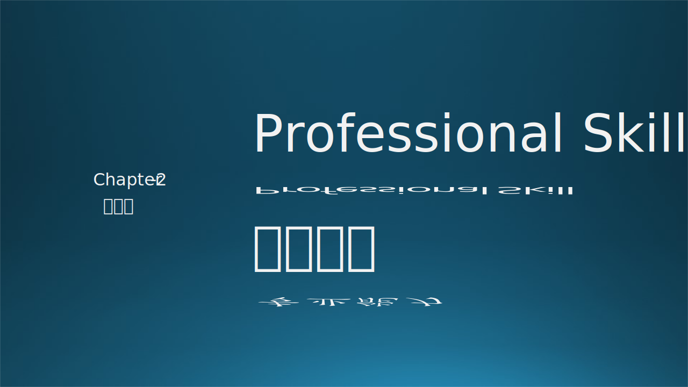
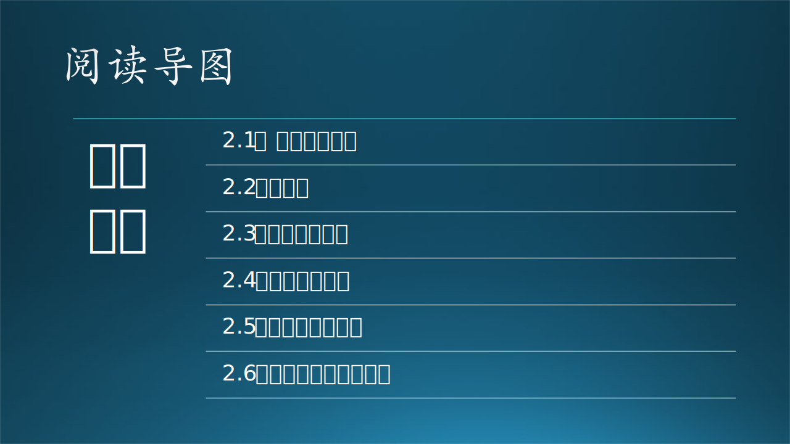

做一名合格的软件工程师所需要的专业技术能力有：

- 算法（algorithm）
- 代码（coding skill）
- 建模（design pattern）
- 设计（system design）
- 测试（testing）

本章将会就这几个专业能力展开讨论。

### 参考资料

https://www.freecodecamp.org/news/how-to-think-like-a-programmer-lessons-in-problem-solving-d1d8bf1de7d2/

https://www.jianshu.com/p/0f46896ab4a0

Krathwohl, D.R. (2002) A Revision of Bloom’s Taxonomy: An Overview. Theory into Practice, 41, 212-218. http://dx.doi.org/10.1016/S0164-1212(98)10055-9
