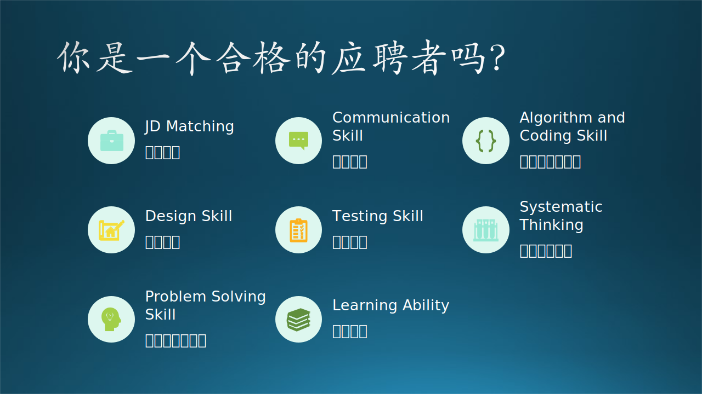

## 2.1 面试的故事

我们先讲一个木头面试的（真实，但有节选）故事，从故事的情节中，大家也许可以发现像微软这样的公司是如何考察个人能力的。

木头毕业后在一个国企工作，后来想“下海”闯荡，于是花了3个月时间复习了 4 本书，分别是《C++教程》、《数据结构与算法》、《C#教程》、《高等数学》。恰逢微软启动了当年的扩大招聘计划。于是，修改简历，扔过去，反正也不花钱，要是花钱，就扔 100 块钱的，就当是买彩票了。

和很多大公司一样，微软有两种招聘渠道：Campus Hire（校园招聘）和 Industry Hire（行业招聘）。一般来说，Campus Hire 要经过三轮面试，前两轮是技术面试，最后一轮是 AA（As Appropriate，直译为“视情况而定”，即决策者）面试；而 Industry Hire 要经过六轮面试，前五轮技术面试，最后一轮 AA 面试。

木头加入微软就是走的 Industry Hire 渠道，只要不是刚踏出校门的学生寻找第一份工作，就都要走这个渠道。简历能被 HR（Human Resoruce，人力资源）看到，是一件非常幸运的事（如何写简历不在本书的讨论范围之内）。木头就很幸运，几个关键的技术点正好符合 JD（Job Description，职位描述），于是才有了下面的故事......

### 2.1.1 第一轮面试

某年 10 月 20 日，18:00 下班后，某大厦 4 层木头的办公地点。

木头的手机响了，一个男子的声音：我是微软 xxx，你是 yyy 吧？

木头激动地说：是！

面试官：我们进行电话面试吧？

木头：好。

面试官：您有大数据量的处理经验吗？

木头：有！每天上万条记录，一个月可以到 100 多万条，如，通话话单或短信业务......

*注：以上问题是关键，主要是看木头有无大批量数据的处理经验，所以可以初筛过关了。*

### 2.1.2 第二轮面试

10 月 23 日，12:00 午休时间，某大厦 4 层木头的办公地点。

木头的手机响了，一个女子的声音：我是微软 zzz，你是 yyy 吧，我们可以电话面试吗？

木头：好！

面试官：您先用英语介绍一下自己吧？

木头：blah blah blah......（磕磕绊绊的没关系，只要能说就行）。

面试官：给您出一道题目吧，也算智力题吧。

木头：好！

面试官：有一个101个单元的数组，在随机位置无回放地从1-100之间取一个数填入，最后一个空位随机填入1-100之间的任意一个数，求重复的数字是什么？

*注：这是电话面试，如果你在电话这边一声不响地思考，那是不礼貌的，你必须尽快想出答案，并且在思考的过程中，要让对方“听到”你在思考。做到这一点很难。*

木头：嗯......（30秒后）用一个辅助存储数组，记录次数，最后统计一下即可。

面试官：要是不用辅助存储呢？

木头：嗯......（30秒后）把数组排序，然后就能找到。

面试官：那要经过两次扫描，还有更简单方法吗？

木头：嗯......（30秒后）我暂时想不出来了，对不起。

面试官：没关系。再问您一个问题：如果有一款新手机，你打算如何测试？

木头：......（省略100字）反正我觉得重点应该在数据业务上，因为手机上的话音业务比较成熟，而数据业务是用户困惑的地方。

面试官：您有什么爱好吗？

木头：我喜欢游泳，我是业余中最专业的，但是专业中最业余的。我很幽默。我喜欢打桥牌，我喜欢玩魔方。

面试官：您很幽默，我听出来了。打桥牌，说明您逻辑推理能力强；魔方是个很有趣的爱好。

木头：是这样的（在电话面试的过程中，要尽量的表达你自己的优点，但不能过火）。

面试官：好的。如果合适，您还将接到电话。

木头：好的。

木头挂断电话，心里忐忑不安：唉！那个数组问题好像没答对啊！心里太紧张了，时间也太紧了，我讨厌电话面试这种形式。坐到座位上后，木头开始思考数组题的答案，10分钟后，有了结果，并且认为肯定是正确的答案之一。在电面过程中，不会有这10分钟存在的。估计我搞砸了，机会就这样远离我而去......

没想到，10 月 26 日 11:00，木头的手机响了，一个女子的声音：我是微软 HR，你下周来面试吧......

### 2.1.3 第三轮面试

10 月 31 日 15:00，希格马大厦 6 层。

面试官是个小伙子：说说你最得意的项目吧。

木头：......（此处省略1000字。一般都是用这种方式开始，让面试者有个热身的机会，增加自信心）

面试官：咱们做个算法题吧，你在黑板上写出代码来！

*注：这个难度超大的，因为：1.站着；2.在黑板上写；3.有人看着。压力巨大。*

面试官：有两个数组，排序好的，分别有 M 个元素和 N 个元素，建立一个新数组，有 M+N 个元素，把那两个数组中的元素按次序写入新数组中，在写入的时候就排好序。

木头 10 分钟后，涂涂改改若干次后，写出了一个函数，正要报告“完毕”，我忽然发现了一个漏洞，其中的一个数组有可能先用完，那么这段代码就会死机。又花了 2 分钟，把这个漏洞弥补上了。

挑了几个小毛病后，就进入第二问了。

面试官：还是这两个数组，从每个数组中取一个值相加，放入到新的数组中，在写入时就是排好序的，组合关系不能重复。比如，第一个组合是 $i_0+j_0$，第二个组合可能是 $i_0+j_1$ 或 $i_1+j_0$，取小的那个组合，然后继续......

木头：在黑板上做 $k=1，2，3$ 的推演，最后没有推出来，时间已经不够了......

面试官：$k=n$ 估计是时间不够了，咱们做一个建模题。三个形状，一个圆，一个矩形，一个正方形，如何建模？

木头：......（此处省略1000字）

面试官：行，咱们去下一个面试吧。

*注：上面的第二问主要考你的解题思路，并不指望你能在现场解出来。回家后，我前后用了1小时时间，用代码实现了，保证是最佳算法。*

### 2.1.4 第四轮面试

当日 16:00，希格马大厦 1 层。

面试官是个部门经理：咱们做个算法题吧！

（算法！除了算法，还是算法！因为我应聘的是 SDE）

木头：（颤抖地）好...吗...吧！

面试官：有一棵满二叉树，每个节点都有一个指向其它某个节点的指针，要求用 $O(1)$ 的时间消耗，就能知道这个指针指向的是上级节点。如何设计数据结构？

木头心想：数据结构的书没白看，这次有在黑板上写东西的经验了。3 分钟后，画了一个二叉树的数据结构，每个节点的 key 值都用含有级别信息的值标识，则任意一个节点内的指向其它节点的指针的 key 值与本节点的 key 值比较，就能知道指向的是否是上级节点。

面试官：还有没有更简单的方法？

木头：不可能有了。

面试官：真的吗？你用的是深度优先算法，能不能考虑广度优先算法？

木头：除非把节点存储在数组中，但是还要把左右节点也存到辅助数组中。

面试官站起来了，在黑板上刚把数组画出一半来，还没等他说话解释，木头立刻就明白了他的意思，说：哦，我知道了。满二叉树，第 n 级节点占用了 $2^n$ 个单元，用某节点的位置的单元序号直接能得到它的级别。

面试官：我们再出个建模题吧。大厦里有很多会议室，建个模型，来管理这些会议室。

木头：（先做了会议室类，再做了管理类）。

面试官：如果多人预订会议室呢？

木头：（又做了预订动作类）

又说了些别的，就带木头去 6 层了。他进去后和人力资源谈了几分钟，再出来时，就和木头握手说再见。人力资源说起下一轮面试的时间，木头才踏实了，知道应该过关了。

### 2.1.5 第五轮面试

11 月 1 日 10:00，希格马大厦 1 层。

面试官是个女博士，人很和善：说说你最得意的项目。

木头：您对增值业务有了解吗？数据业务或话音业务？

面试官：话音业务我不了解，说数据业务吧。

木头把数据互联网业务的系统设计思路在黑板上画了一遍，考虑到了可用性、可靠性、可扩展性，分 4 层结构，第一层做对内 DNS 轮询；第二层做接入，要用 Load Balance（负载均衡）；第三层用 COM+ 组件，做中间件，做任务分发；第四层做数据库群集......（此处省略1000字）。

面试官：我们再做一个算法题吧。

木头：（天啊，又是算法）没...问题！

面试官：有一个字符集，要求用算法把所有组合列出来。如 ${a,b,c}$，要列出 ${a,b,c,ab,ac,bc,abc}$ 七种组合可能。

木头：（在黑板上写了5分钟，也没写出来）

面试官：可以考虑用递归方式

木头：我尽量先考虑用迭代方式吧。

面试官：好。

木头：（还是没琢磨出来）

面试官：再给你 5 分钟吧，写不出来就算了，我自己也写不出来。

木头：（5 分钟后写出了一个递归函数，勉强过关，她好像并不在意这个题目是否能答的出来，因为木头在开始的关于系统结构的讲解给她留下了很深的印象）。

面试官：咱们去 6 层吧，glad to meet you！

木头：哦，好好（其实应该说 me too）。

*注：这种情景让笔者想起了有一次在Intel，给一个老外和几个同胞讲我们的产品系统结构，讲得他们很爽，最后老外主动站起来和我握手，说"glad to meet you"。当时，那些Intel的同胞都很惊讶的叫了一声，因为他们知道那个老外很少这样做，前面有10个这样的公司给他们讲东西了，他从来没有站起来过。于是我才知道，如果在刚见面时，人家对你说“glad to meet you”是客套，在会谈结束后说“glad to meet you”就表示是欣赏你。*

### 2.1.6 第六轮面试

当日 11:00，希格马大厦 6 层。

面试官是一个学者，应该是大领导，非常和善。

面试官：说说你最得意的项目。

木头：......（此处省略1000字）

面试官：你的简历中提到你的学习能力很强，说说理由。

木头说了木头第一次做语音增值业务系统的经过，又举了个自学游泳的例子）：花1个月（4次）学仰泳，花2个月（8次）学自由泳，花6个月（24次）学蝶泳......

面试官：当用户在网络上发起请求后，系统服务器故障了，你如何保留这个用户的请求信息。

木头：如果没有造成呼损，那就不管了；如果不牵涉到计费，也不管了；我尽量设计成把请求一次提交。

面试官：如果以上条件都不满足呢？

木头：那我只好把 session 存在 DB 里面了。

又说了些别的，就把木头送出办公室，挥手告别。
