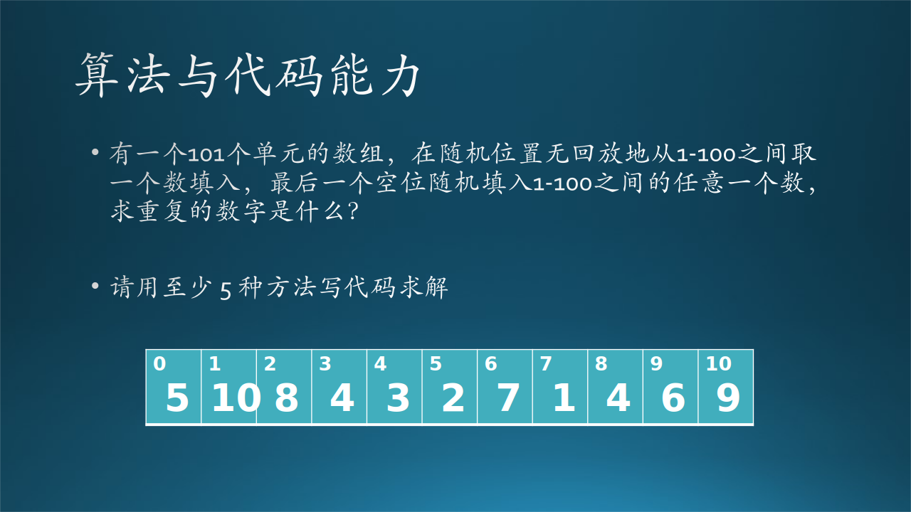

## 2.2 故事分析

11月6日，10:00，某大厦4层。

木头的手机响了：我是微软 xxx，我们对你的面试很满意，我们决定给你这个 offer......

木头：（激动啊......）您给我个正式的邮件吧（保持镇定，万一对方是个骗子呢，所以需要书面的东西）。

11 月 7 日木头收到了正式的邮件。

故事就写到这里吧，下面总结一下微软这样的公司需要什么样的人做 SDE。

### 2.2.1 技能点是否符合 JD 要求

第一个面试官是一个 PM，他的主要职责是询问木头的技能点是否满足 JD（Job Description，职位描述）要求。比如在这次面试中，希望木头有大批量数据的处理经验，因为是要做一个后台的 Pipeline（数据处理流程）。

做为一个 Industry Hire Candidate（即有多年从业经验的面试者），写简历的基本技巧如下：

#### 1. 让 HR 能够一眼看到关键字

因为简历都是通过 HR 筛选出来的，而大部分 HR 是不懂技术的，Ta 们每天面对大量的简历，首先就是要通过关键字来匹配岗位需要和面试者的经验或技术能力。

- 开发语言掌握能力，比如 C++, Python, C#, Php, Java 等等。
- 设计能力和经验，比如大数据存储与处理经验、复杂系统搭建经验、大用户量的并发访问设计经验、训练神经网络模型的经验、手机应用开发的经验等等。
- 一些著名的服务组件或框架的使用经验，比如 Web 服务器中的 Appache、消息队列中的 RabbitMQ、数据库 MySQL、分布式系统架构 Hadoop 等等。

#### 2. 让技术面试官能看到项目经验

技术面试官通常不会被关键字所迷惑，而是看面试者的具体项目经验。在每一个项目介绍中，应该包含一下内容：

- 项目内容，比如企业信息管理系统、网络购物系统、游戏系统、视频点播系统、股票预测系统等等。
- 项目规模，比如有多少开发人员、代码量多大、开发时间多长、使用了多少台服务器、用户量多大等等。
- 承担的角色，比如做为普通开发人员、资深开发人员、技术专家、开发经理、系统设计师等等。
- 项目实施结果，比如上线后的用户反馈情况、如何更新升级功能、如何降低维护成本等等。
- 遇到的困难及解决方案，由于内容较多所以通常不会写在简历里，但是面试者要准备好面试官的询问。

#### 3. 让老板能看到能力特点

具有同等技术能力的面试者有很多，如果都能通过前面的技术面试的话，老板为什么会选择你？通常下面几点会影响老板的决策：

- 从经历中看你的发展方向和速度，会决定你将来在这个公司的发展曲线。
- 性格特点，比如有什么业余爱好、是否有社团经历，决定你是否可以很快地融入新的团队。一些高大上的业余爱好也是有加分的，比如音乐、桥牌、魔方等技能。
- 在前面每个公司任职的时长，会预测你在新公司是否稳定，两年里换了三个公司的人，一般老板是不敢要的。

### 2.2.2 面试时的沟通
    
面试刚开始时，面试官一般都让你聊一聊自己的项目，并且时不时地插问几个问题，实际上就是看看你的表达能力如何。当今的软件规模很大，没有那种一个人可以搞定的，需要团队配合，所以沟通能力很重要。
   
第二个面试官也是 PM，她更多地是与木头进行谈话，以确定木头的沟通能力是满足团队工作要求的。幽默的性格是每个团队都欢迎的，因为它是乐观、开放、聪明的集合体。

关于沟通能力，我们会在 2.3 节中详细说明。下面先说一说面试过程中的自我介绍，这是就是考察沟通能力的第一步。

自我介绍是面试过程中必经的一个环节，一段精彩的自我介绍是面试成功的基础，它决定着面试官对候选人的第一印象，也为接下来的面谈定下基调。

#### 1. 第一印象很重要

面试官通过简历和候选人的自我介绍，可以快速了解和掌握候选人的行业背景、经历、表达能力、逻辑思维能力、英语水平等。其实在面谈开始的1到2分钟内，面试官就已经有了初步的判断，这个候选人是否适合这个岗位，而后面展开的一系列的问题和探讨，都是在验证自己的这个判断，当然也存在在过程中改变的情况。所以，第一印象很重要，一定要好好准备开场的自我介绍。

#### 2. 自我介绍如何准备

1. 内容要有重点

可以介绍自己的背景，曾工作过的公司，所熟悉的行业或领域以及擅长的方向；负责过哪些产品及项目，项目类型和规模如何；所负责项目获得过的成绩，或为公司创造的价值，但要尽量具体、可量化。

此外，要介绍自己的独特贡献，以突出与别人的不同之处，体现出自己对于应聘岗位的优势及核心竞争力，这可以加深面试官对你的了解。

2. 要与岗位要求匹配

一定要提前了解岗位信息，自我介绍的内容一定要围绕着岗位要求来准备，将自身经历与岗位要求相匹配。

因为每个岗位的需求是不一样，所以针对不同岗位的自我介绍，也应随需求不同而相应改变。也就是岗位有什么样的需求，就可以在自我介绍提到这些内容。

3. 时间控制在2-3分钟，切记不要太长

自我介绍的时间最好控制在2-3分钟。如果太长，则可能说明表达能力、总结能力稍差，抓不住重点，这可能会成为减分项。

我曾经有一个候选人，简历非常优秀，但面试时自我介绍部分讲了12分钟，虽然其它方面都相当不错，但面试还是没有通过。

4. 自我介绍尤其英文自我介绍一定要流利

流利的自我介绍应该是有底气的、自信的，这样才更有可能让这段自我介绍成为加分项。所以提前准备并加以练习是有必要的。

### 2.2.3 面试中的技术问题

#### 1. 算法与代码能力（Algorithm and Coding Skil）
   
第三个面试官是一个Dev Lead，他会着重在算法和 Coding Skill（代码能力）上。

我们前面讲过从算法到程序到软件的演进过程，如果基本算法都不能保证，那后面的就谈不上了。算法又分两种：
   - 标准算法，比如快速排序、Dijkstra等。
   
      基本算法只能解决固定套路的问题。这些算法如果在面试时被问到，说明这个公司不行，至少是面试官的水平不行；
   
   - 应用算法，即一个实际问题没有固定的解法，需要你寻找一个合适的算法组合来解决。

在考察算法的同时，也考察了代码能力。

而有的面试官会出一个不需要很强的算法而是需要写很多行代码的题目，比如：有一个字符串，里面只有字母和数字两种字符，要求用 $O(n)$ 的效率，把所有的字母都放到左侧，所有的数字都放到右侧，顺序无所谓。

这个题目一般人都会想到用两个指针从字符串两头向中间移动，所以算法并不难，只是考察代码能力。

#### 2. 设计能力（Design Skill）

第四个面试官是 Dev Manager，他会着重在算法和设计能力上。

在考察 OO（Object Oriented，面向对象）概念的同时，也考察了基本设计能力和数据结构知识。设计能力通常用面向对象的建模作为题目。木头遇到的是几个比较简单的建模题，后来木头在面试别人时，也会出一些稍微复杂的题目，如：
   - 如何给三阶魔方建模。现场给面试者一个拆开的魔方，主要是对一个对象的建模。
   - 如何给一个十字路口的红绿灯系统建模，这个问题稍微复杂一些了，要对对象、行为、外部控制等建模。
   - 给一个会议室建模。

#### 3. 测试能力（Testing Skill）

第二个面试官问过关于手机测试的问题。关于“测试”有两个误区：

   - 不能狭隘地把测试能力理解为“软件测试”的能力，而应该是从外部“观察”一个对象的能力。有了这种观察力，对理解软件系统的各个方面是有帮助的，当然也会对写出高质量代码有帮助。

   - 不要认为测试能力是对测试人员的要求，懂测试、能测试，是对开发人员的基本要求。

测试问题一般有两种考察方法：

- 对特定问题的测试方法考察，比如：已知一个三角形的三条边的长度，如何确定这是一个合法的三角形？
- 对模糊问题的测试思路考察，比如：给你一个新闻阅读手机 App，问你如何测试这款应用。

### 2.2.4 关于软能力的考察

相对一技术能力，以下能力可以称之为“软能力”：解决问题的能力，系统化思维能力，学习能力。

#### 1. 解决问题的能力（Problem Solving）

一般情况下，面试官会把这种能力与算法编码能力以及设计能力混淆，因为他们认为一个面试者的解决问题的能力就应该体现在编码和设计上。但其实笔者认为这是两个领域的问题，解决问题的能力，应该处于更高层次，是一种可以普遍适用的能力。

比如，需要你用 GPU 测试一个模型，但是公司内部没有现成的 GPU 机器，你怎么办？向领导要，领导会说：你去 Azure 上找一找。于是你就应该在 Azure 上的十几个 Data Center 的好几十个 Zone 里面，找到一个恰好有 GPU 资源的并且能满足你的 subscription 的 quota 的 GPU 虚拟机，申请下来使用。

这种能力何时使用呢？领导交给你一个任务，其中会有很多困难，有一些环节有成熟的解决方案，有些环节没有任何前人经验和参考资料，需要你抓住重点和主线，一个一个地解决它们，为最终完成任务铺平道路。

#### 2. 系统化思维能力（Systematic Thinking）
   
从旁观者看来，木头遇到的这些面试题并不难，面试官主要是考察木头的思维习惯，以及在压力面前的表现，而不是用一个很难的题目难倒面试者。Skill（技能）当然要具备，Passion（激情）和 Potential（潜力）是最重要的。

第五个面试官是 Architect（架构师），她关心的是木头的系统思维能力（Systematic Thinking），所以当木头讲完一些对系统的理解后，基本上可以满足她的要求了。

通常情况是，面试官会问一个比较开放式的问题，这个问题没有确切答案，是想看看面试者如何思考并解决。比如：
   - 为什么井盖儿是圆的？为什么杯子也是圆的？
   - 北京有多少个加油站？
   - 如果一个团队 4 个年轻人，有男有女，骑车环游中国边界省份，大概需要多长时间完成一圈？
   - 为什么民间有“八月十五云遮月，正月十五雪打灯”的说法？

#### 3. 学习能力（Learning Ability）

学习能力从一个小时的面试过程中是看不出来的，只能从面试者的经历中做判断。最后一个面试官就是 AA，他可以从木头在语音增值业务系统上的经验和自学游泳的四种泳姿的经历中考察木头的学习能力。

人类的学习能力是有“互通”性的，“聪明”是学习能力强的代名词，它可以应用到学习任何技能上，而不仅仅是编程能力。

其实，人们在大学中学习到的知识，绝大部分在以后的工作中是没有用的，不信可以翻翻你的数理化课本，关于拉格朗日函数的推导，关于电容脉冲的计算，关于有机化学的成分提取的试验......所以，人们在大学中主要是在“学习如何学习新知识的能力”。

另外，在职场中，大家都是大学毕业，科班出身，知识结构也都相似，那么谁的学习能力强，谁就会更适合职场的新需要，就可以走得更快更远。

### 2.2.5 来自面试官的 Tips

以下是一位来自微软 M365 团队的技术经理的分享（偏口语化）。

#### 1. 过往项目经历

过去的项目经历，并不只是了解你做了什么，很多时候我们更希望知道你的独特的贡献是什么？因为很多时我们都是在“团队环境”下工作，你独特的贡献是什么？以及你遇到的独特的挑战和你怎么独特地解决这些挑战的？这些东西是可以在你们在面试的过程中需要特别的强调的。

如果你像记流水账死得说做了A项目，做了B项目，做了C项目，那其实是没有任何印象的，需要特别的去抓住一些独特的贡献，独特的挑战，独特的一些解决办法。

其实不用讲太多，讲一些独特性就可以了。

#### 2. 算法

针对软件工程师，我们一定会考察算法，当然算法大家也不用太害怕，我们其实更多的看重是你解题的思路。这种算法一般都是不难找到一个解决办法，但是我们更多的是看你能不能基于一个解决办法能够去调优，能够找到一个更优化的办法。所以很多题目都是有一个相对比较简单能够解出来的办法，但是同时也会有需要一些思考才能够想到的一个优化的办法。所以我们很多时候是希望看到你的解题的思路和过程，因为其实我们目的并不是要考住你。

#### 3. 系统设计

我们针对比较 Senior 职位，也会考察一下Systsem Design，会有些开放式的 Design 的问题，比如说设计一个这个网盘系统啊，Message Queue 的系统设计呀，比如说像那个推特这种这种发消息和订阅消息的这样的一个系统啊，我发一条消息，然后所有的人都能搜到。其实就是考察大家系统设计。

要注意分布式系统设计系统架构的。你可能要考虑到，这个系统你怎么保证高可用啊？你怎么做灾备啊？你怎么做异地多活啊？你怎么保证数据的可用性啊？你怎么保证你的不同的区域的用户都能够Low  Latency地访问啊等等，会考察大家的这个这种分布式系统环境下的这种思考。

#### 4. 文化

当然在文化上面呢，我们可能会问大家对多元和包容的理解啊，以及你是怎么做的。因为这个多元包容，不只是管理者，其实很多时候涉及到，每个人每个人都要多元和包容。

此外你是不是具有成长型思维。比如叫一个资历比较浅的员工女员工去用 Visio 画一个图，然后就问了一句，你会不会？这位女员工说我不会，但我可以学啊。其实就是这种 Growth Mindset 思维方式。很多时候我们并不是什么都会，包括我现在对我自己现在工作很多东西，我也不是都会，也很多东西不懂，但是要有这样的一个 Growth Mindset。
