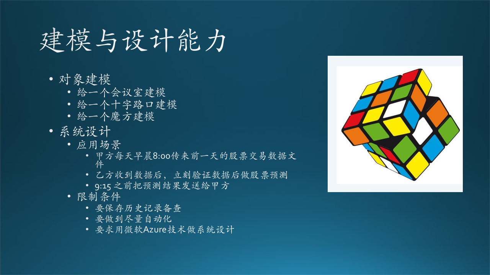

## 2.3 算法与编码能力

在木头的面试中，有过这样一道题，如图 2.3.1 所示。


图 2.3.1 算法与代码能力

有一个 [0-100] 的数组，在随机位置无回放地从 1-100 共 100 之间取一个数填入，还富余出一个空位，随机填入 1-100 之间的任意一个数。求重复的数字是什么？至少用 5 种方法写出代码求解。

为了简化，在图 2.3.1 中，我们假设是 [0-10] 的数组，其解题原理和 [0-100] 没有区别。

我们使用 Python 语言来生成数组和写算法，在面试时，你可以使用任何语言甚至伪代码，除非职位有要求一定要用 C++ 或其它编程语言。

```python
import random

max_number = 10     # 以最大值为10为例，便于说明问题，读者可以自行改到100

def generate_data():
    data = [i for i in range(1, max_number+1)]  # 生成一个顺序数组
    data.append(random.randint(1, max_number))  # 最后随机填一个数
    print("顺序数组=",data)
    random.shuffle(data)                        # 打乱顺序
    print("乱序数组=", data)
    return data
```
生成的数组：

```
顺序数组= [1, 2, 3, 4, 5, 6, 7, 8, 9, 10, 4]
乱序数组= [5, 10, 8, 4, 3, 2, 7, 1, 4, 6, 9]
```

以下各算法将针对乱序数组求解。

下面我们列出从简单到复杂的几种解法，其实这个问题本身就不难，所以解法也很容易理解，仅供读者开阔思路。


### 2.3.1 求和法

小学生都知道：

$$
\sum_{i=1}^{100} i=\frac{1+100}{2} \times 100=5050
$$

所以把 101 个数组单元内的数字相加，在减去 5050，得到的数字就是重复的数字。比如求和结果是 5061，则 $5061-5050=11$，11 就是重复的数字。

算法时间复杂度：$O(n)$，因为所有数字遍历一遍。
算法空间复杂度：$O(1)$，只需要保留求和结果。

```python
def method_1_sum(data):
    sum = 0
    for x in data:
        sum += x
    #print(sum - 5050)
    print(sum - int((1+max_number)*max_number/2))
```

### 2.3.2 哈希法

使用一个哈希表来顺序保存 101 个单元内的数字，那么在哈希表中重复的那个数字就很容易得到。

比如在 Python 中，字典就是有哈希表功能的。

算法时间复杂度：$O(n)$，最坏情况下所有的数字遍历一遍存放到字典中。
算法空间复杂度：$O(n)$，需要一个额外的字典来保存数据。

```python
def method_2_dict(data):
    dict = {}
    for x in data:
        if dict.__contains__(x):    # 字典中已经有此数，是重复的
            print(x)
            return
        else:                       # 如果字典中没有此数，则保存
            dict[x]=1   
```

注意，这里不能使用数组的 “_ contains _ ” 函数来判断是否已经存在相同的值，因为该函数是遍历方式搜索，属于 $O(n)$ 的时间复杂度，而字典的 “_ contains _” 函数是 $O(1)$ 速度的，但是计算哈希值需要一些时间。


### 2.3.3 排序法

首先对原数组进行排序，然后从头遍历找到重复的数字。

算法时间复杂度：$O(n\log n)$，因为数组的 sort() 函数使用了快速排序的算法。
算法空间复杂度：$O(1)$，排序时需要的缓冲。

```python
def method_3_sort(data):
    data.sort()  
    for i in range(max_number+1):
        if data[i] == data[i+1]:    # 相邻的两个数相等，是重复数字
            print(i+1)
            return
```


### 2.3.4 追溯法

如图 2.3.2 所示，我们以 5 个数字为例来简化说明问题。

1. 从位置 0 取出数字 3，放到位置 3；
2. 从位置 3 取出数字 2，放到位置 2；
3. 从位置 2 取出数字 1，放到位置 1；
4. 从位置 1 取出数字 5，放到位置 5；
5. 从位置 5 取出数字 1，放到位置 1，但发现位置 1 上已经是 1 了，是重复数字。



图 2.3.2 追溯法

这种解法是利用了本题的特点：数据和数组序号可以一一对应。

算法时间复杂度：$O(n)$，这是最坏的情况，大多数时候可以提前结束。
算法空间复杂度：$O(1)$，交换数字时的缓冲。

```python
def method_4_search(data):
    pos = 0                 # 从 0 位开始
    x = data[pos]           # 从 0 位取出数字
    while (True):
        if (x == pos):      # 在目标位置上已经有一个相同的数字，是重复的
            data[0] = x     # 不是必须，只是把重复的数字放到第 0 个位置上
            print(x)
            break
        pos = x             # 保存 x 的值到 pos
        x = data[pos]       # 取出 pos 位置的数值 x
        data[pos] = pos     # 把 pos 位置成 pos 值，如，第 3 个数组单元就置成 3

    print(data) # 打印输出排好的数组，但有可能已经找到了重复数字而没有完成排序
```

### 2.3.5 异或法

异或运算满足交换律和结合律，并且 $x \oplus x = 0, x \oplus 0 = x$。

假设重复的数字为 $x$，则包含有两个 $x$ 的乱序数据的异或结果为：

$$
T_x = 1 \oplus 2 \oplus 3 \oplus \cdots \oplus x \oplus x \oplus \cdots \oplus 100 
$$

没有重复的数字的连续的 100 个整数的异或结果为：

$$
T_n = 1 \oplus 2 \oplus 3 \oplus \cdots \oplus x \oplus \cdots \oplus 100
$$

二者异或，利用交换律和结合律重新编排计算顺序：

$$
\begin{aligned}
T_x \oplus T_n &= (1 \oplus 1) \oplus (2 \oplus 2) \oplus \cdots \oplus (x \oplus x \oplus x) \oplus \cdots \oplus(100 \oplus 100)
\\
&= 0 \oplus 0 \oplus \cdots \oplus (x \oplus x \oplus x) \oplus \cdots \oplus 0
\\
&= 0 \oplus x \oplus x \oplus x
\\
&= x
\end{aligned}
$$

即二者异或结果就是重复的数字 $x$。

算法时间复杂度：$O(2n)$，两遍异或运算。
算法空间复杂度：$O(2)$，保存异或结果。

```python
def method_5_xor(data):
    # 求所有数字的异或结果，包含重复的数字
    tmp_x = 0
    for i in range(len(data)):
        tmp_x = tmp_x ^ data[i]
    print(tmp_x)
    # 求 1~max_number 的异或结果
    tmp_n = 0
    for i in range(max_number):
        tmp_n = tmp_n ^ (i+1)   # 注意是 i+1，不是 i，因为 i 从 0 开始
    print(tmp_n)
    # 上面两者异或，可以得到重复的数字
    print(tmp_x ^ tmp_n)
```

### 2.3.6 其它

读者也许还有其它求解的办法，可以贡献到这个 GitHub 中供大家学习。

这个数组问题本身比较简单，但是在短时间内可以准确地写出 5 种方法来并非易事。所以，面试官出题的原则应该是：
- 一般水平的面试者可以部分答对；
- 超过一般水平的面试者在可以接受的时间内全部答对；
- 水平更高的面试者可以在较短的时间内全部答对；
- 最高水平的面试者可以给出 7 种解法。

微软的面试官出题，一般会用更复杂的链表、树等数据结构来考察面试者，也有人会出类似动态规划的题目（但笔者个人认为不合适）。每个面试官在一个小时的时间内，至少会出两道算法题，如果面试者两道题都答对，就再问一些考察设计能力方面的问题。

面试者在答题的过程中，可以这样做：

- 确认题目的具体细节，避免浪费时间走错方向；
- 在有思路后，立刻和面试官讨论，得到确认，然后再继续给出后续答案；
- 如果想了几分钟后还没有思路，可以请求面试官给一些提示；
- 如果遇到的题很难，或超出自己知识范围了，可以说明情况，请面试官换一道题。比如：
    - 遇到动态规划的题目，你可以提出来更换题目；
    - 假设你只是面试初级软件工程师，还没有能力做系统设计，但是面试官问到相关问题时，你可以坦白地说明情况，避免后面瞎编乱造。

还有一点需要注意：最好不要带着笔记本电脑去面试，否则面试官很可能要求你打开电脑写真实的代码来验证你的算法。在很多时候，你在纸上写出来的算法，如果没有明显的漏洞的话，面试官也不会计较一些隐藏的小问题（因为面试官自己也不一定能看得出来）。但是一旦上机，那些小问题可能会造成程序无法得到正确的结果，改了半天还是不对，从而造成答题失败。
