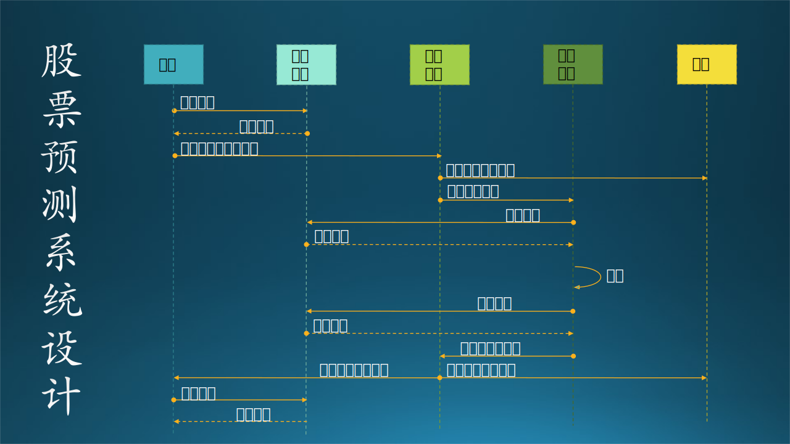

## 2.4 建模与设计能力


图 2-4 建模与设计能力

### 2.4.1 建模题

建模题一般就是考察面试者对事物的观察归纳能力以及面向对象的设计思想，这种设计仅限于对象级别的，稍微复杂一些的会涉及到组件级别，而非系统级别的。

#### 1. 给一个会议室建模

(1) 定义一个会议起止时间的帮助类

```Python
class BookTime():
    start: time
    end: time
```

(2) 定义会议室

```python
class MeetingRoom():
    location: Geometry  # 位置
    no_room: str        # 会议室编号
    no_seat: int        # 座位数
    has_projetor: bool  # 有无投影仪
    has_whiteboard:bool # 有无白板
    has_network: bool   # 有无网络会议设备
    status: InUse|Free  # 状态：使用中|空闲
    book_times: BookTime[] # 被预定时段列表
```

(3) 定义会议

```python
class Meeting():
    book_time: BookTime # 会议时间
    room: MeetingRoom   # 会议室
    host: People        # 会议主持人
    attendee: People    # 与会者
    topic: str          # 议题或内容
    owner: People       # 订会议室的人
    status: Normal      # 状态(正常、进行中、取消、已结束)
```

给出了会议室的定义后，如果能够一鼓作气给出会议的定义，会更好，说明你思路清晰。因为有的面试者会误把会议的内容定义到会议室里面去。

#### 2. 给一个十字路口的红绿灯系统建模

(1) 定义基本枚举值

```python
class Colors():
    Red = 1         # 红灯
    Green = 3       # 绿灯

class Status():
    On = 1          # 亮起
    Off = 0         # 熄灭
```

(2) 定义单个灯

```python
class Light():
    # 属性
    status: Status 
    # 动作
    def TurnOn(color)   # 开灯并指定颜色
    def TurnOff()       # 关灯
```

上面的定义中，开灯或关灯与具体的交通信号含义无关，还需要上层对象来调用。

(3) 定义灯组，至少两个灯组成一个灯组

```Python
class LightGroup():
    # 属性
    light_Straight: Light   # 直行灯
    light_LeftTurn: Light   # 左转灯
    # 动作
    def SetStraight(On|Off) # 允许|禁止直行
    def SetLeftTurn(On|Off) # 允许|禁止左转
```

上面的动作定义中，就可以对应得到具体的交通信号含义了。

(4) 定义中控器

```python
class ControlCenter():
    light_groups: LightGroup[4] # 路口的每个方向都有一个灯组
    scheduler: timer   # 定时器，用于对LightGroup进行定时开关操作
```

最后，每个十字路口都肯定会有一个中控器来控制四组灯的信号以保证其协调性。这一点往往是面试者容易忘记的，原因是他们并没有观察到有时候警察叔叔会手动操作中控器来控制交通流量。

#### 3. 给一个魔方建模

很多没有玩过魔方的人，会对此问题一筹莫展。在实际的面试时，可以要求面试官提供一个魔方，供面试者动手观察。

一个魔方的单面有：

- 一个中心块
- 四个棱块
- 四个角块

而扩展到六面以后，总共会有：

- 六个中心块
- 八个角块
- 十二个棱块

如果仔细观察的话，魔方的中心块实际上只能原地旋转，六个中心块的相对位置是不会发生变化的，而所谓的还原魔方，就是把与中心块相同的颜色都拼在一起。所以可以用中心块的颜色来代表六个面。

先定义块的颜色和位置：

```python
# 颜色
class Colors(Enum):
    White = 0
    Red = 1
    Yellow = 2
    Blue = 3
    Green = 4
    Orange = 5

# 位置, 以魔方的中心点为坐标(0,0,0), 每个块在[-2,+2]之间
class Position():
    x:int
    y:int
    z:int
```

再从最小的单元块定义：

```python
# 块的基类
class Block():
    postion: Position

# 中心块, 一种颜色
class CenterBlock(Block):
    color_0: Colors

# 棱块, 两种颜色
class EdgeBlock(Block):
    color_0: Colors
    color_1: Colors

# 角块, 三种颜色
class CornerBlock(Block):
    color_0: Colors
    color_1: Colors
    color_2: Colors
```

然后定义一个面：

```python
# 一个面
class Side():
    # 属性
    center_block: CenterBlock      # 1个中心块
    corner_blocks: CornerBlock[4]  # 4个角块
    edge_blocks: EdgeBlock[4]      # 4个棱块
    # 动作
    def Rotate_90():  pass
    def Rotate_180(): pass
    def Rotate_270(): pass
```

最后定义整个魔方：

```python
# 一个魔方
class RibukCube():
    side_Front: Side
    side_Back:  Side
    side_Up:    Side
    side_Down:  Side
    side_Left:  Side
    side_Right: Side
```

给魔方建模有几个误区：

- 从静态结构上把它分成上、中、下三层。
- 从动作上多定义一个中心层的旋转。
- 用颜色代替块的概念（颜色只是块的一个属性而已）。
    
如果有中心层，并且可以旋转的话，整个模型会变得非常复杂而不可描述，实际上中心层的“正向”旋转可以用两个边层的逆向旋转来表达，但是所谓的“正向”是无法定义清楚的，不像每个面那样可以把旋转 90 度和旋转 270 度区分开。

### 2.4.2 设计

应用场景：

- 甲方每天早晨 8:00 传给乙方前一个交易日的股票大盘数据。
- 乙方收到数据后，立刻验证数据是否齐备，然后使用已有模型做股票价格预测。
- 需要在 9:30 之前把预测结果发送回甲方。

限制条件：

- 保存所有的历史大盘及预测记录。
- 全自动化，无人干预。
- 用微软 Azure 提供的技术。

这个问题需要有一定的系统设计能力了，一个合格的设计如图 2-5 所示。



图 2-5 股票预测系统设计

由于是每个交易日都要进行这样的操作，所以全自动化流程是很有必要的。

1. 甲方准备好前一个交易日的数据后，安装双方约定好的格式上传到云端存储；
2. 然后通知控制中心来启动预测服务；
3. 控制中心通知乙方（可选）；
4. 然后启动预测服务；
5. 预测系统首先要读取数据；
6. 等到数据返回后进行验证，然后进行预测；
7. 预测将会持续一个多小时；
8. 保存预测结果到云端存储；
9. 然后通知控制中心预测结束；
10. 控制中心同时通知甲方和乙方；
11. 甲方去约定好的地方下载结果到本地使用。

当然，这不是标准答案，实际上这个题目比较开放，有很多解决方案，也可以用任何模板图来绘制，主要考察应聘者对于系统的理解。如果时间允许的话，面试官可能还要考察你一些细节问题，让你描绘每个模块的内部功能、外部接口等等，如下面的内容所述。

#### 1. 关于存储

由于需要使用 Azure 技术（或其它公司的云服务），所以存储本身也是一个服务，而不是像传统的数据库或者磁盘文件那样还需要有一个本地的存取接口。

不习惯使用云端存储的人，在这里一般会选用关系式数据库做存储媒介，而股票数据确实也是符合关系式数据库的使用标准，但是在这个应用场景中，没有任何需要查询某只股票的某个字段的需求，所以使用关系式数据库就是一种浪费，容量和性能都会有问题。

所以在这里我们可以使用块存储（Storage Blobs）来存储大块的数据，速度快、容量大。

#### 2. 关于控制中心

这里一般存在两个误区：

1. 做一个网站，提供上传、下载的页面，供甲方使用。
2. 把控制中心和预测系统合并在一起。

控制中心的作用主要是隔离用户与预测系统，不让二者有直接的交互，否则容易产生误操作。

而由于有云端存储服务的存在，所以上传、下载数据可以直接从客户端发起，而不需要网页服务，否则数据就需要从客户端传到网页上，在由网站转存到云端存储服务上，影响可靠性和性能。

#### 3. 关于预测系统

这个系统应该设计得很简单，对外接口是：

1. 和控制中心的接口
    - 得到通知，参数中含有最新股票数据的位置；
    - 发送预测结果通知（成功、失败）。

2. 和云端存储的接口
    - 读取股票数据；
    - 保存预测结果。

这里的设计误区是：预测系统和甲方、乙方直接有交互。由于预测所需要的时间很长，如果甲方误操作（比如连续多次上传数据并启动预测服务），预测系统将会不能正常工作。

#### 4. 关于异常

由于篇幅原因，在图 2-5 中没有做一些异常检测及处理，这也是考察面试者的重要因素。比如：

1. 甲方上传的数据格式有问题怎么办？
2. 控制中心是 7x24 小时工作的吗？会不会宕机？
3. 预测系统启动失败怎么办？
4. 预测过程中出现异常时，如何通知甲方或乙方？


关于设计，可以考察的形式和内容很多，也许面试官要求做以下的设计实例：
- 高并发的设计
- 异地灾备的设计
- 消息队列的设计
- 微信系统的设计（点对点通信）
- 微博系统的设计（消息订阅，发布）
- 淘宝系统的设计
- 异地访问延迟
- 高性能的理解和应用
- 微服务的使用
- 语音系统的设计
- 地图系统的设计

这就要求具有一定经验的应聘者平时要多观察、积累这方面的经验。而对于刚毕业的学生来说，这些东西有些勉强了，还是以基本的算法和编码能力为主。
