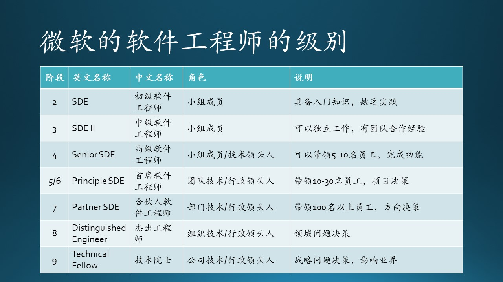
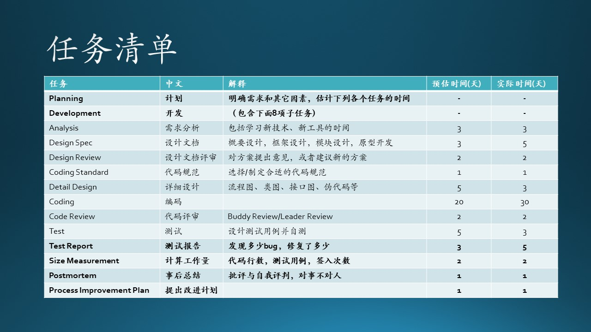
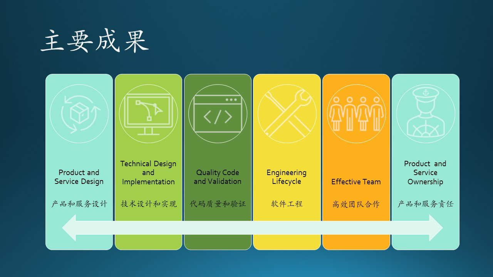
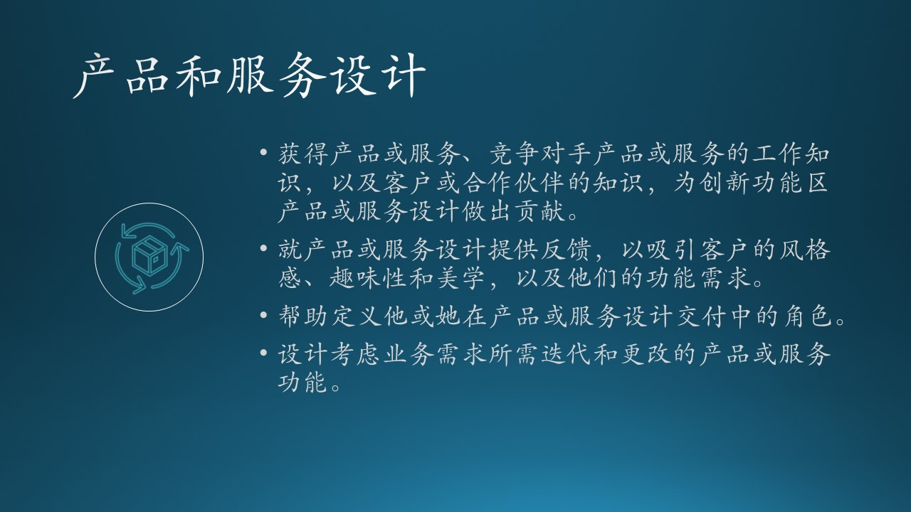
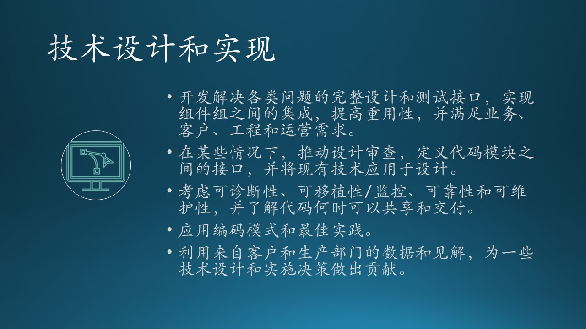
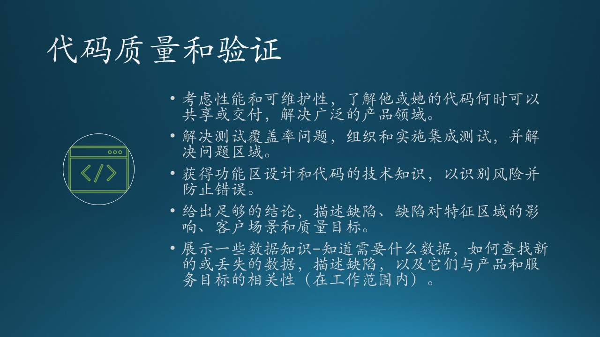
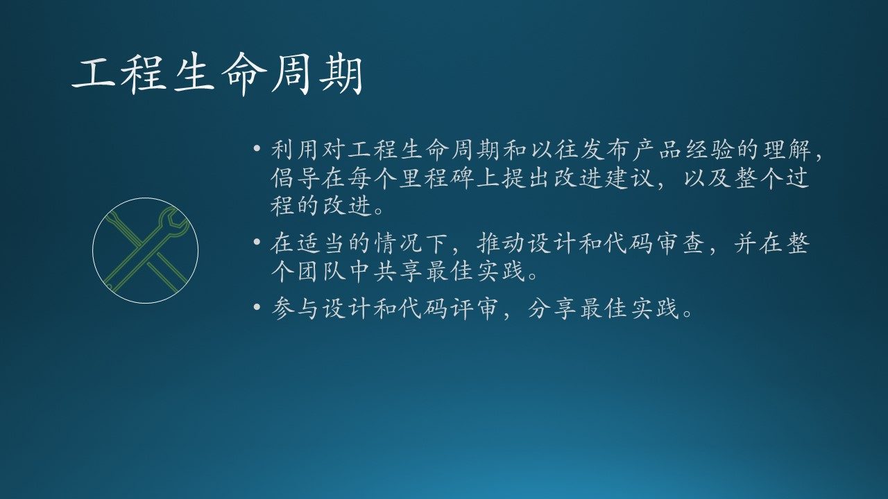
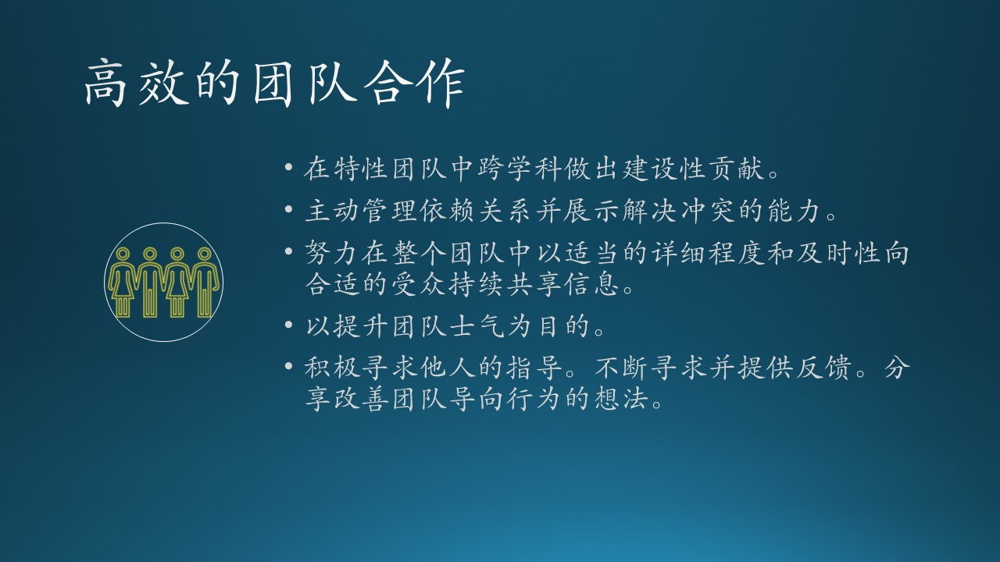
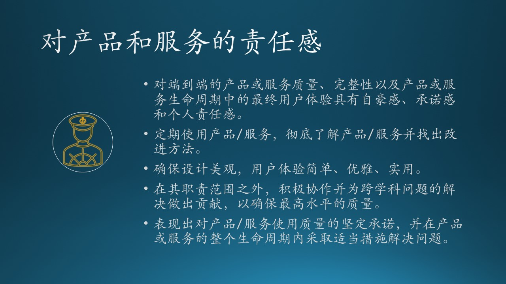

## 2.5 软件工程师在微软

### 2.5.1 定义、级别、职务

#### 定义 Definition

微软是这样定位软件工程师的：

*Software Engineers take end-to-end ownership for development and quality of products and services that delight customers and add strategic value to Microsoft. They evaluate requirements, estimate costs, and design and implement products and services. They define and implement the quality criteria for their products and services, using measurements and insights to understand and validate the quality of experience for customers. They manage and improve the engineering process, manage risks, dependencies and compromises, and integrate software into broader ecosystems and/or products and services.*

软件工程师负责端到端的产品和服务的开发和质量，以让客户满意并为Microsoft增加战略价值。

- 评估需求，估算成本，设计和实施产品和服务。
- 他们定义并实施产品和服务的质量标准，通过有效的衡量手段和细致入微的观察来理解和验证用户体验的质量。
- 管理和改进工程过程，管理风险，捋顺依赖链条，必要时采取折中方案，将软件集成到更广泛的生态系统和/或产品和服务中。

#### 阶段 Stage

微软的软件工程师的级别划分如图 2.5.1 所示。

图 2.5.1 微软软件工程师的级别

从阶段看，一共有 9 个，所以后面会简称为“几段”（类似围棋选手级别名词）。在有些区域是有“一段”的，比如微软苏州，但是微软北京都是从“二段”开始。

在以前的官方定义中，软件工程师的英文名称为 Software Development（软件开发），后来改成了 Software Engineer（软件工程师），笔者猜测其原因如下：

1. 在微软取消了测试职位后，软件工程师也要负责测试，所以不能再叫做Development 了，但是又不能叫做 Software Development-Test，所以就叫做 Software Engineer；
2. Software Development 只负责开发，Software Engineer 在字面上加入了工程的含义，即对软件开发者有更高的要求，需要熟悉产品周期各个环节的所有职责。

还有一个级别（Level）的概念，比如：
- 在二段中有 59，60 两个级别；
- 在三段中有 61、62 两个级别；
- 在四段中有 63、64 两个级别；
- 在五段中有 65、66、67 三个级别；
......

#### 角色 Discipline

Discipline 原意是知识领域，可以引申为角色。前面也说过，在微软与软件开发有关的有以下几种主要的角色：

- SE/SDE 软件工程师
- PM（Program Manager）项目经理
- Designer 设计师

#### 职务 Role

有三种职务：

- IC（Individual Contributer，个人贡献者），表示不管理任何人的工程师，因为有些人即使到了技术专家级别也不想走管理路线。

- Lead，小领导，管理几个 IC，这些 IC 的级别通常都比该 Lead 要低或者同级。

    逐渐地，为了扁平化管理，微软渐渐取消了 Lead 职务，不在 Title 中明确标明，而是在小组内部任命一些 Technical Lead（技术带头人），这些 Lead 与 IC 之间不存在 Report 关系。

- Manager，大领导，管理 IC 和 Lead 并有 Report 关系，一般具有 Principle 段位。

### 2.5.2 主要工作考核指标

微软对软件工程师的主要考核有六个大项，如图 2.5.2 所示。

图 2.5.2 微软工程师的考核指标

下面以“二段”为例，介绍一下每个大项中包含的具体内容。

#### Product and Service Design - 产品和服务设计

构建正确的产品和服务，为客户提供预期价值，并实现所需的业务目标。根据客户洞察力（数据驱动）和总体业务目标制定决策。

对于“二段”，有以下具体要求：

图 2.5.3 产品和服务设计

从内容上看，这一项要求软件工程师具备 PM 的一些基本素质，这里的“设计”不是技术上的，而是功能上的。需要在横向上对产品和服务的有基本的了解，在纵向上对上下游合作者有基本的了解。

#### Technical Design and Implementation - 技术设计和实现

开发高质量的代码以满足技术要求，例如：可伸缩、全球交付、分布式、可监控、可维护性、可测试性、调试和维护。构建关联的测试以在单元级别和端到端级别验证代码。开发满足预期投资回报（ROI）的基础设施。使用技术软件开发技能来识别问题并提倡改进产品或服务设计。

对于“二段”，有以下具体要求：

图 2.5.4 技术设计和实现

这一项要求首先有设计，哪怕是很简单的设计，或者口头交流，得到大家的认可之后，再继续进行开发工作。对于这个阶段的软件工程师而言，应该是使用已经定义好的接口进行局部功能的设计与开发，尽量通过看代码、查文档、向资深同事咨询等方式，来充分了解技术背景。

#### Quality Code and Validation - 代码质量和验证

创建并验证高效（低延迟、高吞吐量）、稳定、安全、可维护、可扩展、性能好、经过良好测试和可重用的代码，以实现产品或服务的客户和业务目标。构建正确的测试和工具，以验证代码是否符合质量目标或服务。分析数据并给出结论，使自己和同事能够在适当的时候理解和解决问题。确保在产品或服务的整个生命周期内保持质量。

对于“二段”，有以下具体要求：

图 2.5.5 代码质量和验证

这一项强调了代码 review（审查）的重要性，一方面要审查别人的代码，另一方面让别人审查自己的代码，主要是在代码风格、命名规范、与已有代码的契合程度等方面。另一方面，代码逻辑的正确性需要由单元测试做保证，也避免将来别人新加入的代码破坏你的代码逻辑。

#### Engineering Lifecycle - 工程生命周期

使用、定义和改进编码和测试实践、流程、工具、基础架构和标准，以提高效率，为Microsoft和客户提供预期的产品或服务成果。

对于“二段”，有以下具体要求：

图 2.5.6 工程生命周期

这一项把代码和工程结合起来，相当于是软件工程的具体实践。

#### Effective Team - 高效的团队合作

在团队环境中积极行动，提高团队整体的效率、影响力和士气。跨团队、产品、服务或平台边界积极工作，以共享信息和技术，并确保同行团队目标一致。酌情组建团队。指导他人并主动寻求他人的指导。

对于“二段”，有以下具体要求：

图 2.5.7 高效的团队合作

在团队环境中积极行动，提高团队整体的效率、影响力和士气。跨团队、产品/服务或平台边界积极工作，以共享信息和技术，并确保同行团队目标一致。

其中第三条是比较难做到的：当你意识到有些信息其它人不知道时（这一点本身就很难），需要主动地告知他人（一般人会选择等着别人来问）。

#### Product and Service Ownership - 对产品和服务的责任感

持续而有力地显示出对整个产品或服务的质量和完整性以及最终用户体验的责任感。保持一种自豪感和工艺感，使我们的产品具有美感和技术价值。

图 2.5.8 对产品和服务的责任感

### 2.5.3 技术设计与实现的进阶

在 2.5.1 小节中描述的都是针对“二段”软件工程师的要求，

图 2.5.9 技术设计与实现的进阶

#### SDE - 模块级别

要求：

- 开发解决各类问题的完整设计和测试接口，实现组件组之间的集成，提高重用性，并满足业务、客户、工程和运营需求。
- 在某些情况下，推动设计审查，定义代码模块之间的接口，并将现有技术应用于设计。
- 考虑可诊断性、可移植性/监控、可靠性和可维护性，并了解代码何时可以共享和交付。
- 应用编码模式和最佳实践。
- 利用来自客户和生产部门的数据和观察，为一些技术设计和实施决策做出贡献。

说明：

在 SDE 级别，主要是在软件的模块级别上工作，只为自己编写的局部功能负责。

#### SDE II - 组件级别

要求：

- 开发完整的设计和测试接口，以解决各类问题，实现组件组之间的集成，改进重用，并满足业务、客户、工程和运营需求。
- 推动所在项目的设计审查，定义代码模块之间的接口，并将现有技术应用于设计。
- 考虑可诊断性、可移植性/监控、可靠性和可维护性，并了解其代码何时可以共享和交付。
- 应用编码模式和最佳实践。
- 利用来自客户和生产部门的数据和观察，为一些技术设计和实施决策做出贡献。

说明：

在 SDE II 级别，主要是在软件的组件级别上工作，对所在的项目负有一定的责任。

#### Senior SDE - 功能级别

要求：

- 开发优雅的设计和测试，以识别和消除产品或服务范围内的问题，并与多版本产品或服务计划和功能区架构保持一致。
- 推动整个团队的设计审查，并应用可用技术的专业知识。
- 在团队中以身作则，生成简单、可扩展和可维护的代码，缺陷极少。查找并修复缺陷类别。
- 确保一致、可用、前瞻性、可维护的测试基础设施，从大量设计模式中汲取经验，是可用技术方面的专家，并且擅长识别有效的实践。
- 应用指标来提高代码的质量和稳定性。
- 利用来自客户和生产部门的数据和观察，做出功能区技术设计和实施决策。

说明：

在 Senior SDE 级别，主要是在软件的功能级别上工作，对某个产品或服务的端到端功能负有责任。

#### Principle SDE - 系统级别

要求：

- 开发持久、创新、简单、优雅的代码和测试（适当时包括架构），以满足业务和客户需求，并与产品或服务的长期计划保持一致。
- 运用其深厚的技术专长解决问题，使团队能够交付高质量的设计。
- 领导验证产品或服务或架构创新的工作，确定开发过程早期的关键设计领域和下游需要改进的领域。
- 选择适当的内部或外部技术，整合研究，创建设计和验证工具，包括在团队中重用的测试自动化，是对有效实践的优秀判断。
- 定义或重用质量指标、最佳实践和编码模式，以确保代码可测试。
- 利用来自客户和生产部门的数据和观察做出技术设计和实施决策。

说明：

在 Principle SDE 级别，主要工作在软件的系统级别上，对某个产品或服务的整体负责。

#### Partner SDE - 部门级别

要求：

- 开发持久、创新的体系结构，以满足产品/服务或整个部门的业务和客户目标。
- 利用深厚的技术专业知识，使团队能够提供高质量的产品/服务或部门范围的设计。
- 将质量融入自己的设计，并贯穿整个部门。
- 解决跨越多个版本的产品/服务或部门的最复杂问题。

说明：

Partner SDE 级别已经不能再用软件的级别来对标了，而是要负责一个部门中的好几个产品或服务。

#### Distinguished Engineer - 部门/公司

杰出的工程师代表着对微软的持续技术影响和影响力。个人需要深厚的技术知识、领导力和专业领域的重大创新。在各自的领域，对部门的业务成功至关重要，并负有责任，可能会塑造行业。

- 作为其专业领域/领域的技术权威，为其专业领域的部门、公司或行业制定方向或技术路线图。
- 无论组织或权力如何，都会影响技术业务决策。
- 跨部门、公司或行业工作，以增加其专业技术领域的价值。
- 在做出技术决策时，要考虑到部门和公司战略，而不是个人/团队的利益。
- 通过教学、参与、指导、建议和领导建立未来的技术社区。
- 体现了“一个微软”和“一个工程文化”。
- 展示微软的领导原则、文化属性和价值观。

#### Technical Fellow - 公司/行业

该名称仅适用于公司高管层（相当于CVP）。

代表着对微软最高水平的持续技术影响和影响力。个人需要卓越的技术知识、领导力和专业领域的重大创新。在各自的领域，对微软持续的商业成功至关重要，并对其负责，他们往往塑造着整个行业。
