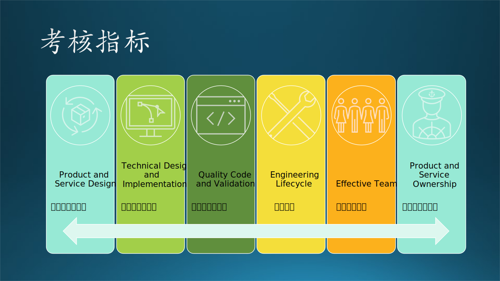
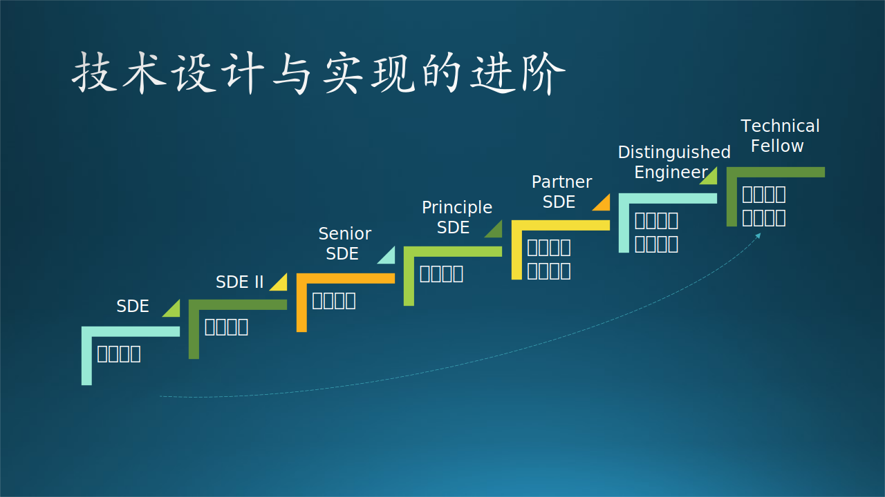

## 2.5 软件工程师在微软

### 2.5.1 定义、级别、角色

#### 定义（Definition）

微软是这样定位软件工程师的（英文原文）：

*Software Engineers take end-to-end ownership for development and quality of products and services that delight customers and add strategic value to Microsoft. They evaluate requirements, estimate costs, and design and implement products and services. They define and implement the quality criteria for their products and services, using measurements and insights to understand and validate the quality of experience for customers. They manage and improve the engineering process, manage risks, dependencies and compromises, and integrate software into broader ecosystems and/or products and services.*

软件工程师负责端到端的产品和服务的开发和质量，以让客户满意并为 Microsoft 增加战略价值。

- 评估需求，估算成本，设计和实施产品和服务。
- 定义并实施产品和服务的质量标准，通过有效的衡量手段和细致入微的观察来理解和验证用户体验的质量。
- 管理和改进工程过程，管理风险，捋顺依赖链条，必要时采取折中方案，将软件集成到更广泛的生态系统和/或产品和服务中。

#### 阶段（Stage）

微软的软件工程师的阶段划分（级别）如图 2.5.1 所示。

图 2.5.1 微软软件工程师的级别

从阶段看，一共有 9 个，所以后面会简称为“几段”（类似围棋选手级别名词）。在有些区域是有“一段”的，比如微软苏州，但是微软北京都是从“二段 (Stage 2)”开始。

在以前的官方定义中，软件工程师的英文名称为 Software Development（软件开发），后来改成了 Software Engineer（软件工程师），笔者猜测其原因如下：

1. 在微软取消了测试职位后，软件工程师也要负责测试，所以不能再叫做 Development 了，但是又不能叫做 Software Development-Test，所以就叫做 Software Engineer；
2. Software Development 只负责开发，Software Engineer 在字面上加入了工程的含义，即对软件开发者有更高的要求，需要熟悉产品周期各个环节的所有职责。

还有一个级别（Level）的概念，比如：
- 在二段中有 L59，L60 两个级别；
- 在三段中有 L61、L62 两个级别；
- 在四段中有 L63、L64 两个级别；
- 在五段中有 L65、L66、L67 三个级别；
......

#### 职业（Discipline）

Discipline 原意是知识领域，可以引申为职业。前面也说过，在微软与软件开发有关的有以下几种主要的职业角色：

- SE/SDE 软件工程师
- PM（Program Manager）项目经理
- Designer 设计师

#### 角色（Role）

有三种角色：

- IC（Individual Contributer，个人贡献者），表示不管理任何人，因为有些人即使到了技术专家级别也不想走管理路线。

- Lead，小领导，管理几个 IC，这些 IC 的级别通常都比该 Lead 要低或者同级。

    逐渐地，为了扁平化管理，微软渐渐取消了 Lead 职务，不在 Title 中明确标明，而是在小组内部任命一些 Technical Lead（技术带头人），这些 Lead 与 IC 之间不存在 Report 关系。

- Manager，大领导，管理 IC 和 Lead 并有 Report 关系，一般具有 Principle 段位。

### 2.5.2 考核指标

微软对软件工程师的要求有六个大项，如图 2.5.2 所示。

图 2.5.2 微软工程师的考核指标

下面以“二段”为例，介绍一下每个大项中包含的具体内容。

#### 1. Product and Service Design - 产品和服务设计

构建正确的产品和服务，为客户提供其预期的价值，并实现所需的业务目标。根据对客户系统运行数据的观察总结和总体业务目标制定决策。

对于“二段”，有如图 2.5.3 所示的具体要求：

图 2.5.3 产品和服务设计

- 熟悉产品或服务、竞争对手产品或服务的工作知识，以及客户或合作伙伴的知识，为创新功能区产品或服务设计做出贡献。
- 就产品或服务设计提供反馈，具有吸引客户的风格、趣味性和美感，以及功能需求。
- 找到自己在产品或服务设计交付中的角色，充分发挥自己的作用。
- 根据业务需求进行迭代和更改的设计。

【最佳实践】

- 每个软件工程师不能一叶障目不见泰山，只看得见眼前的代码，但看不见软件产品的整体面貌。要求软件工程师具备 PM 的一些基本素质，这里的“设计”不是技术上的，而是功能上的。比如想开发一个新的功能，其用户交互入口应该放在什么地方，才能既不破坏原有界面不违和，又能够让用户发现新功能。
- 需要在横向上对现有的产品和服务以及竞争对手有基本的了解，比如 Bing 搜索服务，你要知道微软自己的 Bing 都能提供什么功能，还要知道竞争对手如 Goole 和百度都能提供什么功能。
- 在纵向上对上下游合作者有基本的了解，比如作为界面开发者，你需要知道上游的业务都需要展示什么功能，还需要知道给下游的数据采集都提供什么接口。
- 在时间轴上还要掌握产品的迭代规律和方向，比如在满足了用户的基本搜索需求后，是不是要提供合适的广告来增加收益，同时又不引起用户反感。

对于这个阶段的软件工程师而言，

#### 2. Technical Design and Implementation - 技术设计和实现

开发高质量的代码以满足技术要求，例如：可伸缩、全球交付、分布式、可监控、可维护性、可测试性、调试和维护。构建关联的测试以在单元级别和端到端级别验证代码。开发满足预期投资回报（ROI）的基础设施。使用软件开发技能来分析解决问题并改进产品或服务的技术设计。

对于“二段”，有如图 2.5.4 所示的具体要求：

图 2.5.4 技术设计和实现

- 针对各类不同的问题，进行层次设计和接口设计，实现组件组之间的集成，提高重用性，并满足业务、客户、工程和运营需求。
- 在适当的时候推动设计评审，定义模块之间的接口，并将成熟技术应用于设计。
- 考虑可诊断性、可移植性/监控、可靠性和可维护性，并知道分享和交付代码的最佳时机。
- 遵守代码编写规范。
- 利用来自客户和生产部门的数据和分析，为一些技术设计和实施决策提出建议。

【最佳实践】

- 这一项要求强调了设计的重要性，哪怕是很简单的设计，或者口头交流，得到大家的认可之后，再继续进行开发工作。
- 对于这个阶段的软件工程师而言，应该是使用已经定义好的接口进行局部功能的设计与开发，尽量通过看代码、查文档、向资深同事咨询等方式，来充分了解技术背景，别自己瞎猜，不但耽误时间，猜错了还会耽误事。
- 强调了代码质量的重要性，在现阶段主要是让别人审查自己的代码，在代码风格、命名规范、与已有代码的契合程度等方面符合项目组的代码编写规范，同一个错误不能犯两次。比如在代码审查时，同事给你指出了一个变量命名错误，那么以后在命名变量时就不要太随意。
- 懂得数据收集与统计分析的重要性，并学会分析的方法。

#### 3. Quality Code and Validation - 代码质量和验证

创建并验证高效（低延迟、高吞吐量）、稳定、安全、可维护、可扩展、性能好、经过良好测试和可重用的代码，以实现产品或服务的客户和业务目标。构建正确的测试和工具，以验证代码是否符合质量目标或服务。分析数据并给出结论，使自己和同事能够理解和解决问题。确保在产品或服务的整个生命周期内保持质量。

对于“二段”，有如图 2.5.5 所示的具体要求：

图 2.5.5 代码质量和验证

- 考虑性能和可维护性，了解代码何时可以分享或交付，可以处理该产品各个方面的问题。
- 解决测试覆盖率问题，组织和实施集成测试，并修复发生问题的代码。
- 获得功能设计和编写代码的技术知识，以识别风险并防止错误。
- 发现缺陷时，给出充足的证据来描述缺陷本身，说明缺陷对某些功能的影响，以及对应用场景和质量目标的影响。
- 具备数据知识，知道需要什么日志数据，如何查找新的或丢失的数据，以及它们与产品和服务目标的相关性。

【最佳实践】

- 对所有的代码增加单元测试，代码逻辑的正确性需要由单元测试做保证，也避免将来别人新加入的代码破坏你的代码逻辑。
- 对于代码测试覆盖率有要求，比如是 80% 还是 90% 才能达标？增加单元测试的项目以便提高覆盖率。如果当时嫌麻烦而少写了几条单元测试，后面新加的功能很可能会破坏现有逻辑。
- 发现 Bug 后要很负责地提供详细的信息，或者是找到该功能的负责人，告知对方自己发现的 Bug，演示如何复现这个 Bug，以及它带来的不良后果。
- 最后还要有日志技术的知识，可以设计如何产生日志，以及日志可以反应的具体功能点的好坏。比如用户经常抱怨某个功能的响应速度太慢，那么就要为此功能多加几层日志，以了解各个环节的运行时间，找到瓶颈所在。

#### 4. Engineering Lifecycle - 工程生命周期

使用、定义和改进编码和测试实践、流程、工具、基础架构和标准，以提高效率，为 Microsoft 和客户提供预期的产品或服务成果。

对于“二段”，有如图 2.5.6 所示的具体要求：

图 2.5.6 工程生命周期

- 利用对工程生命周期和以往发布产品经验的理解，倡导在每个里程碑上提出改进建议，以及整个过程的改进。
- 在适当的情况下，推动设计和代码审查，并在整个团队中分享最佳实践。
- 参与设计和代码评审，分享最佳实践。

【最佳实践】

- 要学习软件工程的基本概念和操作过程，书本上的知识是远远不够的。
- 在实际发布软件产品时，会发现很多细节问题，向资深同事了解详细的发布过程，有必要的话把它们记录下来，下一次发布时就会不遗漏任何步骤。
- 当你觉得在某个环节上有理解障碍或者没有具体的行动指南时，就要提出来。比如在团队中工作的老员工都知道多写注释少写文档，而你在别的项目中得到的信息是多写文档少写注释，这时就要及时询问领导，或者给出你的选择理由。
- 在刚加入团队时，可以要求其它老同事多分享最佳实践，这样可以帮助你尽快融入团队。自己有一些心得后，也应该及时分享，别藏着掖着的拿自己当外人。

#### 5. Effective Team - 高效的团队合作

在团队环境中积极行动，提高团队整体的效率、影响力和士气。跨团队、产品、服务或平台边界积极工作，以共享信息和技术，并确保同行团队目标一致。酌情组建团队。指导他人并主动寻求他人的指导。

对于“二段”，有如图 2.5.7 所示的具体要求：

图 2.5.7 高效的团队合作

- 在团队中做出建设性贡献。
- 主动管理依赖关系并展示解决冲突的能力。
- 努力在整个团队中以适当的详细程度和及时性向合适的受众持续共享信息。
- 提升团队士气。
- 积极寻求他人的指导。
- 不断寻求并提供反馈。
- 分享改善团队效率的想法。

【最佳实践】

- 少发牢骚，不抱怨现有困难，而是要想办法解决困难，多提建设性的意见。比如大家共享的一个服务器运行速度很慢，你发现有个同事经常跑一些运算量很大的任务，长时间占用计算资源，你可以向领导提出多增加几个虚拟机的要求，进行物理隔离，这样每个人的任务都不会影响其它人。
- 当你意识到有些信息其它人不知道时（这一点本身就很难），需要主动地告知他人（一般人会选择等着别人来问）。比如你发现了大家都在使用的一个工具有个 Bug 会导致运行结果不对但又很难发现，你应该及时群发邮件告知大家这个信息。
- 有时候顾于面子不愿意向他人请教，而是自己花时间在那里抠细节。此时如果先放下面子问一下相关同事，就会得到一些基本的概念和行动指南，避免绕路或者重新发明轮子。

#### 6. Product and Service Ownership - 对产品和服务的责任感

持续而有力地显示出对整个产品或服务的质量和完整性以及最终用户体验的责任感。保持一种自豪感和工艺感，使我们的产品具有美感和技术价值。

对于“二段”，有如图 2.5.8 所示的具体要求：

图 2.5.8 对产品和服务的责任感

- 对端到端的产品或服务质量、完整性以及产品或服务生命周期中的最终用户体验具有自豪感、承诺感和个人责任感。
- 定期使用产品/服务，彻底了解产品/服务并找出改进方法。
- 确保设计美观、用户体验简单、优雅、实用。
- 在其职责范围之外，积极协作并为问题的解决做出贡献，以确保最高水平的质量。
- 表现出对产品/服务使用质量的坚定承诺，并在产品或服务的整个生命周期内采取适当措施解决问题。

【最佳实践】

- 这一项主要是强调态度，让员工和自己所负责的产品融为一体，有主人翁的责任感。其实，以员工自身而言，要想获得更多的工作经验和更高的职位，就应该热爱自己的产品，全身心投入。产品给力，客户评价好，自然就晋升得快，对客户、对公司、对自己，三方都有好处。
- 在提出自己的意见时也要注意不要过分热心，不顾及其它人的感受。比如，你觉得有个界面的配色太丑了，你不能直接对 Designer 说“你的设计太丑了”，而是要拿出具体的改进意见和对方讨论。
- 在修改某个代码片段时，一定要找到该代码的原始作者，与之商量后再改，不能越俎代庖，抢占他人的“地盘”。

### 2.5.3 技术设计与实现的进阶

在上一小节中描述的都是针对“二段”软件工程师的要求，内容看上去已经比较丰富了，但其实还是入门级别。针对更高级别的软件工程师的级别如图 2.5.9 所示，这里只用“技术设计与实现”一项来举例。

图 2.5.9 技术设计与实现的进阶

#### 1. SDE - 解决模块级别的简单技术问题

要求：

- 针对各类不同的问题，进行层次设计和接口设计，实现组件组之间的集成，提高重用性，并满足业务、客户、工程和运营需求。
- 在适当的时候推动设计评审，定义模块之间的接口，并将成熟技术应用于设计。
- 考虑可诊断性、可移植性/监控、可靠性和可维护性，并知道分享和交付代码的时机。
- 遵守代码编写规范。
- 利用来自客户和生产部门的数据和分析，为一些技术设计和实施决策提出建议。

【最佳实践】

在 SDE 级别，主要是在软件的**模块级别**上工作，只为自己编写的局部功能负责。模块是否能正常工作是重点要关心的。

#### 2. SDE II - 解决组件级别的复杂技术问题

要求：

- 针对各类不同的问题，进行层次设计和接口设计，实现组件组之间的集成，提高重用性，并满足业务、客户、工程和运营需求。
- 推动所在项目的设计审查，定义模块之间的接口，并将成熟技术应用于设计。
- 考虑可诊断性、可移植性/监控、可靠性和可维护性，并知道分享和交付代码的时机。
- 遵守编码规范和最佳实践。
- 利用来自客户和生产部门的数据和分析，为一些技术设计和实施决策做出贡献。

【最佳实践】

在 SDE II 级别，主要是在软件的**组件级别**（模块的组合）上工作，对所在的项目负有一定的责任。要关心的组件的对外接口的正确与稳定。

#### 3. Senior SDE - 解决功能级别的端到端技术问题

要求：

- 做出优雅的设计和测试框架，发现和解决产品或服务范围内的问题，并与多版本产品或服务计划和功能区架构保持兼容。
- 推动整个团队的设计审查，具备使用成熟技术的专业知识。
- 在团队中以身作则，生成简单、可扩展和可维护的代码，缺陷极少。查找并修复各类缺陷。
- 确保一致的、可用的、前瞻性的、可维护的测试基础设施，从大量设计模式中汲取经验，是可用技术方面的专家，并且擅长总结有效的实践经验。
- 用指标来衡量并提高代码的质量和稳定性。
- 利用来自客户和生产部门的数据和分析结果，做出功能区技术设计和实施决策。

【最佳实践】

在 Senior SDE 级别，主要是在软件的**功能级别**（组件的堆叠）上工作，对某个产品或服务的端到端功能负有责任。功能的完整性、正确性是要关心的事情。

#### 4. Principle SDE - 解决系统级别的综合性技术问题

要求：

- 开发持久、创新、简单、优雅的代码和测试（适当时包括架构），以满足业务和客户需求，并与产品或服务的长期计划保持一致。
- 运用其深厚的技术专长解决问题，使团队能够交付高质量的设计。
- 领导验证产品或服务或架构创新的工作，确定开发过程早期的关键设计领域和下游需要改进的领域。
- 选择适当的内部或外部技术，整合研究，创建设计和验证工具，包括在团队中重用的测试自动化，是对有效实践的优秀判断。
- 定义或重用质量指标、最佳实践和编码模式，以确保代码可测试。
- 利用来自客户和生产部门的数据和分析结果做出技术设计和实施决策。

【最佳实践】

在 Principle SDE 级别，主要工作在软件的**系统级别**（功能的组合）上，对某个产品或服务的整体负责。产品是否可以满足各种用户的整体要求、为公司增加商业价值是要关心的事情。

#### 5. Partner SDE - 部门级别的创新设计

要求：

- 开发持久、创新的体系结构，以满足产品/服务或整个部门的业务和客户目标。
- 利用深厚的技术专业知识，使团队能够提供高质量的产品/服务或部门范围的设计。
- 将质量融入自己的设计，并贯穿整个部门。
- 解决跨越多个版本的产品/服务或部门的最复杂问题。

【最佳实践】

Partner SDE 级别已经不能再用软件的级别来对标了，而是要负责一个**部门**中的好几个产品或服务。产品发展方向以及在公司产品线中的地位是这个级别最应该关心的事情。

#### 6. Distinguished Engineer - 组织级别的产品方向

要求：
- 作为其专业领域/领域的技术权威，为其专业领域的部门、公司或行业制定方向或技术路线图。
- 无论组织或权力如何，都会影响技术业务决策。
- 跨部门、公司或行业工作，以增加其专业技术领域的价值。
- 在做出技术决策时，要考虑到部门和公司战略，而不是个人/团队的利益。
- 通过教学、参与、指导、建议和领导建立未来的技术社区。
- 体现了“一个微软 (One Microsoft)”和“一个工程文化(One Engineering Culture)”。
- 展示微软的领导原则、文化属性和价值观。

【最佳实践】

杰出工程师代表着对微软的持续技术影响和影响力。个人需要深厚的技术知识、领导力和专业领域的重大创新。在各自的领域，对**组织**的业务成功至关重要，并负有责任，可能会塑造行业。

#### 7. Technical Fellow - 公司级别的重大创新

要求：

- 代表着对微软最高水平的持续技术影响。
- 本人需要具备卓越的技术知识、领导力和专业领域的重大创新。
- 在各自的领域，对微软持续的商业成功至关重要，并对其负责，他们往往塑造着整个行业。

【最佳实践】

该头衔仅适用于公司高管层（相当于CVP），需要对**公司**级别的产品方向负责。
